```c-lms
activity-name: Big Data Overview and Introduction to Amazon Web Services (AWS) 
topic: Big Data Overview
```

<iframe src="https://player.vimeo.com/video/778931015?h=e6443add1f" width="640" height="363" frameborder="0" allow="autoplay; fullscreen; picture-in-picture" allowfullscreen></iframe>

## Big Data Overview and Introduction to Amazon Web Services

<div class="panel panel-success">
    <div class="panel-heading">
        <h3 class="panel-title">Additional Info!</h3>
    </div>
    <div class="panel-body">
        <p>All images and references not separately referenced are provided by Amazon Web Services, Inc. 2022., <a href="https://aws.amazon.com/"> aws.amazon.com </a></p>
    </div>
</div>


## Module Overview

## Big Data
As society becomes increasingly digital, the amount of data being created and collected is growing and accelerating significantly. Analyzing this ever-growing data with traditional tools is a challenge. Innovation is required to bridge the gap between the data being generated and the data that can be analyzed effectively.

The concept of big data is more than just the collection and analysis of the data. The actual value of an organization’s data is found when questions can be answered and used to create competitive advantages for the organization.


Big data refers to both the storage and analysis of large collections of data. For perspective, in the year 2010, **[Volume of data/information created, captured, copied, and consumed worldwide from 2010 to 2025(in zettabytes)](https://www.statista.com/statistics/871513/worldwide-data-created/)** 2 zettabytes was generated but in 2025 there will be 181 zettabytes. 


Image provided by [Statista](https://www.statista.com/statistics/871513/worldwide-data-created/)


This trend is going to continue to increase exponentially as computing becomes cheaper. In this module, you will learn how to process large datasets using cloud computing, and how cloud computing works to distribute computation to multiple computers for better performance, and how to prevent and recover from errors. By the end of this module, you should be able to:

Understand:

- What is Big Data?
- Introduction to Amazon Academy
- Introduction to Cloud Computer Core Concepts
- The Advantages of Cloud Computing
- Cloud Economics and Billing
- Fundamentals of pricing
- Total Cost of Ownership
- AWS Organizations
- AWS Billing and Cost Management
- AWS Technical Support

---

## Lesson Overview

In this lesson, you will get an introduction to cloud foundations, big data and the Amazon Web Service (AWS) ecosystem.

```c-lms
topic: What is Big Data?
```

## What is Big Data?

Data is usually categorized as "big" when you can no longer process it efficiently on one computer.  However, the parameters for this will differ by both dataset and computer setup.  There is no one cutoff that allows someone to say "my data is big;" there is no set number of columns or rows that will push you over the edge into "big data" territory.  You could have a relatively small number of records (rows), but have a lot of columns.  You could have data that are images, audio, or text that is space and processing intensive.  You could have a relatively small set of variables in key-pair format that is updated incredibly frequently.  All of these may or may not be instances of big data, based on their particular ramifications AND based on the computer you're using.  A ten year old system running an Intel i5 processor is going to be able to handle much less data than a brand-new computer with a solid state hard drive and an Intel i9 or Mac M1 Max processor.

---

## Example

If ACME Groceries has collected both the dates and times of each item sold in their store, they're empowered to ask questions concerning inventory. This sounds simple, right? The variables you're interested in are only date, time, and item.  How can that possibly become big data? Well, think about how many items a store has.  Think about how many customers PER DAY they may receive.  Think about how many items at a time a customer may purchase.  Think about how many years back you may want to conduct your analysis. Is it starting to look a lot bigger now? What if you wanted just a little more information, and you increased data collection to include multiple ACME Groceries in the chain? Now maybe you need store location as well, and you have increased the number of dates, times, and items tenfold. The amount of data generated and stored becomes monumental! 

With fine detail and vast records of customer purchase history, companies can spot patterns and predict customer behavior. Big data makes large-scale insights possible. For instance, consider the following questions that can be answered with just those few variables and the actions that can be taken with those answers:

* What month has the highest produce sales?

  **_Action:_** Mail out advertisements and coupons the week prior to additionally incentivize produce purchase.

* Which two items are frequently purchased together?

  **_Action:_** Place these items adjacent to each other to enhance the likelihood they will both be purchased.

* What are the five most frequently purchased items between the hours of 6:00 AM and 8:00 AM?

  **_Action:_** Place the items in a popup kiosk near the front of the store for quick access in the morning.

* Which brand of toothpaste generates the most money?

  **_Action:_** Move the best seller to the middle shelf (eye-level) to encourage purchases.

---

## Properties of Big Data

The properties of big data are all denoted with a V. There are the main 3 Vs of Big Data, which are _Volume_, _Variety_, and _Velocity_.

1.  **Volume** refers to the size of the datasets being stored. According to an **[article](https://www.statista.com/statistics/871513/worldwide-data-created/)** by Statista, the total amount of data in the world is projected to rise steeply to 79 zetabytes by 2021. For those who are unfamiliar with the **[metric prefixes](https://www.nist.gov/pml/weights-and-measures/metric-si-prefixes)**, 79 zetabytes expanded is 79,000,000,000,000,000,000,000 bytes! 

    <div class="panel panel-success">
        <div class="panel-heading">
            <h3 class="panel-title">Additional Info!</h3>
        </div>
        <div class="panel-body">
            <p>To really get a perspective on how much data volume has changed, think about this: NASA traveled to the moon and back on only 4kb of memory! For more details about the early Apollo computing system, <a href="https://www.metroweekly.com/2014/07/to-the-moon-and-back-on-4kb-of-memory/"> check this article out! </a></p>
        </div>
    </div>

2.  **Variety** refers to the different forms the data can take, such as images, video, audio, and text. These types of data often take more space to store and require longer processing times as well. Some systems will have a lot of variety, but others may be a little less dispersed. For example, Twitter's _variety_ dimension may consist mostly of text while YouTube's _variety_ dimension is primarily video.

3.  **Velocity** refers to the speed of data generation and storage. This typically ties into the "real-time" rate of data transmission.  With large-scale or global companies that are dealing with transactional or monitoring data, the velocity can be incredibly fast.  For instance, **[at the end of 2021 there were a half a billion Tweets being sent per day](https://startupbonsai.com/twitter-statistics/)**. 

In addition, as big data has become more popular, other Vs have been added.  Consider also noting: 

4. **Veracity:** How trustworthy the data is. As data is coming in, is it likely to create discrepancies on your cluster? Are you likely to have duplicate records? What happens in the case of computer failure?

5. **Value:** It don't mean a thing if it ain't got that swing! Big data has got to provide useful information and insights from it, otherwise, why are you throwing all this computer processing power and storage at it?

The Vs can continue: read [The 42 V’s of Big Data and Data Science](https://www.elderresearch.com/blog/the-42-vs-of-big-data-and-data-science/) for imaginative and further reading. 


---

## Big Data Computing

A fundamental part of big data analysis is being able to process all of the necessary data, and because of the nature of big data, you're going to need more than one computer, elsewise the the processing time and cost is too much to justify the usefulness of the data. What if the work could be shared among two computers? Well, that would cut the time in half. What if a third computer were added? As you may guess, the more computers that are added, the shorter the amount of time required to process the same amount of data. This is called *scalability* - the ability to keep throwing additional computers at the data in a linear fashion - the more data you have, the more computers you need.

When you're harnessing multiple computers to do one job, altogether those computers are referred to as a *cluster*. Each individual computer in a cluster is referred to as a *node* typically, and you will have one main node that is running the whole enchilada, and then others that are just doing the work.  The node that is in charge is called the *manager node* and the computers that are working are the *worker nodes*.   

Note that your workplace may or may not actually physically own the computers in the cluster. There are many services out there that allow you to rent out clusters.  This then becomes an endeavor in *virtual machines* as well.  For instance, depending on the processing needs of your data, you may be renting anywhere from a small partition on just one of the small silver boxes below to several silver boxes (each a computer). 


---

## Review and Practice <a class="anchor" id="DS107L1_page_2_quiz"></a>

Below you will find a quiz to review the recently covered material. 

```c-lms
start-activity: DS107L1.2 Introduction to Big Data Analytics Quiz
```


### Welcome to the Cloud

In the next several lessons you will learn foundational cloud concepts that will help you enable your Big Data Analytics journey. So sit back, relax and enjoy your journey.

```c-lms
topic: Introduction to Amazon Academy
```

# What is Amazon Web Service (AWS)?

[What is AWS?](https://youtu.be/a9__D53WsUs)


<!--
```python
from IPython.display import YouTubeVideo
# Tutorial Video Name: What is AWS?
YouTubeVideo('a9__D53WsUs', width=720, height=480)
```
-->


<iframe
    width="720"
    height="480"
    src="https://www.youtube.com/embed/a9__D53WsUs"
    frameborder="0"
    allowfullscreen

></iframe>


# Amazon Academy

Empowers students for industry-recognized certifications and careers in the cloud. Helps to Bridge the gap between industry and academia. As cloud technologies continue to help organizations transform at a rapid pace, employees with the necessary cloud skills are in high demand. According to LinkedIn data, cloud computing is the number one hard skill companies need most.

AWS Academy provides cloud computing that prepares students to pursue industry-recognized certifications and in-demand cloud jobs. This helps students stay at the forefront of AWS Cloud innovation so that they can be equipped with the skills they need to get hired in one of the fastest-growing industries.

AWS Academy provides courses and learning resources that enable students to develop a range of skills in the AWS Cloud.

Let's get started!

## Set up your AWS Academy Account

There are many different ways and places from which to spin up virtual machines and rent clusters. One of them is *Amazon Web Services (AWS)*, which you will be utilizing later in this module.  In order to access AWS for free, and to take advantaged of their free student services, like training and job boards, you will create an AWS Academy account.  If you haven't received an invitation from AWS Academy, check your spam or junk email folder of the email account you registered with the data science program. If you still have not found or received an email please contact your mentor. 


The process to obtain an AWS account is described below.

<div class="panel panel-success">
    <div class="panel-heading">
        <h3 class="panel-title">Additional Info!</h3>
    </div>
    <div class="panel-body">
        <p>If you already have an AWS Academy account, you can skip to the end of the page.</p>
    </div>
</div>

# Amazon Academy Account

AWS Academy is a program Amazon offers that will allow you to obtain an AWS account for free (with limitations). 

**Check your email for an invite to AWS Academy Cloud Foundations and Data Analytics.**

## Check Email for AWS Academy Application Process
You should receive an email from AWS Academy Support providing a link to complete the `AWS Academy application process`.   **If you did not receive an email, please inform your mentor right away**.

## Complete the AWS Academy Application Process
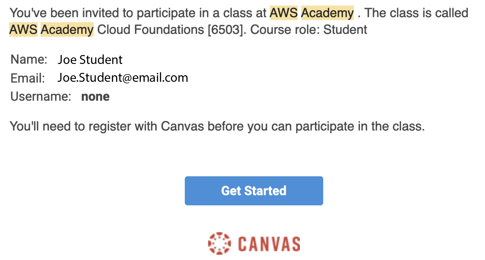

---

```c-lms
topic: Introduction to Cloud Computer Core Concepts
```

<hr style="height:10px;border-width:0;color:gray;background-color:gray">


## Introduction to Cloud Computer Core Concepts

Follow along with [AWS Academy](https://awsacademy.instructure.com) Cloud Foundations Module 1 - Cloud Concepts Overview.

## Introduction to Amazon Web Services

## What is AWS?

From Amazon's website:

> "Amazon Web Services (AWS) is the world’s most comprehensive and broadly adopted cloud platform, offering over 200 fully featured services from data centers globally. Millions of customers—including the fastest-growing startups, largest enterprises, and leading government agencies—are using AWS to lower costs, become more agile, and innovate faster.." - [Amazon AWS](https://aws.amazon.com/what-is-aws/).

After completing this module, you should be able to:
- Define different types of cloud computing models
- Describe six advantages of cloud computing
- Recognize the main AWS service categories and core services
- Review the AWS Cloud Adoption Framework (AWS CAF)

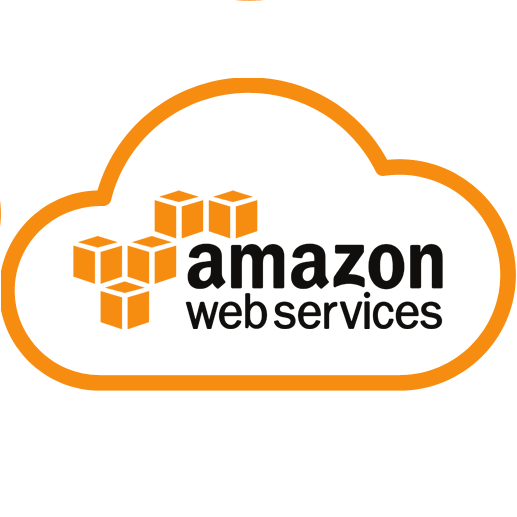


<div class="panel panel-success">
    <div class="panel-heading">
        <h3 class="panel-title">Fun Fact!</h3>
    </div>
    <div class="panel-body">
        <p>Explore more than 100 products and start building on AWS using the Free Tier. </p>
    </div>
</div>

---

## Introduction to Cloud Computing

### Cloud computing defined

Cloud computing is the on-demand delivery of compute power, database, storage, applications, and other IT resources via the internet with pay-as-you-go pricing.

---

### Infrastructure as software

Cloud computing enables you to stop thinking of your infrastructure as hardware, and instead think of (and use) it as software. 


#### Traditional computing model: 
Infrastructure as hardware
- Hardware solutions:
    - Require space, staff, physical security, planning, capital expenditure
    - Have a long hardware procurement cycle
    - Require you to provision capacity by guessing theoretical maximum peaks

#### Cloud computing model: 
Infrastructure as software
- Software solutions:
    - Are flexible
    - Can change more quickly, easily, and cost-effectively than hardware solutions
    - Eliminate the undifferentiated heavylifting tasks

---

### Cloud service models

There are three main types of cloud service models each giving more or less control over what you need:

- IaaS Infrastructure as a Service
- PaaS Platform as a Service
- SaaS Software as a Service


---

### Cloud Computing Deployment Models

Generally there are three different types of cloud computing deployment models:

- Cloud
- Hybrid
- On Premise (Private cloud)


---

### Similarities between AWS and traditional IT

There are a variety of similarities between traditional IT and AWS Cloud Computing. Take a look at the below graphic and see if you can spot some of the similarities. Don't fear the graphic we'll explain more as you progress into the lessons.

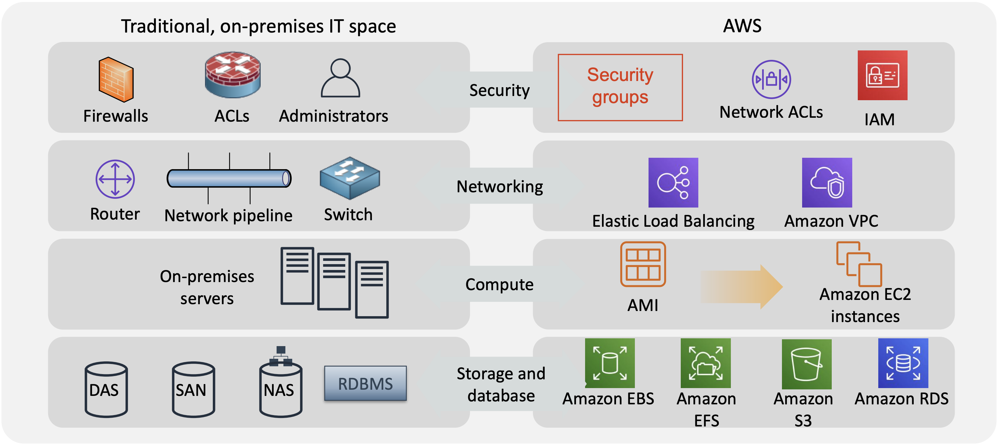

## Review and Practice <a class="anchor" id="DS107L1_page_4_quiz"></a>

Below you will find a quiz to review the recently covered material. Quizzes are _not_ graded.

```c-lms
start-activity: DS107L1.4 Core Cloud Concepts Quiz
```

```c-lms
topic: The Advantages of Cloud Computing
```

## The Advantages of Cloud Computing


## Trade Capital for Variable Expense

Instead of having upfront capital costs for data center equipment, operations and services you can scale on demand with pay as you go services and infrastructure.


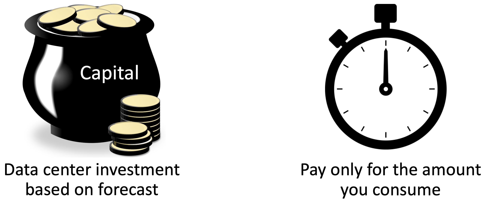


---

##  Massive Economies of Scale

Because of aggregate usage from all customers, AWS can achieve higher economies of scale and pass savings on to customers.


---

## Stop Guessing Capacity 

Technology is rapidly changing and it's difficult to keep a data center up to date with the latest technology. Procurement of hardware and software is often difficult and takes time. Increasing capacity in the cloud or testing out new software hardware technologies can be rapidly prototyped. 


---

## Increase Speed and Agility

Cloud computing can assist in the organization being faster for technology adoption and allow people within the organization to be more innovative and agile.

---


## Maintaining Data Centers is Costly

Running your own data center can have a variety of costs associated with them:

1. Equipment
2. Software
3. Own and Operate Building (Lease/Rent/Own)
4. Physical Security
5. Cyber Security
6. Personnel (Pay and Benefits) for everyone involved
7. Insurance
8. The list goes on...


---

## Go Global in Minutes

How would you like to scale your capability and go global in minutes? With cloud computing it is much simpler and cost effective to enable scalability worldwide.


---

## Review and Practice <a class="anchor" id="DS107L1_page_5_quiz"></a>

Below you will find a quiz to review the recently covered material. Quizzes are _not_ graded.

```c-lms
start-activity: DS107L1.5 Advantages of Cloud Computing Quiz
```

```c-lms
topic: Cloud Economics and Billing
```

# Cloud Economics and Billing

Follow along with [AWS Academy](https://awsacademy.instructure.com) Cloud Foundations Module 2 - Cloud Economics and Billing.

## Overview

Topics
- Fundamentals of pricing
- Total Cost of Ownership
- AWS Organizations
- AWS Billing and Cost Management
- Technical Support

---

## Module Objectives

After completing this module, you should be able to:
- Explain the AWS pricing philosophy
- Recognize fundamental pricing characteristics
- Indicate the elements of total cost of ownership
- Discuss the results of the AWS Pricing Calculator
- Identify how to set up an organizational structure that simplifies billing and account
visibility to review cost data.
- Identify the functionality in the AWS Billing Dashboard
- Describe how to use AWS Bills, AWS Cost Explorer, AWS Budgets, and AWS Cost and
Usage Reports
- Identify the various AWS technical support plans and features

---

```c-lms
topic: Fundamentals of pricing
```

## Fundamentals of pricing
## AWS Pricing Model

### Three fundamental drivers of cost with AWS

#### Compute
- Charged per hour/second*
- Varies by instance type

*Linux only

#### Storage
- Charged typically per GB

#### Data transfer
- Outbound is aggregated and
charged
- Inbound has no charge (with
some exceptions)
- Charged typically per GB

---


---

### How do you pay for AWS?

- Pay for what you use
    - Pay only for the services that you consume, with no large upfront expenses.
- Pay for a reserved instance
    - Invest in [Reserved Instances (RIs)](https://aws.amazon.com/ec2/pricing/reserved-instances/pricing/):
    - Save up to 75 percent
    - Options:
        - All Upfront Reserved Instance (AURI) → largest discount
        - Partial Upfront Reserved Instance (PURI) → lower discounts
        - No Upfront Payments Reserved Instance (NURI) → smaller discount
        
---
        


---
        
- Pay less the more you use
  Realize volume-based discounts:
  - Savings as usage increases.
  - Tiered pricing for services like Amazon:
    - [Elastic Compute Cloud (Amazon EC2)](https://aws.amazon.com/ec2/),
    - [Simple Storage Service (Amazon S3)](https://aws.amazon.com/s3/), 
    - [Elastic Block Store (Amazon EBS)](https://aws.amazon.com/ebs/), or 
    - [Elastic File System (Amazon EFS)](https://aws.amazon.com/efs/) → the more you use, the less you pay per GB.
  - Multiple storage services deliver lower storage costs based on needs.

---


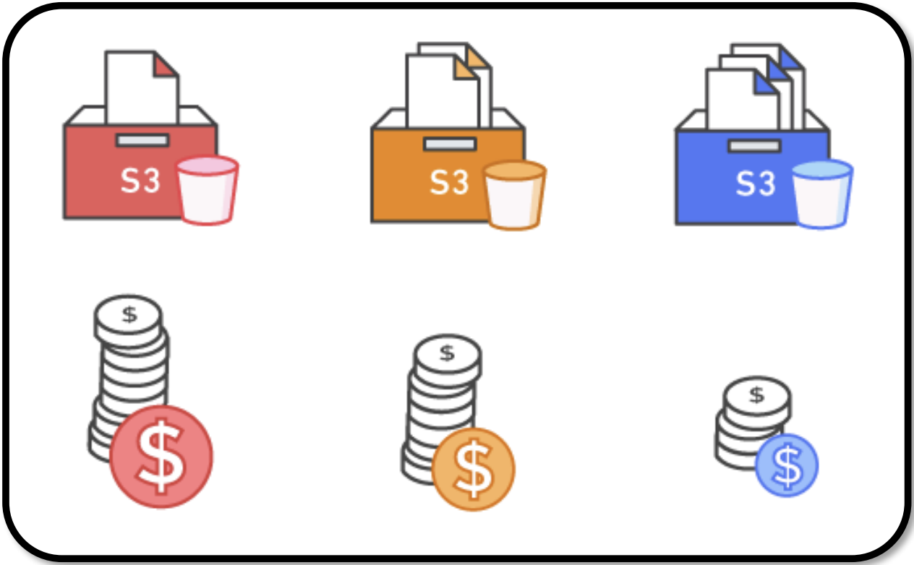

---

As AWS grows:
- AWS focuses on lowering cost of doing business.
- This practice results in AWS passing savings from economies of scale to you.
- Since 2006, AWS has lowered pricing 75 times (as of September 2019).
- Future higher-performing resources replace current resources for no extra charge.

AWS Custom Pricing:
- Meet varying needs through custom pricing.
- Available for high-volume projects with unique requirements.

AWS Free Tier:
- Enables you to gain free hands-on experience with the AWS platform, products, and services. 
- Free for 1 year for new customers.

---


---

AWS Services with no charge:
- [Amazon Virtual Private Cloud (Amazon VPC)](https://aws.amazon.com/vpc/)
- [AWS Elastic Beanstalk](https://aws.amazon.com/elasticbeanstalk/)
- [AWS Auto Scaling](https://aws.amazon.com/autoscaling/)
- [AWS CloudFormation](https://aws.amazon.com/cloudformation/)
- [AWS Identity and Access Management (IAM)](https://aws.amazon.com/iam/)

---

### Key Takeaways

There is no charge for:
- Inbound data transfer.
- Data transfer between services within the same AWS Region.
- Pay for what you use.
- Start and stop anytime.
- No long-term contracts are required.
- Some services are free, but the other AWS services that they provision might not be free.

```c-lms
topic: Total Cost of Ownership
```

## Total Cost of Ownership

## On-premises versus cloud

Total Cost of Ownership (TCO) is the financial estimate to help identify direct and indirect costs of a system. Why use TCO?
- To compare the costs of running an entire infrastructure environment or specific workload on-premises versus on AWS
- To budget and build the business case for moving to the cloud

---


---

## TCO considerations

---


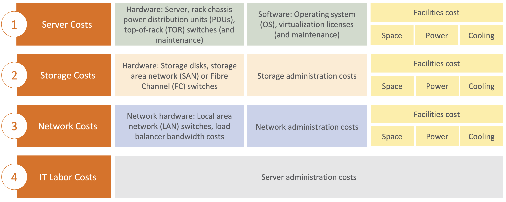

---

## On-premises versus all-in-cloud

You could save up to 96 percent a year by moving your infrastructure to AWS. Your 3-year total savings would be $159,913.

---


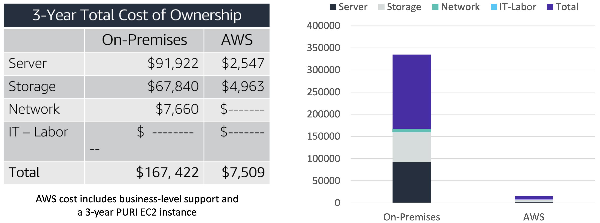

---

## AWS Pricing Calculator

Use the [AWS Pricing Calculator](https://calculator.aws/#/) to:
- Estimate monthly costs
- Identify opportunities to reduce monthly costs
- Model your solutions before building them
- Explore price points and calculations behind your estimate
- Find the available instance types and contract terms that meet your needs
- Name your estimate and create and name groups of services

---

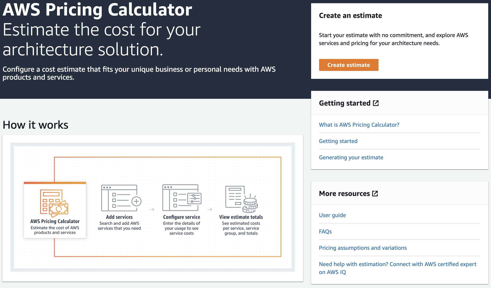

## Additional benefit considerations

### Hard benefits
- Reduced spending on compute, storage, networking, security
- Reductions in hardware and software purchases (capex)
- Reductions in operational costs, backup, and disaster recovery
- Reduction in operations personnel

### Soft Benefits
- Reuse of service and applications that enable you to define (and redefine solutions) by using the same cloud service
- Increased developer productivity
- Improved customer satisfaction
- Agile business processes that can quickly respond to new and emerging opportunities
- Increase in global reach


<hr style="height:10px;border-width:0;color:gray;background-color:gray">

```c-lms
topic: AWS Organizations
```

## Introduction to AWS Organizations

[AWS Organizations](https://aws.amazon.com/organizations/) 

AWS Organizations helps you centrally manage and govern your environment as you grow and scale your AWS resources. Using AWS Organizations, you can programmatically create new AWS accounts and allocate resources, group accounts to organize your workflows, apply policies to accounts or groups for governance, and simplify billing by using a single payment method for all of your accounts.

In addition, AWS Organizations is integrated with other AWS services so you can define central configurations, security mechanisms, audit requirements, and resource sharing across accounts in your organization. AWS Organizations is available to all AWS customers at no additional charge.

---

## AWS Organizations Graph


OU = Organizational Units

---

## Key features and benefits

---

## Security with AWS Organizations

1. Control access with AWS Identity and Access Management (IAM).
2. IAM policies enable you to allow or deny access to AWS services for users, groups, and roles.
3. Service control policies (SCPs) enable you to allow or deny access to AWS services for individuals or group accounts in an organizational unit (OU). 

---

## Organizations setup

1. Create Organization
2. Create Organizational Units (OUs)
3. Create service control policies
4. Test restrictions

---


---

## Limits of AWS Organizations

---

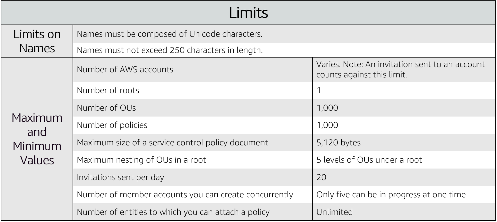

---

## Accessing AWS Organizations

---

1. AWS Management Console
2. AWS Command Line Interface (AWS CLI) tools
3. Software development kits (SDKs)
4. HTTPS Query application programming interfaces (API)


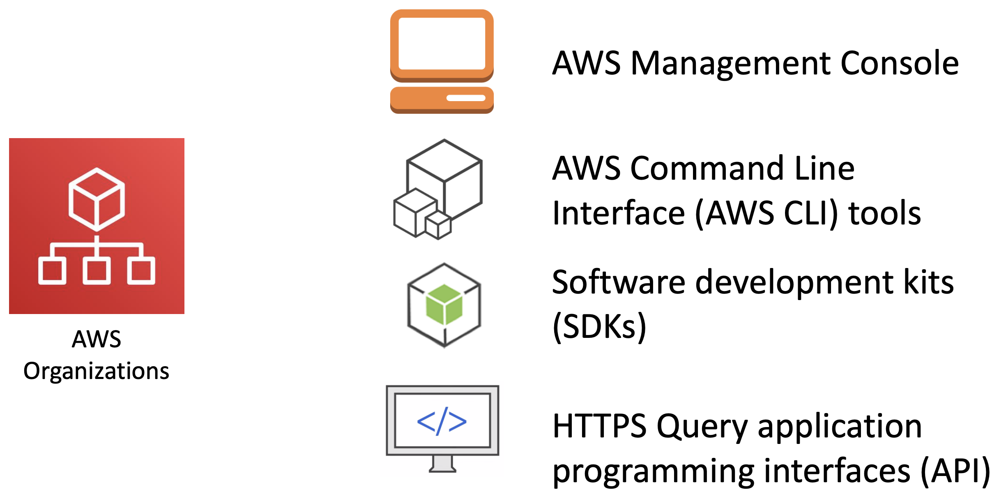

---

```c-lms
topic: AWS Billing and Cost Management
```

## Introduction to AWS Billing and Cost Management


---

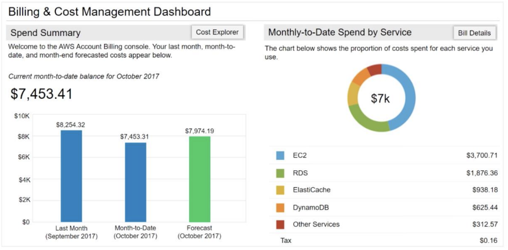

---

## AWS Billing and Cost Management Tools

---


---

```c-lms
topic: Technical Support
```

## Introduction to Technical Support


---
Provide unique combination of tools and expertise:
- AWS Support
- [AWS Support Plans](https://aws.amazon.com/premiumsupport/plans/)
- Support is provided for:
- Experimenting with AWS
- Production use of AWS
- Business-critical use of AWS

---

<p style="text-align: center">
  
</p>


---

[Proactive guidance](https://aws.amazon.com/premiumsupport/technology-and-programs/proactive-services/) :
    - [Technical Account Manager (TAM)](https://aws.amazon.com/premiumsupport/plans/enterprise/)
- Best practices :
    - [AWS Trusted Advisor](https://aws.amazon.com/premiumsupport/technology/trusted-advisor/)
- Account assistance :
    - [AWS Support Concierge](https://aws.amazon.com/premiumsupport/plans/)


<p style="text-align: center">
  
</p>

---

## Support plans

AWS Support offers four support plans:

- **Basic Support:** Resource Center access, Service Health Dashboard, product FAQs, discussion forums, and support for health checks
- **Developer Support:** Support for early development on AWS
- **Business Support:** Customers that run production workloads
- **Enterprise Support:** Customers that run business and mission-critical workloads

## Case severity and response times

<p style="text-align: center">
  
</p>

## Additional Resourcess

- [AWS Economics Center](https://aws.amazon.com/economics/) 
- [AWS Pricing Calculator](https://calculator.aws/#/) 
- [Case studies and research](http://aws.amazon.com/economics/) 
- [Additional pricing exercises](https://dx1572sre29wk.cloudfront.net/cost/) 

## Review and Practice <a class="anchor" id="DS107L1_page_11_quiz"></a>

```c-lms
start-activity: DS107L1.11 Cloud Technical Support Quiz
```
```c-lms
topic: Key Terms
```
## Key Terms

Below is a list and short description of the important keywords learned in this lesson. Please read through and go back and review any concepts you do not fully understand. Great Work!

<table class="table table-striped">
    <tr>
        <th>Keyword</th>
        <th>Description</th>
    </tr>
    <tr>
        <td style="font-weight: bold;" nowrap>Cluster</td>
        <td>A group of connected computers.</td>
    </tr>
    <tr>
        <td style="font-weight: bold;" nowrap>5 Vs of Big Data</td>
        <td>Volume, Variety, Velocity, Veracity and Value</td>
    </tr>
    <tr>
        <td style="font-weight: bold;" nowrap>Volume</td>
        <td>Size of the data being stored.</td>
    </tr>
    <tr>
        <td style="font-weight: bold;" nowrap>Variety</td>
        <td>Different types of data.</td>
    </tr>
    <tr>
        <td style="font-weight: bold;" nowrap>Velocity</td>
        <td>Speed of data generation and storage.</td>
    </tr>
    <tr>
        <td style="font-weight: bold;" nowrap>Veracity</td>
        <td>Trustworthiness of the data.</td>
    </tr>
    <tr>
        <td style="font-weight: bold;" nowrap>Value</td>
        <td>Usefulness of the data.</td>
    </tr>
    <tr>
        <td style="font-weight: bold;" nowrap>Scalability</td>
        <td>The ability to continue adding computers to deal with more data.</td>
    </tr>
    <tr>
        <td style="font-weight: bold;" nowrap>Cluster</td>
        <td>A group of computers all harnessed for the same purpose.</td>
    </tr>
    <tr>
        <td style="font-weight: bold;" nowrap>Node</td>
        <td>A computer in the cluster.</td>
    </tr>
    <tr>
        <td style="font-weight: bold;" nowrap>Manager Node</td>
        <td>The node controlling the other computers in the cluster.</td>
    </tr>
    <tr>
        <td style="font-weight: bold;" nowrap>Worker Node</td>
        <td>The computers doing the work in the cluster.</td>
    </tr>
    <tr>
        <td style="font-weight: bold;" nowrap>IaaS</td>
        <td>Infrastructure as a Service.</td>
    </tr>
    <tr>
        <td style="font-weight: bold;" nowrap>PaaS</td>
        <td>Platform as a Service.</td>
    </tr>
    <tr>
        <td style="font-weight: bold;" nowrap>SaaS</td>
        <td>Software as a Service</td>
    </tr>
    <tr>
        <td style="font-weight: bold;" nowrap>Data Ingestion</td>
        <td>Getting data into your cluster.</td>
    </tr>
    <tr>
        <td style="font-weight: bold;" nowrap>Database Connection (DBC)</td>
        <td>A way of connecting to SQL databases.</td>
    </tr>
    <tr>
        <td style="font-weight: bold;" nowrap>Amazon Web Services (AWS)</td>
        <td>A system for spinning up cloud services to use in big data processing.</td>
    </tr>
    <tr>
        <td style="font-weight: bold;" nowrap>Amazon Elastic Compute Cloud (Amazon EC2)</td>
        <td>Secure and resizable compute capacity for virtually any workload.</td>
    </tr>
    <tr>
        <td style="font-weight: bold;" nowrap>Reserved Instances (RIs)</td>
        <td>An Amazon Reserved Instance (RI) is a billing discount that allows you to save on your Amazon EC2 usage costs. </td>
    </tr>
        <tr>
        <td style="font-weight: bold;" nowrap>All Upfront Reserved Instance (AURI)</td>
        <td>Largest discount offered for AWS Reserved Instances(RIs).</td>
    </tr>
        <tr>
        <td style="font-weight: bold;" nowrap>Partial Upfront Reserved Instance (PURI)</td>
        <td>Lower discount offered for AWS Reserved Instances(RIs).</td>
    </tr>
        <tr>
        <td style="font-weight: bold;" nowrap>No Upfront Payments Reserved Instance (NURI)</td>
        <td>Smaller discount offered for AWS Reserved Instances(RIs).</td>
    </tr>
        <tr>
        <td style="font-weight: bold;" nowrap>Simple Storage Service (Amazon S3)</td>
        <td>Amazon S3 is an object storage service on AWS.</td>
    </tr>
        <tr>
        <td style="font-weight: bold;" nowrap>Amazon Elastic Block Store (Amazon EBS)</td>
        <td>Amazon Elastic Block Store (Amazon EBS) is an easy-to-use, scalable, high-performance block-storage service designed for Amazon Elastic Compute Cloud (Amazon EC2).</td>
    </tr>
        <tr>
        <td style="font-weight: bold;" nowrap>Amazon Elastic File System (Amazon EFS)</td>
        <td>Amazon Elastic File System (Amazon EFS) automatically grows and shrinks as you add and remove files with no need for management or provisioning.</td>
    </tr>
        <tr>
        <td style="font-weight: bold;" nowrap>Amazon Virtual Private Cloud (Amazon VPC)</td>
        <td>Define and launch AWS resources in a logically isolated virtual network.</td>
    </tr>
        <tr>
        <td style="font-weight: bold;" nowrap>AWS Elastic Beanstalk</td>
        <td>AWS Elastic Beanstalk is an easy-to-use service for deploying and scaling web applications and services.</td>
    </tr>
        <tr>
        <td style="font-weight: bold;" nowrap>AWS Auto Scaling</td>
        <td>AWS Auto Scaling monitors your applications and automatically adjusts capacity to maintain steady, predictable performance at the lowest possible cost.</td>
    </tr>
        <tr>
        <td style="font-weight: bold;" nowrap>AWS CloudFormation</td>
        <td>Speed up cloud provisioning with infrastructure as code.</td>
    </tr>
        <tr>
        <td style="font-weight: bold;" nowrap>AWS Identity and Access Management (IAM)</td>
        <td>Apply fine-grained permissions to AWS services and resources.</td>
    </tr>
        <tr>
        <td style="font-weight: bold;" nowrap>Technical Account Manager (TAM)</td>
        <td>A Technical Account Manager (TAM) is your designated technical point of contact who helps you onboard, provides advocacy and guidance to help plan and build solutions</td>
    </tr>
        <tr>
        <td style="font-weight: bold;" nowrap>AWS Trusted Advisor</td>
        <td>AWS Trusted Advisors provides recommendations that help you follow AWS best practices. Trusted Advisor evaluates your account by using checks.</td>
    </tr>    
</table>

```c-lms
topic: Lesson 1 Exam
```

# Lesson 1 Exam 

Review recently covered material and quizzes. Please feel free to refer to your notes, curriculum or companion notebooks since you don't have to memorize everything in the real world - as long as you know where to find information!

```c-lms
start-activity: DS107L1.13 Exam
```
