```c-lms
activity-name: AWS Global Infrastructure and Cloud Security
topic: Introduction
```

# AWS Global Infrastructure and Cloud Security


<!--
```python
from IPython.display import YouTubeVideo
# Tutorial Video Name: Need an AWS Global Infrastructure Video
YouTubeVideo('rno8iNfKChM', width=720, height=480)
```
-->


<iframe
    width="720"
    height="480"
    src="https://www.youtube.com/embed/rno8iNfKChM"
    frameborder="0"
    allowfullscreen

></iframe>


In this lesson, we'll discuss the AWS Global Infrastructure and the AWS service and service categories. We'll also discuss AWS Security and Compliance programs. By the end of this lesson, you should be able to: 

- Identify the difference between AWS Regions, Availability Zones, and Edge locations
- Identify the various AWS Services and Service Categories
- Recognize the shared security model
- Identify the responsibility of the customer and AWS
- Recognize IAM users, groups, and roles
- Describe the different types of security credentials in IAM
- Identify the steps in securing a new AWS account
- Explore IAM users and groups
- Recognize how to secure AWS data
- Recognize AWS compliance programs

You will also be introduced to the [AWS Management Console](https://aws.amazon.com/console/).

You should be completing AWS Academy Cloud Foundations Course Module 3 and utilizing this companion notebook as a study guide.

[AWS Global Infrastructure Map](https://aws.amazon.com/about-aws/global-infrastructure/#AWS_Global_Infrastructure_Map)


```c-lms
topic: AWS Regions
```
## AWS Regions

AWS has the concept of a Region, which is a physical location around the world where we cluster data centers. We call each group of logical data centers an Availability Zone. Each AWS Region consists of multiple, isolated, and physically separate AZs within a geographic area. Unlike other cloud providers, who often define a region as a single data center, the multiple AZ design of every AWS Region offers advantages for customers. Each AZ has independent power, cooling, and physical security and is connected via redundant, ultra-low-latency networks. AWS customers focused on high availability can design their applications to run in multiple AZs to achieve even greater fault-tolerance. AWS infrastructure Regions meet the highest levels of security, compliance, and data protection.

AWS provides a more extensive global footprint than any other cloud provider, and to support its global footprint and ensure customers are served across the world, AWS opens new Regions rapidly. AWS maintains multiple geographic Regions, including Regions in North America, South America, Europe, China, Asia Pacific, South Africa, and the Middle East.

- An AWS Region is a geographical area.
    - Data Replication across Regions is controlled by you.
    - Communication between Regions uses AWS backbone network infrastructure.


- Each Region provides full redundancy and connectivity to the network.
- A Region typically consists of two or more Availability Zones

Reference: [AWS Regions and Zones](https://docs.aws.amazon.com/AWSEC2/latest/UserGuide/using-regions-availability-zones.html)

<p style="text-align: center">
  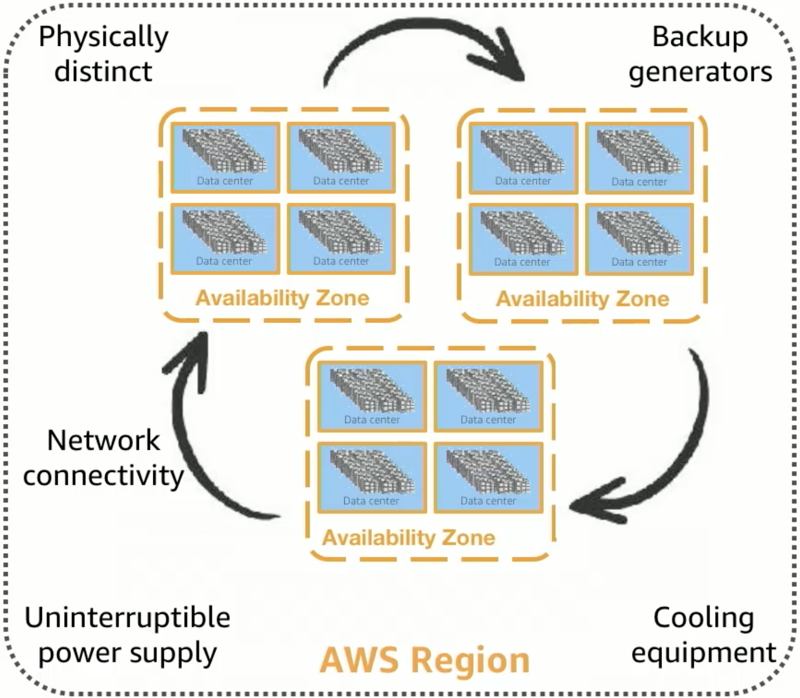
</p>


## Features

- Elasticity and Scalability
    - Elastic infrastructure; dynamic adaption of capacity
    - Scalable infrastructure; adapts to accommodate growth
- Fault-tolerant
    - Continues operating properly in the presence of a failure
    - Built-in redundancy of components
- High Availability
    - High level of operational performance
    - Minimized downtime
    - No human intervention


```c-lms
topic: AWS GovCloud (US)
```

## AWS GovCloud (US)

AWS GovCloud (US) gives government customers and their partners the flexibility to architect secure cloud solutions that comply with the FedRAMP High baseline; the DOJ’s Criminal Justice Information Systems (CJIS) Security Policy; U.S. International Traffic in Arms Regulations (ITAR); Export Administration Regulations (EAR); Department of Defense (DoD) Cloud Computing Security Requirements Guide (SRG) for Impact Levels 2, 4 and 5; FIPS 140-2; IRS-1075; and other compliance regimes.

AWS GovCloud (US-East) and (US-West) Regions are operated by employees who are U.S. citizens on U.S. soil. AWS GovCloud (US) is only accessible to U.S. entities and root account holders who pass a screening process. Customers must confirm that they will only use a U.S. person (green card holder or citizen as defined by the U.S. Department of State) to manage and access root account keys to these regions.

From Controlled Unclassified Information (CUI), Personally Identifiable Information (PII), sensitive patient medical records, and financial data to law enforcement data, export controlled data and other forms of CUI, AWS GovCloud (US) Regions can help customers address compliance at every stage of their cloud journey.

Reference: [AWS GovCloud (US)](https://aws.amazon.com/govcloud-us/?whats-new-ess.sort-by=item.additionalFields.postDateTime&whats-new-ess.sort-order=desc)


<p style="text-align: center">
  
</p>


[Map of AWS Global Infrastructure](https://aws.amazon.com/about-aws/global-infrastructure/regions_az/)

Use Cloudping to determine speed of internet to various AWS Regions [Cloudping](https://www.cloudping.info/)


```c-lms
topic: AWS Availability Zones 
```

## AWS Availability Zones

An Availability Zone (AZ) is one or more discrete data centers with redundant power, networking, and connectivity in an AWS Region. AZs give customers the ability to operate production applications and databases that are more highly available, fault tolerant, and scalable than would be possible from a single data center. All AZs in an AWS Region are interconnected with high-bandwidth, low-latency networking, over fully redundant, dedicated metro fiber providing high-throughput, low-latency networking between AZs. All traffic between AZs is encrypted. The network performance is sufficient to accomplish synchronous replication between AZs. AZs make partitioning applications for high availability easy. If an application is partitioned across AZs, companies are better isolated and protected from issues such as power outages, lightning strikes, tornadoes, earthquakes, and more. AZs are physically separated by a meaningful distance, many kilometers, from any other AZ, although all are within 100 km (60 miles) of each other.

- Each Region has multiple [Availability Zones](https://aws.amazon.com/about-aws/global-infrastructure/regions_az/)
- Each AZ is a fully isolated partition of the AWS Infrastructure.
    - There are over 80 AZs
    - AZs consist of discrete data centers
    - They are designed for fault isolation
    - They are interconnected with other AZs by using high-speed private networking
    - You choose AZs
    - AWS recommends replicating data and resources across AZs for resiliency


<p style="text-align: center">
  
</p>


```c-lms
topic: AWS Data Centers 
```

## AWS Data Centers


<p style="text-align: center">
  
</p>

AWS pioneered cloud computing in 2006, creating cloud infrastructure that allows you to securely build and innovate faster. We are continuously innovating the design and systems of our data centers to protect them from man-made and natural risks. AWS team implement controls, build automated systems, and undergo third-party audits to confirm security and compliance. As a result, the most highly-regulated organizations in the world trust AWS every day. Take a virtual tour of one of their data centers to learn about our security approach to protect the data of millions of active monthly customers.

- AWS data centers are designed for security
- Data centers are where data resides and data processing occurs
- Each data center has redundant power, networking and connectivity and is housed in a separate facility
- A data center typically has 50-80 thousand physical servers 

[AWS Data Centers](https://aws.amazon.com/compliance/data-center/data-centers/)

<p style="text-align: center">
  
</p>

<hr style="height:10px;border-width:0;color:gray;background-color:gray">

```c-lms
topic: Amazon CloudFront
```

## Amazon CloudFront

Securely deliver content with low latency and high transfer speeds

### How it works
Amazon CloudFront is a content delivery network (CDN) service built for high performance, security, and developer convenience.

<p style="text-align: center">
  
</p>

### Network Connectivity and Backbone

Amazon CloudFront peers with thousands of Tier 1/2/3 telecom carriers globally, is well connected with all major access networks for optimal performance, and has hundreds of terabits of deployed capacity. CloudFront Edge locations are connected to the AWS Regions through the AWS network backbone - fully redundant, multiple 100GbE parallel fiber that circles the globe and links with tens of thousands of networks for improved origin fetches and dynamic content acceleration.

To deliver content to end users with lower latency, Amazon CloudFront uses a global network of 310+ Points of Presence (300+ Edge locations and 13 regional mid-tier caches) in 90+ cities across 47 countries. Amazon CloudFront Edge locations are located in:

<p style="text-align: center">
  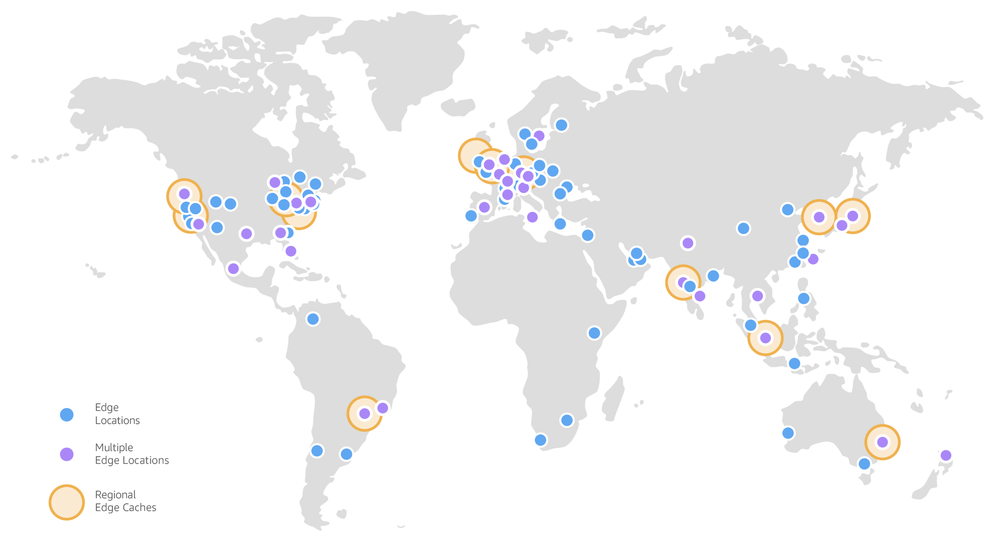
</p>

#### North America
Edge locations: Washington, DC (11); Chicago, IL (11); New York, NY (10); Atlanta, GA (8); Los Angeles, CA (7); Miami, FL (7); Dallas-Fort Worth, TX (6); Houston, TX (4); San Francisco, CA (4); Boston, MA (3); Denver, CO (3); Portland, OR (3); Seattle, WA (3); Toronto, Canada (3); Minneapolis, MN (2); Phoenix, AZ (2); Querétaro, Mexico (2); Montréal, Canada (2); Philadelphia, PA (1); Salt Lake City, UT (1); Vancouver, Canada (1)

Regional Edge caches: California; Ohio; Oregon; Virginia

#### Europe
Edge locations: Frankfurt am Main, Germany (15); London, UK (14); Paris, France (9); Milan, Italy (7); Rome, Italy (6); Berlin, Germany (5); Madrid, Spain (4); Marseille, France (4); Amsterdam, The Netherlands (3); Düsseldorf, Germany (3); Hamburg, Germany (3); Manchester, UK (3); Munich, Germany (3); Vienna, Austria (3); Stockholm, Sweden (2); Copenhagen, Denmark (2); Dublin, Ireland (2); Helsinki, Finland (2); Athens, Greece (1); Brussels, Belgium (1); Budapest, Hungary (1); Lisbon, Portugal (1); Oslo, Norway (1); Bucharest, Romania (1); Palermo, Italy (1); Prague, Czech (1); Sofia, Bulgaria (1); Warsaw, Poland (1); Zagreb, Croatia (1); Zurich, Switzerland (1)

Regional Edge caches: Dublin, Ireland; Frankfurt, Germany; London, England

#### Asia
Edge locations: Tokyo, Japan (22); New Delhi, India (7); Seoul, Korea (6); Chennai, India (6); Hanoi, Vietnam (announced); Singapore (6); Osaka, Japan (5); Mumbai, India (4); Hong Kong, CHINA (4); Bangalore, India (3); Hyderabad, India (3); Taipei, Taiwan (3); Bangkok, Thailand (2); Kolkata, India (2); Jakarta, Indonesia (2); Kuala Lumpur, Malaysia (2); Manila, Philippines (1)

Regional Edge caches: Mumbai, India; Singapore; Seoul, South Korea; Tokyo, Japan

#### Australia & New Zealand
Edge locations: Sydney, Australia (6); Auckland, New Zealand (2); Melbourne, Australia (2); Perth, Australia (1)

Regional Edge caches: Sydney

#### South America
Edge locations: Lima, Peru (announced); São Paulo, Brazil (5); Rio De Janeiro, Brazil (2); Bogota, Colombia (1); Buenos Aires, Argentina (1); Santiago, Chile (1)

Regional Edge caches: São Paulo, Brazil

#### Middle East
Edge location: Tel Aviv, Israel (2); Manama, Bahrain (1); Dubai, UAE (1); Fujairah, UAE (1)

#### Africa
Edge locations: Cape Town, South Africa (1); Johannesburg, South Africa (1); Nairobi, Kenya (1)

#### China
Edge locations: Shanghai China (1); Shenzhen China (1); Zhongwei, China (1); Beijing, China (1)


## Review and Practice <a class="anchor" id="DS107L2.6_quiz"></a>

Below you will find a quiz to review the recently covered material. Quizzes are _not_ graded.


```c-lms
start-activity: DS107L2.6 AWS Global Infrastructure Quiz
```


```c-lms
topic: AWS Services and Service Categories
```

<p style="text-align: center">
  
</p>

As you can see above, understanding infrastructure is a bedrock before learning which foundational services are built upon it.

Below you can see outlined the most utilized foundational services available.

<p style="text-align: center">
  
</p>

We can even see the larger AWS Stack as we we've broken them out by operational area!
<p style="text-align: center">
  
</p>

```c-lms
topic: AWS Storage Services
```

<p style="text-align: center">
  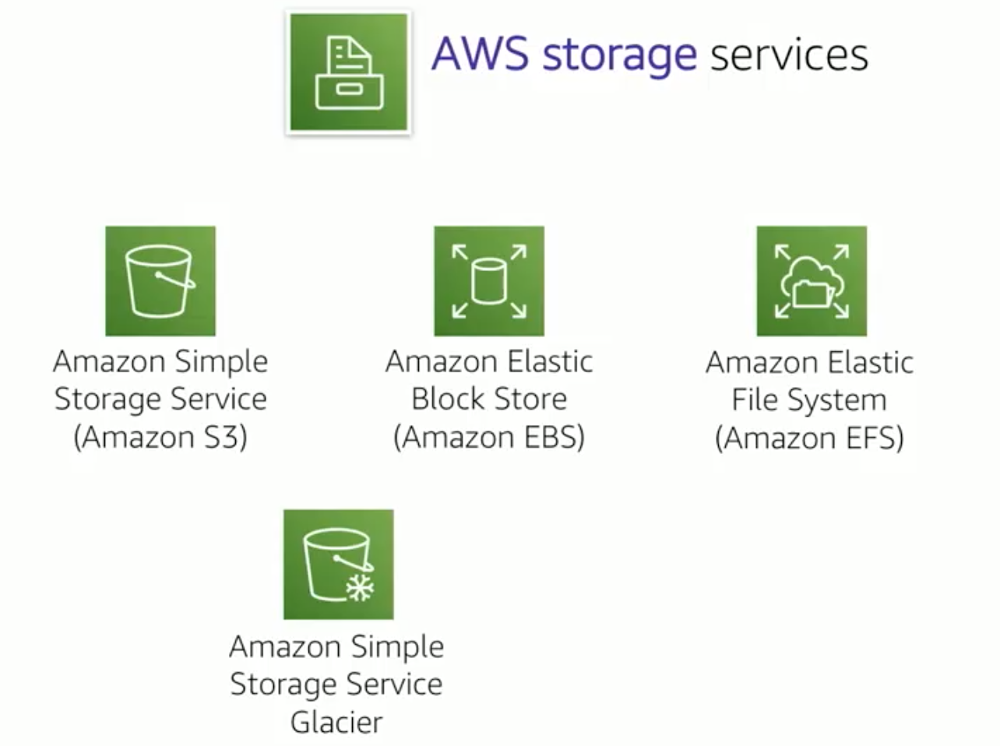
</p>

## Storage Category

### Top Utilized Storage Services
- [Amazon Simple Storage Service (S3)](https://aws.amazon.com/s3/?hp=tile&so-exp=below) Scalable storage in the cloud 
- [Amazon Elastic Block Store (EBS)](https://aws.amazon.com/ebs/?hp=tile&so-exp=below) EC2 block storage volumes 
- [Amazon Elastic File System (EFS)](https://aws.amazon.com/efs/?hp=tile&so-exp=below) Fully managed file system for EC2 
- [Amazon S3 Glacier](https://aws.amazon.com/glacier1/?hp=tile&so-exp=below) Low-cost archive storage in the cloud

#### Other Widely Utilized Storage Services
- [Amazon FSx for Lustre](https://aws.amazon.com/fsx/lustre/?hp=tile&so-exp=below) High-performance file system integrated with S3
- [Amazon FSx for Windows File Server](https://aws.amazon.com/fsx/windows/?hp=tile&so-exp=below) Fully managed Windows native file system
- [AWS Backup](https://aws.amazon.com/backup/?hp=tile&so-exp=below) Centralized backup across AWS services
- [AWS Snow Family](https://aws.amazon.com/snow/?hp=tile&so-exp=below) Physical edge computing and storage devices for rugged or disconnected environments
- [AWS Storage Gateway](https://aws.amazon.com/storagegateway/?hp=tile&so-exp=below) Hybrid storage integration
- [CloudEndure](https://aws.amazon.com/cloudendure-disaster-recovery/?hp=tile&so-exp=below) Disaster Recovery Highly automated disaster recovery


```c-lms
topic: AWS Compute
```

<p style="text-align: center">
  
</p>

### Top Utilized Compute Services
- [Amazon EC2](https://aws.amazon.com/ec2/?hp=tile&so-exp=below) Virtual servers in the cloud
- [Amazon EC2 Auto Scaling](https://aws.amazon.com/ec2/autoscaling/?hp=tile&so-exp=below) Scale compute capacity to meet demand
- [Amazon Elastic Container Service (ECS)](https://aws.amazon.com/ecs/?hp=tile&so-exp=below) Run highly secure, reliable, and scalable containers
- [Amazon Elastic Container Registry (ECR)](https://aws.amazon.com/ecr/) Easily store, share, and deploy your container software anywhere
- [AWS Elastic Beanstalk](https://aws.amazon.com/elasticbeanstalk/?hp=tile&so-exp=below) Run and manage web apps
- [AWS Lambda](https://aws.amazon.com/lambda/?hp=tile&so-exp=below) Run code without thinking about servers
- [Amazon Elastic Kubernetes Service (EKS)](https://aws.amazon.com/eks/) The most trusted way to start, run, and scale Kubernetes
- [AWS Fargate](https://aws.amazon.com/fargate/) Serverless compute for containers

#### Other Widely Utilized Compute Services
- [Amazon Lightsail](https://aws.amazon.com/lightsail/?hp=tile&so-exp=below) Launch and manage virtual private servers
- [AWS Batch](https://aws.amazon.com/batch/?hp=tile&so-exp=below) Run batch jobs at any scale
- [AWS Outposts](https://aws.amazon.com/outposts/?hp=tile&so-exp=below) Run AWS infrastructure on-premises
- [AWS Serverless](https://aws.amazon.com/serverlessrepo/?hp=tile&so-exp=below) Application Repository Discover, deploy, and publish serverless applications
- [AWS Snow Family](https://aws.amazon.com/snow/?hp=tile&so-exp=below) Physical devices to aggregate and process data in edge locations, then transfer to AWS
- [AWS Wavelength](https://aws.amazon.com/wavelength/?hp=tile&so-exp=below) Deliver ultra-low latency applications for 5G devices
- [VMware Cloud on AWS](https://aws.amazon.com/vmware/?hp=tile&so-exp=below) Build a hybrid cloud without custom hardware


```c-lms
topic: AWS Database Services
```

<p style="text-align: center">
  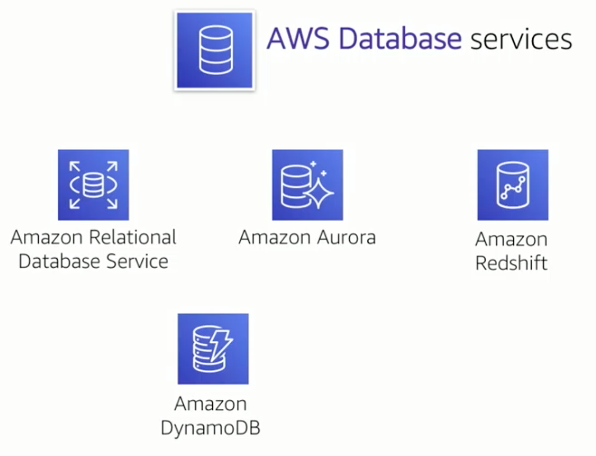
</p>

### Top Utilized Database Services
- [Amazon RDS](https://aws.amazon.com/rds/?hp=tile&so-exp=below) Managed relational database service for MySQL, PostgreSQL, Oracle, SQL Server, and MariaDB
- [Amazon Aurora](https://aws.amazon.com/rds/aurora/?hp=tile&so-exp=below) High performance managed relational database
- [Amazon Redshift](https://aws.amazon.com/redshift/?hp=tile&so-exp=below) Fast, simple, cost-effective data warehousing
- [Amazon DynamoDB](https://aws.amazon.com/dynamodb/?hp=tile&so-exp=below) Managed NoSQL database

#### Other Widely Utilized Database Services
- [Amazon DocumentDB (with MongoDB compatibility)](https://aws.amazon.com/documentdb/?hp=tile&so-exp=below) Fully managed document database
- [Amazon ElastiCache](https://aws.amazon.com/elasticache/?hp=tile&so-exp=below) In-memory caching system
- [Amazon Keyspaces (for Apache Cassandra)](https://aws.amazon.com/mcs/?hp=tile&so-exp=below) Managed Cassandra-compatible database
- [Amazon Neptune](https://aws.amazon.com/neptune/?hp=tile&so-exp=below) Fully managed graph database service
- [Amazon Quantum Ledger Database (QLDB)](https://aws.amazon.com/qldb/?hp=tile&so-exp=below) Fully managed ledger database
- [Amazon RDS on VMware](https://aws.amazon.com/rds/vmware/?hp=tile&so-exp=below) Automate on-premises database management
- [AWS Database Migration Service](https://aws.amazon.com/dms/?hp=tile&so-exp=below) Migrate databases with minimal downtime


```c-lms
topic: AWS Networking and Content Delivery
```

<p style="text-align: center">
  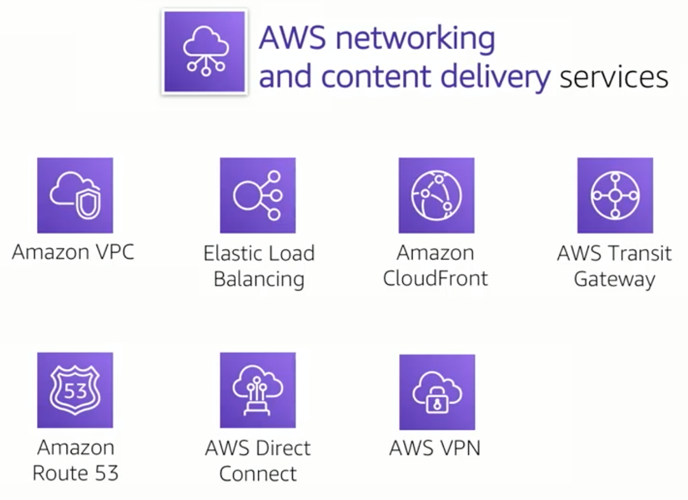
</p>

### Top Utilized Networking and Content Delivery Services
- [Amazon VPC](https://aws.amazon.com/vpc/?hp=tile&so-exp=below) Isolated cloud resources
- [Elastic Load Balancing (ELB)](https://aws.amazon.com/elasticloadbalancing/?hp=tile&so-exp=below) Distribute incoming traffic across multiple targets database
- [Amazon CloudFront](https://aws.amazon.com/cloudfront/?hp=tile&so-exp=below) Global content delivery network
- [AWS Transit Gateway](https://aws.amazon.com/transit-gateway/?hp=tile&so-exp=below) Easily scale VPC and account connections
- [Amazon Route 53](https://aws.amazon.com/route53/?hp=tile&so-exp=below) Scalable domain name system (DNS)
- [AWS Direct Connect](https://aws.amazon.com/directconnect/?hp=tile&so-exp=below) Dedicated network connection to AWS
- [AWS VPN](https://aws.amazon.com/vpn/) Extend your on-premises networks to the cloud and securely access them from anywhere

#### Other Widely Utilized Networking and Content Delivery Services
- [Amazon API Gateway](https://aws.amazon.com/api-gateway/) Build, deploy, and manage APIs at any scale
- [AWS PrivateLink](https://aws.amazon.com/privatelink/?hp=tile&so-exp=below) Securely access services hosted on AWS
- [AWS App Mesh](https://aws.amazon.com/app-mesh/?hp=tile&so-exp=below) Monitor and control microservices
- [AWS Cloud Map](https://aws.amazon.com/cloud-map/?hp=tile&so-exp=below) Service discovery for cloud resources
- [AWS Global Accelerator](https://aws.amazon.com/global-accelerator/?hp=tile&so-exp=below) Improve application availability and performance

```c-lms
topic: AWS Security, Identity, and Compliance
```

<p style="text-align: center">
  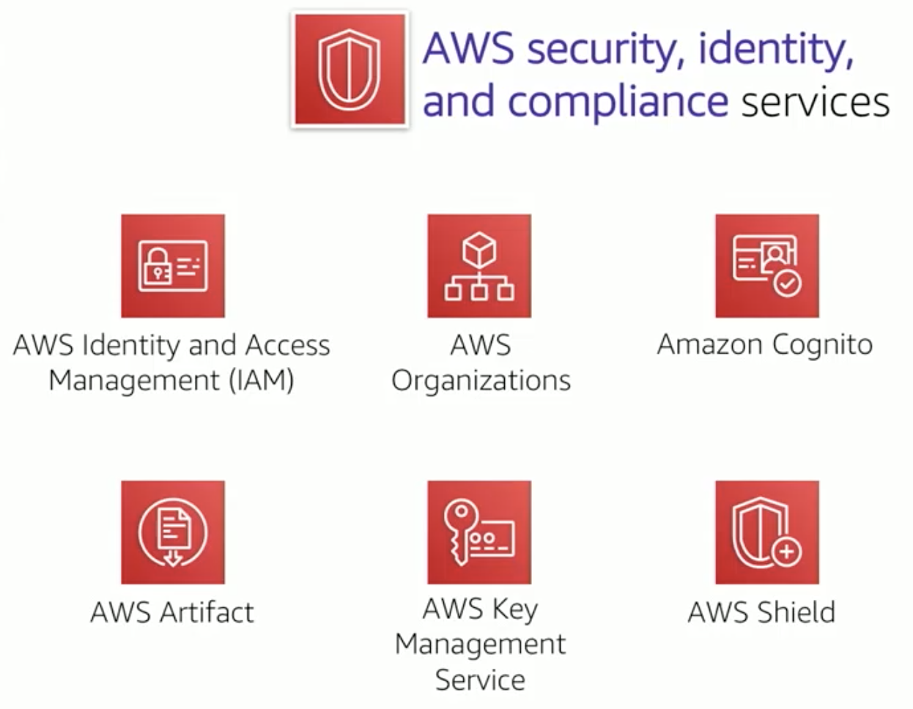
</p>

### Top Utilized Security, Identity, and Compliance Services
- [AWS Identity and Access Management (IAM)](https://aws.amazon.com/iam/?hp=tile&so-exp=below) Securely manage access to services and resources
- [AWS Organizations](https://aws.amazon.com/organizations/) Centrally manage and govern your environment as you scale your AWS resources
- [Amazon Cognito](https://aws.amazon.com/cognito/?hp=tile&so-exp=below) Identity management for your apps
- [AWS Artifact](https://aws.amazon.com/artifact/) On-demand access to AWS' compliance reports
- [AWS Key Management Service](https://aws.amazon.com/kms/?hp=tile&so-exp=below) Managed creation and control of encryption keys
- [AWS Shield](https://aws.amazon.com/shield/?hp=tile&so-exp=below) DDoS protection


#### Other Widely Utilized Security, Identity, and Compliance Services
- [Amazon Detective](https://aws.amazon.com/detective/?hp=tile&so-exp=below) Investigate potential security issues
- [Amazon GuardDuty](https://aws.amazon.com/guardduty/?hp=tile&so-exp=below) Managed threat detection service
- [Amazon Inspector](https://aws.amazon.com/inspector/?hp=tile&so-exp=below) Analyze application security
- [Amazon Macie](https://aws.amazon.com/macie/?hp=tile&so-exp=below) Discover and protect your sensitive data at scale
- [AWS Certificate Manager](https://aws.amazon.com/certificate-manager/?hp=tile&so-exp=below) Provision, manage, and deploy SSL/TLS certificates
- [AWS CloudHSM](https://aws.amazon.com/cloudhsm/?hp=tile&so-exp=below) Hardware-based key storage for regulatory compliance
- [AWS Directory Service](https://aws.amazon.com/directoryservice/?hp=tile&so-exp=below) Host and manage active directory
- [AWS Firewall Manager](https://aws.amazon.com/firewall-manager/?hp=tile&so-exp=below) Central management of firewall rules
- [AWS Resource Access Manager](https://aws.amazon.com/ram/?hp=tile&so-exp=below) Simple, secure service to share AWS resources
- [AWS Secrets Manager](https://aws.amazon.com/secrets-manager/?hp=tile&so-exp=below) Rotate, manage, and retrieve secrets
- [AWS Security Hub](https://aws.amazon.com/security-hub/?hp=tile&so-exp=below) Unified security and compliance center
- [AWS Single Sign-On](https://aws.amazon.com/single-sign-on/?hp=tile&so-exp=below) Cloud single sign-on (SSO) service
- [AWS WAF](https://aws.amazon.com/waf/?hp=tile&so-exp=below) Filter malicious web traffic

```c-lms
topic: AWS Cost Management
```

<p style="text-align: center">
  
</p>

### Top Utilized Cost Management Services
- [AWS Cost Explorer](https://aws.amazon.com/aws-cost-management/aws-cost-explorer/) Analyze your AWS cost and usage
- [AWS Budgets](https://aws.amazon.com/aws-cost-management/aws-budgets/?hp=tile&so-exp=below) Set custom cost and usage budgets
- [AWS Cost and Usage Report](https://aws.amazon.com/aws-cost-management/aws-cost-and-usage-reporting/?hp=tile&so-exp=below) Access comprehensive cost and usage information

#### Other Widely Utilized Cost Management Services
- [Reserved Instance Reporting](https://aws.amazon.com/aws-cost-management/reserved-instance-reporting/?hp=tile&so-exp=below) Dive deeper into your reserved instances (RIs)
- [Savings Plans](https://aws.amazon.com/savingsplans/?hp=tile&so-exp=below) Save up to 72% on compute usage with flexible pricing

<hr style="height:10px;border-width:0;color:gray;background-color:gray">

```c-lms
topic: AWS Management and Governance
```

<p style="text-align: center">
  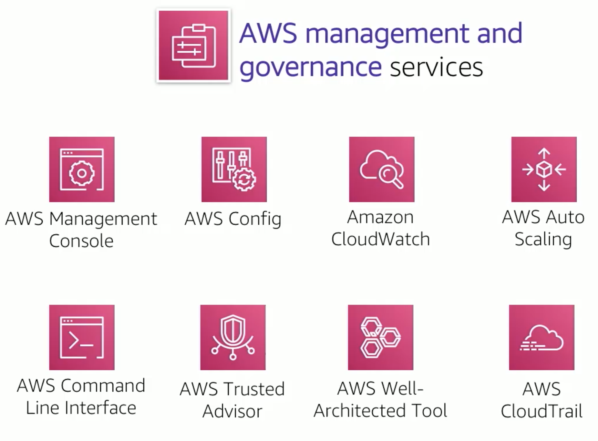
</p>

### Top Utilized AWS Management and Governance Services
- [AWS Management Console](https://aws.amazon.com/console/) Web-based user interface
- [AWS Config](https://aws.amazon.com/config/) Track resources inventory and changes
- [Amazon CloudWatch](https://aws.amazon.com/cloudwatch/) Monitor resources and applications
- [AWS Auto Scaling](https://aws.amazon.com/autoscaling/) Scale multiple resources to meet demand
- [AWS Command Line Interface](https://aws.amazon.com/cli/) Unified tool to manage AWS services
- [AWS Trusted Advisor](https://aws.amazon.com/premiumsupport/technology/trusted-advisor/) Optimize performance and security
- [AWS Well-Architected Tool](https://aws.amazon.com/well-architected-tool/) Review and improve your workloads
- [AWS CloudTrail](https://aws.amazon.com/cloudtrail/) Track user activity and API usage

#### Other Widely Utilized AWS Management and Governance Services
- [AWS Chatbot](https://aws.amazon.com/chatbot/?hp=tile&so-exp=below) ChatOps for AWS
- [AWS CloudFormation](https://aws.amazon.com/cloudformation/?hp=tile&so-exp=below) Create and manage resources with templates
- [AWS Compute Optimizer](https://aws.amazon.com/compute-optimizer/?hp=tile&so-exp=below) Identify optimal AWS Compute resources
- [AWS Control Tower](https://aws.amazon.com/controltower/?hp=tile&so-exp=below) Set-up and govern a secure, compliant multi-account environment
- [AWS Console Mobile Application](https://aws.amazon.com/console/mobile/?hp=tile&so-exp=below) Access resources on the go
- [AWS License Manager](https://aws.amazon.com/license-manager/?hp=tile&so-exp=below) Track, manage, and control licenses
- [AWS Managed Services](https://aws.amazon.com/managed-services/?hp=tile&so-exp=below) Infrastructure operations management for AWS
- [AWS OpsWorks](https://aws.amazon.com/opsworks/?hp=tile&so-exp=below) Automate operations with Chef and Puppet 
- [AWS Organizations](https://aws.amazon.com/organizations/?hp=tile&so-exp=below) Central governance and management across AWS accounts
- [AWS Personal Health Dashboard](https://aws.amazon.com/premiumsupport/phd/?hp=tile&so-exp=below) Personalized view of AWS service health
- [AWS Service Catalog](https://aws.amazon.com/servicecatalog/?hp=tile&so-exp=below) Create and use standardized products
- [AWS Systems Manager](https://aws.amazon.com/systems-manager/?hp=tile&so-exp=below) Gain operational insights and take action


## Review and Practice<a class="anchor" id="DS107L2.14_quiz"></a>

Below you will find a quiz to review the recently covered material. Quizzes are _not_ graded.

```c-lms
start-activity: DS107L2.14 AWS Management and Governance Quiz
```


```c-lms
topic: AWS Cloud Security
```

After completing this section you should be able to:

- Recognize the shared security model
- Identify the responsibility of the customer and AWS
- Recognize IAM users, groups and roles
- Describe different types of security credentials in iAM
- Identify the steps to securing a new AWS Account
- Explore IAM users and groups
- Recognize how to secure AWS data
- Recognize AWS compliance programs

AWS Shared Security Model:

<p style="text-align: center">
  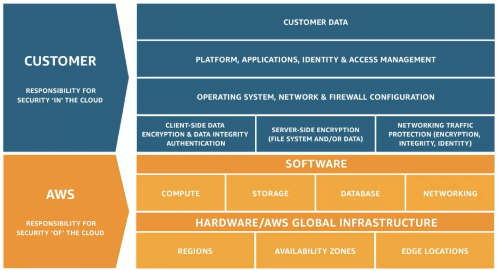
</p>

AWS Responsibilities:

- Physical security of data centers
    - Controlled, need-based access
- Hardware and software infrastructure
    - Storage decommissioning, host operating system (OS) access logging, and auditing 
- Network infrastructure
    - Intrusion detection
- Virtualization infrastructure
    - Instance isolation

<p style="text-align: center">
  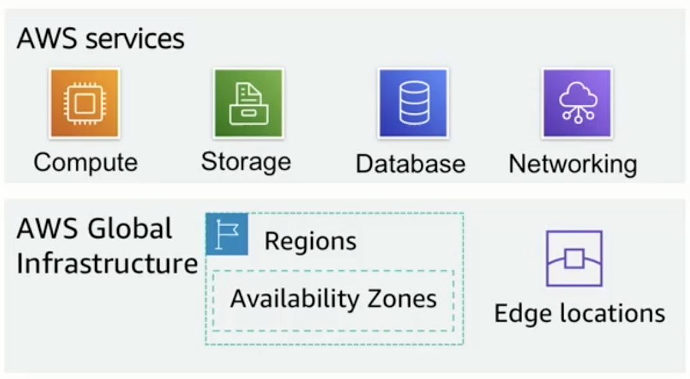
</p>

Customer Responsibilities:

- Amazon Elastic Compute Cloud (EC2) instance operating system
    - Includes patching, maintenance
- Applications
    - Passwords, role-based access, etc.
- Security group configuration
- OS or host-based firewalls
    - Including intrusion detection or prevention systems
- Network configurations
- Account management
    - Login and permission settings for each user

<p style="text-align: center">
  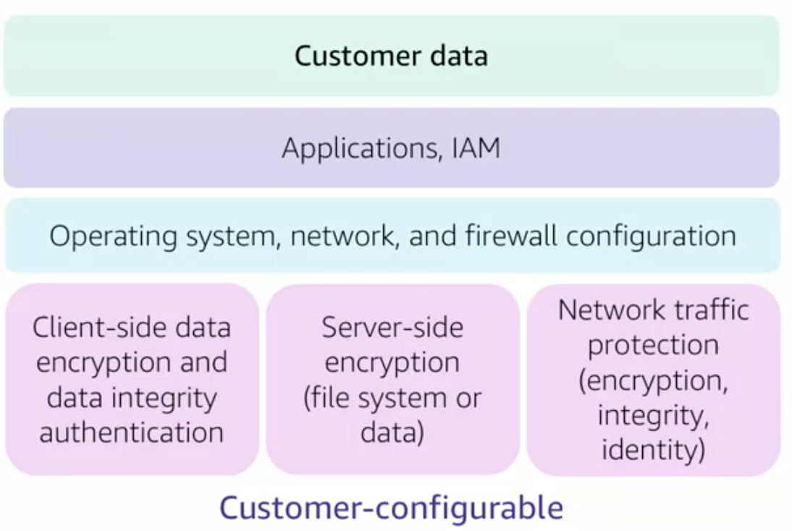
</p>

Service characteristics and security responsibility

<p style="text-align: center">
  
</p>

<p style="text-align: center">
  
</p>

## Review and Practice<a class="anchor" id="DS107L2.15_quiz"></a>

Below you will find a quiz to review the recently covered material. Quizzes are _not_ graded.

```c-lms
start-activity: DS107L2.15 AWS Cloud Security Quiz
```


```c-lms
topic: AWS Identity and Access Management (IAM)
```

IAM is one of the first services you will use in AWS.

<p style="text-align: left">
  
</p>

- Use IAM to manage AWS Resources
    - A resources is an entity in an AWS account that you work with such as:
    - S3 bucket or an EC2 instance
- For example you can control can terminate EC2 instances or delete S3 buckets
- You can define fine-grain access rights
    - who can access the resource
    - which resources can be accessed
    - what can a user do with the resource
    - how resources can be accessed
- IAM is a no-cost account service
---

## IAM essential components

<p style="text-align: left">
  
</p>

A person or application that can authenticate with an AWS account.

<p style="text-align: left">
  
</p>

A collection of IAM users that are granted identical authorization.

<p style="text-align: left">
  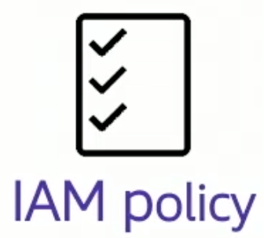
</p>

The document that defines which resources can be accessed and the level of access to each resource.

<p style="text-align: left">
  
</p>

Useful mechanism to grant a set of permissions for making AWS service requests.

---

When you define an IAM user, you select what types of access the user is permitted to use.

- Programmatic Access
    - Authenticate using:
        - Access key ID
        - Secret access key
    - Provide AWS CLI and SDK access

- AWS Management Console Access
    - Authenticate using:
        - 12-digit account ID
        - IAM username and password
    - If enabled, multi-factor authentication (MFA) prompt for an authentication code.

<p style="text-align: center">
  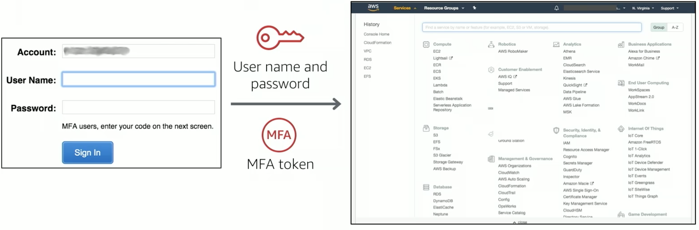
</p>

---

After an AWS User is connected to their account, what are they allowed to do and access?

<p style="text-align: center">
  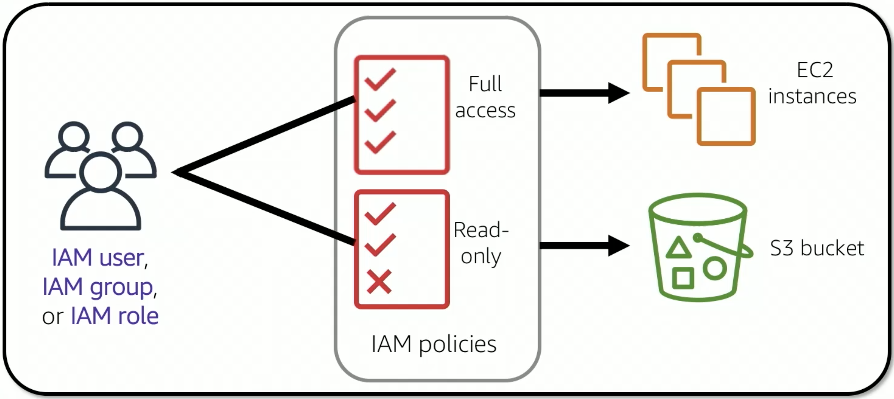
</p>

---

## IAM Authorizations

- Assign permissions by creating an IAM Policy.
- Permissions determine which resources and operations are allowed.
    - All permissions are implicitly denied by default.
    - If something is explicitly denied, it is never allowed.

Best practice: Follow the **principle of least priviledge**

Note: the scope of IAM service configurations are global. Settings apply across all AWS Regions.

---

## IAM Policies

- An IAM Policy is a document that defines permissions
    - Enables fine-grain access control
- Two types of policies - Identity-based and Resource-based
    - Identity-based policies
        - Attach a policy to any IAM entity
            - IAM User, IAM Group, IAM Policy
        - Policies specify:
            - Actions that may be performed by the entity
            - Actions that may not be peformed by the entity
        - A single policy can be attached to multiple entities
        - A single entity can have multiple policies attached to it
    - Resource-based policies
        - Attached to a resources such as an S3 bucket


<p style="text-align: center">
  
</p>


How an IAM determines positions:

<p style="text-align: center">
  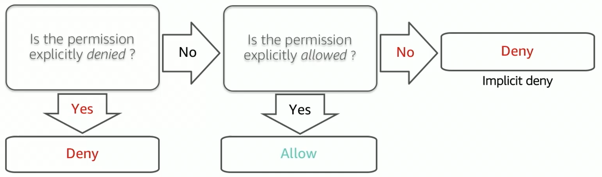
</p>

---

## IAM Groups

- An IAM Group is a collection of IAM Users
- A group is used to grant the same permissions to multiple users
    - Permissions granted by attaching IAM policy or policies to the group
- A user can belong to multiple groups
- There is no default group
- Groups cannot be nested

<p style="text-align: center">
  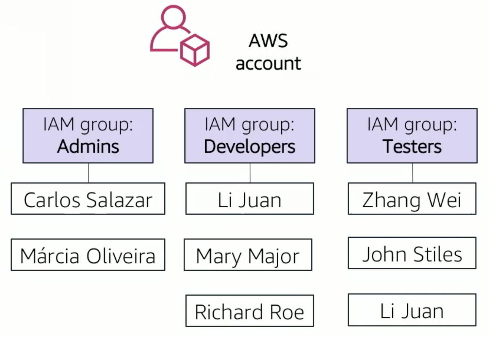
</p>

---

## IAM Roles

- An IAM Role is a specific IAM identity with specific permissions
- Similar to an IAM user
    - attach permission policies to it
- Different from an IAM user
    - Not uniquely associated with one person
    - Intended to be assumable by a person, application, or service
- Role provides temporary security credentials
- Examples of how IAM roles are used to delegate access
    - Used by the IAM user in the same AWS account as the role
    - Used by an AWS service such as Amazon EC2 in the same account as the role
    - Used by the IAM user in a different AWS account than the role

Scenario:

- An application that runs on an EC2 instance needs access to an S3 bucket

Solution:

- Define an IAM policy that grants access to the S3 bucket
- Attach the policy to a role
- Allow EC2 instance to assume the role

<p style="text-align: center">
  
</p>

---

## Review and Practice<a class="anchor" id="DS107L2.16_quiz"></a>

Below you will find a quiz to review the recently covered material. Quizzes are _not_ graded.

```c-lms
start-activity: DS107L2.16 AWS IAM Quiz
```

```c-lms
topic: AWS Organizations
```

<p style="text-align: center">
  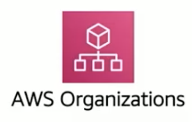
</p>

- AWS Organizations enables you to consolidate multiple AWS accounts so that you centrally manage them.

- Security features of AWS Organizations:
    - Group AWS accounts into organizational units (OUs) and attached different access policies to each OU.
    - Integration and support for IAM
        - Permissions to a user at the intersection what is allowed by AWS Organizations and what is granted by IAM in that account.
    - User service control policies to establish control over the AWS services and API actions  that actions that each AWS account can access.

- Service control policies (SCPs) offer centralized control over accounts.
    - Limit permissions that are available in an account that is part of an organization.
- Ensures that accounts comply with access control guidelines
- SCPs are similar to IAM permissions policies:
    - They use similar syntax.
    - However, SCP never grants permissions.
    - Instead, SCPs specify the maximum permissions for an organization.


```c-lms
topic: AWS Key Management Service (AWS KMS)
```

<p style="text-align: center">
  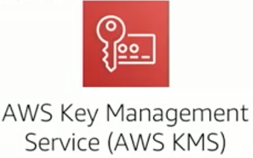
</p>

AWS Key Management Services (AWS KMS) features:
- Enables you to create and manage encryption keys.
- Enables you to control the use of encryption across AWS services and in your applications.
- Integrates with CloudTrail to log all key usage.
- Uses hardware security modules (HSMs) that are validated by Federal Information Processing Standards (FIPS) 140-2 to protect keys.

```c-lms
topic: Amazon Cognito
```

<p style="text-align: center">
  
</p>

Amazon Cognito features:
- Adds user sign-up, sign-in, and access control to you web and mobile applications.
- Scales to millions of users.
- Supports sign-in with social identity partners, such as Facebook, Google, and Amazon; and enterprise identity providers, such as Microsoft Active Directory via Security Assertion Markup Language (SAML) 2.0.

```c-lms
topic: AWS Shield
```


<p style="text-align: center">
  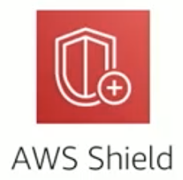
</p>

AWS Shield features:
- Is a managed distributed denial of service (DDoS) protection service
- Safeguards applications running on AWS
- Provides always-on detection and automatic inline mitigations
- AWS Shield Standard enabled at no additional cost.
- AWS Shield Advanced is an optional paid service
- Used to minimize application downtime and latency

```c-lms
topic: Securing Data on AWS
```

## Encryption of data at rest

- Encryption encodes data with a secret key, which makes it unreadable.
    - Only those with the secret key can decode the data.
    - AWS KMS can manage your secret keys
- AWS supports encrypted data at rest
    - Data at rest = Data stored physically (On disk or tape)
    - You can encrypt data stored in any service that is supported by AWS KMS, including:
        - Amazon S3
        - Amazon EBS
        - Amazon Elastic File System (EFS)
        - Amazon RDS managed databases 

## Encryption of data in transit

- Encryption of data in transit (data moving across a network)
    - Transport Layer Security (TLS), formerly SSL, is an open standard protocol.
    - AWS Certificate Manager provides a way to manage, deploy, and renew TLS or SSL certificates
- Secure HTTP(HTTPS) creates a secure tunnel
    - Uses TLS or SSL for secure bidirectional exchange of data
- AWS services support data in transit encryption
    - Two examples show below:
    
<p style="text-align: center">
  
</p>

## Securing Amazon S3 buckets and objects

- Newly created S3 buckets and objects are private and protected by default.
- When use cases require data objects on Amazon S3:
    - It is essential manage and control data access
    - Follow the permissions that follow the principle of least priviledge.
    - Consider using Amazon S3 encryption
- Tools and options for controlling access to S3 include:
    - [Amazon S3 Block Public Access feature](https://docs.aws.amazon.com/AmazonS3/latest/userguide/access-control-block-public-access.html): Simple to use.
    - [IAM Policies](https://docs.aws.amazon.com/IAM/latest/UserGuide/access_policies.html): is a good option for a user to authenticate using IAM.
    - [S3 Bucket Policies](https://docs.aws.amazon.com/AmazonS3/latest/userguide/using-iam-policies.html)
    - [Access Control Lists (ACLs)](https://docs.aws.amazon.com/AmazonS3/latest/userguide/acl-overview.html): A legacy access control mechanism
    - [AWS Trusted Advisor bucket permissions check](https://docs.aws.amazon.com/awssupport/latest/user/trusted-advisor-check-reference.html): A free feature
    
```c-lms
topic: Ensuring Compliance
```

## AWS Compliance Programs

- Customers are subject to many different security and compliance regulations and requirements.
- AWS engages with certifying bodies and independent auditors to provide customers with detailed information about the policies, processes, and controls that are established and operated by AWS. 
- Compliance programs can be broadly categorized:
    - Certifications and attestations
        - Assessed by a third party, independent auditor.
        - Examples: ISO 27001, 27017, 27018, and ISO/IEC 9001.
    - Laws, regulations, and privacy
        - AWS provides security features and legal agreements to support compliance.
        - Examples: EU General Data Protection Regulation (GDPR), HIPAA.
    - Alignments and frameworks
        - Industry - function-specific security or compliance requirements
        - Examples: Center for Internet Security (CIS), EU-US Privacy Shield certified


## AWS Config

<p style="text-align: center">
  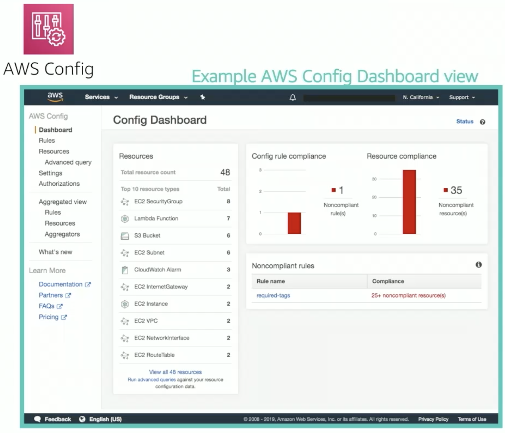
</p>

- Assess, audit, and evaluate the configurations of AWS resources.
- Use for continuous monitoring of configurations.
- Automatically evaluate recorded configurations versus desired configurations.
- View detailed configuration histories.
- Simplify compliance auditing and security analysis.

## AWS Artifact

- Is a resource for compliance-related information.
- Provides access to security and compliance reports and select online agreements.
- Can access example downloads:
    - AWS ISO certifications
    - Payment Card Industry (PCI) and Service Organizational Control (SOC) reports.
- Access AWS Artifact directly from the AWS Management Console 
    - Under Security, Identity, and Compliance click Artifact.

<p style="text-align: center">
  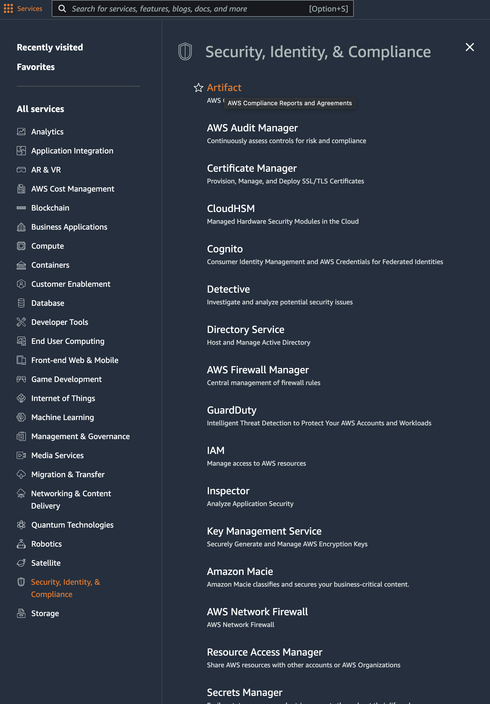
</p>

## Review and Practice<a class="anchor" id="DS107L2.22_quiz"></a>

Below you will find a quiz to review the recently covered material. Quizzes are _not_ graded.

```c-lms
start-activity: DS107L2.22 Ensuring Compliance Quiz
```

```c-lms
topic: Lesson Summary
```

## Lesson Summary
In this lesson you learned how to:

- Identify the difference between AWS Regions, Availability Zones, and Edge locations
- Identify the various AWS Services and Service Categories
- Recognize the shared security model
- Identify the responsibility of the customer and AWS
- Recognize IAM users, groups, and roles
- Describe the different types of security credentials in IAM
- Identify the steps in securing a new AWS account
- Explore IAM users and groups
- Recognize how to secure AWS data
- Recognize AWS compliance programs

```c-lms
topic: Key Terms
```
## Key Terms

Below is a list and short description of the important keywords learned in this lesson. Please read through and go back and review any concepts you do not fully understand. 

<table class="table table-striped">
    <tr>
        <th>Keyword</th>
        <th>Description</th>
    </tr>
    <tr>
        <td style="font-weight: bold;" nowrap>AWS Region</td>
        <td>Separate geographic areas that AWS uses to house its infrastructure. These are distributed around the world so that customers can choose a region closest to them in order to host their cloud infrastructure there.</td>
    </tr>
    <tr>
        <td style="font-weight: bold;" nowrap>AWS Availability Zone (AZ)</td>
        <td>Distinct locations within an AWS Region that are engineered to be isolated from failures in other Availability Zones. They provide inexpensive, low-latency network connectivity to other Availability Zones in the same AWS Region.</td>
    </tr>
    <tr>
        <td style="font-weight: bold;" nowrap>AWS Edge Locations</td>
        <td>A site that CloudFront uses to cache copies of your content for faster delivery to users at any location.</td>
    </tr>
    <tr>
        <td style="font-weight: bold;" nowrap>AWS Data Center</td>
        <td>Physical facility that Amazon uses to house their critical applications and data.</td>
    </tr>
    <tr>
        <td style="font-weight: bold;" nowrap>Amazon Cloudfront</td>
        <td> web service that speeds up distribution of your static and dynamic web content, such as .html, .css, .js, and image files, to your users. CloudFront delivers your content through a worldwide network of data centers called edge locations.</td>
    </tr>
    <tr>
        <td style="font-weight: bold;" nowrap>Amazon S3 (Simple Storage Service)</td>
        <td>An object storage service offering industry-leading scalability, data availability, security, and performance.</td>
    </tr>
    <tr>
        <td style="font-weight: bold;" nowrap>Amazon EBS (Elastic Block Store)</td>
        <td>Provides block level storage volumes for use with EC2 instances. </td>
    </tr>
    <tr>
        <td style="font-weight: bold;" nowrap>Amazon EFS (Elastic File System)</td>
        <td>Provides a simple, serverless, set-and-forget elastic file system for use with AWS Cloud services and on-premises resources. It is built to scale on demand.</td>
    </tr>
    <tr>
        <td style="font-weight: bold;" nowrap>AWS Glacier</td>
        <td>A secure, durable, and extremely low-cost Amazon S3 storage class for data archiving and long-term backup.</td>
    </tr>
    <tr>
        <td style="font-weight: bold;" nowrap>AWS Storage Gateway</td>
        <td>Hybrid cloud storage service that gives you on-premises access to virtually unlimited cloud storage.</td>
    </tr>
    <tr>
        <td style="font-weight: bold;" nowrap>Amazon EC2 (Elastic Compute Cloud)</td>
        <td>Provides scalable computing capacity in the Amazon Web Services (AWS) Cloud.</td>
    </tr>
    <tr>
        <td style="font-weight: bold;" nowrap>Amazon EC2 Auto Scaling</td>
        <td>Helps you maintain application availability and allows you to automatically add or remove EC2 instances according to conditions you define. You can use the fleet management features of EC2 Auto Scaling to maintain the health and availability of your fleet.</td>
    </tr>
    <tr>
        <td style="font-weight: bold;" nowrap>Amazon ECS (Elastic Container Service)</td>
        <td>A highly scalable and fast container management service. You can use it to run, stop, and manage containers on a cluster.</td>
    </tr>
    <tr>
        <td style="font-weight: bold;" nowrap>Amazon EC2 Container Registry</td>
        <td>A fully-managed Docker container registry, making it easy for developers to store, manage, and deploy container images.</td>
    </tr>
    <tr>
        <td style="font-weight: bold;" nowrap>AWS Elastic Beanstalk</td>
        <td>An easy-to-use service for deploying and scaling web applications and services developed with Java, .NET, PHP, Node.js, Python, Ruby, Go, and Docker on familiar servers such as Apache, Nginx, Passenger, and IIS.</td>
    </tr>
    <tr>
        <td style="font-weight: bold;" nowrap>AWS Lambda</td>
        <td>A compute service that lets you build applications that respond quickly to new information and events.</td>
    </tr>
    <tr>
        <td style="font-weight: bold;" nowrap>Amazon EKS (Elastic Kubernetes Service)</td>
        <td>A managed Kubernetes service that makes it easy for you to run Kubernetes on AWS and on-premises. Kubernetes is an open-source system for automating deployment, scaling, and management of containerized applications.</td>
    </tr>
    <tr>
        <td style="font-weight: bold;" nowrap>AWS Fargate</td>
        <td>A serverless, pay-as-you-go compute engine that lets you focus on building applications without managing servers.</td>
    </tr>
    <tr>
        <td style="font-weight: bold;" nowrap>Amazon RDS (Relational Database Service)</td>
        <td>A managed relational database service that provides you six familiar database engines to choose from, including Amazon Aurora, MySQL, MariaDB, Oracle, Microsoft SQL Server, and PostgreSQL.</td>
    </tr>
    <tr>
        <td style="font-weight: bold;" nowrap>Amazon Aurora</td>
        <td>A fully managed relational database engine that's compatible with MySQL and PostgreSQL. </td>
    </tr>
    <tr>
        <td style="font-weight: bold;" nowrap>Amazon DynamoDB</td>
        <td>A fully managed, serverless, key-value NoSQL database designed to run high-performance applications at any scale. DynamoDB offers built-in security, continuous backups, automated multi-region replication, in-memory caching, and data export tools.</td>
    </tr>
    <tr>
        <td style="font-weight: bold;" nowrap>Amazon Redshift</td>
        <td>A fully managed, petabyte-scale data warehouse service in the cloud.</td>
    </tr>
    <tr>
        <td style="font-weight: bold;" nowrap>Amazon VPC (Virtual Private Cloud)</td>
        <td>Enables you to launch AWS resources into a virtual network that you've defined. This virtual network closely resembles a traditional network that you'd operate in your own data center, with the benefits of using the scalable infrastructure of AWS.</td>
    </tr>
    <tr>
        <td style="font-weight: bold;" nowrap>Elastic Load Balancing</td>
        <td>Automatically distributes incoming application traffic across multiple targets and virtual appliances in one or more Availability Zones.</td>
    </tr>
    <tr>
        <td style="font-weight: bold;" nowrap>AWS Transit Gateway</td>
        <td>A network transit hub that you can use to interconnect your virtual private clouds (VPCs) and on-premises networks.</td>
    </tr>
    <tr>
        <td style="font-weight: bold;" nowrap>Amazon Route 53</td>
        <td>A highly available and scalable cloud Domain Name System (DNS) web service.</td>
    </tr>
    <tr>
        <td style="font-weight: bold;" nowrap>AWS Direct Connect</td>
        <td>A network service that provides an alternative to using the Internet to utilize AWS cloud services. AWS Direct Connect enables customers to have low latency, secure and private connections to AWS for workloads which require higher speed or lower latency than the internet.</td>
    </tr>
    <tr>
        <td style="font-weight: bold;" nowrap>AWS VPN (Virtual Private Network)</td>
        <td>Establishes encrypted connections between your network or device and AWS.</td>
    </tr>
    <tr>
        <td style="font-weight: bold;" nowrap>AWS IAM (Identity and Access Management)</td>
        <td>Provides fine-grained access control across all of AWS. With IAM, you can specify who can access which services and resources, and under which conditions.</td>
    </tr>
    <tr>
        <td style="font-weight: bold;" nowrap>AWS Organizations</td>
        <td>An account management service that enables you to consolidate multiple AWS accounts into an organization that you create and centrally manage. AWS Organizations includes account management and consolidated billing capabilities.</td>
    </tr>
    <tr>
        <td style="font-weight: bold;" nowrap>Amazon Artifact</td>
        <td>Provides on-demand downloads of AWS security and compliance documents, such as AWS ISO certifications, Payment Card Industry (PCI), and Service Organization Control (SOC) reports.</td>
    </tr>
    <tr>
        <td style="font-weight: bold;" nowrap>AWS Cognito</td>
        <td>Lets you add user sign-up, sign-in, and access control to your web and mobile apps quickly and easily. Amazon Cognito scales to millions of users and supports sign-in with social identity providers, such as Apple, Facebook, Google, and Amazon, and enterprise identity providers via SAML 2.0 and OpenID Connect.</td>
    </tr>
    <tr>
        <td style="font-weight: bold;" nowrap>AWS KMS (Key Management Service)</td>
        <td>A managed service that makes it easy for you to create and control the cryptographic keys that are used to protect your data.</td>
    </tr>
    <tr>
        <td style="font-weight: bold;" nowrap>AWS Shield</td>
        <td>A managed Distributed Denial of Service (DDoS) protection service that safeguards applications running on AWS. AWS Shield provides always-on detection and automatic inline mitigations that minimize application downtime and latency, so there is no need to engage AWS Support to benefit from DDoS protection.</td>
    </tr>
    <tr>
        <td style="font-weight: bold;" nowrap>Amazon Detective</td>
        <td>Makes it easy to analyze, investigate, and quickly identify the root cause of potential security issues or suspicious activities. Amazon Detective automatically collects log data from your AWS resources and uses machine learning, statistical analysis, and graph theory to build a linked set of data that enables you to easily conduct faster and more efficient security investigations.

</td>
    </tr>
    <tr>
        <td style="font-weight: bold;" nowrap>Amazon GuardDuty</td>
        <td>A continuous security monitoring service that analyzes and processes the following Data sources: VPC Flow Logs, AWS CloudTrail management event logs, CloudTrail S3 data event logs, and DNS logs.</td>
    </tr>
    <tr>
        <td style="font-weight: bold;" nowrap>AWS Cost and Usage Report</td>
        <td>Tracks your AWS usage and provides estimated charges associated with your account.</td>
    </tr>
    <tr>
        <td style="font-weight: bold;" nowrap>AWS Budgets</td>
        <td>Gives you the ability to set custom budgets that alert you when your costs or usage exceed (or are forecasted to exceed) your budgeted amount. You can also use AWS Budgets to set reservation utilization or coverage targets and receive alerts when your metrics drop below the threshold you define.</td>
    </tr>
    <tr>
        <td style="font-weight: bold;" nowrap>AWS Cost Explorer</td>
        <td>A tool that enables you to view and analyze your costs and usage. You can explore your usage and costs using the main graph, the Cost Explorer cost and usage reports, or the Cost Explorer RI reports. You can view data for up to the last 12 months.</td>
    </tr>
    <tr>
        <td style="font-weight: bold;" nowrap>AWS Management Console</td>
        <td>A browser-based GUI for Amazon Web Services (AWS). Through the console, a customer can manage their cloud computing, cloud storage and other resources running on the Amazon Web Services infrastructure.</td>
    </tr>
    <tr>
        <td style="font-weight: bold;" nowrap>AWS Config</td>
        <td>A service that enables you to assess, audit, and evaluate the configurations of your AWS resources. Config continuously monitors and records your AWS resource configurations and allows you to automate the evaluation of recorded configurations against desired configurations.</td>
    </tr>
    <tr>
        <td style="font-weight: bold;" nowrap>Amazon CloudWatch</td>
        <td>A monitoring and management service that provides data and actionable insights for AWS, hybrid, and on-premises applications and infrastructure resources.</td>
    </tr>
    <tr>
        <td style="font-weight: bold;" nowrap>AWS Auto Scaling</td>
        <td>Monitors your applications and automatically adjusts capacity to maintain steady, predictable performance at the lowest possible cost. Using AWS Auto Scaling, it’s easy to setup application scaling for multiple resources across multiple services in minutes.</td>
    </tr>
    <tr>
        <td style="font-weight: bold;" nowrap>AWS CLI (Command Line Interface)</td>
        <td>A unified tool to manage your AWS services. With just one tool to download and configure, you can control multiple AWS services from the command line and automate them through scripts.</td>
    </tr>
    <tr>
        <td style="font-weight: bold;" nowrap>AWS Trusted Advisor</td>
        <td>Provides recommendations that help you follow AWS best practices. Trusted Advisor evaluates your account by using checks. These checks identify ways to optimize your AWS infrastructure, improve security and performance, reduce costs, and monitor service quotas.</td>
    </tr>
    <tr>
        <td style="font-weight: bold;" nowrap>AWS Well-Architected Tool</td>
        <td>A service in the cloud that provides a consistent process for measuring your architecture using AWS best practices.</td>
    </tr>
    <tr>
        <td style="font-weight: bold;" nowrap>AWS CloudTrail</td>
        <td>Helps you enable governance, compliance, and operational and risk auditing of your AWS account. Actions taken by a user, role, or an AWS service are recorded as events in CloudTrail.</td>
    </tr>
</table>

```c-lms
topic: Complete AWS Academy Cloud Foundations Lab 1 and Exam 2
```


- Lab 1 - Introduction to AWS IAM

[Watch this workshop if you need guidance!](https://vimeo.com/758819595)


<div style="padding:56.66% 0 0 0;position:relative;"><iframe src="https://player.vimeo.com/video/758819595?h=b9792f4d41&amp;badge=0&amp;autopause=0&amp;player_id=0&amp;app_id=58479" frameborder="0" allow="autoplay; fullscreen; picture-in-picture" allowfullscreen style="position:absolute;top:0;left:0;width:100%;height:100%;" title="Lab 1 - Introduction to AWS IAM"></iframe></div><script src="https://player.vimeo.com/api/player.js"></script>


```c-lms
start-activity: DS107L2.25 Lesson 2 Exam
```


