```c-lms
activity-name: AWS Networking Content Delivery and Compute
topic: Overview of this Module
```

# AWS Networking Content Delivery and Compute

## Topics

- Networking basics
- Amazon VPC
- VPC networking 
- VPC security
- Amazon Route 53
- Amazon CloudFront

## Activities

- Label a network diagram
- Design a basic VPC architecture

## Demo

- Watch VPC Demonstration

## Lab Assignment

- Build a VPC and launch a web server

### After completing the AWS Networking Content Delivery module you should be able to:

- Recognize the basics of networking
- Describe virtual networking in the cloud with Amazon VPC
- Label a network diagram
- Design a basic VPC architecture
- Indicate the steps to build a VPC
- Identify security groups
- Create your own VPC and add additional components to it to produce a customized network
- Identify the fundamentals Amazon Route 53 
- Recognize the benefits of CloudFront


```c-lms
topic: Networking Basics
```
## Networking Basics

<p style="text-align: center">
  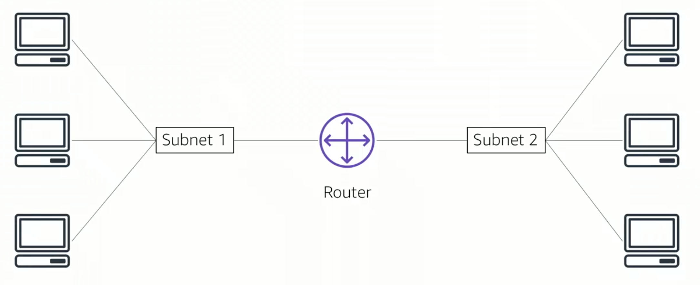
</p>

A computer network consists of two or more computers connected together in order to communicate. A network can be logically partitioned into subnets. Networking requires network equipment such as routers or switches. These devices connect all the computers together and enables communication between them. 

<p style="text-align: center">
  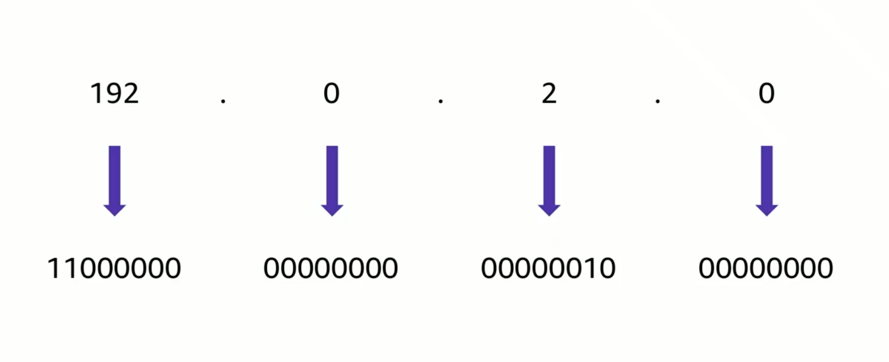
</p>

Each machine on the network has a unique Internet Protocol (IP) address assigned to it. An IP address is similar to a phone number and must be unique on that subnet for it to adequately communicate with other computers have their own IP address. Machines convert that decimal number to a binary format in order to use it. For the IP address 192.0.2.0, each of the four dot separated numbers of the address represent a maximum of 8 bits called an octet. This means that each of the four numbers can be anything from 0 to 255. The combined total of the four numbers for an IP address is 32 bits in binary format. A 32 bit IP address is called an IPv4 address.

<p style="text-align: center">
  
</p>

IPv6 addresses also exist and use a 128 bit binary format. IPv6 can address more devices and were created since we're running out of IPv4 addresses. An IPv6 address is composed of 8 groups of four letters and numbers that are separated by colons. Each of the groups represent 16 bits. That means that each of the groups can represent anything from 0 to ffff. These are hexidecimal numbers i.e. (0,1,2,3,4,5,6,7,8,9,A,B,C,D,E,F)


<p style="text-align: center">
  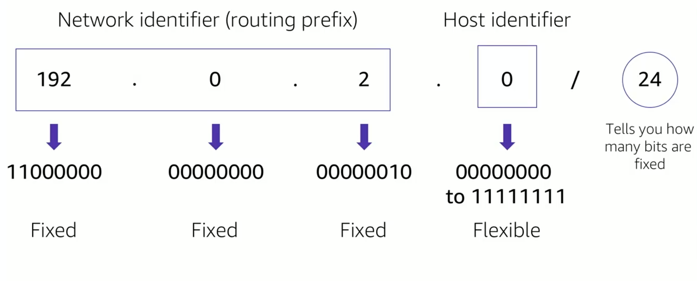
</p>

A common method to describe networks and groups of IP address is called Classless Inter-Domain Routing or CIDR. A CIDR address is expressed as an IP address, which is the first address of the network followed by a / (forward slash character). Where the prefix must be steady and not changeable and allocated for the network identifier. The bits that are not fixed are allowed to change. CIDR is a way to express a group of IP addresses that are consecutive to each other. In the above example, the CIDR address is 192.0.2.0/24 where the last octet is changeable and the first three octets are fixed. This means that there are 256 addresses available for this network. The range for this network is 192.0.2.0 - 192.0.2.255. 

<p style="text-align: center">
  
</p>

The Open System Interconnection (OSI) Model is a conceptual model that is used to explain data as it travels over a network and which layer the computer may receive it at. It consists of seven layers and shows the various common protocols and addresses that are used to send and receive data at each layer. For example, hubs and switches operate at layer 2 where a router will operate at layer 3. The OSI model is used to demonstrate and understand how communication takes place on a simple network as well as the cloud and Internet.  

```c-lms
topic: Amazon Virtual Private Cloud (VPC)
```

## Amazon Virtual Private Cloud (VPC)

<p style="text-align: center">
  
</p>

- Enables you to provision a logically isolated section of the AWS Cloud where you can launch AWS resources in a virtual network that you define.
- Gives you control over your virtual networking resources, including:
    - Selection of IP address range.
    - Creation of subnets.
    - Configuration of route tables and network gateways.
- Enables you to customize the network configuration for your VPC.
- Enables you to use multiple layers of security.

## VPCs and Subnets

- VPCs:
    - Logically isolated from other VPCs.
    - Dedicated to your AWS account.
    - Belong to single AWS Region and can span multiple Availability Zones (AZs).
- Subnets:
    - Range of IP addresses that divide a VPC.
    - Belong to a single Availability Zone.
    - Classified as public or private.

<p style="text-align: center">
  
</p>

## IP Adressing

- When you create a VPC, you assign it to an IPv4 CIDR block (range of IPv4 addresses).
- You cannot change the address range after you create the VPC.
- The largest IPv4 CIDR block is /16.
- The smallest IPv4 CIDR block is /28.
- IPv6 is also available (with different block size limit).
- CIDR blocks of subnets cannot overlap.

<p style="text-align: center">
  
</p>

## Reserved IP addresses

Example: A VPC with an IPv4 CIDR block 10.0.0.0/16 has 65,536 total IP addresses. The VPC has four equal size subnets. Out of the 256 addresses in a /24 subnet, only 251 IP addresses are available for use by each subnet.

<p style="text-align: center">
  
</p>

### 5 reserved IP addresses

<p style="text-align: center">
  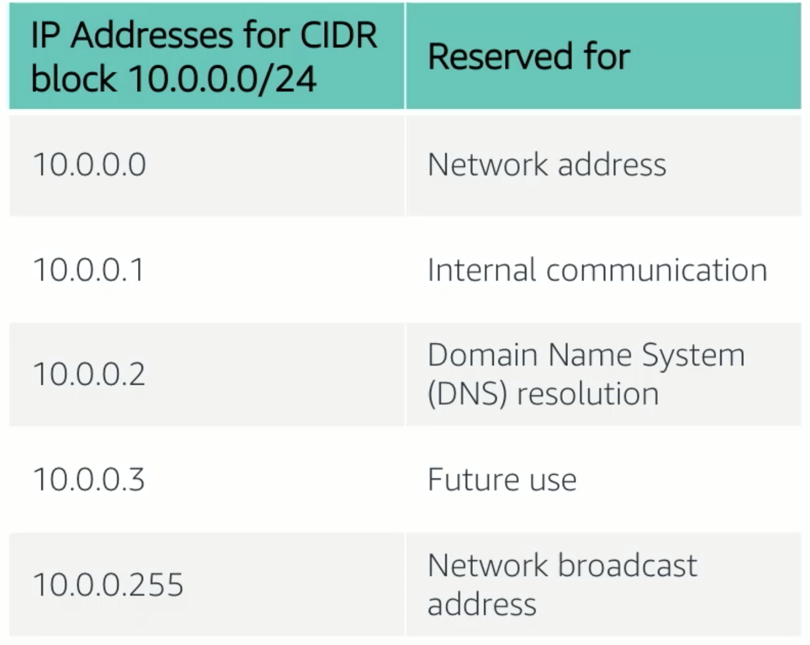
</p>

## Public IP address types

### Public IPv4 addresses

- Manually assigned through an Elastic IP address
- Automatically assigned through the auto-assign public IP address settings at the subnet level

### Elastic IP address

- Associated with the AWS account
- Can be allocated and remapped anytime
- Additional costs might apply


## Elastic Network Interface

<p style="text-align: center">
  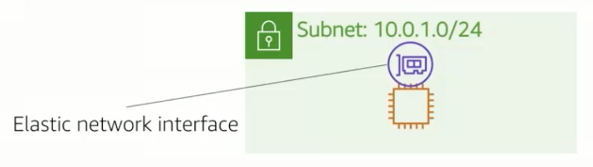
</p>

- An elastic network interface is a virtual network interface that you can:
    - Attach to an instance
    - Detach from an instance, and attach to another instance to redirect network traffic
- Its attributes follow when it is reattached to a new instance.
- Each instance in your VPC has a default network interface that is assigned a private IPv4 address from the IPv4 range of your VPC.

## Route tables and routes

<p style="text-align: center">
  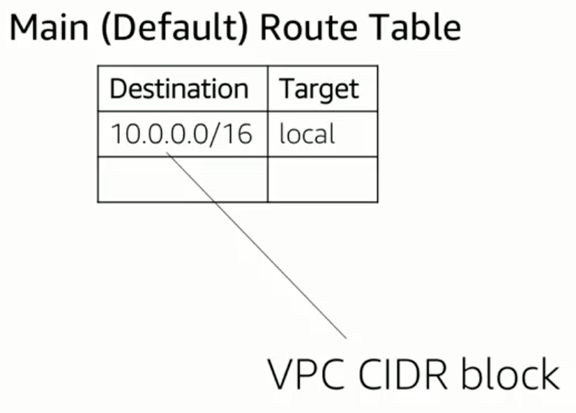
</p>

- A route table contains a set of rules (or routes) that you can configure to direct network traffic from your subnet.
- Each route specifies a destination and a target.
- By default, every route table contains a local route for communication within the VPC.
- Each subnet must be associated with a route table.

```c-lms
topic: VPC Networking
```

## VPC Networking

Now that you have learned about the basic components of the VPC, you can start routing traffic in interesting ways.

<p style="text-align: center">
  
</p>

An Internet gateway is a scalable, redundant, and highly available VPC component that allows communication between instances in your VPC and the public Internet. An Internet gateway services. 
- Number One, to provide a target in your VPC route tables for Internet traffic. 
- Number two, perform network address translation for instances that were assigned IPv4 addresses. 

To make that subnet public, you attach and Internet gateway to your VPC and add a route entry to the route table associated with the subnet. 

<p style="text-align: center">
  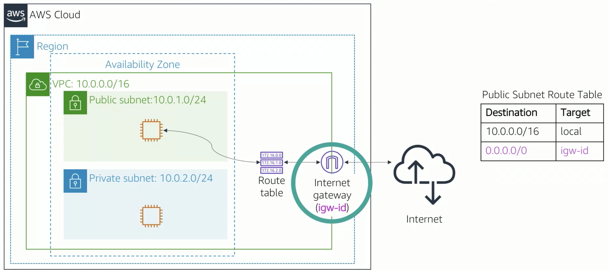
</p>


<p style="text-align: center">
  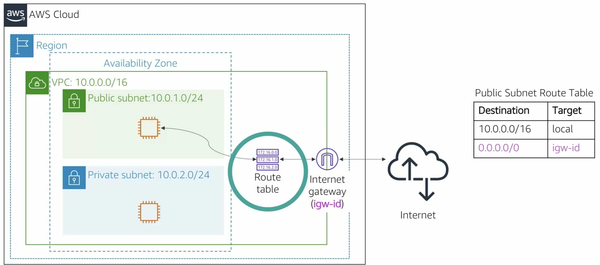
</p>

## Network address translation (NAT)

A network address translation, or NAT, gateway enables instances in a private subnet to connect to the Internet or other AWS services. It prevents the public Internet from initiating a connection with those instances. To create a NAT gateway you must specify the public subnet in which NAT gateway should live. 

<p style="text-align: center">
  
</p>

You must also specify an elastic IP address to associate with the NAT gateway when you create it. After you create the NAT gateway you update the route table that is associated with one or more of your private subnets to point Internet-bound traffic to NAT gateway. This will allow instances in your private subnets to communicate with the Internet. You can also use a NAT instance in a public subnet in your VPC instead of a NAT gateway. However, AWS recommends that you use a NAT gateway instead of a NAT instance because a NAT gateway is a managed service that provides better availability, higher bandwidth, and less administrative effort.

<p style="text-align: center">
  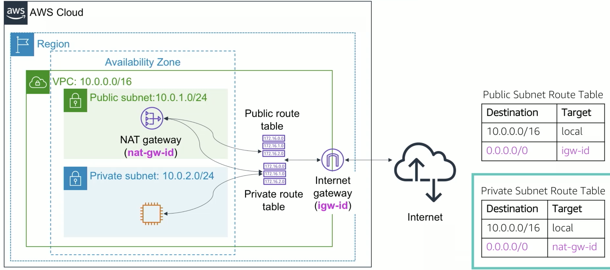
</p>

## VPC Sharing

VPC Sharing enables customers to share subnets with other AWS accounts in the same organizations. VPC sharing enables multiple AWS accounts to create their application resources, such as Amazon EC2 instances, Amazon Relational Database Services, Amazon Redshift clusters, and AWS Lambda functions into a shared, centrally managed VPC. In this model, the account that owns the VPC shares one or more subnets with other accounts called the participants that belong to the same organization. After a subnet is shared , participants can view, create, modify, and delete their application resources in the subnets that are shared with them. 


<p style="text-align: center">
  
</p>

## VPC Peering

A VPC Peering connection enables you to privately route traffic between two VPCs. Instances in either VPC can communicate with each other as if they were on the same network. 

You can connect VPCs in your own account, between AWS accounts, or between AWS Regions.

Restrictions:

- IP space cannot overlap
- Transitive peering is not supported
- You can only have one peering resource between the same two VPCs.

<p style="text-align: center">
  
</p>

In the route table for VPC A, you set the destination for VPC B, and the target to be the peering resource ID.

In the route table for VPC B, you set the destination to be the IP address of VPC A with the target to be the peering resource ID.

## AWS site-to-site VPN

By default, instances that you launch into an Amazon VPC cannot communicate over their own remote network. You can enable access to you remote network from your VPC by attaching a virtual private gateway to the VPC, creating a custom route table, updating your security group rules, creating an AWS site-to-site VPN connection, and configuring routing pass through traffic to the connection. 

<p style="text-align: center">
  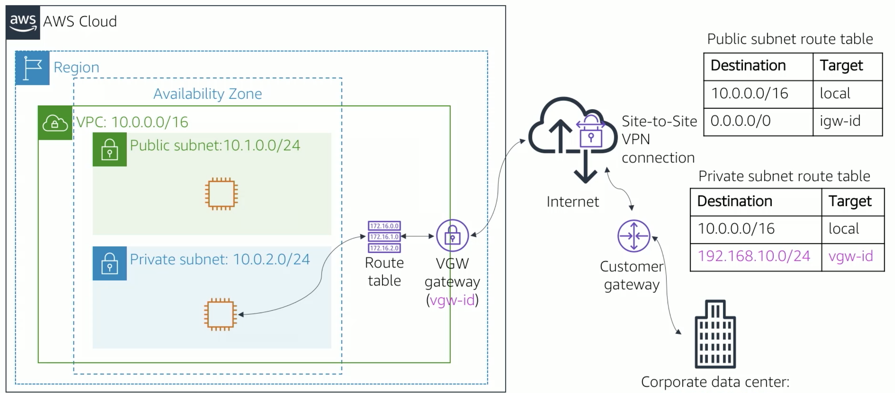
</p>

## AWS Direct Connect

One of the challenges of network communications is network performance. Performance can be negatively affected if your data center is located far away from you AWS Region. For such situations, AWS offers AWS Direct Connect. AWS Direct Connect enables you to establish a dedicated private connection between your network and one of the direct connect locations. This private connection can increase bandwidth, throughput, and provide a more consistent experience than Internet-based connections or VPN connections. Direct Connect uses open standard 802.1q virtual local area networks.

<p style="text-align: center">
  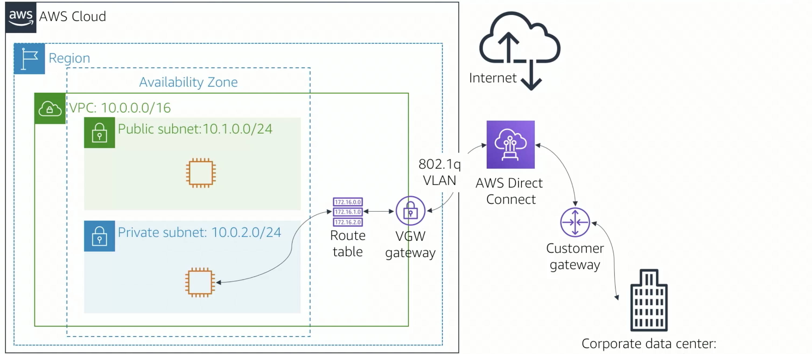
</p>

## AWS VPC Endpoint

On occasion, you will need to connect VPC resources to AWS regional services like Amazon S3 and DynamoDB. A VPC Endpoint is a virtual device that enables you to privately connect your VPC to these supported services. A VPC gateway endpoint is a gateway that you specify as a target for a route in your route table, for traffic destined to either Amazon S3 or Amazon DynamoDB. Traffic between your VPC and these services does not leave Amazon network, so it remains private.

<p style="text-align: center">
  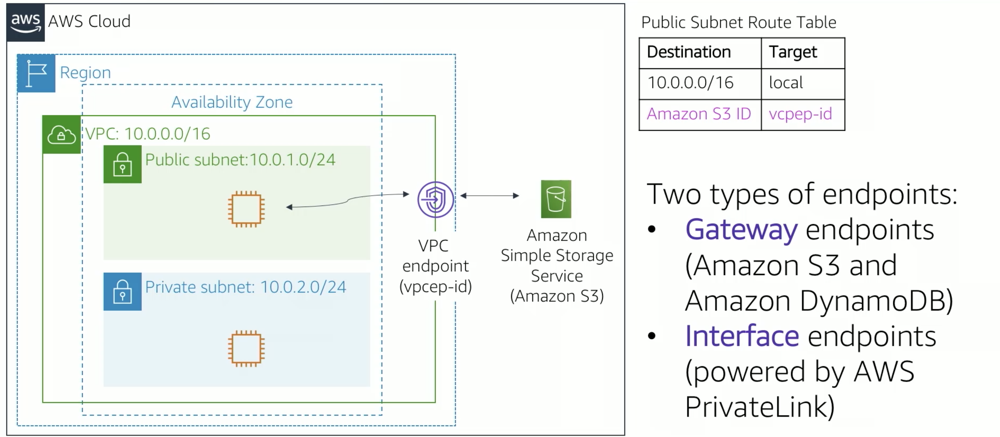
</p>

## AWS PrivateLink

More recently AWS has introduced AWS PrivateLink. It requires a VPC interface endpoint. AWS PrivateLink simplifies the security of data shared with cloud-based applications, by eliminating the exposure of data to the public internet. AWS PrivateLink provides private connectivity between VPCs, AWS services, and on-premise applications. All traffic flows securely on the Amazon network. AWS PrivateLink makes it easy to connect  services across different accounts and VPCs to significantly simplify network architectures.

<p style="text-align: center">
  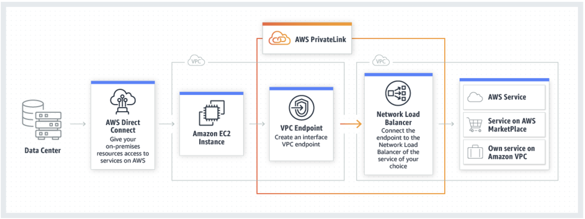
</p>

## AWS Transit Gateway

Consider how you might connect hundreds of VPCs together. Each VPC pair will require a dedicated peering connection. The complexity of connectivity can become a heavy burden and won't scale well. A transit gateway is a network transit hub that you use to interconnect your virtual private clouds. You can also connect your on-premises network. You can attach a VPC, AWS Direct Connect gateways, or VPN connections to a transit gateway. The topology becomes hub and spoke, which reduces the number of connections required, the complexity to implement, and be able to maintain it.

<p style="text-align: center">
  
</p>


## Review and Practice <a class="anchor" id="DS107L3.4_quiz"></a>

Below you will find a quiz to review the recently covered material. Quizzes are _not_ graded.

```c-lms
start-activity: DS107L3.4 AWS Networking Quiz
```

```c-lms
topic: VPC Security
```
## VPC Security

You can build security into your VPC architecture in several ways so that you have complete control over incoming and outgoing traffic. There are two firewall options you can use to secure your VPC.

<p style="text-align: center">
  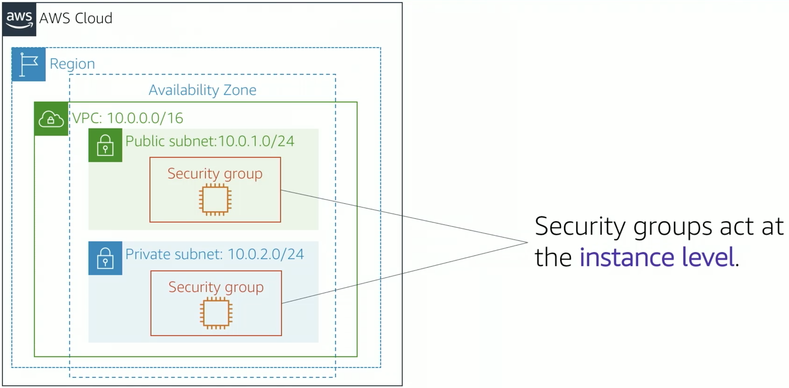
</p>

### Security groups
- A security group acts as a virtual firewall that controls inbound and outbound traffic, to and from your instances.
- Security groups acts at the instance level. Particularly, the network interface card, and you can assign each instance in your VPC to a different set of security groups. 
- You can think of a security group as a way to filter traffic, to and from your instances. 
- Security groups are the equivalent of firewalls for your EC2 instances. 
- They contain rules to allow inbound traffic.
- By default, security groups are sealed shut.
- Security groups are stateful. The outbound traffic is always allowed.
    
<p style="text-align: center">
  
</p>    

### Network access control lists

<p style="text-align: center">
  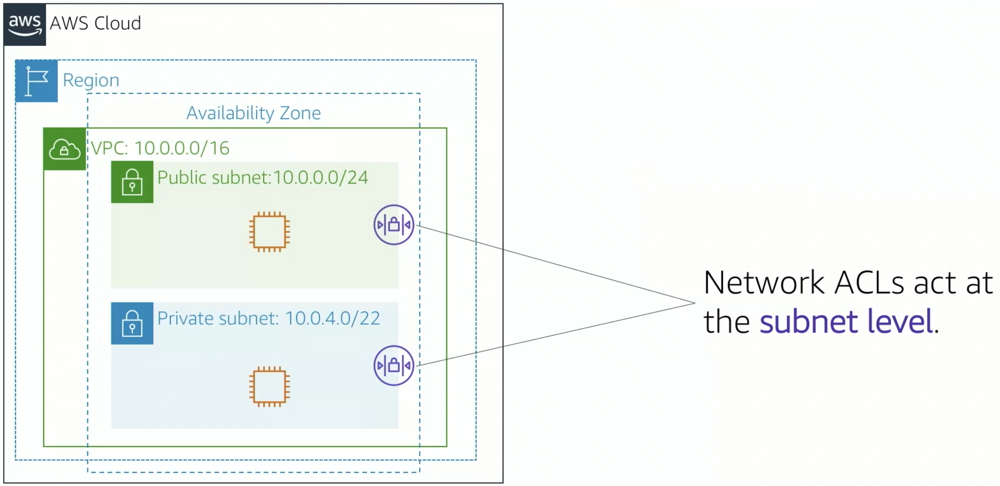
</p>  

- Network access control lists work at the subnet level, and control traffic in and out of the subnet.
- You can set up network ACLs with rules to allow or deny.
- You can also specify ports and protocols.
- Each subnet in your VPC must be associated with a network ACL.
- You can associate a network ACL with multiple subnets. However, a subnet can only be associated with one network ACL.

<p style="text-align: center">
  
</p>  

- A network ACL has separate inbound and outbound rules, and each rule can either allow or deny traffic. 
- Default network ACLs allow all inbound and outbound IPv4 traffic.
- Network ACLs are stateless.

### Security groups versus network ACLs

<p style="text-align: center">
  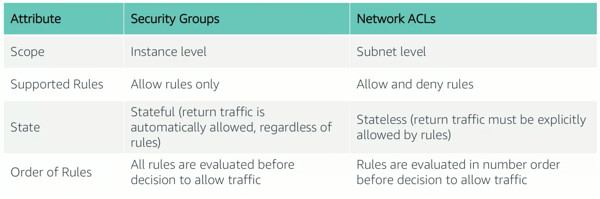
</p> 


```c-lms
topic: Amazon Route 53
```

## Amazon Route 53

<p style="text-align: center">
  
</p>

DNS Resolution is the process of translating an internal name to the corresponding IP address. The DNS protocol stands for Domain Name System and it functions as a phone book where internet names are replaced for the IP addresses of the corresponding machines.

<p style="text-align: center">
  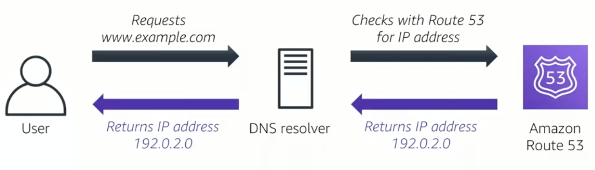
</p>

- Amazon Route 53 gives you the ability to register a domain name such as yourcompany.com and have the service handle the names and hosts related to that account.
- Route 53 is highly available, scalable, fully compliant with IPv4 and IPv6.
- Connects user requests to infrastructure running AWS and also outside of AWS.
- Is used check the health of your resources.
- Features traffic flow.
- Enables you to register domain names.

## Amazon 53 supported routing

- Simple routing: Use in single-server environments.
- Weighted routing: Assign weights to resource record sets to specify the frequency.
- Latency routing: Help improve your global applications.
- Geolocation routing: Route traffic based on the location of your users.
- Geoproximity routing: Route traffic based on the location of your resources.
- Failover routing: Fail over to a backup site if your primary site becomes unreachable.
- Multivalue answer routing: Respond to DNS queries with up to eight healthy records selected at random.

<p style="text-align: center">
  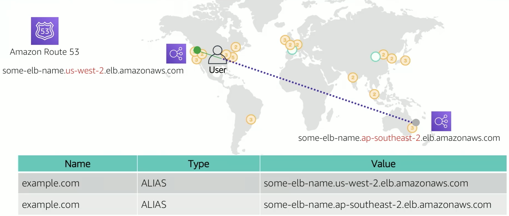
</p>


```c-lms
topic: Amazon CloudFront
```

## Amazon CloudFront

<p style="text-align: center">
  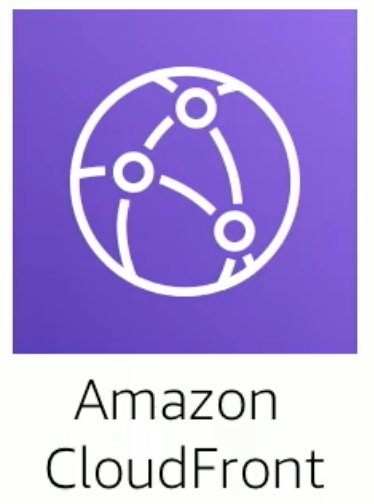
</p>

One of the challenges of network communication is network performance. When you browse to a website, your request is routed through different networks. The origin server stores the original version of the data, which is commonly high density data such as images, songs, and videos. The distance between the customer and the original data server significantly affects performance in the playback and user experience. Also, network latency happens to be different depending on the geographic location of your users. For this reason, a content delivery network is essential part of a smooth user experience. 

<p style="text-align: center">
  
</p>

Fast content delivery service that securely delivers data to customers at high transfer speeds.

- Fast, global, secure CDN service
- Global network of edge locations and regional caches
- Self-service model
- Pay-as-you-go pricing
- High transfer speeds
- Friendly developer environment

Amazon CloudFront relies on Amazon Route 53's geolocating routing.

<p style="text-align: center">
  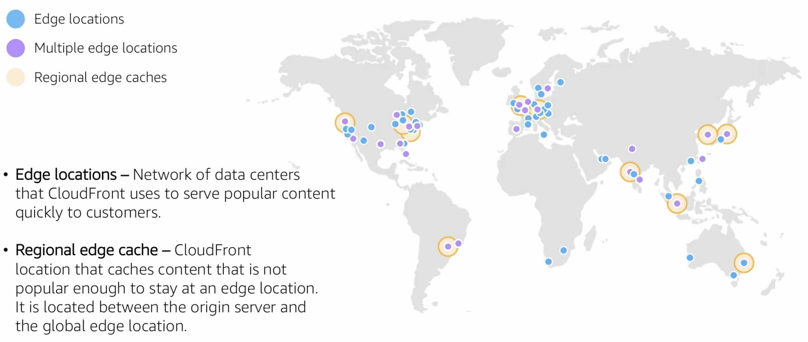
</p>

Basically Route 53 determines the customers location, and it responds with the IP address of the edge closest to their location. CloudFront then obtains the data from where it normally lives and copies it to the edge location. Then the customer's user experience begins. As data becomes stale, it is removed from the cache at the edge location in order to make room for new content. You can define the expiration of data in the cache using a time-to-live number. This defines the amount of time in which the data cache will remain valid.

<p style="text-align: center">
  
</p>


```c-lms
topic: AWS Networking and Content Delivery Summary
```

## AWS Networking and Content Delivery Summary

In this module you learned how to:
- Recognize the basics of networking
- Describe virtual networking in the cloud with Amazon VPC
- Label a network diagram
- Design a basic VPC architecture
- Indicate the steps to build a VPC
- Identify security groups
- Create your own VPC and add additional components to it to produce a customized network
- Identify the fundamentals Amazon Route 53
- Recognize the benefits of CloudFront

```c-lms
topic: Complete Assignment : Lab 2 - Build your VPC and Launch a Web Server
```
## Complete Lab 2 Assignment on AWS Academy

- Take exam on LMS after you complete [Lab 2 - Build your VPC and Launch a Web Server](https://vimeo.com/759286185) Watch the workshop to assist you.

<!--
```python
from IPython.display import VimeoVideo
## Tutorial Video Name: Lab 2 - Build your VPC and Launch a Web Server
VimeoVideo('759286185', width=720, height=480)
```
-->

<div style="padding:56.66% 0 0 0;position:relative;"><iframe src="https://player.vimeo.com/video/759286185?h=b991e19389&amp;badge=0&amp;autopause=0&amp;player_id=0&amp;app_id=58479" frameborder="0" allow="autoplay; fullscreen; picture-in-picture" allowfullscreen style="position:absolute;top:0;left:0;width:100%;height:100%;" title="Lab 2 - Build your VPC and Launch a Web Server"></iframe></div><script src="https://player.vimeo.com/api/player.js"></script>


## Review and Practice <a class="anchor" id="DS107L3.9_quiz"></a>

Below you will find a quiz to review the recently covered material. Quizzes are _not_ graded.

```c-lms
start-activity: DS107L3.9 AWS Content Delivery Quiz
```

```c-lms
topic: AWS Compute Overview
```

Topics:
- Compute services overview
- Amazon EC2
- Amazon cost optimization
- Container services
- Introduction to AWS Lambda
- Introduction to AWS Elastic Beanstalk

Activities:
- Amazon EC2 Managed Service
- Hands-on with AWS Lambda
- Hands-on with AWS Elastic Beanstalk

Demonstration:
- Recorded demonstration of Amazon EC2

Lab:
- Introduction to Amazon EC2

After completing this module, you should be able to:
- Provide and overview of different AWS compute services in the cloud.
- Demonstrate why to use Amazon Elastic Compute Cloud (Amazon EC2).
- Identify the functionality of the EC2 console.
- Perform basic functions in Amazon EC2 to build virtual computing environment.
- Identify Amazon EC2 cost optimization elements.
- Demonstrate when to use AWS Elastic Beanstalk.
- Demonstrate when to use AWS Lambda.
- Identify how to run containerized applications in a cluster of managed servers.

```c-lms
topic: Compute Services Overview
```
## AWS Compute Services Overview

<p style="text-align: center">
  
</p>

### Top Utilized Compute Services
- [Amazon EC2 Virtual](https://aws.amazon.com/ec2/?hp=tile&so-exp=below) servers in the cloud
- [AWS Elastic Beanstalk](https://aws.amazon.com/elasticbeanstalk/?hp=tile&so-exp=below) Run and manage web apps
- [AWS Lambda](https://aws.amazon.com/lambda/?hp=tile&so-exp=below) Run code without thinking about servers

#### Docker-Kubernetes-Container-Based Services
- [Amazon ECR](https://aws.amazon.com/ecr/) Easily store, share, and deploy your container software anywhere
- [Amazon ECS](https://aws.amazon.com/ecs/) Run highly secure, reliable, and scalable containers
- [Amazon EKS](https://aws.amazon.com/eks/) The most trusted way to start, run, and scale Kubernetes
- [AWS Fargate](https://aws.amazon.com/fargate/) Serverless compute for containers

#### Other Widely Utilized Container Services
- [Amazon EC2 Auto Scaling](https://aws.amazon.com/ec2/autoscaling/?hp=tile&so-exp=below) Scale compute capacity to meet demand
- [Amazon Lightsail](https://aws.amazon.com/lightsail/?hp=tile&so-exp=below) Launch and manage virtual private servers
- [AWS Batch](https://aws.amazon.com/batch/?hp=tile&so-exp=below) Run batch jobs at any scale
- [AWS Outposts](https://aws.amazon.com/outposts/?hp=tile&so-exp=below) Run AWS infrastructure on-premises
- [AWS Serverless Application Repository](https://aws.amazon.com/serverlessrepo/?hp=tile&so-exp=below) Discover, deploy, and publish serverless applications
- [AWS Snow Family](https://aws.amazon.com/snow/?hp=tile&so-exp=below) Physical devices to aggregate and process data in edge locations, then transfer to AWS
- [AWS Wavelength](https://aws.amazon.com/wavelength/?hp=tile&so-exp=below) Deliver ultra-low latency applications for 5G devices
- [VMware Cloud on AWS](https://aws.amazon.com/vmware/?hp=tile&so-exp=below) Build a hybrid cloud without custom hardware


<p style="text-align: center">
  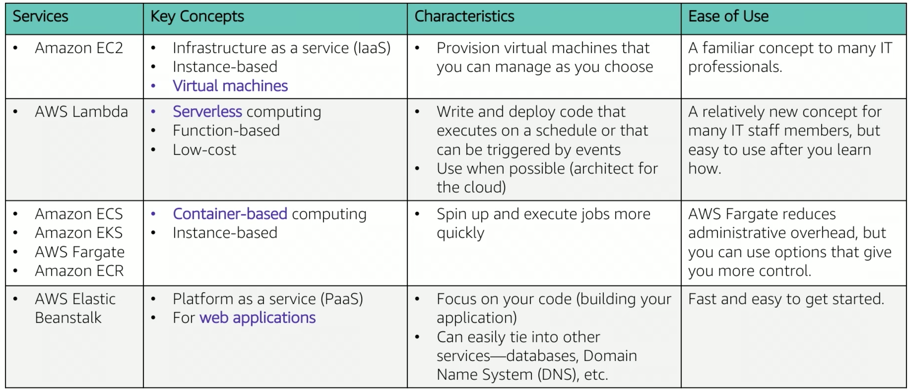
</p>


## Choosing the Optimal Computer Service

- The optimal compute or services that you use will depend on your use case
- Some aspects to consider
    - What is your application design?
    - What are your usage patterns?
    - Which configuration settings will you want to manage?
- Selecting the wrong compute solution for an architecture can lead to lower performance efficiency
    - A good starting place -- understand the available compute options

## Review and Practice <a class="anchor" id="DS107L3.11_quiz"></a>

Below you will find a quiz to review the recently covered material. Quizzes are _not_ graded.

```c-lms
start-activity: DS107L3.11 AWS Compute Overview Quiz
```

```c-lms
topic: Amazon Elastic Compute Cloud (Amazon EC2) Part 1
```

## Amazon Elastic Compute Cloud (Amazon EC2) 

In lesson 2 we discussed AMIs and Amazon EC2 instance types in the AWS Compute section. Running servers on premises is expensive, servers must be purchased, data centers must be built, staffed and maintained. Organizations must permanently provision enough hardware to handle peak workloads. After all the hardware is in place, server capacity often sits idle for significant portions of every day. which is wasteful. Amazon Computer Cloud (EC2) is a different option where EC2 provides virtual machines where you can host the same applications you run on premises. It provides secure, resizable compute capacity in the cloud. See some common uses for EC2 below:

<p style="text-align: center">
  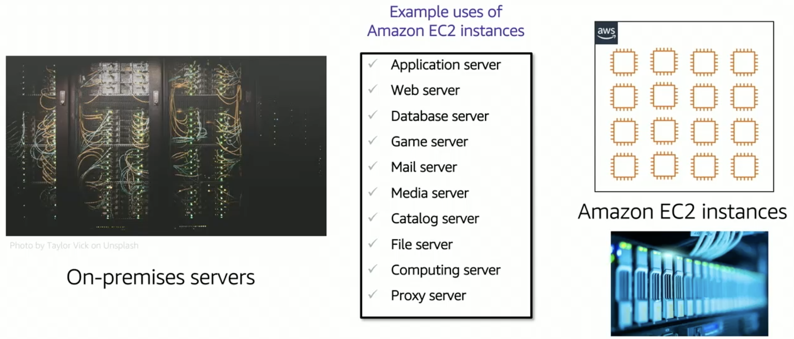
</p>

Amazon EC2 provides virtual machines (VMs) in the cloud, these VMs are referred to as EC2 instances. You have full administration control over the Windows or Linux operating system that runs on these instances. Most server operating systems are supported, including recent versions of Windows, Red Hat, SUSE, Ubuntu and Amazon Linux. With Amazon EC2, you can launch any number of instances of any size into any Availability Zone, pretty much anywhere in the world in a matter of minutes.

Instances launch from Amazon Machine Images (AMIs), which are effectively virtual machine templates. You can control traffic to and from these instances by using security groups.

The first time you launch an EC2 image you will likely use the AWS Management Console Launch Instance Wizard.

### Amazon Management Console 

<p style="text-align: center">
  
</p>

There are nine key decisions to make when you create an EC2 instance by using the AWS Management Console Launch Wizard. This Launch Wizard simplifies the EC2 instance creation process. If you accept all the default settings this allows you to skip most of the steps provided by the wizard. However, for most deployments, you'll want to modify the default settings so that the servers you launch are deployed in a way that matches your specific application needs.

#### Selecting an AMI

<p style="text-align: center">
  
</p>

#### Creating a New AMI


<p style="text-align: center">
  
</p>

There are nine key decisions that you must make when launching an EC2 instance.

#### 1. Amazon Machine Image (AMI)
- Is a template that is used to create an EC2 instance (which is a virtual machine (VM), that runs in the AWS cloud.
- Contains a Windows or Linux operating system
- Often also has some software pre-installed

AMI Choices/Categories:
- Quick Start - Linux and Windows AMIs that are provided by AWS
- My AMIs - Any AMIs that you created
- AWS Marketplace - Pre-configured templates from third parties
- Community AMIs - AMIs shared by others; use at your own risk

<p style="text-align: center">
  
</p>

#### 2. Instance Type

<p style="text-align: center">
  
</p>

- Consider your use case
    - How will the EC2 instance you create be used?
- The instance type that you choose determines 
    - Memory (RAM)
    - Processing power (CPU)
    - Disk space and disk type (Storage)
    - Network performance
- Instance type categories
    - General purpose
    - Compute optimized
    - Memory optimized
    - Storage optimized
    - Accelerated computing
- Instance types offer family, generation, and size
    
<p style="text-align: center">
  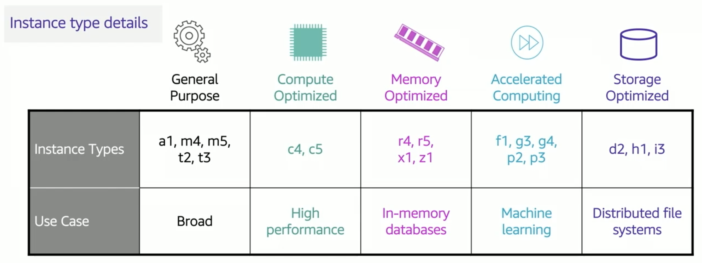
</p>

Instance types vary in several ways, including CPU type, CPU or core count, storage type, storage amount, and network performance. The chart above shows the different instance categories and which instance type families and generation numbers fit into each category type. Consider a few of the instance types in more detail. T3 instances are general purpose instances, that provide a baseline of CPU performance with the ability to burst above the baseline. Use cases for these type of instance include web applications, development environments, code repositories, microservices, test and staging environments, and many more. C5 instances are optimized for compute intensive workloads, and deliver high performance at low price per compute ratio. Use cases include scientific modeling, batch processing, ad serving, highly scalable multiplayer games, and video encoding. R5 instances are optimized for memory intensive applications. Use cases include high performance databases, data mining and data analysis, in memory databases, real-time processes of unstructured big data, Apache Spark clusters, and other enterprise applications. 

##### Networking features
- The network bandwidth (Gbps) varies by instance type.
    - See [Amazon EC2 Instance Types](https://aws.amazon.com/ec2/instance-types/) to compare.
    - To maximize networking and bandwidth performance of you instance type:
        - If you have interdependent instances, launch them into a cluster [placement group](https://docs.aws.amazon.com/AWSEC2/latest/UserGuide/placement-groups.html).
        - Enable [enhanced networking](https://aws.amazon.com/premiumsupport/knowledge-center/enable-configure-enhanced-networking/).
- Enhanced networking types are supported on most instance types.
    - See the Networking and Storage Features documentation for details.
- Enhanced networking types
    - [Elastic Network Adapter (ENA)](https://docs.aws.amazon.com/AWSEC2/latest/UserGuide/enhanced-networking-ena.html): Supports network speeds of up to 100 Gbps.
    - [Intel 82599 Virtual Function interface](https://docs.aws.amazon.com/AWSEC2/latest/UserGuide/sriov-networking.html): Supports network speeds of up to 10 Gbps.


<hr style="height:10px;border-width:0;color:gray;background-color:gray">


```c-lms
topic: Amazon Elastic Compute Cloud (Amazon EC2) Part 2
```

#### 3. Network Settings

In this second part describing EC2, we'll discuss networking settings, attaching an IAM role, user data scripts, and storage options. After you have chosen and AMI and instance type, you must specify the network location where the EC2 instance will be deployed. The choice of region must be made before you start the Launch Instance wizard. Verify that you are in the correct region within the Amazon EC2 Console before you choose Launch Instance. Within the region, you can sepcify to place the instance into any existing subnet, into any existing VPC. The wizard also provides a link to create a new VPC or to create a new subnet if wanted. In the example shown below, the user has indicated that the instance should be deployed into a specific public subnet inside a specific VPC. If you do not specify a VPC when launching an instance, the instance will be placed in the default VPC. When you launch an instance in a default VPC, AWS will assign it a public IP address by default. When you launch an instance into a non-default VPC, the subnet has an attribute that determines if instances launched into it receive a public IP. If you want to you can override this setting for the instances as you are launching them. 

<p style="text-align: center">
  
</p>

#### 4. IAM role

It is common to use EC2 instances to run an application that must make API calls to other AWS services. To support these use cases, AWS allows you to create and attach an IAM role to the EC2 instance. Without this feature, you might be tempted to place AWS credentials on EC2 instances so an application can use them to call another AWS service. However, you should never store AWS credentials on an EC2 instance. It's not secure. Instead, attach an IAM role to the EC2 instance. An instance profile is a container for an IAM role. If you use the AWS Management Console to create a role for Amazon EC2, the console automatically creates an instance profile and gives it the same name as the role. In the below example, an IAM role is attached to an EC2 instance to grant permissions to an application that runs on that instance. The application must access a bucket in the Amazon S3. You can attach an IAM role when you launch the instance, but you can also attacha a role to an already running EC2 instance. 

<p style="text-align: center">
  
</p>

#### 5. User data

When you create an EC2 instance you have the option of passing user data to the instance. User data can automate the completion of installations and configurations at instance launch. For example, a user data script might patch and update the instance operating system, fetch and install software license keys or install additional software. In the below example, user data script is a simple three line Linux bash shell script. The first line indicates that the script should be run by the bash shell. The second line invokes the yum utility, which is commonly used in many Linux distributions to retrieve software from an online repository and install it. The command tells yup to update all installed packages to the latest versions. Line 3, indicates that the wget utility should be installed. wget is a common utility for downloading files from the web. For a w Windows instance, the user data script should be written in a format that is compatible with a command prompt window or batch commands or with Windows Powershell. When the EC2 instance is created, the user data script will run during the final phase of the boot process. By default, user data only runs the first time that an instant starts up. User data scripts can be used strategically to reduce the number of custom AMIs that you need to build and maintain. For example, instead of maintaining software installations and configurations and custom AMIs, consider maintaining separate user data scripts to handle those actions at instance launch. 

<p style="text-align: center">
  
</p>


#### 6. Storage options

When you launch an EC2 instance, you can configure storage options. For example, you can configure the size of the root volume where the guest operating system such as Windows of Linux is installed. You can also attach additional storage volumes when you launch the instance. Some AMIs are configured to launch more than one storage volume by default to provide storage options that are separate from the root volume. For each volume that your instance will have, you can specify the size of the volumes and the volume type, and whether the storage will be retained if the instance is terminated. You can also specify if encryption should be used or not.  

<p style="text-align: center">
  
</p>

- Amazon Elastic Block Storage (Amazon EBS)
    - Durable, block-level storage volumes.
    - You can stop the instance and start it again, and the data will still be there (persistent)
- Amazon EC2 Instance Store
    - Storage is provided on disks that are attached to the host computer where the EC2 instance is running.
    - If the instance stops, data stored here is deleted (non persistent)
- Other options for storage (not for the root volume)
    - Mount an Amazon elaastic File System (Amazon EFS) file system.
    - Connect to Amazon Simple Storage Service (Amazon S3).

Below, you see two examples of how storage options could be configured for EC2 instance. The example for instance one shows that the root volume, which contains the OS and possibly other data, is stored on Amazon EBS. This instance also has two attached volumes. One volume is a 500 gigabyte Amazon EBS storage volume and the other volume is an Instance Store volume. If this instance was stopped and then started again, the OS volume would survive, and any data that was stored on either the 20 GB Amazon EBS volume or the 500 GB Amazon EBS volume, would remain intact. However, any data that was stored on ephemeral volume 1 would be permanently lost. The example for instance two shows that the root volume is on an Instance Store volume type, ephemeral volume 2. An instance with an Instance Store root volume cannot be stopped by an Amazon EC2 API call, it can only be terminated. However, it could be stopped from within the instance OS. For example by issuing a shutdown command, or it could be stopped because of an OS or disk failure which would cause the instance to be terminated. If the instance was terminated, all the data that was stored on ephemeral volume 2 would be lost, including the OS. You would not be able to start that instance again. Therefore, do not rely on Instance Store for valuable, long-term data. Instead, use a more durable data storage, such as Amazon EBS, Amazon EFS, or Amazon S3. If an instance reboots intentionally or unintentionally, 
data on the Instance Store root volume is still available. 

<p style="text-align: center">
  
</p>


```c-lms
topic: Amazon Elastic Compute Cloud (Amazon EC2) Part 3
```

In part 3, we discuss tagging, security groups, key pairs, the AWS CLI, and essential information about running insances and instance lifecycle.  

#### 7. Tags

A tag is a label that you assigned to an AWS resource, such as an EC2 instance. Each tag consists of a key and an optional value, both of which you define. Tags enable you to categorize AWS resources in different ways. For example, you might tag instances by purpose, owner, or environment. Tagging is how you can attach metadata to an EC2 instance. For example, a commonly used tag for EC2 instances is a tag key called Name and a tag value that describes the instance such as WebServer1. The name tag is exposed by default in the Amazon console instances page. It's best practice to develop tagging strategies. Using a consistent set of tag keys makes it easier for you to manage your resources.

<p style="text-align: center">
  
</p>


#### 8. Security group

A security group acts as a virtual firewall that controls network traffic for one or more instances. When you launch an instance you can specify one or more security groups. Otherwise the default security group is used. You can add rules to each security group. Rules allow traffic to or from its associated instance. When traffic attempts to reach an instance, all the rules from all the security groups that are associated with the instance are evaluated. When you define a rule, you can specify the allowable source of the network communication for inbound rules or destination for outbound rules. The source can be an IP address, an IP address range, another security group, a VPC endpoint, or anywhere which means that all sources will be allowed. By default a security group includes an outbound rule that allows all outbound traffic. The inbound traffic shown below, allows the Secure Shell or SSH traffic over TCP port 22 if the source of the request is My IP of 72.21.196.67/32. The My IP address is calculated by determining what IP address you are currently connected to the AWS cloud from when you define the rule. 

<p style="text-align: center">
  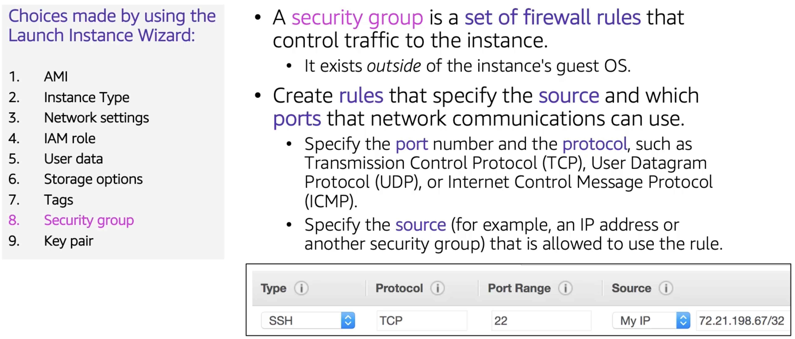
</p>

#### 9. Key pair

The last important choice to make when launching an EC2 instance through the wizard is to specify a key pair. A key pair consists of a public key and a private key. It enables secure connections to an EC2 instance. When creating an EC2 instance you can choose an existing key pair, proceed without a key pair, or create a new key pair. You must make this decision be fore you can choose Launch Instances and create the EC2 instance. If you create a new pair, download it and save it in a safe location. The only opportunity you have to download and save the new private key is at the time of creation.  To connect to a Windows instance, you use the private key to obtain the administrator password and then log into the EC2 instance's Windows Desktop by using Remote Desktop Protocol or RDP. To establish an SSH connection from a Windows machine to an Amazon EC2 instance. You can use a tool such as PuTTY which will require the same private key.   

To log into a Linux instance, for example by using SSH, you must provide the private key when you establish the connection. After you choose Launch Instances and then choose View Instances, you will see a screen that looks like an example shown below. 

<p style="text-align: center">
  
</p>


#### AWS Command Line Interface (CLI)

You can launch EC2 instances programmatically, either by using the AWS Command Line Interface (CLI) or through one of the AWS SDKs. In the below example AWS CLI command, you can see a single command that specifies the minimal information that is needed to launch an instance. "aws" invokes the aws command line utility. "ec2", invokes the ec2 service, "run-instances" is the subcommand that will be run, etc.

<p style="text-align: center">
  
</p>

Now that you understand how an instance is launched, lets consider the different states that an instance can be brought in throughout its life cycle. The arrows in the diagram below show actions that can be taken and the boxes show the state the instance will enter after the action. After it's launched from an AMI, an instance will be in a pending state before it reaches a running state. An instance will also initially enter a pending state if it was stopped and then restarted. A running instance is fully booted and ready. Running instances can be rebooted. A rebooted instance stays on the same physical host, maintains the same public DNS name and public IP address, and if it has instance store volumes it retains the data on those volumes. Running instances can also be terminated, if they are they will enter a temporary shutting down state before they're terminated. A terminated instance remains visible in the Amazon EC2 console for a while before the virtual machine is deleted. However, you can't connect to or recover a terminated instance. Finally, instances that are backed by Amazon EBS can be stopped. They enter the stopping state before they attain the fully stopped state. A stopped instance will not incur the same cost as a running instance. Starting a stopped instance puts it back into the pending state which moves the instance to a new host machine. 

<p style="text-align: center">
  
</p>


A public IP address is an IPv4 address reachable from the Internet. Each instance that receives a public IP address is also given an external DNS host name. Any dynamically assigned public IP address assigned to an EC2 to instance will be released when the instance is stopped or terminated. When the instance has started again it will receive a new public IP address. When a public IP address is disassociated from your instance, it is released back into the public IP address pool. You will not be able to specify that you want to reuse it. If you require a persistent public IP address consider associating an Elastic IP address with the instance. To do this first allocate a new Elastic IP address in the Region where the instance exists then you can associate the Elastic IP address with the instance. By default all AWS accounts are limited to five Elastic IP addresses per Region because public Internet addresses are scarce. However, this is a soft limit and you can request a limit increase. 

<p style="text-align: center">
  
</p>

#### EC2 instance metadata

<p style="text-align: center">
  
</p>


#### Amazon CloudWatch for monitoring

<p style="text-align: center">
  
</p>

#### Watch Console demonstration on AWS Academy

## Review and Practice <a class="anchor" id="DS107L3.14_quiz"></a>

Below you will find a quiz to review the recently covered material. Quizzes are _not_ graded.

```c-lms
start-activity: DS107L3.14 AWS Compute Quiz
```

```c-lms
topic: Key Terms
```

# Key Terms

Below is a list and short description of the important keywords learned in this lesson. Please read through and go back and review any concepts you do not fully understand. Great Work!

<table class="table table-striped">
    <tr>
        <th>Keyword</th>
        <th>Description</th>
    </tr>
    <tr>
        <td style="font-weight: bold;" nowrap>MapReduce</td>
        <td>A programming model used to process big data in parallel using a map procedure to filter and process, and a reduce procedure to perform data aggregation and summarization.</td>
    </tr>
    <tr>
        <td style="font-weight: bold;" nowrap>Hive</td>
        <td>A program that allows you to write SQL queries for your Hadoop cluster.</td>
    </tr>
    <tr>
        <td style="font-weight: bold;" nowrap>HiveQL</td>
        <td>The Hive brand of SQL.  Primarily only differs in how views are used.</td>
    </tr>
    <tr>
        <td style="font-weight: bold;" nowrap>User-Defined Functions</td>
        <td>Functions you, the user, create.</td>
    </tr>
    <tr>
        <td style="font-weight: bold;" nowrap>Schema on Read</td>
        <td>Storing unstructured data and only giving the data a structure when you go to use it.</td>
    </tr>
    <tr>
        <td style="font-weight: bold;" nowrap>Schema on Write</td>
        <td>Storing data in structured tables.  A traditional SQL storage system.</td>
    </tr>
    <tr>
        <td style="font-weight: bold;" nowrap>Sqoop</td>
        <td>A program to integrate Hive and traditional database connections like MySQL.</td>
    </tr>
    <tr>
        <td style="font-weight: bold;" nowrap>Computer Network</td>
        <td>At least two computers that are connected with one another for the purpose of communicating data electronically.</td>
    </tr>
    <tr>
        <td style="font-weight: bold;" nowrap>Router</td>
        <td>A device that connects two or more packet-switched networks or subnetworks. It serves two primary functions: managing traffic between these networks by forwarding data packets to their intended IP addresses, and allowing multiple devices to use the same Internet connection.</td>
        <td></td>
    </tr>
    <tr>
        <td style="font-weight: bold;" nowrap>IP Address</td>
        <td>A unique address that identifies a device on the internet or a local network. IP stands for "Internet Protocol," which is the set of rules governing the format of data sent via the internet or local network.</td>
    </tr>
    <tr>
        <td style="font-weight: bold;" nowrap>Classless Inter-Domain Routing (CIDR)</td>
        <td>A set of Internet protocol (IP) standards that is used to create unique identifiers for networks and individual devices.</td>
    </tr>
    <tr>
        <td style="font-weight: bold;" nowrap>Open Systems Interconnection (OSI) Model</td>
        <td>A conceptual framework used to describe the functions of a networking system. The OSI model characterizes computing functions into a universal set of rules and requirements in order to support interoperability between different products and software.</td>
    </tr>
    <tr>
        <td style="font-weight: bold;" nowrap>Amazon VPC</td>
        <td>Enables you to launch AWS resources into a virtual network that you've defined. This virtual network closely resembles a traditional network that you'd operate in your own data center, with the benefits of using the scalable infrastructure of AWS.</td>
    </tr>
    <tr>
        <td style="font-weight: bold;" nowrap>Subnet</td>
        <td>A segmented piece of a larger network. More specifically, subnets are a logical partition of an IP network into multiple, smaller network segments.</td>
    </tr>
    <tr>
        <td style="font-weight: bold;" nowrap>Public IP Address</td>
        <td>An IP address that your home or business router receives from your ISP; it's used when you access the internet.</td>
    </tr>
    <tr>
        <td style="font-weight: bold;" nowrap>Elastic IP Address</td>
        <td>A static IPv4 address designed for dynamic cloud computing. An Elastic IP address is allocated to your AWS account, and is yours until you release it.</td>
    </tr>
    <tr>
        <td style="font-weight: bold;" nowrap>Elastic Network Interface</td>
        <td>A virtual interface that can be attached to an instance in a Virtual Private Cloud (VPC). </td>
    </tr>
    <tr>
        <td style="font-weight: bold;" nowrap>Routing Tables</td>
        <td>A networking device that forwards data packets between computer networks.</td>
    </tr>
    <tr>
        <td style="font-weight: bold;" nowrap>VPC Networking</td>
        <td>Data transmission over a network partitioned in the cloud.</td>
    </tr>
    <tr>
        <td style="font-weight: bold;" nowrap>Internet Gateway</td>
        <td>A network "node" that connects two different networks that use different protocols (rules) for communicating. In most basic terms, an Internet gateway is where data stops on its way to or from other networks.</td>
    </tr>
    <tr>
        <td style="font-weight: bold;" nowrap>Network Address Translation (NAT)</td>
        <td>A way to map multiple local private addresses to a public one before transferring the information.</td>
    </tr>
    <tr>
        <td style="font-weight: bold;" nowrap>VPC Sharing</td>
        <td>Allows multiple AWS accounts to create their application resources, such as Amazon EC2 instances, Amazon Relational Database Service (RDS) databases, Amazon Redshift clusters, and AWS Lambda functions, into shared, centrally-managed virtual private clouds (VPCs). </td>
    </tr>
    <tr>
        <td style="font-weight: bold;" nowrap>VPC Peering</td>
        <td>A networking connection between two VPCs that enables you to route traffic between them privately.</td>
    </tr>
    <tr>
        <td style="font-weight: bold;" nowrap>AWS Site-to-Site VPN</td>
        <td>A fully-managed service that creates a secure connection between your data center or branch office and your AWS resources using IP Security (IPSec) tunnels.</td>
    </tr>
    <tr>
        <td style="font-weight: bold;" nowrap>AWS Direct Connect</td>
        <td>Links your internal network to an AWS Direct Connect location over a standard Ethernet fiber-optic cable. One end of the cable is connected to your router, the other to an AWS Direct Connect router.</td>
    </tr>
    <tr>
        <td style="font-weight: bold;" nowrap>AWS VPC Endpoint</td>
        <td>Enables connections between a virtual private cloud (VPC) and supported services, without requiring that you use an internet gateway, NAT device, VPN connection, or AWS Direct Connect connection. Therefore, you control the specific API endpoints, sites, and services that are reachable from your VPC.</td>
    </tr>
    <tr>
        <td style="font-weight: bold;" nowrap>AWS PrivateLink</td>
        <td>Enables you to connect to some AWS services, services hosted by other AWS accounts (referred to as endpoint services), and supported AWS Marketplace partner services, via private IP addresses in your VPC. </td>
    </tr>
    <tr>
        <td style="font-weight: bold;" nowrap>AWS Transit Gateway</td>
        <td>A network transit hub that you can use to interconnect your virtual private clouds (VPCs) and on-premises networks.</td>
    </tr>
    <tr>
        <td style="font-weight: bold;" nowrap>Security Groups</td>
        <td>Acts as a virtual firewall for your EC2 instances to control incoming and outgoing traffic. Inbound rules control the incoming traffic to your instance, and outbound rules control the outgoing traffic from your instance.</td>
    </tr>
    <tr>
        <td style="font-weight: bold;" nowrap>Network Access Control Lists (NACLs)</td>
        <td>An optional layer of security for your VPC that acts as a firewall for controlling traffic in and out of one or more subnets. You might set up network ACLs with rules similar to your security groups in order to add an additional layer of security to your VPC.</td>
    </tr>
    <tr>
        <td style="font-weight: bold;" nowrap>Amazon Route 53</td>
        <td>A highly available and scalable Domain Name System (DNS) web service. You can use Route 53 to perform three main functions in any combination: domain registration, DNS routing, and health checking.</td>
    </tr>
    <tr>
        <td style="font-weight: bold;" nowrap>Failover Routing</td>
        <td>Lets you route traffic to a resource when the resource is healthy or to a different resource when the first resource is unhealthy.</td>
    </tr>
    <tr>
        <td style="font-weight: bold;" nowrap>Content Delivery Network (CDN)</td>
        <td>Refers to a geographically distributed group of servers which work together to provide fast delivery of Internet content.</td>
    </tr>
    <tr>
        <td style="font-weight: bold;" nowrap>Amazon CloudFront</td>
        <td>A web service that speeds up distribution of your static and dynamic web content, such as .html, .css, .js, and image files, to your users. CloudFront delivers your content through a worldwide network of data centers called edge locations.</td>
    </tr>
    <tr>
        <td style="font-weight: bold;" nowrap>Regional Edge Cache</td>
        <td>CloudFront locations that are deployed globally, close to your viewers.</td>
    </tr>
    <tr>
        <td style="font-weight: bold;" nowrap>VMWare Cloud on AWS</td>
        <td>An integrated cloud offering jointly developed by Amazon Web Services (AWS) and VMware. You can deliver a highly scalable and secure service by migrating and extending your on-premises VMware vSphere-based environments to the AWS Cloud running on Amazon Elastic Compute Cloud (Amazon EC2).</td>
    </tr>
    <tr>
        <td style="font-weight: bold;" nowrap>Instance Metadata</td>
        <td>Data about your instance.</td>
    </tr>
    <tr>
        <td style="font-weight: bold;" nowrap>Amazon CloudWatch</td>
        <td>A monitoring and management service that provides data and actionable insights for AWS, hybrid, and on-premises applications and infrastructure resources.</td>
    </tr>
</table>

---

```c-lms
topic: Complete Assignment : Lab 3 - Introduction to Amazon EC2 and Lesson 3 Exam
```

## Complete Lab 3 Assignment on AWS Academy

- Take exam on LMS after you complete [Lab 3](https://vimeo.com/759654039)

<!--
```python
from IPython.display import VimeoVideo
## Tutorial Video Name: Lab 3 - Introduction to Amazon EC2
VimeoVideo('759654039', width=720, height=480)
```
-->


<div style="padding:56.66% 0 0 0;position:relative;"><iframe src="https://player.vimeo.com/video/759654039?h=79e8ebbcc6&amp;badge=0&amp;autopause=0&amp;player_id=0&amp;app_id=58479" frameborder="0" allow="autoplay; fullscreen; picture-in-picture" allowfullscreen style="position:absolute;top:0;left:0;width:100%;height:100%;" title="Lab 3 - Introduction to Amazon EC2"></iframe></div><script src="https://player.vimeo.com/api/player.js"></script>


## Review and Practice <a class="anchor" id="DS107L3.17_exam"></a>

Below you will find a quiz to review the recently covered material. Quizzes are _not_ graded.

```c-lms
start-activity: DS107L3.17 Lesson 3 Exam
```
