```c-lms
activity-name: AWS Storage and Databases
topic: AWS Storage Services
```

    
## AWS Storage Services module overview

This module covers AWS Storage Services.

Cloud storage is typically more reliable, scalable and secure than traditional on-premise storage systems. Cloud storage is a critical component of cloud computing because it holds the information that applications use. Big data analytics, data warehouses, the Internet of Things (IoT), Databases, and backup and archive applications all rely on some form of data storage architecture. 

In this module we'll cover:

### Topics
- [Amazon Elastic Block Store (Amazon EBS)](https://aws.amazon.com/ebs/)
- [Amazon Simple Storage Service (Amazon S3)](https://aws.amazon.com/s3/)
- [Amazon Elastic File System (Amazon EFS)](https://aws.amazon.com/efs/)
- [Amazon Simple Storage Services Glacier](https://aws.amazon.com/s3/storage-classes/glacier/)

### AWS Academy Demos
- Amazon EBS console
- Amazon S3 console
- Amazon EFS console
- Amazon S3 Glacier console

### AWS Lab
- Working with Amazon EBS

### AWS Activities
- Storage solution case study

After completing the first half of this module module, you should be able to:

- Identify the different types of storage
- Explain Amazon S3
- Identify the functionality in Amazon S3
- Explain Amazon EBS
- Identify the functionality in Amazon EBS
- Perform functions in Amazon EBS to build an Amazon EC2 storage solution
- Explain Amazon EFS
- Identify the functionality in Amazon EFS
- Explain Amazon S3 Glacier
- Identify the functionality in Amazon S3 Glacier
- Differentiate between Amazon EBS, Amazon S3, Amazon EFS, and Amazon S3 Glacier


```c-lms
topic: Amazon Elastic Block Store (Amazon EBS)
```

## Amazon Elastic Block Store (Amazon EBS)

<p style="text-align: center">
  
</p>

Amazon EBS provides persistent block storage volumes for use with Amazon EC2 instances. Persistent storage is any data storage device that retains data after power to that devices is shut off. 

It is also called non-volatile storage.

Each Amazon EBS volume is automatically replicated within its availability zone to protect you from component failure. It is designed for high availability and durability. Amazon EBS volumes provide the consistent and low latency performance that is needed to run your workloads. With Amazon EBS, you can scale your usage up or down within minutes while paying a low price for only what you provision. 

<p style="text-align: center">
  
</p>

One critical difference between storage types is whether they offer block-level or object level storage. The diagram above illustrates the difference. What happens if you want to change one character in a one gigabyte file? 

### Watch the Console Demonstrations - EBS


```c-lms
topic: Assignment : Lab 4 - Working with EBS
```

## Complete Assignment : Lab 4 - Working with EBS

Complete [Lab 4](https://vimeo.com/759723371) and complete Exam 4 in the LMS.

<!--
```python
from IPython.display import VimeoVideo
## Tutorial Video Name: Lab 4 - Working with EBS
VimeoVideo('759723371', width=720, height=480)
```
-->


<div style="padding:56.66% 0 0 0;position:relative;"><iframe src="https://player.vimeo.com/video/759723371?h=bb8e68fe50&amp;badge=0&amp;autopause=0&amp;player_id=0&amp;app_id=58479" frameborder="0" allow="autoplay; fullscreen; picture-in-picture" allowfullscreen style="position:absolute;top:0;left:0;width:100%;height:100%;" title="Lab 4 - Working with EBS"></iframe></div><script src="https://player.vimeo.com/api/player.js"></script>


## Review and Practice <a class="anchor" id="DS107L4.3_quiz"></a>

Below you will find a quiz to review the recently covered material. Quizzes are _not_ graded.

```c-lms
start-activity: DS107L4.3 AWS EBS Quiz 
```

```c-lms
topic: Amazon Simple Storage Service (Amazon S3)
```
## Amazon Simple Storage Service (Amazon S3)

<p style="text-align: center">
  
</p>

Amazon S3 is object-level storage, which means that if you want to change a part of a file, you must make the change, and then re-upload the entire modified file.

S3 stores data as objects in resources that are called buckets. 

Amazon S3 is a managed cloud storage solution that is designed to scale seamlessly and provide 11 9's of durability.

<p style="text-align: center">
  
</p>

You can store virtually as many objects as you want in a bucket, and you can write, read, and delete objects in your bucket. Bucket names are universal, and must be unique across the world. Objects can be up to 5 terabytes in size. By default, data in Amazon S3 is stored redundantly across multiple facilities. The data that you store in Amazon S3 is not associated with any particular server, and you do not need to manage any infrastructure yourself. You can put as many objects into S3 as you want. Amazon S3 holds trillions of objects, and regularly peaks at millions of requests per second. Objects can be almost any data file, such as images, videos, or server logs. You can fine-grained control over who can access you data by using AWS Identity and Access Management policies, Amazon S3 bucket policies, and even per object access control lists. By default, none of your data is shared publicly. You can also encrypt your data in transit and and at rest by enabling server-side encryption. Amazon S3 includes event notifications that enable you to set up automatic notifications when certain events occur, such as when an object is uploaded to a bucket or deleted from a specific bucket. Those notifications can be sent to you, or they can be used to trigger other processes, such as AWS Lambda functions. 

Amazon S3 offers a range of object-level storage classes that are designed for different use cases:
- Amazon S3 Standard
    - is designed for high availability, high durability, and performance for frequently accessed data. Because it delivers low latency and high throughput, Amazon S3 Standard is appropriate for a variety of use cases, including:
        - content distribution and,
        - big data analytics.
- Amazon S3 Standard-Infrequent Access (Amazon S3 Standard-IA)
    - is designed to provide the high durability, high throughput, and low latency of Amazon S3 standard, with a low per gigabyte storage prices and per gigabyte retrieval fee. This combination of low cost and high performance makes this choice good for long-term stroage and backups, and it's a datastore for disaster recovery files.
- Amazon S3 One Zone-Infrequent Access (Amazon S3 One Zone-IA)
    - is for data that is access less frequently, but requires rapid access when needed. Unlike other Aamzon S3 storage classes, which store data in a minimum of three availability zones, this selection stores data in a single availability zone. It costs less than Amazon S3 Standard-Infrequent Access. This works well for customers who want a lower cost option for infrequently accessed data, but do not require the availability and resilience of Amazon S3 Standard or Amazon S3 Standard-Infrequent Access. It is a good choice for storing backup copies or easy to recreate data, like thumbnail version of an image catalog. 
- Amazon S3 Intelligent-Tiering
    - is designed to optimize costs by automatically moving data to the most cost effective tier. For a small monthly fee per object, Amazon S3 monitors access patterns of the objects and moves those objects if the objects haven't been accessed in 30 consecutive days to the infrequent access tier. If an object in the infrequent access tier is accessed, it is automatically moved back to the standard tier. The Intelligent Tiering storage class works well for long-lived data with access patterns that are unknown or unpredictable. 
- Amazon S3 Glacier
    - is a secure, durable, and low cost storage class for data archiving. To keep costs low, yet suitable for changing needs, Amazon S3 Glacier provides three retrieval options that range from minutes to hours. You can upload objects directly to S3 Glacier, or use Amazon S3 life cycle policies to transfer data between any of the Amazon S3 Storage or Amazon S3 Glacier.   
- Amazon S3 Glacier Deep Archive
    - is the lowest cost storage class. It supports long-term retention and digital preservation for data that might be accesses once or twice a year. It is designed for highly regulated industries, such as financial services, healthcare and the public sector. In some cases, these customers need to retain data sets for seven to ten years to meet regulatory compliance requirements. Amazon S3 Glacier Deep Archive can also be used for backup and disaster recovery use-cases. It is a cost-effective and easy-to-manage alternative to magnetic tape systems. Amazon S3 Glacier Deep Archive complements Amazon S3 Glacier, and it is also designed for 11 9's of durability. All objects that are stored here are replicated stored in at least three availability zones. These objects can be restored within 12 hours.
    
Let's look at S3 buckets in more depth.

<p style="text-align: center">
  
</p>

Buckets are logical containers for objects. You can have one or more buckets in your account. You can control who can create, delete and/or list objects in the bucket. You can view access logs for the bucket and its objects. Also, you can choose the geographical region where your S3 stores the bucket and its contents. In the above example, Amazon S3 was used to create a bucket in the Tokyo region, which is identified within AWS formally by its region code, ap-northwest-1. The URL for a bucket is shown by the example above. In this example, you can see the two different ways or styles to access the bucket. The path-style URL endpoint is normally used when you need to access objects. The virtual hosted style URL endpoint is used when you are using your bucket as a website for static data. Notice the difference in structure. In this example, object Preview2.mp4 is stored inside the bucket.

<p style="text-align: center">
  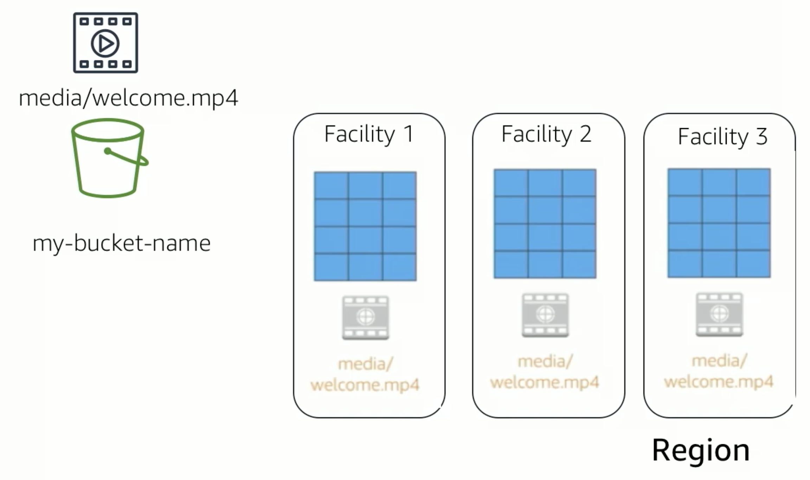
</p>

When you create a bucket in Amazon S3, it is associated with a specific AWS region. When you store data in the bucket it is redundantly stored across multple AWS facilities within your selected region. This means your data is secure even if there is concurrent data loss in two AWS facilities. Amazon S3 automatically manages the storage for your bucket while your data grows. You can get started immediately, and your data storage will grow with your application needs. Amazon S3 also scales to handle a high volume of requests. You do not need to provision the storage or throughput, and you are billed only for what you use.

<p style="text-align: center">
  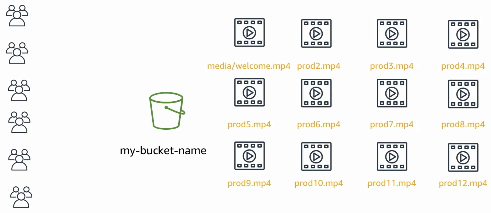
</p>

You can access Amazon S3 via a variety of methods.

- AWS Management Console
- AWS Command Line Interface (CLI)
- AWS SDK

<p style="text-align: center">
  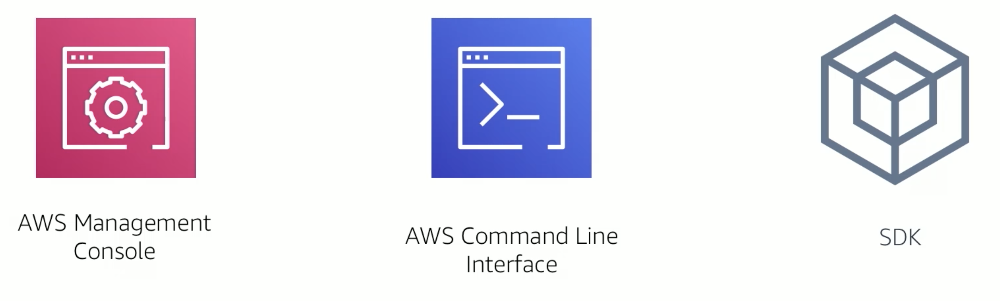
</p>

you can also access Amazon S3 data in your bucket with third party applications and back up tools. Keep in mind, this is considered programmatic access, and will require that you provision an ssh key pair for the tool to access the Amazon S3 service. The endpoints that support HTTP and HTTP access must be globally unique and DNS compliant. This means that bucket names need to be all lowercase, and contain a combination of only letters, numbers and dashes. Symbols such as exclamation points aren't allowed. 

The flexibility to store a virtually unlimited amount of data, and to access that data from anywhere means that AWS S3 is suitable for a variety of scenarios including static website hosting. Amazon S3 Buckets can serve the static contents of your website. Including HTML, Javascript, CSS and other files. The high durability of Amazon S3 makes it a good candidate for storing backups of your data. For greater availability and disaster recovery capability, Amazon S3 can be configured to support cross-region replication. So that data in an Amazon S3 bucket in one region can be automatically replicated in another region.    

Amazon S3 costs vary by region and the specific requests being made.

### Amazon S3 Pricing

- Pay for only what you use:
    - GBs per month
    - Transfer out to other regions
    - PUT, COPY, POST, LIST, and GET requests

- You do not pay for: 
    - Transfers in to Amazon S3
    - Transfers out to Amazon S3 to Amazon Cloudfront or AWS EC2 in the same region
 
### Watch the Console Demonstration S3 video on AWS Academy

## Review and Practice <a class="anchor" id="DS107L4.4_quiz"></a>

Below you will find a quiz to review the recently covered material. Quizzes are _not_ graded.

```c-lms
start-activity: DS107L4.4 AWS S3 Quiz 
```

```c-lms
topic: Amazon Elastic File System (EFS)
```

## Amazon Elastic File System (EFS)

<p style="text-align: center">
  
</p>

An Amazon EFS implements storage for EC2 instances that multiple virtual machines can access at the same time. In is implemented as a Network File System (NFS). 

### Amazon EFS Features

- File storage in the AWS Cloud
- Works well for big data and analytics, media processing workflows, content management, web serving, and home directories.
- Petabyte-scale, low latency file system
- Shared storage
- Elastic capacity
- Supports NFS versions 4.0 and 4.1 (NFSv4)
- Compatible with all Linux-based AMIs for Amazon EC2

Amazon EFS file systems can automatically scale from gigabytes to petabytes of data without the need to provision storage. Thousands of Amazon EC2 images can access an Amazon EFS file system at the same time. An Amazon EFS provides consistent performance to each Amazon EC2 instance. Amazon EFS is also highly durable and highly available. There are no minimum fee or setup costs for Amazon EFS, you only pay for the storage that you use. 

<p style="text-align: center">
  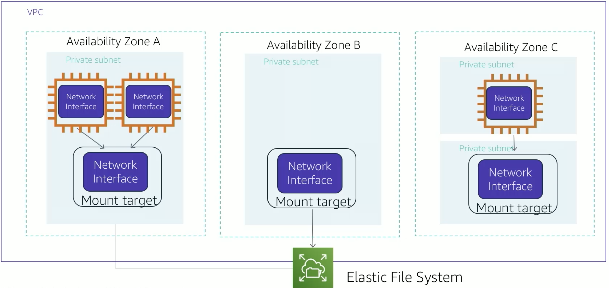
</p>

Think of Amazon EFS as file storage in the cloud. With Amazon EFS, you can create a file system, mount the file system on an Amazon EC2 instance, and then read and write to and from your file system. You can mount an Amazon EFS file system on your VPC. Amazon EFS supports Network File System 4.0 and 4.1. You can access your Amazon EFS file system concurrently from multiple Amazon EC2 instances in your VPC.  So, applications that scale beyond a single connection can access a file system. Amazon EC2 instances that run in mutilple availability zones within the same AWS region can access the file system, so many users can access and share a common data source. In the diagram, the VPC has three availability zones, and each availability zone has one mount target that was created in it. Accessing the file system from the mount target within the same availability zone is advised. One of the availability zones has two subnets. However, a mount target is created in only one of the subnets. 

### Amazon EFS Implementation

There are five steps to setup your Amazon EFS file system:

1. Create your Amazon EC2 resources and launch your Amazon EC2 instance.
2. Create your Amazon EFS file system.
3. Create your mount targets in the appropriate subnet.
4. Connect your EC2 instances to the mount targets.
5. Verify the resources and protection of your AWS account.

<p style="text-align: center">
  
</p>

In Amazon EFS, a file system is the primary resource. Each file system has properties as show above.

## Watch the Console Demonstrations - S3 and EFS in AWS Academy

## Review and Practice <a class="anchor" id="DS107L4.5_quiz"></a>

Below you will find a quiz to review the recently covered material. Quizzes are _not_ graded.

```c-lms
start-activity: DS107L4.5 AWS EFS Quiz 
```

```c-lms
topic: AWS S3 Glacier
```

## AWS S3 Glacier

<p style="text-align: center">
  
</p>

Amazon S3 Glacier is a secure, durable, and extremely low-cost cloud storage service for data archiving and long-term backup. When you use the Glacier to archive data you can store your data at an extremely low cost.

### Amazon S3 Glacier Retrieval Options

<p style="text-align: center">
  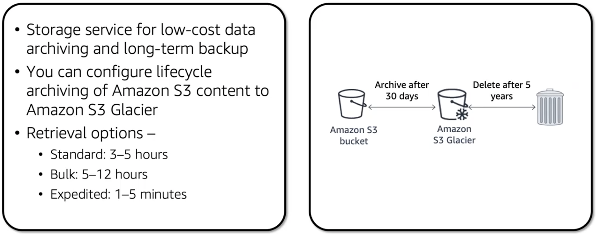
</p>

- Amazon S3 Glacier is designed to provide 11 9's of durability for objects.
- It supports the encryption of data in transit and at rest through Secure Sockets Layer (SSL) or Transport Security Layer (TLS).
- The Vault lock feature enforces compliance through policy.
- Extremely low-cost design works well for long-term archiving.
- Provides three options for access to archives:
    - expedited (one to five minutes, highest cost),
    - standard (three to five hours, less expensive),
    - bulk (five to twelve hours, the least expensive option)
    
These retrieval times range from a few minutes to several hours.

### Amazon S3 Glacier Use-Cases

<p style="text-align: center">
  
</p>

Some common use-cases for Amazon S3 Glacier shown above

Amazon S3 Glacier performs regular systematic data integrity checks. Designed to be automatically self-healing. 


<p style="text-align: center">
  
</p>

To store and access data in Amazon S3 Glacier you can use the AWS Management Console. However, only a few operations such as creating and deleting vaults and creating and managing archive policies are available in the console. For other operations and interactions with Amazon S3 Glacier you must use either Amazon S3 Glacier REST APIs, the AWS Java or .NET SDKs, or the AWS CLI. You can also use lifecycle policies to archive data into Glacier. 

<p style="text-align: center">
  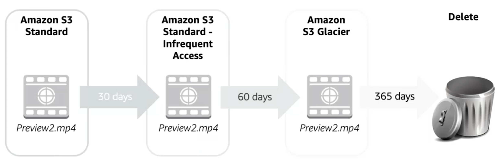
</p>

You should automate the lifecycle of the data that you store in Amazon S3. By using lifecycle policies you can cycle data at regular intervals between different Amazon storage types. This automation reduces your overall cost because you pay less for the data as it becomes less important over time. In addition to setting lifecycle rules per object you can also set lifecycle rules per bucket. Consider the example of a lifecycle policy that moves data as it ages from Amazon S3 Standard, to Amazon S3 Standard - Infrequent Access, and finally into Amazon S3 Glacier before it's deleted. Supposed that a user uploads a video to your application and your application generates a thumbnail preview of the video. This video preview is stored to Amazon S3 Standard because it is likely that the user wants to access it right away. Your usage data indicates that most thumbnail previews are not accessed after 30 days. Your lifecycle policy takes these previews and moves them to Amazon Standard - Infrequent Access after 30 days. After another 30 days elapsed, the preview is likely not to be accessed again. The previews move to Amazon Glacier where it remains after 1 year. After one year the preview is deleted. The lifecycle policy manages all this movement automatically.

<p style="text-align: center">
  
</p>

Each object in Amazon S3 has a storage class that is associated with it. All the storage classes are designed for 11 nines of durability for objects across multiple Availability Zones, except Amazone S3 One Zone-Infrequent Access, which is in a single Availability Zones. S3 Standard works well in performance-sensitive use-cases and frequently used data. Standard is the default storage class in Amazon S3. S3 Intelligent-Tiering is designed to optimize cost by automatically moving data to the most cost effective access tier without impacting performance or opertational costs. S3 Standard - Infrequent Access is optimized for long-lived and less frequently accessed data. For example, backups and older data that are accessed less frequently, but still require high performance. S3 One Zone-Infrequent Access stores data in a single Availability Zone and costs less that S3 Standard-Infrequent Access. S3 One Zone-Infrequent Access works well for customers who want a lower-cost option for infrequently accessed data, but do not require the availability and resilience of S3 Standard of Standard-Infrequent Access. S3 Glacier is suitable for archiving data, where access is infrequent and a retrieval time of several hours is acceptable. Archived objects are not available for real-time access. They must be restored before they can be accessed. The S3 Glacier storage class is very low cost. S3 Glacier Deep Archive is the lowest cost storage solution and supports long-term retention and digital preservation of data that might be accessed once or twice a year. It is designed for customers that must retain data sets for 7 to 10 years or even longer to meet regulatory compliance requirements.   

<p style="text-align: center">
  
</p>

While Amazon S3 and Amazon S3 Glacier are both object storage solutions that enable you to store virtually unlimited amounts of data, they have some critical differences between them. The chart above outlines some of these differences. Be careful of which storage solution is correct for your needs. These two services serve very different storage needs. Amazon S3 is designed for frequent low latency access to your data. Amazon S3 Glacier is designed for low-cost long-term storage of infrequently accessed data. Because you get faster access with S3 the storage cost per gigabyte is higher that it is with Glacier. The maximum item size in Amazon S3 is 5 terabytes. Amazon S3 Glacier can store items that are up to 40 terabytes in size. While both services have per request charges, Amazon S3 charges for PUT, COPY, POST, LIST, and GET operations. In contrast, Amazon S3 Glacier charges for upload and retrieval operations. Because Amazon S3 Glacier was designed for less frequent access to data, it costs more for each retrieval request than Amazon S3. 

<p style="text-align: center">
  
</p>

Another important difference between Amazon S3 and Amazon S3 Glacier is how data is encrypted. Server-side encryption is focused on protecting data at rest. With both solutions you can securely transfer your data over HTTPS. Any data you archive in Glacier is encrypted by default. With Amazon S3 your application must initiate server-side encryption. There are several ways to enable server-side encryption in Amazon S3. First, you can enable server-side encryption in Amazon S3 with Amazon S3 managed encryption keys, or SSE S3. Amazon S3 encrypts each object with a unique key. As an additional safeguard it encrypts the key with a main key that rotates regularly. Amazon S3 server-side encryption uses one of the strongest block ciphers available, 256-bit Advanced Encryption Standard, or AES 256, to encrypt your data. Next, you can use server-side encryption with customer provided encryption keys, what is known as SSE-C. This option enables you to set your own encryption keys. You include the encryption key as a part of your request, and Amazon S3 manages both encryption  as it writes to disks and decryption when you access your objects. Finally, you can use server-side encryption with AWS Key Management Services, or AWS KMS. AWS KMS is a service that combines secure, highly-available hardware and software to provide a key management system that is scaled for the cloud. AWS KMS uses customer master keys to encrypt your Amazon S3 objects. You access KMS through the encryption section of the AWS IAM Console. You can also access AWS KMS through the API to centrally create encryption keys, define the policies that control how keys can be used, and audit key usage to prove that they are being used correctly.  

<p style="text-align: center">
  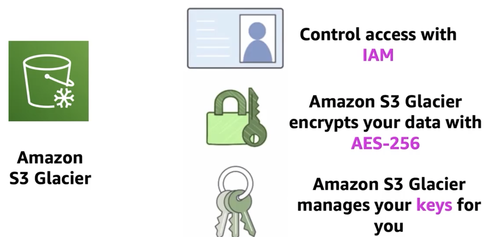
</p>

By default, only you can access your data. There are two different layers of security that you can apply to Glacier. First, you can control and enable and control access to your data in Amazon S3 Glacier by using IAM. You set up an IAM policy that specifies user access. Secondly, Glacier encrypts your data by default. You can choose how you want to manage the keys to that encrypted data. 

### Watch the Console Demonstrations - Glacier

```c-lms
topic: Amazon Databases
```
## Amazon Databases

<p style="text-align: center">
  
</p>


## Overview

### Topics: Top Utilized Database Services
- [Amazon RDS](https://aws.amazon.com/rds/?hp=tile&so-exp=below) Managed relational database service for MySQL, PostgreSQL, Oracle, SQL Server, and MariaDB
- [Amazon DynamoDB](https://aws.amazon.com/dynamodb/?hp=tile&so-exp=below) Managed NoSQL database
- [Amazon Redshift](https://aws.amazon.com/redshift/?hp=tile&so-exp=below) Fast, simple, cost-effective data warehousing
- [Amazon Aurora](https://aws.amazon.com/rds/aurora/?hp=tile&so-exp=below) High performance managed relational database

### Demos
Amazon RDS console
Amazon DynamoDB console

### Watch the Console Demonstrations - Databases


### Activity
Database case study

### Other Widely Utilized Database Services
- [Amazon DocumentDB (with MongoDB compatibility)](https://aws.amazon.com/documentdb/?hp=tile&so-exp=below) Fully managed document database
- [Amazon ElastiCache](https://aws.amazon.com/elasticache/?hp=tile&so-exp=below) In-memory caching system
- [Amazon Keyspaces (for Apache Cassandra)](https://aws.amazon.com/mcs/?hp=tile&so-exp=below) Managed Cassandra-compatible database
- [Amazon Neptune](https://aws.amazon.com/neptune/?hp=tile&so-exp=below) Fully managed graph database service
- [Amazon Quantum Ledger Database (QLDB)](https://aws.amazon.com/qldb/?hp=tile&so-exp=below) Fully managed ledger database
- [Amazon RDS on VMware](https://aws.amazon.com/rds/vmware/?hp=tile&so-exp=below) Automate on-premises database management
- [AWS Database Migration Service](https://aws.amazon.com/dms/?hp=tile&so-exp=below) Migrate databases with minimal downtime

The business world is constantly changing and evolving by accurately recording, updating, and tracking data on an efficient and regular basis. Companies can use the immense potential from the insights that they obtain from their data. Database management systems are the crucial link for managing this data. Like other cloud services, cloud databases offer significant cost advantages over traditional database strategies. In this section you will learn about Amazon Relational Database Service or Amazon RDS, Amazon DynamoDB, Amazon Redshift, and Amazon Aurora. You will also learn the differences between managed and unmanaged database solutions. You will learn how to describe the differences between a SQL and noSQL database, and how to match that database service to a specific set of business requirements. 

After completing this module you should be able to:

- Explain Amazon RDS
- Identify the functionality in RDS
- Explain Amazon DynamoDB
- Identify the functionality in DynamoDB
- Explain Amazon Redshift
- Explain Amazon Aurora
- Perform tasks in RDS, such as launching, configuring, and interacting with an application

```c-lms
topic: Amazon Relational Database Service (RDS)
```

## Amazon Relational Database Service (RDS)

AWS solutions typically fall into one of two categories, either unmanaged or managed services.

<p style="text-align: center">
  
</p>
## Unmanaged Services

Unmanaged services are typically provisioned as discrete portions as specified by users. As the owner of the service, you manage how the service responds to changes in load, errors, and situations where resources become unavailable. If you want to maintain complete control of your database, you can install a relational database management system on an EC2 instance. This will be very similar to running your database in a physical data center that you own, and will be an example of an unmanaged service. Say that you launch a web server on an EC2 instance. Because Amazon EC2 is an unmanaged solution, that web server will not scale automatically to scale to handle increased traffic load or replace unhealthy instances with healthy ones unless you specify that it uses a scaling solution. It could be the auto scaling service that you use. The benefit of using an unmanaged service is that you have more fine-tuned control over how your solution handles changes in load, errors, and situations where resources become unavailable. There is also some configuration for managed services. For example, you can create an S3 bucket and set permissions for it. However, managed services typically require a lot less configuration. Now let's look at the challenges or running an unmanaged standalone relational database. Then you can understand how Amazon RDS addresses those challenges.

### Challenges of Relational Databases

- Server maintenance and energy footprint
- Software installation and patches
- Database backups and high availability
- Limits on scalability
- Data security
- Operating System (OS) installation and patches
- Database backups

When you run your own relational database, you are responsible for several administrative tasks, such as listed above. All these tasks take resources from other items on your to-do list, and require specific expertise.  

<p style="text-align: center">
  
</p>

To address the challenges of running an unmanaged standalone relational database, AWS provides RDS, a service that sets up, operates, and scales relational databases without any ongoing administration. With Amazon RDS, your primary focus is your data on optimizing your application.  

## Managed Services

<p style="text-align: center">
  
</p>

### Managed services responsibilities

**You manage:**
- Application optimization

**AWS manages:**
- OS installation and patching
- Database software installation and patching
- Database backups
- High availability
- Scaling
- Power, racking, and stacking servers
- Server maintenance

Offloading these operations to the managed Amazon RDS service reduces your operational workload and the costs associated with your relational database. 

<p style="text-align: center">
  
</p>

Let's take a closer look at the details of RDS, the basic building blocks of the Amazon RDS is the database instance. 

A database instance is an isolated database environment that you can contain multiple user created databases. You can access your databases using the same tools and applications that you use with a standalone database instance. When setting up your database, you pick an instance class and the type of storage you need for your database. Database instances and storage differ in performance characteristics and price. This enables you to customize your performance and costs to the needs of your business. When you choose to create a database instance, you specify which database engine to run. Amazon RDS supports six database engines, MySQL, Amazon Aurora, Microsoft SQL Server, PostgreSQL, MariaDB, and Oracle. 

<p style="text-align: center">
  
</p>

When you use a VPC you have control over your virtual network environment. You can select your own IP address range, create subnets, and configure routing and access control lists to control access to your database. The basic functionality of Amazon RDS is the same whether or not you run it in a VPC. Usually the database instance is isolated in a private subnet, and it's only made directly accessible to the applications you choose. 

<p style="text-align: center">
  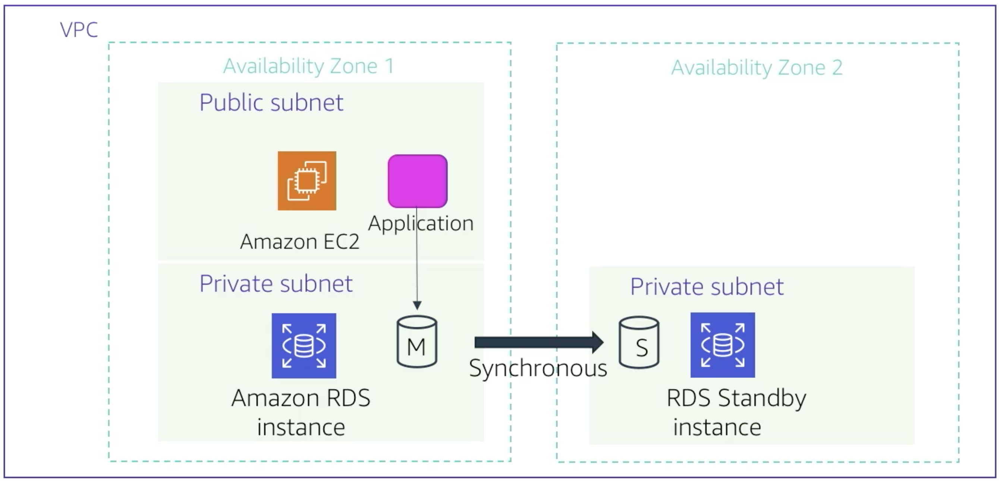
</p>

One of the most powerful features of Amazon RDS is the ability to configure your database instance for availability with a Multi-AZ deployment. When you configure a Multi-AZ deployment, Amazon RDS automatically generates a standby copy of the database instance in another AZ within the same VPC. After seeding the database copy, transactions are synchronously replicated in the standby copy. Running a database instance in a multi AZ deployment can enhance availability during planned system maintenance. And it can help protect your database instance if there is ever a disruption in your AZ. 

<p style="text-align: center">
  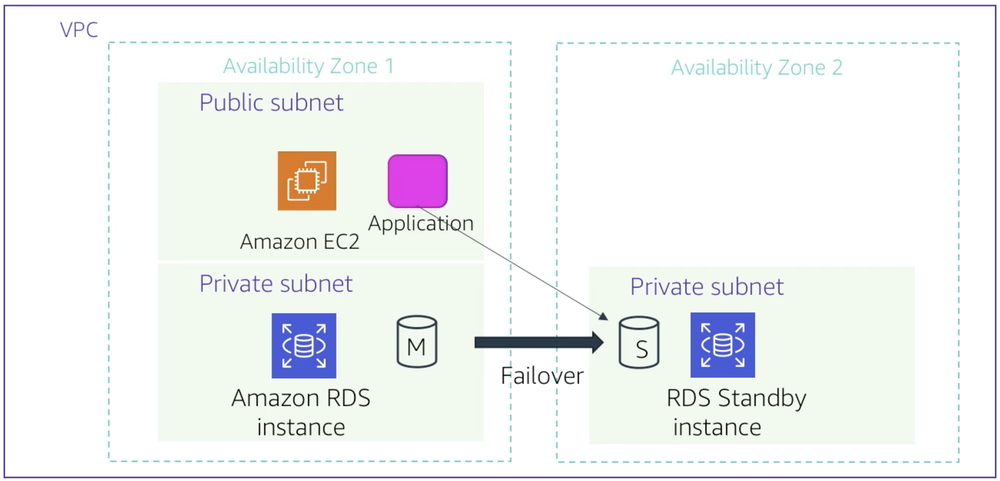
</p>

If the main database instance fails in a Multi-AZ deployment, Amazon RDS automatically brings the standby database instance online as the new main instance. The synchronous replication minimizes the potential for data loss. Because your applications reference the database by name using the DNS domain endpoint, you don't need to change anything in your application code to use the standby copy for failover. 

<p style="text-align: center">
  
</p>

Amazon RDS also supports the creation of read replicas for MySQL, MariaDB, PostgresSQL, and Amazon Aurora. Updates that are made to the source database instance are asynchronously copied to the read replica instance. You can reduce the load on your source database instance by routing read queries from your applications to the read replica. This is a configuration that you would choose if you have an application with a high number of read operations. 

<p style="text-align: center">
  
</p>

Amazon RDS is a great solution for many types of database scenarios. But some of the more common use-cases include the chart above.

### When to use Amazon RDS

#### Use Amazon RDS when: 
- Complex transactions
- Complex queries
- A medium to high query or write rate - up to 30,000 IOPS (15,000 reads + 15,000 writes)
- No more than a single work node or shard
- High durability

#### Do not use Amazon RDS when your application requires:
- Massive read/write rates (for example, 150,000 write/second)
- Sharding due to high data size or throughput demands
- Simple GET or PUT requests and queries that a NoSQL database can handle
- Relational Database Management System (RDMS) customization

If Amazon RDS is not a good candidate for your requirements, you should consider one of the other database services such as Amazon Aurora or Amazon DynamoDB, which we'll review in other videos in this series. 

### Amazon RDS: Clock hour billing and database characteristics
- Clock-hour billing
    - Resources incur charges when running
- Database characteristics
    - Physical capacacity of the database:
        - Engine
        - Instance Size
        - Memory class

All of these affect the overal cost of your RDS implementation

### Amazon RDS: Purchase type and multiple DB instances

Database purchase type also has an impact on cost. When you use on-demand instances you pay for compute capacity for each hour that your database instance runs. There is no minimum requirements or commitments.  you can also select reserve instances. With reserve instances you make a one-time upfront payment for each database instance that you want to reserve for one year or a three-year term. The number of instances you create will also impact your cost. For example, you might want to provision multiple database instances to handle peak loads. 

- DB purchase type
    - On-Demand Instances
        - Computer capacity by the hour
    - Reserve Instances 
        - Low, one-time, upfront payment for database instances that are reserved with a 1-year or 3-year term
- Number of DB instances
    - Provision multiple DB instances to handle peak loads

### Amazon RDS: Storage

Selecting the best storage configuration is another factor that will impact the cost of running an RDS implementation. There is no additional charge for backup storage of up to 100% of your provisioned database storage for an active database instance. After the database instance is terminated, backup storage is billed per GB per month. 

- Provisioned storage
    - No charge
        - Backup storage of up to 100 percent of database storage for an active database
    - Charge (GB/Month)
        - Backup storage for terminated DB instances

- Additional storage
    - Charge (GB/Month)
        - Backup storage in addition to provisioned storage

### Amazon RDS: Deployment type and data transfer

Finally, consider the number of input and output requests that will be made to the database, as well as any data transfers. Inbound data transfers are free and outbound data transfer costs are tiered. Depending on the needs of your application, you might be able to optimize your costs by purchasing reserved instances.

- Requests
    - the number of input/output requests that are made to the database
- Deployment type--Storage and I/O charges vary, depending on how you deploy
    - Single Availability Zone
    - Mutliple Availability Zones
- Data transfer
    - No charge for inbound data transfer
    - Tiered charges for outbound data transfer


## Watch Console Demonstration - RDS

## Review and Practice <a class="anchor" id="DS107L4.8_quiz"></a>

Below you will find a quiz to review the recently covered material. Quizzes are _not_ graded.

```c-lms
start-activity: DS107L4.8 AWS RDS Quiz 
```

```c-lms
topic: Activity Lab 5 - Build a Database Server
```

## Follow directions on AWS Academy

Complete [Lab 5](https://vimeo.com/760024987) and then complete Exam 5 on the LMS

<!--
```python
# https://vimeo.com/760024987
from IPython.display import VimeoVideo
## Tutorial Video Name: Lab 5 - Build a Database Server
VimeoVideo('760024987', width=720, height=480)
```
-->


<div style="padding:56.66% 0 0 0;position:relative;"><iframe src="https://player.vimeo.com/video/760024987?h=c5982533e4&amp;badge=0&amp;autopause=0&amp;player_id=0&amp;app_id=58479" frameborder="0" allow="autoplay; fullscreen; picture-in-picture" allowfullscreen style="position:absolute;top:0;left:0;width:100%;height:100%;" title="Lab 5 - Build a Database Server"></iframe></div><script src="https://player.vimeo.com/api/player.js"></script>


```c-lms
topic: Amazon DynamoDB
```

## Amazon DynamoDB

With DynamoDB with transition from relational databases to non-relational databases. Let's review the differences between these two types of databases. A relational database works with structured data that is organized by tables records and columns. You can think of tables like a spreadsheet with the rows being the records and the columns being the fields. Relational databases create relationships between tables so you can pull data from multiple tables with queries. Relational databases use structured query language, which is a programming language for interacting with the database. A non-relational database is any database that doesn't follow the relational model. Non-relational databases work with lists of key-value pairs. Look at the two examples of data in the diagram below. 

<p style="text-align: center">
  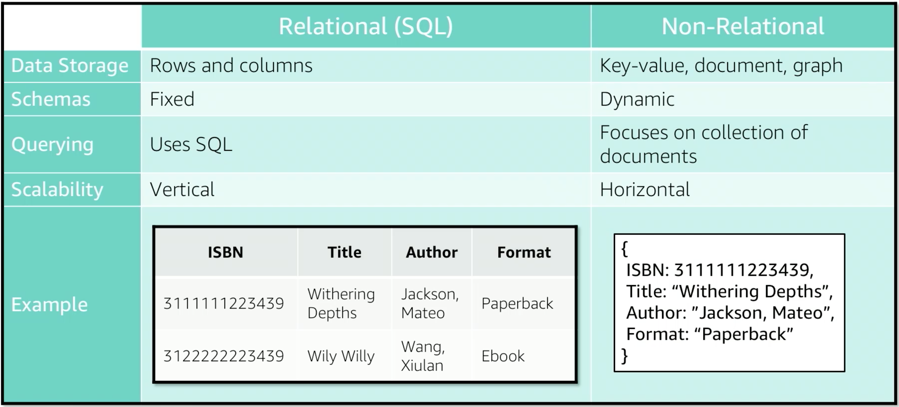
</p>

The structured example is a set of rows and columns while the unstructured example is a list of items stored in a document. Many non-relational databases use JavaScript Object Notation or (JSON) to document your storage data. Non relational databases have grown in popularity because they overcome the limitations of relational databases for handling the demands of semi-structure and unstructured data. Non-relational database scale down horizontally, this makes them a better choice for massive data sets. Non-relational databases are also known as NoSQL databases. 

<p style="text-align: center">
  
</p>

Let's have a look at what DynamoDB is. DynamoDB is a fast and flexible NoSQL database service for all applications that need consistent single-digit millisecond latencies at any scale. Amazon manages all the underlying data structure for this service and redundantly store data across multiple facilities in a region in a fault-tolerant architecture. With DynamoDB you create tables then add items to a table. The system automatically partitions your data and has table storage optimizated for very large and highly volatile data sets. There is no practical limit on the number of items you can store in a table. For instance, some customers have production tables that contain billions of items. One of the benefits of a NoSQL database is that items in the same table can have different attributes. This gives you the flexibility to add attributes as your application evolves. You can store new or format items side-by-side with older format items in the same table without needing to migrate your schema. Migrating a schema in a traditional relational database service, can reduce your ability to respond quickly to changing data requirements. As your application becomes more popular and as users continue to interact with it, your storage can grow with your application needs. All the data in DynamoDB is stored in solid state drives. And it's simple query language enables consistent low latency query performance. In addition to scaling storage with DynamoDB, you can provision the amount of read or write throughput that you need for your table. As the number of application users grow, DynamoDB tables can be scaled to handle the increased number of read, write, requests with manual provisioning. You can also enable automatic scaling so that DynamoDB monitors the load on the table and automatically increases or decreases the provisioned throughput. Some other key DynamoDB features include global tables that enable you to automatically replicate your choice across AWS regions. You can also encrypt your data at rest and set a time to live for specific items. The core DynamoDB components are table items and attributes. A table is a collection of data. Items are a group of attributes that is uniquely identifiable. For example, if you had a table for all your friends, every friend would be a distinct item. An attibute is a fundamental data element in the table. For example, if you had a table of friends including their phone numbers, you might have attributes like first name, last name, and phone number. 


### Core DynamoDB components
- Table
    - a collection of data
- Items
    - a group of attributes that is uniquely identifiable
- Attribute
    - a fundamental data element in the table

<p style="text-align: center">
  
</p>

When you create a table in addition to the table name, you must specify a primary key of the table. When you add, update, or delete an item in the table, you must specify the primary key attributes values for that item. DynamoDB supports two different kinds of primary keys. A simple primary key is an attribute that uniquely identifies an item. The attribute is called a partition key. A composite primary key is composed of two attributes. The first attribute is the partition key, and the second attribute is called the sort key.

### Keys
- Single or Simple key
    - Partition key
- Compound or Composite key
    - Partition key + Sort key

### Watch the Console Demonstration - DynamoDB

```c-lms
topic: Amazon Redshift
```

## Amazon Redshift


<p style="text-align: center">
  
</p>

Amazon Redshift is a fast, fully managed data warehouse that makes it simple and cost-effective to analyze all of your data by using standard SQL and your existing business intelligence tools. Let's review a detailed exploration of key Amazon Redshift features and some common use cases. 

<p style="text-align: center">
  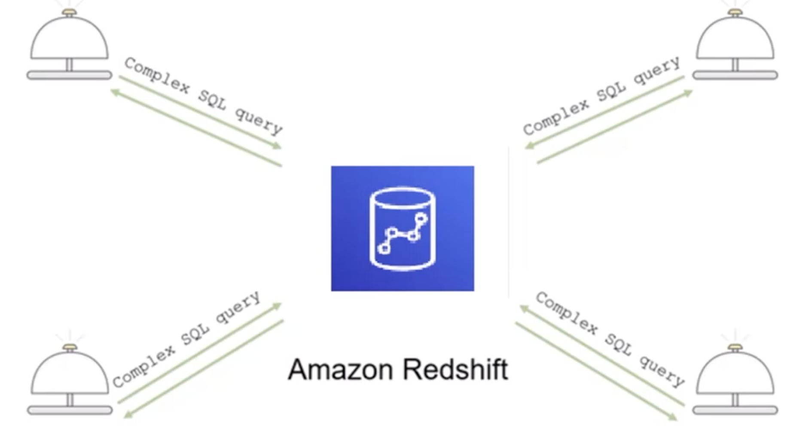
</p>

Analytics is an important part of businesses today but building a data warehouse is complex and expensive. Data warehouses can take months and financial resources to set up. Amazon Redshift is a fast and powerful fully-managed data warehouse that is simple and cost effective to set up, use, and to scale. It enables you to run complex analytics queries against petabytes of structured data by using sophisticated query optimization, columnar storage on high-performance local disk, and massively parallel queries. Most results come back in seconds.  

<p style="text-align: center">
  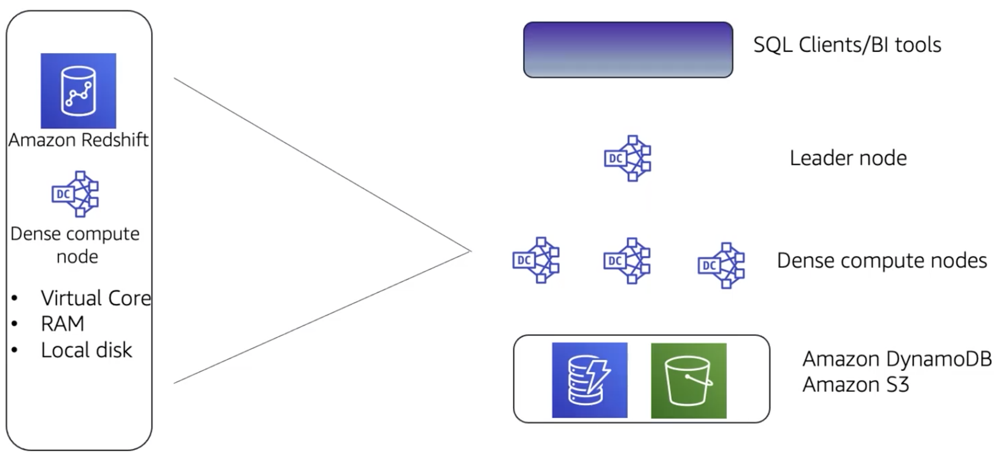
</p>

### Amazon-Redshift Parallel Processing Architecture

An Amazon Redshift implementation consists of a cluster of leader and compute nodes. The leader node manages communication with client programs and all communication with compute nodes. It parses and develops plans to perform series of steps needed to obtain results from complex queries. The leader node compiles code for individual elements of the plan and assigns the code to individual computer nodes. The compute nodes run the compiled code and send intermediate results back to the leader node for final aggregation.  Like other AWS services, you only pay for what you use with Amazon Redshift. 

<p style="text-align: center">
  
</p>

You can automate most of the common administrative tasks to manage, monitor and scale your Amazon Redshift cluster. This enables you to focus on your data and your business. Scalability is intrinsic in Amazon Redshift. Your cluster can be scaled up and down as your needs change with a few clicks in the console. Security is the highest priority of AWS. With Amazon Redshift, security is built in and it is designed to provide strong encryption of your data at both rest and in transit. 

<p style="text-align: center">
  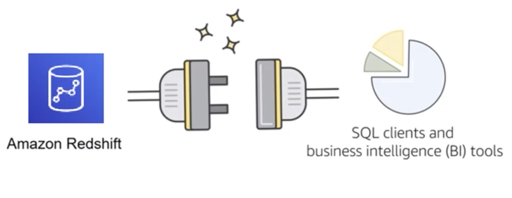
</p>

Amazon Redshift is already compatible with the BI tools that you already know and use. Amazon Redshift supports standard SQL. It also provides high-performance Java Database Connectivity and Open Database Connectivity connectors. This means that you can connect your Amazon Redshift cluster with SQL clients and business intelligence tools of your choice. You can also interact directly with your Amazon Redshift cluster via the AWS console or AWS CLI. 

### Amazon Redshift use-cases
- Enterprise data warehouse(EDW)
    - Migrate at a pace that customers are comfortable with 
    - Experiment without large upfront cost or commitment
    - Respond faster to business needs
- Big data
    - Low price point for small customers
    - Managed services for ease of deployment and maintenance
    - Focus more on data and less on database management

- Software as a Service (SaaS)
    - Scale the data warehouse capacity as demand grows
    - Add analytic functionality to applications
    - Reduce hardware and software costs
    
```c-lms
topic: Amazon Aurora
```

## Amazon Aurora


<p style="text-align: center">
  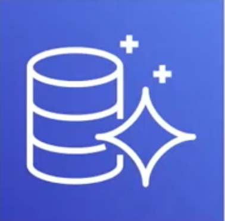
</p>

Amazon Aurora is a MySQL and PostgreSQL compatible relational database that is built for the cloud. Amazon Aurora combines the performance and availability of high-end commercial databases with simplicity and cost effectiveness of open-source databases. Using Amazon Aurora can reduce your database costs while improving the reliability and availability of the database instance. As a fully mananged service, Aurora is designed to automate time consuming tasks.

- Amazon Aurora provides:
    - Enterprise-class relational database
    - Compatible with MySQL and PostgreSQL
    - Automate time-consuming tasks 
        - provisioning
        - patching
        - backup
        - recovery
        - fault detection
        - repair

<p style="text-align: center">
  
</p>

Amazon Aurora is highly available by design. You don't have to do anything to configure high availability, it's built into the Aurora architecture. Aurora is built on a fast distributed storage subsystem, which makes it an ideal solution for large relational database sets. Amazon Aurora is straightforward to set up and supports standard SQL. It is designed to have drop-in compatibility with MySQL and PostgreSQL database engines so that you can use most of your existing database tools with little or no change. Amazon Aurora is a pay-as-you-go service, which means you only pay for the services and features that you use. It's a managed service and work seamlessly with AWS Database Migration Service and the AWS Schema Conversion Tool. These tools simplify the process of moving your data set into Amazon Aurora from your legacy relational database management system. 

<p style="text-align: center">
  
</p>

There are several reasons why you may want to choose Amazon Aurora over other options. One of the primary reasons is the high availability and resilient design that Amazon Aurora offers. Amazon Aurora achieves high availability by storing multiple copies of your data across different Availability Zones. The data is continuously backed up by Amazon S3. You can use up to 15 read replicas with Amazon Aurora to greatly improve performance of high-read use-cases. This also reduces the possibility of losing your data. 

<p style="text-align: center">
  
</p>

Amazon Aurora is designed for instant crash recovery if your primary database becomes unhealthy. After a databse crash, Amazon Aurora does not need to replay the redo log from the last database checkpoint, instead it peforms this on every read operation.  This reduces the restart time after a database crash to less than 60 seconds in most cases. The Aurora architecture removes the buffer cache from the database process, that's why the buffer is available immediately after a restart. This means you do not need to throttle access after a crash while you wait for cache to repopulate. 

```c-lms
topic: Amazon Databases Summary
```

## Amazon Databases Summary


In summary, you learned how to:
- Explain Amazon Relational Database Service (Amazon RDS)
- Identify the functionality in Amazon RDS
- Explain Amazon DynamoDB
- Identify the functionality in Amazon DynamoDB
- Explain Amazon Redshift
- Explain Amazon Aurora
- Perform tasks in an RDS database, such as launching, configuring and interacting


## Review and Practice <a class="anchor" id="DS107L4.13_quiz"></a>

Below you will find a quiz to review the recently covered material. Quizzes are _not_ graded.

```c-lms
start-activity: DS107L4.13 AWS Database Quiz 
```

```c-lms
topic: Key Terms
```

## Key Terms


Below is a list and short description of the important keywords learned in this lesson. Please read through and go back and review any concepts you do not fully understand. 

<table class="table table-striped">
    <tr>
        <th>Keyword</th>
        <th>Description</th>
    </tr>
    <tr>
        <td style="font-weight: bold;" nowrap>Amazon Elastic Block Store (EBS)</td>
        <td>Easy to use, high performance block storage at any scale</td>
    </tr>
    <tr>
        <td style="font-weight: bold;" nowrap>Amazon S3</td>
        <td>Object storage built to retrieve any amount of data from anywhere</td>
    </tr>
    <tr>
        <td style="font-weight: bold;" nowrap>Amazon Elastic File System</td>
        <td>Simple, serverless, set-and-forget, elastic file system</td>
    </tr>
    <tr>
        <td style="font-weight: bold;" nowrap>User-Defined Functions</td>
        <td>Functions you, the user, create.</td>
    </tr>
    <tr>
        <td style="font-weight: bold;" nowrap>Schema on Read</td>
        <td>Storing unstructured data and only giving the data a structure when you go to use it.</td>
    </tr>
    <tr>
        <td style="font-weight: bold;" nowrap>Schema on Write</td>
        <td>Storing data in structured tables.  A traditional SQL storage system.</td>
    </tr>
    <tr>
        <td style="font-weight: bold;" nowrap>Amazon S3 Glacier storage classes</td>
        <td>Long-term, secure, durable storage classes for data archiving at the lowest cost and milliseconds access
</td>
    </tr>
    <tr>
        <td style="font-weight: bold;" nowrap>Amazon RDS</td>
        <td>Set up, operate, and scale a relational database in the cloud with just a few clicks. Amazon RDS is a relational database service that supports multiple database engines such as MySQL, Amazon Aurora, Microsoft SQL Server, PostgreSQL, MariaDB, and Oracle.</td>
    </tr>
    <tr>
        <td style="font-weight: bold;" nowrap>Amazon DynamoDB</td>
        <td>Fast, flexible NoSQL database service for single-digit millisecond performance at any scale</td>
        <td></td>
    </tr>
    <tr>
        <td style="font-weight: bold;" nowrap>Amazon Redshift</td>
        <td>Fastest, easiest, and most widely used cloud data warehouse</td>
    </tr>
    <tr>
        <td style="font-weight: bold;" nowrap>Amazon Aurora</td>
        <td>Designed for unparalleled high performance and availability at global scale with full MySQL and PostgreSQL compatibility</td>
    </tr>
    <tr>
        <td style="font-weight: bold;" nowrap>Amazon DocumentDB</td>
        <td>Scale JSON workloads with ease using a fully managed document database service</td>
    </tr>
    <tr>
        <td style="font-weight: bold;" nowrap>Amazon ElastiCache</td>
        <td>Unlock microsecond latency and scale with in-memory caching</td>
    </tr>
    <tr>
        <td style="font-weight: bold;" nowrap>Amazon Keyspaces</td>
        <td>A scalable, highly available, and managed Apache Cassandra–compatible database service</td>
    </tr>
    <tr>
        <td style="font-weight: bold;" nowrap>Amazon Neptune</td>
        <td>Serverless graph database designed for superior scalability and availability</td>
    </tr>
    <tr>
        <td style="font-weight: bold;" nowrap>Elastic IP Address</td>
        <td>A static IPv4 address designed for dynamic cloud computing. An Elastic IP address is allocated to your AWS account, and is yours until you release it.</td>
    </tr>
    <tr>
        <td style="font-weight: bold;" nowrap>Elastic Network Interface</td>
        <td>A virtual interface that can be attached to an instance in a Virtual Private Cloud (VPC). </td>
    </tr>
    <tr>
        <td style="font-weight: bold;" nowrap>Amazon Quantum Ledger Database (QLDB)</td>
        <td>Maintain an immutable, cryptographically verifiable log of data changes</td>
    </tr>
    <tr>
        <td style="font-weight: bold;" nowrap>AWS Database Migration Service</td>
        <td>More than 750,000 databases have securely migrated to AWS with minimal downtime</td>
    </tr>
</table>

---


```c-lms
topic: Lesson 4 Exam
```

## Lesson 4 Exam


```c-lms
start-activity: DS107L4.15 Lesson 4 Exam 
```
