```c-lms
activity-name: AWS Cloud Architectures Autoscaling and Monitoring
topic: Overview of Cloud Architecture
```

# AWS Cloud Architectures Autoscaling and Monitoring


<p style="text-align: center">
  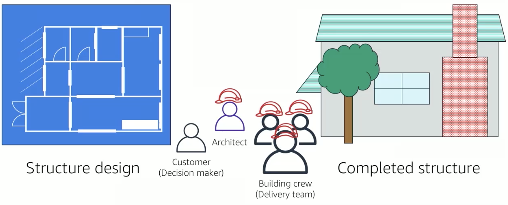
</p>

Architecture is the art and science of designing and building large structures. Large systems require architects to manage their size and complexity. What do cloud architects do? Cloud architects engage with decision makers to identify the business goal and the capabilities that need improvement. They ensure alignment between technology deliverables of a solution and the business goals. They work with delivery teams that are implementing the solution to ensure that the technology features are appropriate. The AWS Well-Architected Framework is a guide that is designed to help you build the most secure, high-performing, resilient and efficient infrastructure possible for your cloud applications and workloads. It provides a set of foundational questions and the best practices that can help you evaluate and implement your cloud architectures. AWS developed the Well-Architected Framework after reviewing thousands of customer architectures on AWS. 


```c-lms
topic: AWS Well-Architected Framework Design Principles
```

## The AWS Well-Architected Framework
- A guide for designing architectures that are
    - Secure
    - High-performing
    - Resilient
    - Efficient
- A consistent approach to evaluating and implementing cloud architectures
- A way to provide best practices that were developed through lessons learned by reviewing customer architectures

<p style="text-align: center">
  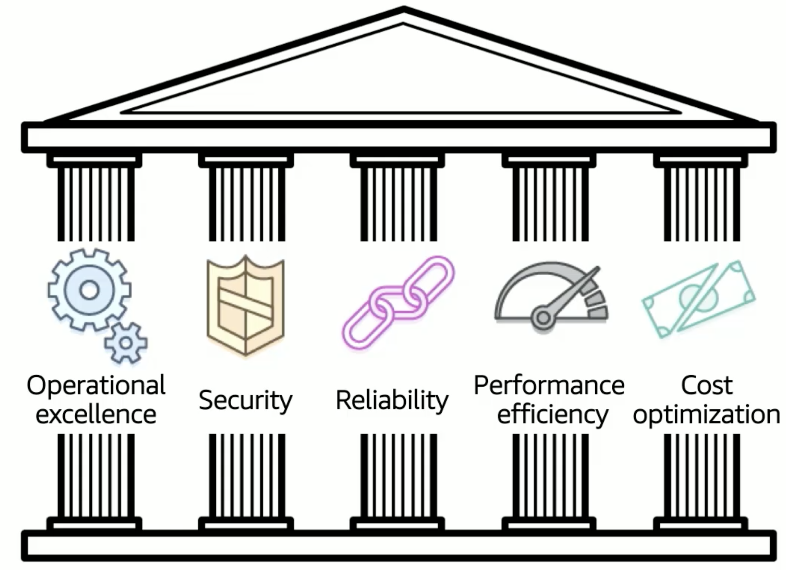
</p>

The AWS Well-Architected Framework is organized into 5 pillars. Each pillar includes a set of design principles and best practices. In each best practice area, there are a set of foundational questions. Some context and a list of best practices are provided for each question. 

[AWS Well-Architected Framework Design Principles](https://aws.amazon.com/architecture/well-architected/?wa-lens-whitepapers.sort-by=item.additionalFields.sortDate&wa-lens-whitepapers.sort-order=desc)

```c-lms
topic: Operational Excellence
```

## Operational Excellence

<p style="text-align: center">
  
</p>

- The Operational Excellence pillar focuses on the ability to run and systems to deliver business value and to continually improve operations. 

- Key topics include managing and automating changes, responding to events, and defining standards to successfully manage daily operations.

### There are six design principles for Operational Excellence:
- Perform operations as code
    - This is where you define your entire workload, that is applications and infrastructure, as code.
    - By performing operations as code, you limit human error and enable consistent responses to events.
- Annotate documentation
    - Here you focus on automating the creation of annotation documentation after every build.
    - Annotations can be used as input to your operations as code.
- Make frequent small reversible changes 
    - You should design workloads to enable components to be updated regularly.
    - Make changes in small increments that can be reversed if they fail.
- Refine operations procedures frequently
    - Here you look for opportunities to improve operations procedures and update them as they evolve.
- Anticipate failure
    - This is where you identify potential sources of failure so that they can be removed or mitigated.
    - Test failure scenarios and validate your understanding of their impact regularly.
- Learn from all operational events and failures
    - This is what you share what is learned across teams and throughout the entire organization.
    
### Operational Excellence Questions
<p style="text-align: center">
  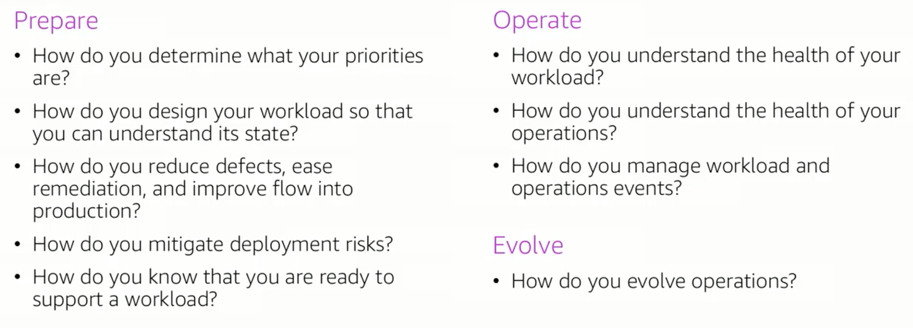
</p>

[Operational Excellence Pillar - AWS Well-Architected Framework](https://docs.aws.amazon.com/wellarchitected/latest/operational-excellence-pillar/welcome.html)

```c-lms
topic: Security
```
## Security

<p style="text-align: center">
  
</p>

- The Security pillar focuses on the ability to protect information, systems, and assets while delivering business value through risk assessment and mitigation strategies. 

- The Security pillar focuses on the key areas of protecting confidentiality and integrity of data, identifying and managing who can do what or priviledge management, protecting systems, and establishing controls to detect security events. 

### There are seven Security design principles that can improve security:

- Implmement a strong identity foundation
    - Here you implement the principle of least priviledge and enforce separation of duties with appropriate authorization for each interaction with your AWS resources.
- Enable traceability
    - This is where you monitor, alert, and audit actions and changes in your environment in real time. Integrate logs and metrics with systems to automatically respond and take action.
- Apply security at all layers
    - Here you apply defense-in-depth and apply security controls to all layers of your architecture, for example, edge network, virtual private cloud, subnet, and load balancer, and every instance, operating system, and application.
- Automate security best practices
    - This is where you automate security mechanisms to improve your ability to securely scale more rapidly and cost effectively.
- Protect data in transit and at rest
    - Here you classify your data into sensitivity levels and use mechanisms such encryption, tokenization, and access control where appropriate.
- Keep people away from data
    - This is where you reduce the loss or modification of sensitive data due to human error. Create mechanisms and tools to reduce or eliminate the need for direct access or manual processing of the data. 
- Prepare for security events
    - This is where you have an incident management process that aligns with organizational requirements. Run incident response simulations and use tools with automation to increase your speed of detection, investigation, and recovery. 
    
### The foundational questions for Security are:

<p style="text-align: center">
  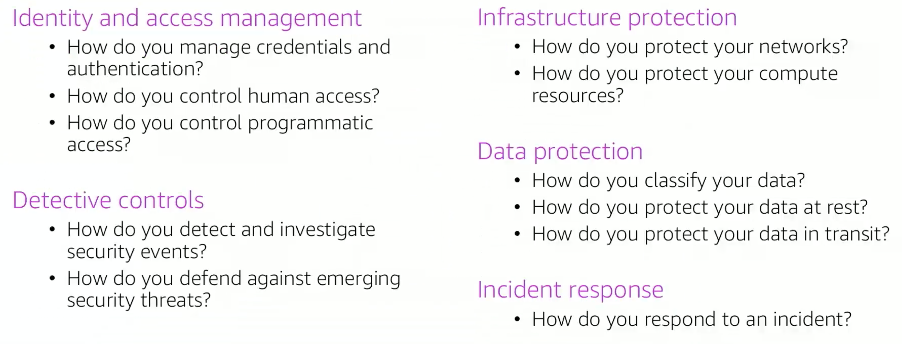
</p>

[Security Pillar - AWS Well-Architected Framework](https://docs.aws.amazon.com/wellarchitected/latest/security-pillar/welcome.html)

```c-lms
topic: Reliability
```

<p style="text-align: center">
  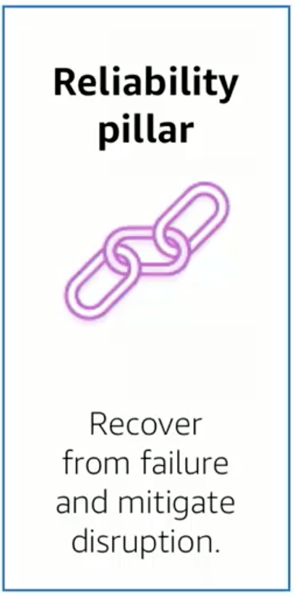
</p>

- Focuses on the ability of a system to recover from infrastructure or service disruptions, dynamically acquire computing resources to meet demand, and mitigate disruptions such as misconfigurations or transient network issues.

- Key Topics:
    - Setting up
    - Cross-project requirements
    - Recovery planning
    - Handling change

### There are five Reliability design principles

- Test recovery procedures
    - This is where you test how your systems fail and validate your test procedures. This practice can expose failure pathways that you can test and rectify before a real failure scenario.
- Automatically recover from failure
    - here you monitor systems for key performance indicators and configure your systems to trigger an automated recovery when the threshold is breached. This practice enables automatic notification and failure tracking and for automated recovery processes that work around or repair a failure.
- Scale horizontally to aggregate system availability
    - This is where you replace one large resource with multiple smaller resources and distribute requests across these smaller resources to reduce the impact of a single point of failure on the overall system. 
- Stop guessing capacity
    - Here you monitor demand and system usage and automate the addition or removal of resources to maintain the optimal level for satisfying demand.
- Manage change in automation
    - This is where you use automation to make changes to infrastructure and manage changes through automation.

### The foundational Reliability questions are

<p style="text-align: center">
  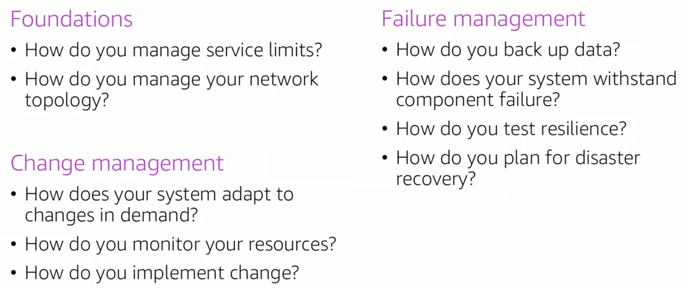
</p>

[Reliability Pillar - AWS Well-Architected Framework](https://docs.aws.amazon.com/wellarchitected/latest/reliability-pillar/welcome.html)

```c-lms
topic: Performance Efficiency
```
## Performance Efficiency

<p style="text-align: center">
  
</p>

- The Performance Efficiency pillar focuses on the ability to use IT and computing resources efficiently to meet system requirements and to maintain that efficiency as demand changes and technologies evolve. 

- Key topics
    - Selecting the right resource types and sizes based on workload requirements
    - Monitor performance 
    - Making informed decisions to maintain efficiency as business needs evolve

### There are five Performance Efficiency design principles

- Democratize advanced technologies
    - Here you consume technologies as a service, for example technology such as NoSQL database, media transcoding, and machine learning require expertise that is not evenly dispersed across the technical community. In the cloud, these technologies become services that teams can consume. Consuming technologies enable teams to focus on product development instead of resource provisioning and management. 
- Go global in minutes
    - This is where you deploy systems in multiple AWS Regions to provide lower latency and better customer experience at minimal cost. 
- Use serverless architectures
    - You utilize serverless architectures to remove the operational burden of running and maintaining servers to carry out traditional compute activities. Serverless architectures can also lower the transactional costs because managed services operate at cloud scale. 
- Experiment more often
    - This is where you perform comparative testing of different types of instances, storage and configurations.
- Have mechanical sympathy
    - Here you use the technology approach that aligns best to what you are trying to achieve. For example, consider your data access patterns when you select approaches for databases or storage. 

### The foundational Performance Efficiency  questions are

<p style="text-align: center">
  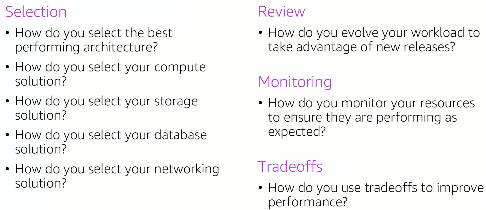
</p>

[Performance Efficiency Pillar - AWS Well-Architected Framework](https://docs.aws.amazon.com/wellarchitected/latest/performance-efficiency-pillar/welcome.html)


```c-lms
topic: Cost Optimization
```

## Cost Optimization

<p style="text-align: center">
  
</p>

- The Cost Optimization pillar focuses on the ability to run systems to deliver business value at the lowest price point.

- Key topics
    - Understanding and controlling when money is being spent
    - Selecting the appropriate and right number of resource types
    - Analyzing spending over time
    - Scaling to meeting business needs without overspending

### There are five Cost Optimization design principles

- Adopt a consuption model
    - This is where you pay only for the resources you require. Increase or decrease usage depending on business requirements, not by using elaborate forecasting.
- Measure overall efficiency
    - Here you measure the business output of the workload and the costs that are associated with delivering it. Use this measure to know the gains that you are making from increasing output and reducing costs.
- Stop spending money on data center operations
    - AWS does the heavy lifting of racking, stacking and powering servers, which means you can focus on your customers and business projects instead of the IT infrastructure.
- Analyze and attribute expenditures
    - The cloud makes it easy to accurately identify system usage and costs, and attribute IT costs to individual workload owners. Having this capability helps you measure return on investment and gives workload owners an opportunity to optimize their resources and reduce costs.
- Use managed and application level services to reduce cost of ownership
    - Managed and application level services reduce the operational burden for maintaining servers for tasks such as sending email or managing databases. because managed services operate at cloud scale, cloud server providers can offer a lower cost per transaction or service.

### The foundational Cost Optimization questions are

<p style="text-align: center">
  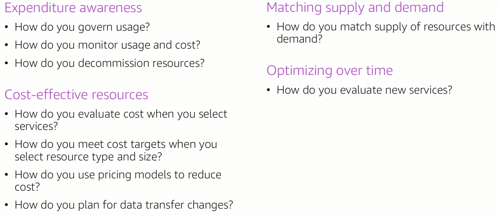
</p>

[Cost Optimization Pillar - AWS Well-Architected Framework](https://docs.aws.amazon.com/wellarchitected/latest/cost-optimization-pillar/welcome.html)

```c-lms
topic: Reliability & High Availability
```

## Reliability & High Availability

_"Everything fails all of the time" ~ Werner Vogels, Amazon CTO_

One of the best practices identified in the AWS Well-Architected Framework is to plan for failure, which means application or workload downtime. You need to architect your applications and workloads to withstand failure. There are two important factors that cloud architects consider when designing architectures to withstand failure: reliability and availability.

- Reliability
    - A measure of your system's ability to provide functionality when desired by the user.
    - System includes all the system components: hardware, firmware, and software.
    - Probability that your entire system will function for a specified period.
    - Mean time between failures (MTBF) = total time in service/number of failures
    
To understand reliability, it is helpful to consider the familiar example of a car.

<p style="text-align: center">
  
</p>

The car is a system. Each of the cars components, for example, the cooling, ignition, and brakes must work together in order for the car to work properly.  If you try to start the car and ignition fails, you cannot drive anywhere. The car is not available. If the ignition fails repeatedly, your car is not considered reliable. A common way to measure reliability is to use statistical measurements such as mean time between failures, what is commonly referred to as MTBF. MTBF is the total time in service over the number of failures. Let's say you have an application that you bring online Monday at noon.

<p style="text-align: center">
  
</p>

The application is said to be available. It functions normally until it fails Friday at noon. Therefore the time to failure or the length of time the application is available is 96 hours. You spend from Friday at noon until Monday at noon diagnosing why the application failed and repairing it, at which point you bring the application back online. Therefore, the time to repair is 72 hours and you had no weekend. Then it happens again. The application fails on Friday at noon. You spend from Friday until Monday at noon repairing it and you bring it back online Monday at noon. Let's say this failure-repair-restore cycle happens every week and you don't get a weekend. You can now calculate the average of these numbers. In this example, your mean time to failure is 96 hours and your mean time to repair is 72 hours. Your mean time between failures is 168 hours or one week, which is the sum of the other mean time to failure and the mean time to repair. As you just learned, failure of system components impacts the availability of the system. Formally, availability is the percentage of time that a system is operating normally or correctly performing the operations of it or normal operation time over total time. Availability is reduced any time an application isn't operating normally including both scheduled and unscheduled interruptions. 

- [Availability](https://docs.aws.amazon.com/wellarchitected/latest/reliability-pillar/availability.html)
    - Normal operation time / total time
    - A percentage of uptime (for example, 99.9 percent) over time (for example, 1 year)
    - Number of 9s - Five 9s means 99.999 percent availability

- [High Availability](https://docs.aws.amazon.com/whitepapers/latest/real-time-communication-on-aws/high-availability-and-scalability-on-aws.html)
    - System can withstand some measure of degradation while still remaining available.
    - Downtime is minimized 
    - Minimal human intervention is required

A highly available system can be viewed as a set of system-wide shared resources that cooperate to guarantee essential services. High availability combines software with open standard hardware to minimize downtime by quickly restoring essential services when a system component or application fails. Services are restored rapidly, often less than one minute. Availability requirements may vary. The length of disruption that is acceptable depends on the type of application. Take a moment and study the common application availability design goals and the maximum length of disruption that can occur within a year while still meeting the goal. 

<p style="text-align: center">
  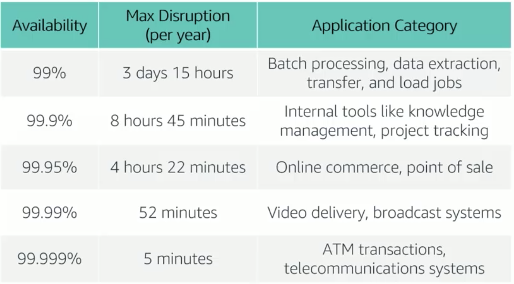
</p>

The table above contains examples of types of applications that are common at each availability tier. Though events that might disrupt an applications availability cannot always be predicted, you can build availability into your architecture design. There are three factors that determine the overall availability of your application.

<p style="text-align: center">
  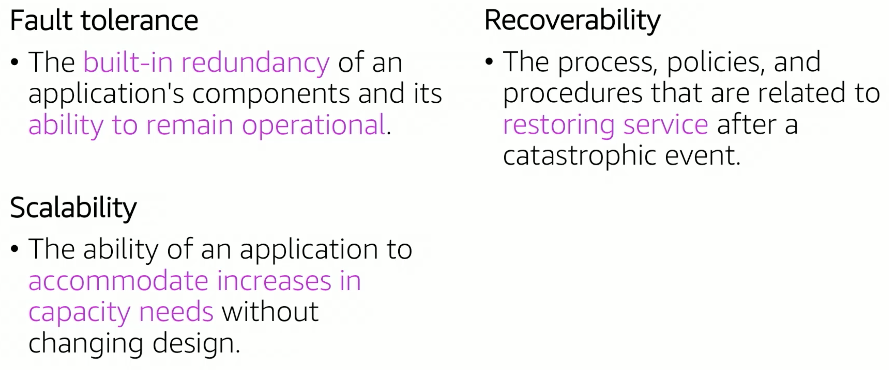
</p>

```c-lms
topic: AWS Trusted Advisor
```
## AWS Trusted Advisor

<p style="text-align: center">
  
</p>

You can use the AWS Well-Architected Framework to understand potential risks in your architecture, identify areas that need improvement, and drive architectural decisions. Lets discuss the AWS Trusted Advisor Tool that you can use to design and review your architectures on AWS. AWS Trusted Advisor looks at your entire AWS environment, and gives you recommendations in five categories.

- Online tool that looks at your infrastructure and provides real-time guidance


<p style="text-align: center">
  
</p>

AWS Trusted Advisor
- looks at your resource usage and makes recommendations that can help you optimize costs, such as eliminating unused and idle resources or making commitments to reserve capacity.  
- can recommend you improve the performance of your service by checking your service limits, looking at your provisioned throughput, and monitoring for overutilized instances. 
- recommendations can help you improve the security of your application by identifying gaps that you need to close and various AWS security features that you need to enable. Also examines your permissions.
- recommendations can help you increase the availability and redundancy of your AWS application so that you can take advantage of automatic scaling, health checks, multi-AZ deployments, and backup capabilities. 
- checks for service usage that is more than 80% of the service limit. Values are based on a snapshot, so your current usage might differ. Limit and usage data can take up to 24 hours to reflect any changes. 

It is important to reiterate that AWS Trusted Advisor is a tool that you can use to review your AWS environment as soon as you start implementing your architectures. You don't need to wait until you have a fully built production-ready environment.


```c-lms
topic: Summary of Cloud Architecture
```

## Summary of Cloud Architecture

In Summary, in the past several sections you learned how to:
- Describe the AWS Well-Architected Framework, including five pillars
- Identify the design principles of the AWS Well-Architected Framework
- Explain the importance of reliability and high availability
- Identify how AWS Trusted Advisor helps customers
- Interpret AWS Trusted Advisor recommendations


## Review and Practice <a class="anchor" id="DS107L5.10_quiz"></a>

Below you will find a quiz to review the recently covered material. Quizzes are _not_ graded.

```c-lms
start-activity: DS107L5.10 Cloud Architecture Quiz
```

```c-lms
topic: Overview of Autoscaling and Monitoring
```

## Overview of Autoscaling and Monitoring
## Topics
- Elastic Load Balancing 
- Amazon CloudWatch
- Amazon EC2 Auto Scaling

These three services work well individually, but together they become more powerful and increase control and flexibility over how your applications handle customer demand.

## Activities
- Elastic Load Balancing Activity
- Amazon CloudWatch Activity

## Lab
- Scale and Load Balance your architecture
In this lab, you will use Amazon EC2 Auto Scaling, Elastic Load Balancing, and Amazon CloudWatch together to create a dynamically scalable architecture.

After completing this next section, you should be able to:
- Indicate how to distribute traffic across Amazon Elastic Compute Cloud (EC2) by using Amazon Elastic Load Balancing
- Explain how Amazon EC2 Auto Scaling launches and releases servers in response to workload changes
- Identify how Amazon CloudWatch enables you to monitor AWS resources and applications in real-time 
- Perform scaling and load balancing tasks to improve and architecture


```c-lms
topic: Elastic Load Balancing
```

## Elastic Load Balancing

<p style="text-align: center">
  
</p>

Modern high-traffic websites must serve hundreds of thousands if not millions of concurrent requests from users or clients and then return the correct text, image, video, or application data in a fast reliable manner. To meet these high-volume demands, additional servers are generally required. Elastic Load Balancing is an AWS service that distributes incoming application or network traffice across multiple targets, such as EC2 instances, containers, IP addresses, Lambda functions, in a single or mutliple Available Zone/s.

<p style="text-align: center">
  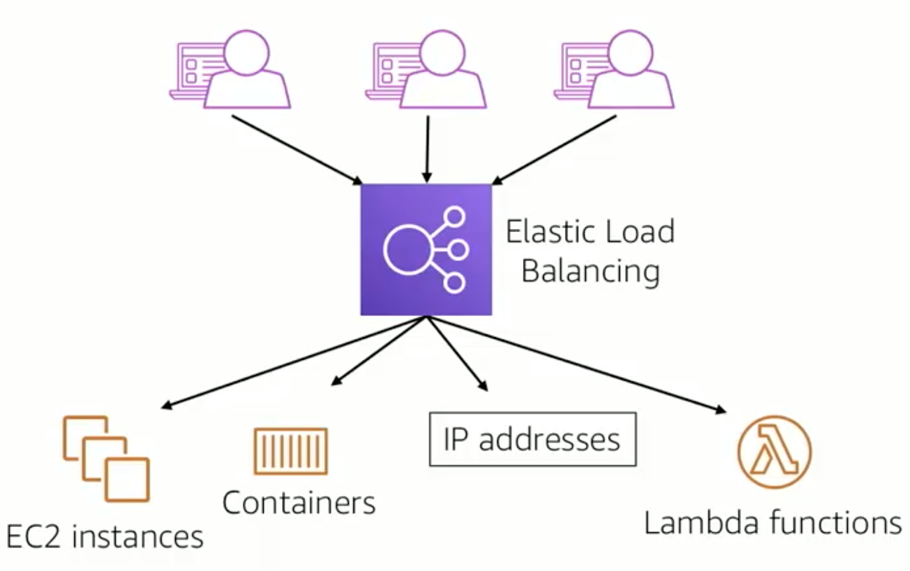
</p>

[Amazon Elastic Load Balancing (ELB)](https://aws.amazon.com/elasticloadbalancing/):
- Distributes incoming application or network traffic across multiple targets in a single Availability Zone or across multiple Availability Zones.
- Scales your load balancer as traffic to your application over time.

ELB can automatically scale to most workloads. 

There are three types of elastic load balancers.

<p style="text-align: center">
  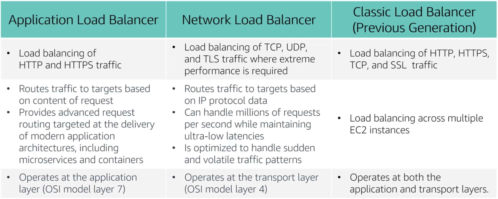
</p>

A load balancer accepts incoming traffic from clients, and routes requests to registered targets in one or more Availability Zones. You configure your load balancer to accept incoming traffic by specifying one or more listeners. A listener is a process that checks for connection requests. It is configured with a protocol, like HTTP, and a port number, such as port 80. Similarly, it is configured with a protocol and a port number for connections from the load balancers to the targets. You can also configure your load balancer to perform health checks, which are used to monitor health of the registered targets so that the load balancer only sends requests to the healthy instances. When the load balancer detects a unhealthy target, it stops routing requests to that target. It then resumes routing traffic to that target when it detects that the target is healthy again.

<p style="text-align: center">
  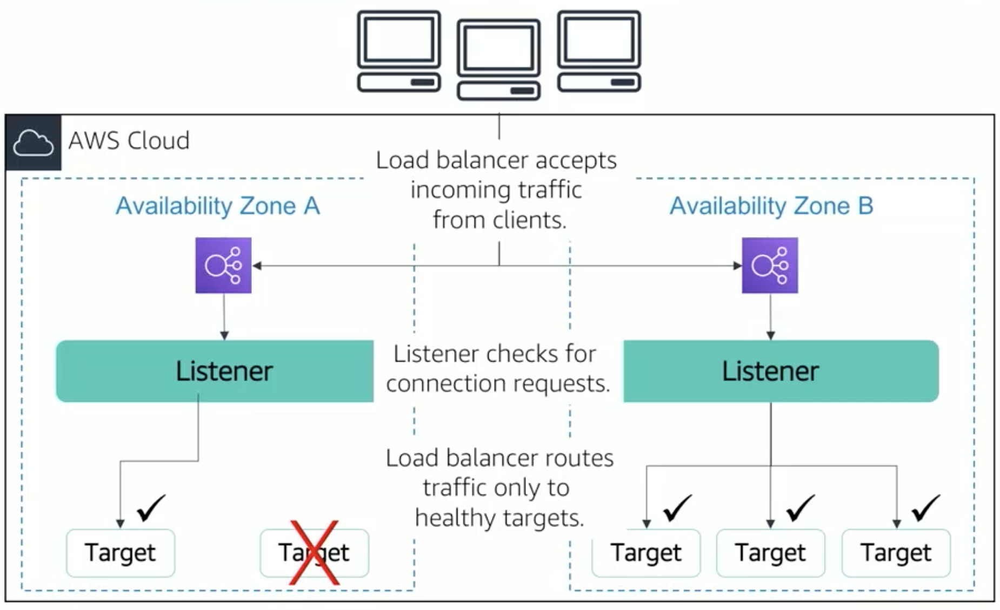
</p>

There is a key difference in how the load balancer types are configured. With an application and network load balancer, you register targets in target groups, and route traffic to the target groups.  With classic load balancers, you register instances with the load balancer. There are many Elastic Load Balancing use cases. Let's consider the main ones. 

<p style="text-align: center">
  
</p>

- You can use ELB to achieve highly available and better fault-tolerance for your applications. ELB balances traffic across healthy targets in multiple Availability Zones. If one or more of your targets in a single Availability Zone and unhealthy, ELB will route target traffic to healthy targets in other Availability Zones. After the targets return to a healthy state, ELB will automatically resume traffic to them.
- There is enhanced container support for ELB so you can use a load balancer to automatically load balance your containerized applications across multiple ports on the same EC2 instance. You can also take advantage of deep integration with Amazon [Elastic Container Service (ECS)](https://aws.amazon.com/ecs/), which provides a fully managed container offering. You only need to register a service with a load balancer and Amazon ECS transparantly manages registration and deregistering of the Docker containers. The load balancer automatically detects the port and dynamically reconfigures itself. To learn more about Elastic Load Balancing, visit the AWS Website about [Amazon Elastic Load Balancing (ELB)](https://aws.amazon.com/elasticloadbalancing/). 

There are a few ways you can monitor your load balancers, analyze traffic patterns, and troubleshoot issues with your load balancers and targets. 

- [Amazon CloudWatch metrics](https://docs.aws.amazon.com/AmazonCloudWatch/latest/monitoring/working_with_metrics.html): Used to verify that the system is performing as expected and creates an alarm to initiate an action if a metric goes outside an acceptable range.
- [Access logs](https://docs.aws.amazon.com/elasticloadbalancing/latest/application/load-balancer-access-logs.html): Capture detailed information about requests sent to your load balancer. 
- [AWS CloudTrail logs](https://docs.aws.amazon.com/awscloudtrail/latest/userguide/cloudtrail-log-file-examples.html): Capture the who, what, when and where of API interactions in AWS services.


```c-lms
topic: Amazon CloudWatch
```

## Amazon CloudWatch

<p style="text-align: center">
  
</p>

To use AWS efficiently, you need insight into your AWS resources:
- How do you know when you should launch more Amazon EC2 instances?
- Is your application's performance or availability being affected by a lack of sufficient capacity?
- How much of your infrastructure is being used?

How do you capture this information?
answer: __Amazon CloudWatch__

Amazon CloudWatch is a monitoring and observability service that is built for DevOps engineers, site reliability engineers, and IT managers. CloudWatch monitors your AWS resources and the applications that you run in real-time. You can use CloudWatch to collect and track metrics, which are variables that you can measure for your resources and applications.

### Amazon CloudWatch:
- Monitors
    - AWS resources
    - Applications that run on AWS
- Collects and tracks
    - Standard metrics
    - Custom metrics
- Alarms
    - Send notifications to Amazon SNS topic
    - Perform Amazon EC2 Auto Scaling or Amazon EC2 actions
    - Alarm examples:
        - EC2 CPU utilization
        - ELB request latency
        - DynamoDB table throughput
        - Amazon Simple Queue Service (SQS) length
        - AWS bill charges
        - Custom metrics that you specify for your own applications or infrastructure
- Events
    - Define rules to match changes in AWS environment and route these events to one or more target functions or streams for processing
    - Targets can include:
        - EC2 instances
        - Lambda functions
        - Kinesis Streams
        - ECS tasks
        - Step functions state machines
        - SNS topics
        - SQS queues
        - Built-in targets inside CloudWatch events
    - CloudWatch events becomes aware of operational changes as they occur and responds to these changes in order to take corrective actions as necessary.

With Amazon CloudWatch you gain system-wide visibility into resource utilization, application performance, and operational health. There is no upfront commitment or minimum fee. You simply pay for what you use.

You can create a CloudWatch alarm based on a static threshold, an anomaly detection, or a metric math expression. 


- Create alarms based on
    - Static threshold
    - Anomaly detection
    - Metric math expression
- Specify
    - Namespace
    - Metric
    - Statistic
    - Period
    - Conditions
    - Additional configuration
    - Actions
 
 
When you create an alarm based on a static threshold, you choose a CloudWatch metric for the alarm and the threshold for that metric. The alarm state is triggered when the metric breaches the threshold for the specified number of evaluation periods. Take a look at the static example for CPU utilization below:

<p style="text-align: center">
  
</p>

[Amazon CloudWatch](https://aws.amazon.com/cloudwatch/)


```c-lms
topic: Amazon EC2 Auto Scaling
```

## Amazon EC2 Auto Scaling  

<p style="text-align: center">
  
</p>

### Why Scaling is important

<p style="text-align: center">
  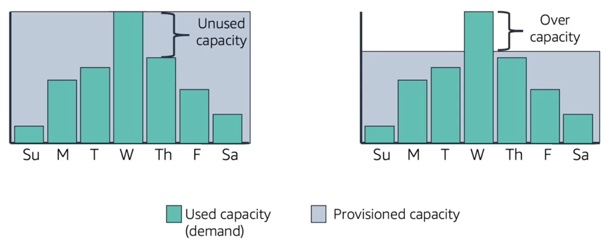
</p>

Scaling is the ability to increase or decrease the compute capacity of your application. To understand why automatic scaling is important, consider this above example of a workload that has varying requirements throughout the week. You provision capacity to meet your highest demand which occurs on Wednesday. If you provision capacity this way then you're running resources will be under utilized most days of the week. With this option, your costs are not optimized. Another option is to allocate less capacity to reduce costs. However, in this situation you are under capacity on certain days. Automatic capacity scaling is necessary to support the fluctuating demands for service. Without scaling, your application could underperform or potentially even become unavailable to your users. 

<p style="text-align: center">
  
</p>

### Amazon EC2 Auto Scaling

- Helps you maintain application availability
- Enables you to automatically add or remove EC2 instances according to conditions that you define
- Detects impaired EC2 instances according to conditions you define
- Provides several scaling options 
    - Manual
    - Scheduled
    - Dynamic
    - On-Demand
    - Predictive

In the cloud, computing power is a programmatic resource. This means you can have a flexible approach to scaling. Amazon EC2 Auto Scaling is an AWS service that helps you maintain application availability and enables you to automatically add or remove EC2 instances according to conditions that you define. You can use the Fleet Management features of EC2 Auto Scaling to maintain the health and availability of your fleet. Amazon EC2 Auto Scaling provides several ways to adjust scaling to best meet the needs of your application. You can add or remove EC2 instances manually, on a schedule, in response to changing demand, or in a combination with AWS Auto Scaling for Predictive Scaling. Dynamic Scaling and Predictive Scaling can be used together to scale even faster. 

<p style="text-align: center">
  
</p>

Automatic Scaling is useful for predictable workloads. For example, the weekly traffic of the retail company, Amazon.com.

<p style="text-align: center">
  
</p>

Automatic Scaling is also useful for dynamic, on-demand scaling. [Amazon.com](https://www.amazon.com/) experiences a seasonal peak in traffic at the end of November on Black Friday and Cyber Monday which are days when US retailers hold major sales. If Amazon provision servers using fixed capacity to accommadate the highest use, 76% of the resources would be idle the most of the year.   

<p style="text-align: center">
  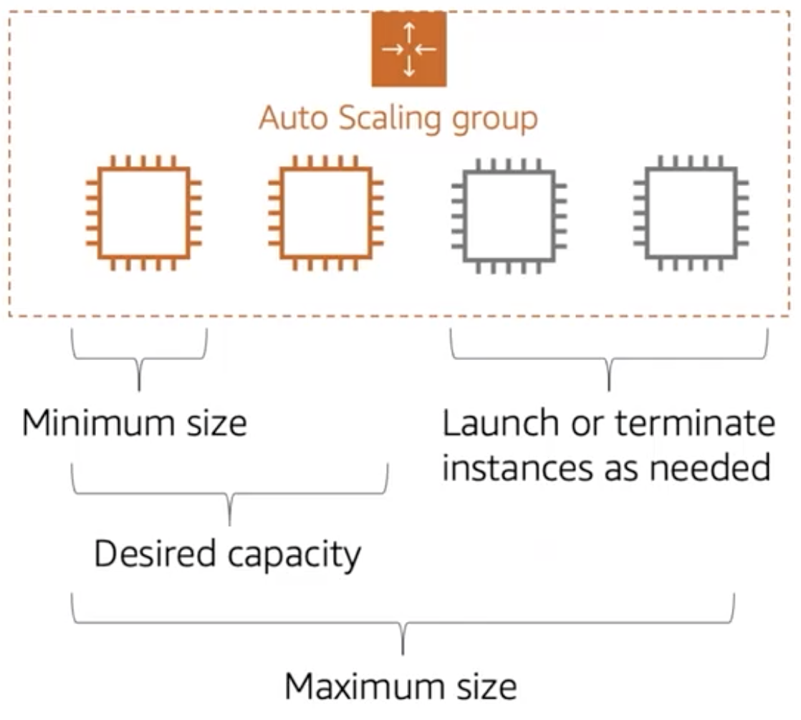
</p>

[An Auto Scaling Group](https://docs.aws.amazon.com/autoscaling/ec2/userguide/auto-scaling-groups.html) is a collection of EC2 instances that are treated as a logical grouping for the purposes of automatic scaling and management. The size of the Auto Scaling Group depends on the number of instances you configure as the desired capacity. You can adjust its size to meet the demand either manually or by using automatic scaling. You can specify the minium number of instances in each Auto Scaling Group and Amazon EC2 Auto Scaling will prevent your group from going below that size. You can specify the maximum number instances in each Auto Scaling group and Amazon EC2 Auto Scaling will prevent your group from going above this limit. If you specify the desired capacity, either when you create the group or anytime afterwards, Amazon EC2 Auto Scaling will adjust the size of your group so it has the specified number of instances. If you specify auto scaling properties, then Amazon EC2 Auto Scaling can launch or terminate instances when you have the demand or the application increases or decreases. For example, the diagram above this Auto Scaling group has a minimum size of one instance, a desired capacity of two instances, and a maximum size of four instances. The scaling policy you define adjusts the number of instances within your minimum and maximum number of instances based on the criteria that you specify.   

<p style="text-align: center">
  
</p>

With Amazon EC2 Auto Scaling, launching instances is referred to as scaling out and terminating instances refers to scaling in. 

<p style="text-align: center">
  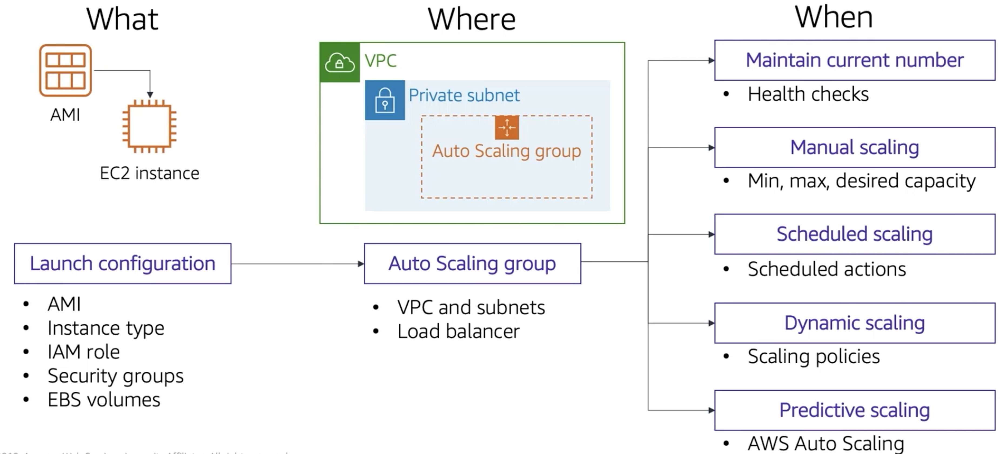
</p>

To launch EC2 instances, an Auto Scaling group uses a launch configuration which is an instance configuration template. When you create a launch configuration, you specify what information instances will use when scaling. The information you specify includes the ID of the AMI, the instance type, IAM role, one or more security groups, and any EBS volumes. Next, you specify where you want the scale. You define the minimum and maximum number of instances and desired capacity of your Auto Scaling group. Then you launch it into a subnet within a VPC. Amazon EC2 Auto Scaling, integrates with Elastic Load Balancing to enable you to attach one or more load balancers to an existing Auto Scaling group. After you attach the load balancer, it automatically registers the instances in a group and distributes incoming traffic across those instances. Finally, you specify when you want to scale the event. You may have other options to consider when scaling. You can configure your Auto Scaling group to maintain a specified number of running instances at all times. You may wan to maintain the current level of instances and Amazon EC2 Auto Scaling performs a periodic health check on running instances in an Auto Scaling group. When Amazon EC2 Auto Scaling finds and unhealthy instance, it terminates it and that instance is replaced with a new one. If you choose manual scaling, you specify only the change in the maximum and minimum or desired capacity of your Auto Scaling group. With scheduled scaling, scaling actions are performed automatically as a function of date and time. This is useful for predictable workloads when you know exactly when to increase or decrease the number of instances in your group over a day, week, or month. You can configure dynamic on-demand scaling as a more advanced way to scale your resources where you define parameters that control the scaling process using scaling policies. Scaling events for on-demand scaling can use Amazon CloudWatch to check for CPU utilization and only scale when your predefined threshold for CPU utilization is breached. This option is useful for scaling in response to changing conditions when you don't know when these conditions will change. Finally, you can use Amazon EC2 Auto Scalling with AWS Scaling to implement predictive scaling where you capacity scales on predicted demand. Predicted scaling uses data that is collected from your actual EC2 usage and data is further informed by billions of data points that are drawn from our own observations. AWS then uses well-trained machine learning models to predict your expected traffic and EC2 usage including daily and weekly patterns. This model needs at least a day of historical data to start making predictions and is reevaluated every 24 hours to create a forecast for the next 48 hours. The predication process produces a scaling plan that can drive one or more groups automatically for scaling EC2 instances.  

<p style="text-align: center">
  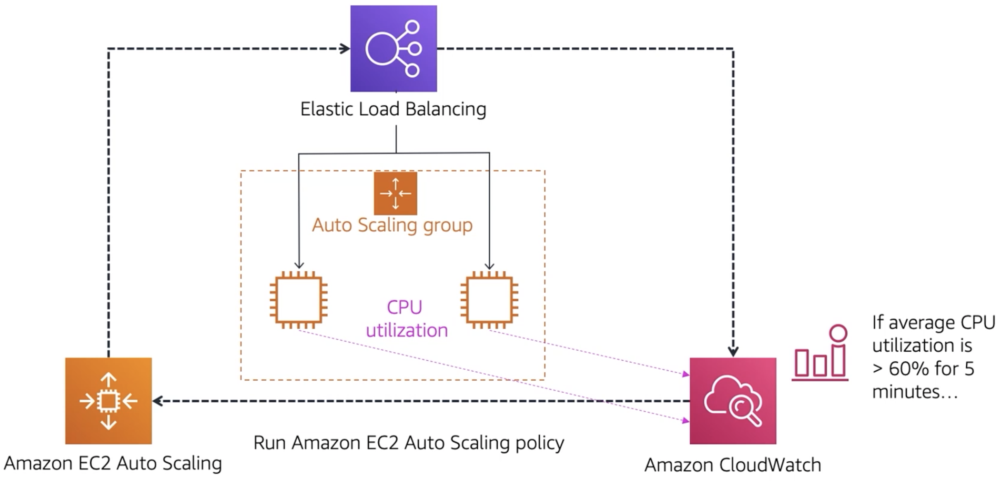
</p>

One common configuration for implementing dynamic scaling is to create a CloudWatch alarm that is based on performance information collected from your EC2 instances or load balancers. When a performance threshold is breached, a CloudWatch alarm triggers and automatic scaling event that either scales out or scales in EC2 instances in the Auto Scaling group.  To understand how it works, consider the example above. First,  you create a CloudWatch alarm to monitor CPU utilization across your fleet of EC2 instances and run automatic scaling policies if the average CPU utilization across the entire fleet goes above 60% for more than five minutes. Next, Amazon EC2 Auto Scaling adds a new EC2 instance into your Auto Scaling group based on the launch configuration you have created. After the new instances is added, Amazon EC2 Auto Scaling makes a call to the Elastic Load Balancer to register the new EC2 instance in that Auto Scaling group. Finally, ELB performs the required health checks and starts distributing traffic to that instance. ELB then routes traffic between instances and feeds metrics to Amazon CloudWatch.

So far you've learned about:
- scaling EC2 instances with Amazon EC2 Auto Scaling
- use Amazon EC2 Auto Scaling with AWS Scaling to perform predictive scaling

AWS Scaling is a separate service that monitors your applications. It automatically adjusts capacity to maintain steady predictable performance at the lowest possible cost. The service provides a simple, powerful user interface that enables you to build up scaling plans for resources such as Amazon EC2 instances, spot fleets, Amazon ECS, Amazon DynamoDB tables and indexes, and Amazon Aurora replicas.  If you're already using Amazon EC2 Auto Scaling to dynamically scale your EC2 instances, you can now use it with AWS Auto Scaling to scale additional resources for other AWS services. 

```c-lms
topic: Summary of Autoscaling and Monitoring
```

## Summary of Autoscaling and Monitoring

In summary, you learned how to:
- Indicate how to distribute traffic Across Amazon Elastic Compute Cloud (EC2) instances using Elastic Load Balancing
- Identify how Amazon CloudWatch enables you to monitor AWS resources and applications in real-time.
- Explain how Amazon EC2 Auto Scaling launches and releases servers in response to workload changes.
- Peform scaling and load balancing tasks to improve an architecture.

## Review and Practice <a class="anchor" id="DS107L5.15_quiz"></a>

Below you will find a quiz to review the recently covered material. Quizzes are _not_ graded.

```c-lms
start-activity: DS107L5.15 Autoscaling and Monitoring Quiz
```

```c-lms
topic: Lab 6 - Scale & Load Balance your Architecture
```
## Lab 6 - Scale & Load Balance your Architecture

Complete [Lab 6](https://vimeo.com/760089019) on AWS Academy, then complete Exam 5 on the LMS

<!--
```python
#https://vimeo.com/760089019
from IPython.display import VimeoVideo
## Tutorial Video Name:  Lab 6 - Scale & Load Balance your Architecture
VimeoVideo('760089019', width=720, height=480)
```
-->


<div style="padding:56.66% 0 0 0;position:relative;"><iframe src="https://player.vimeo.com/video/760089019?h=811dc65188&amp;badge=0&amp;autopause=0&amp;player_id=0&amp;app_id=58479" frameborder="0" allow="autoplay; fullscreen; picture-in-picture" allowfullscreen style="position:absolute;top:0;left:0;width:100%;height:100%;" title="Lab 6 - Scale and Load Balance Your Architecture"></iframe></div><script src="https://player.vimeo.com/api/player.js"></script>


```c-lms
topic: Key Terms
```

## Key Terms

Below is a list and short description of the important keywords learned in this lesson. Please read through and go back and review any concepts you do not fully understand. Great Work!

<table class="table table-striped">
    <tr>
        <th>Keyword</th>
        <th>Description</th>
    </tr>
    <tr>
        <td style="font-weight: bold;" nowrap>Mean time between failures (MTBF)</td>
        <td>total time in service/number of failures</td>
    </tr>
    <tr>
        <td style="font-weight: bold;" nowrap>Availability</td>
        <td>- Normal operation time / total time, A percentage of uptime (for example, 99.9 percent) over time (for example, 1 year), Number of 9s - Five 9s means 99.999 percent availability</td>
    </tr>
    <tr>
        <td style="font-weight: bold;" nowrap>High Availability</td>
        <td>System can withstand some measure of degradation while still remaining available. Downtime is minimized. Minimal human intervention is required</td>
    </tr>
    <tr>
        <td style="font-weight: bold;" nowrap>AWS Trusted Advisor  </td>
        <td>Tool that you can use to design and review your architectures on AWS. AWS Trusted Advisor looks at your entire AWS environment, and gives you recommendations in five categories.</td>
    </tr>
    <tr>
        <td style="font-weight: bold;" nowrap>Elastic Load Balancing</td>
        <td>is an AWS service that distributes incoming application or network traffice across multiple targets, such as EC2 instances, containers, IP addresses, Lambda functions, in a single or mutliple Available Zones.</td>
    </tr>
    <tr>
        <td style="font-weight: bold;" nowrap>load balancer</td>
        <td>accepts incoming traffic from clients, and routes requests to registered targets in one or more Availability Zones. You configure your load balancer to accept incoming traffic by specifying one or more listeners.</td>
    </tr>
    <tr>
        <td style="font-weight: bold;" nowrap>Amazon CloudWatch</td>
        <td>is a monitoring and observability service that is built for DevOps engineers, site reliability engineers, and IT managers. </td>
    </tr>
    <tr>
        <td style="font-weight: bold;" nowrap>Scaling</td>
        <td>is the ability to increase or decrease the compute capacity of your application.</td>
    </tr>
    <tr>
        <td style="font-weight: bold;" nowrap>Amazon EC2 Auto Scaling</td>
        <td>is an AWS service that helps you maintain application availability and enables you to automatically add or remove EC2 instances according to conditions that you define. </td>
    </tr>
    
</table>

```c-lms
topic: AWS Cloud Foundations Certification Resources
```

## AWS Cloud Foundations Certification Resources

Certification Resources
Preparation
This course will have helped you to prepare for the AWS Certified Cloud Practitioner exam. Use the resources listed below to understand what to expect and to ensure you are fully prepared before attempting the exam.

- [Read the certification overview web page](https://aws.amazon.com/certification/certified-cloud-practitioner/).
- [Download and read the exam guide](https://d1.awsstatic.com/training-and-certification/docs-cloud-practitioner/AWS_Certified_Cloud_Practitioner_Exam_Guide_v2.1.pdf).
- Read these AWS Whitepapers
    - [Overview of Amazon Web Services](https://d0.awsstatic.com/whitepapers/aws-overview.pdf)
    - [AWS Well-Architected Framework](https://d1.awsstatic.com/whitepapers/architecture/AWS_Well-Architected_Framework.pdf)
    - [How AWS Pricing Works](http://d1.awsstatic.com/whitepapers/aws_pricing_overview.pdf)
    - [Compare AWS Support Plans](https://aws.amazon.com/premiumsupport/plans/)
- Answers to common questions are in the [Exam FAQs](https://aws.amazon.com/certification/faqs/)
- [Attempt some example questions](https://d1.awsstatic.com/training-and-certification/docs-cloud-practitioner/AWS-Certified-Cloud-Practioner_Sample_Questions_v1.1_FINAL.PDF).
- [Take a practice exam in AWS Skill builder.](https://explore.skillbuilder.aws/learn)
- Certification Exam
    - [Register for your Certification Exam](https://www.aws.training/certification)
    - Answers to common certification questions are in the [Certification FAQs](https://www.aws.training/Support?src=training-faqs#certification)


```c-lms
topic: Lesson 5 Exam
```

```c-lms
start-activity: DS107L5.19 Lesson 5 Exam 
```