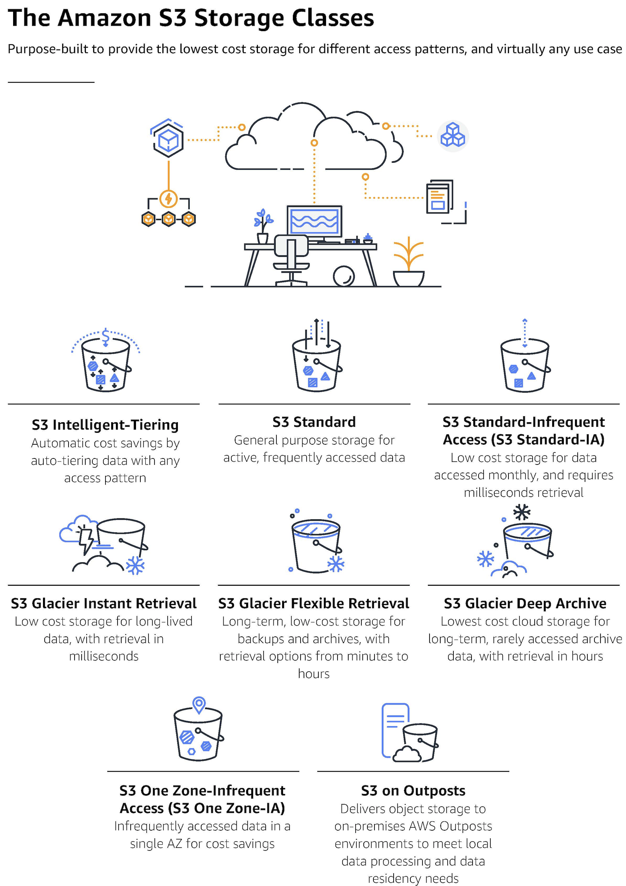
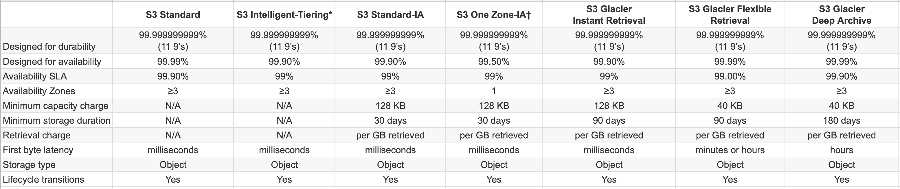
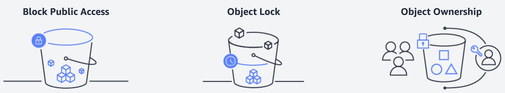
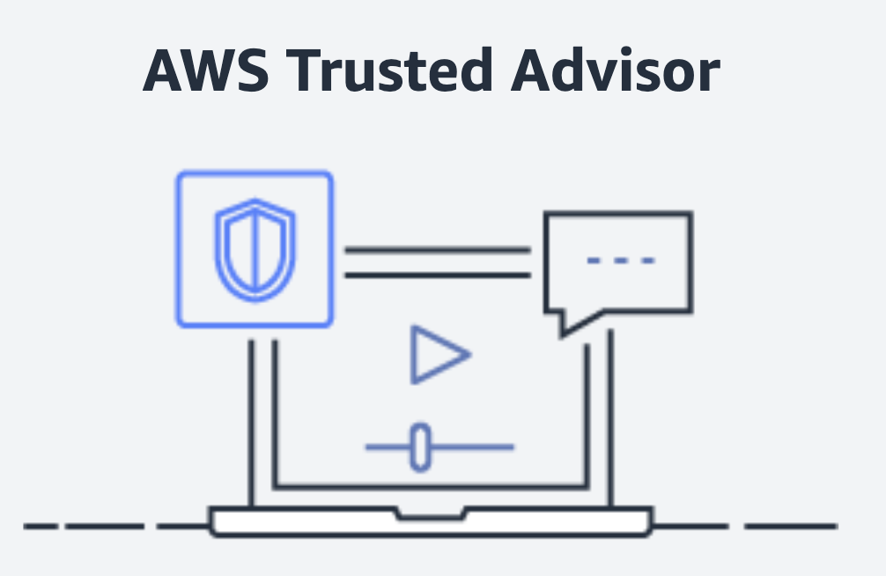
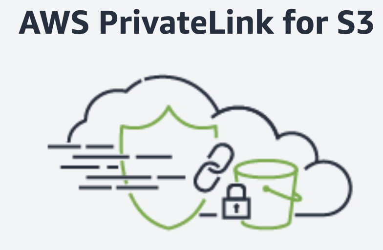
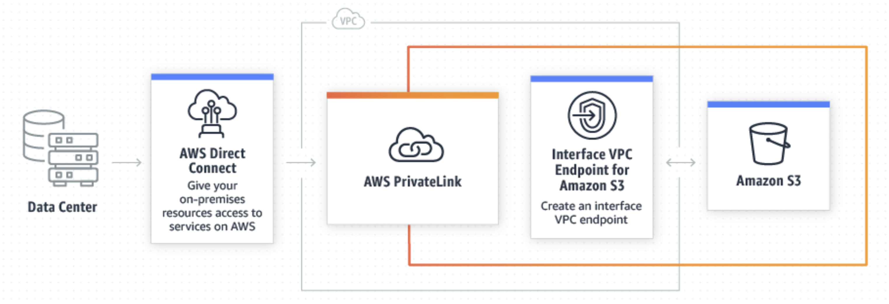
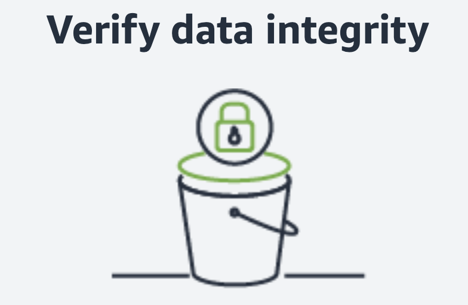

```c-lms
activity-name: AWS Big Data Analytics S3 Athena
topic: Overview of this Module
```

# AWS Big Data Analytics S3 & Athena


## Overview of this Module

In this lesson we will be learning about Amazon Simple Storage Service (Amazon S3) and Amazon Athena. Amazon S3 is an object storage service offering scalability, data availability, security, and performance. Amazon Athena is an interactive query service that makes it easy to analyze data in Amazon S3 using standard SQL.

```c-lms
topic: Amazon Simple Storage Service (Amazon S3)
```

## Amazon Simple Storage Service (Amazon S3)

__Amazon Simple Storage Service (Amazon S3)__ is an object storage service offering industry-leading scalability, data availability, security, and performance. Customers of all sizes and industries can store and protect any amount of data for virtually any use case, such as data lakes, cloud-native applications, and mobile apps. With cost-effective storage classes and easy-to-use management features, you can optimize costs, organize data, and configure fine-tuned access controls to meet specific business, organizational, and compliance requirements.

<p style="text-align: center">
  
</p>

[Amazon S3 Docs](https://docs.aws.amazon.com/s3/index.html?id=docs_gateway#lang/en_us)


```c-lms
topic: Amazon S3 Features
```

## Amazon S3 Features

Amazon S3 has various features you can use to organize and manage your data in ways that support specific use cases, enable cost efficiencies, enforce security, and meet compliance requirements. Data is stored as objects within resources called “buckets”, and a single object can be up to 5 terabytes in size. S3 features include capabilities to append metadata tags to objects, move and store data across the S3 Storage Classes, configure and enforce data access controls, secure data against unauthorized users, run big data analytics, monitor data at the object and bucket levels, and view storage usage and activity trends across your organization. Objects can be accessed through S3 Access Points or directly through the bucket hostname.

## Storage management and monitoring
Amazon S3’s flat, non-hierarchical structure and various management features are helping customers of all sizes and industries organize their data in ways that are valuable to their businesses and teams. All objects are stored in S3 buckets and can be organized with shared names called prefixes. You can also append up to 10 key-value pairs called __S3 object tags__ to each object, which can be created, updated, and deleted throughout an object’s lifecycle. To keep track of objects and their respective tags, buckets, and prefixes, you can use an __S3 Inventory report__ that lists your stored objects within an S3 bucket or with a specific prefix, and their respective metadata and encryption status. S3 Inventory can be configured to generate reports on a daily or a weekly basis.

### Storage management
With S3 bucket names, prefixes, object tags, and S3 Inventory, you have a range of ways to categorize and report on your data, and subsequently can configure other S3 features to take action. Whether you store thousands of objects or a billion, S3 Batch Operations makes it simple to manage your data in Amazon S3 at any scale. With S3 Batch Operations, you can copy objects between buckets, replace object tag sets, modify access controls, and restore archived objects from S3 Glacier Flexible Retrieval and S3 Glacier Deep Archive storage classes, with a single S3 API request or a few clicks in the S3 console. You can also use [S3 Batch Operations](https://aws.amazon.com/s3/features/batch-operations/) to run AWS Lambda functions across your objects to execute custom business logic, such as processing data or transcoding image files. To get started, specify a list of target objects by using an S3 Inventory report or by providing a custom list, and then select the desired operation from a pre-populated menu. When an S3 Batch Operation request is done, you'll receive a notification and a completion report of all changes made. Learn more about [S3 Batch Operations by watching the video tutorials](https://aws.amazon.com/s3/s3batchoperations-videos/). 

Amazon S3 also supports features that help maintain data version control, prevent accidental deletions, and replicate data to the same or different AWS Region. With __S3 Versioning__, you can easily preserve, retrieve, and restore every version of an object stored in Amazon S3, which allows you to recover from unintended user actions and application failures. To prevent accidental deletions, enable __Multi-Factor Authentication (MFA) Delete__ on an S3 bucket. If you try to delete an object stored in an MFA Delete-enabled bucket, it will require two forms of authentication: your AWS account credentials and the concatenation of a valid serial number, a space, and the six-digit code displayed on an approved authentication device, like a hardware key fob or a Universal 2nd Factor (U2F) security key.

With [S3 Replication](https://aws.amazon.com/s3/features/replication/), you can replicate objects (and their respective metadata and object tags) to one or more destination buckets into the same or different AWS Regions for reduced latency, compliance, security, disaster recovery, and other use cases. You can configure [S3 Cross-Region Replication (CRR)](https://aws.amazon.com/s3/features/replication/#Amazon_S3_Cross-Region_Replication_.28CRR.29) to replicate objects from a source S3 bucket to one or more destination buckets in different AWS Regions. [S3 Same-Region Replication (SRR)](https://aws.amazon.com/s3/features/replication/#Amazon_S3_Same-Region_Replication_.28SRR.29) replicates objects between buckets in the same AWS Region. While live replication like CRR and SRR automatically replicates newly uploaded objects as they are written to your bucket, S3 Batch Replication allows you to replicate existing objects. You can use [S3 Batch Replication](https://docs.aws.amazon.com/AmazonS3/latest/userguide/s3-batch-replication-batch.html) to backfill a newly created bucket with existing objects, retry objects that were previously unable to replicate, migrate data across accounts, or add new buckets to your data lake. [Amazon S3 Replication Time Control (S3 RTC)](https://aws.amazon.com/s3/features/replication/#Amazon_Replication_Time_Control) helps you meet compliance requirements for data replication by providing an SLA and visibility into replication times.

Amazon S3 Multi-Region Access Points accelerate performance by up to 60% when accessing data sets that are replicated across multiple AWS Regions. Based on AWS Global Accelerator, S3 Multi-Region Access Points consider factors like network congestion and the location of the requesting application to dynamically route your requests over the AWS network to the lowest latency copy of your data. S3 Multi-Region Access Points provide a single global endpoint that you can use to access a replicated data set, spanning multiple buckets in S3. This allows you to build multi-region applications with the same simple architecture that you would use in a single region, and then to run those applications anywhere in the world.

You can also enforce write-once-read-many (WORM) policies with __S3 Object Lock__. This S3 management feature blocks object version deletion during a customer-defined retention period so that you can enforce retention policies as an added layer of data protection or to meet compliance obligations. You can migrate workloads from existing WORM systems into Amazon S3, and configure S3 Object Lock at the object- and bucket-levels to prevent object version deletions prior to a pre-defined Retain Until Date or Legal Hold Date. Objects with S3 Object Lock retain WORM protection, even if they are moved to different storage classes with an S3 Lifecycle policy. To track what objects have S3 Object Lock, you can refer to an S3 Inventory report that includes the WORM status of objects. S3 Object Lock can be configured in one of two modes. When deployed in Governance mode, AWS accounts with specific IAM permissions are able to remove S3 Object Lock from objects. If you require stronger immutability in order to comply with regulations, you can use Compliance Mode. In Compliance Mode, the protection cannot be removed by any user, including the root account.

### Storage monitoring
In addition to these management capabilities, use Amazon S3 features and other AWS services to monitor and control your S3 resources. Apply tags to S3 buckets to allocate costs across multiple business dimensions (such as cost centers, application names, or owners), then use __AWS Cost Allocation Reports__ to view the usage and costs aggregated by the bucket tags. You can also use __Amazon CloudWatch__ to track the operational health of your AWS resources and configure billing alerts for estimated charges that reach a user-defined threshold. Use __AWS CloudTrail__ to track and report on bucket- and object-level activities, and configure __S3 Event Notifications__ to trigger workflows and alerts or invoke AWS Lambda when a specific change is made to your S3 resources. S3 Event Notifications automatically transcodes media files as they’re uploaded to S3, processes data files as they become available, and synchronizes objects with other data stores. Additionally, you can verify integrity of data transferred to and from Amazon S3, and can access the checksum information at any time using the GetObjectAttributes S3 API or an S3 Inventory report. You can choose from four supported checksum algorithms (SHA-1, SHA-256, CRC32, or CRC32C) for data integrity checking on your upload and download requests depending on your application needs.

Learn more about [S3 storage management](https://docs.aws.amazon.com/AmazonS3/latest/user-guide/storage-management.html) and [monitoring](https://docs.aws.amazon.com/AmazonS3/latest/dev/monitoring-overview.html) 


## Storage analytics and insights

### S3 Storage Lens
[S3 Storage Lens](https://aws.amazon.com/s3/storage-analytics-insights/) delivers organization-wide visibility into object storage usage, activity trends, and makes actionable recommendations to improve cost-efficiency and apply data protection best practices. S3 Storage Lens is the first cloud storage analytics solution to provide a single view of object storage usage and activity across hundreds, or even thousands, of accounts in an organization, with drill-downs to generate insights at the account, bucket, or even prefix level. Drawing from more than 14 years of experience helping customers optimize their storage, S3 Storage Lens analyzes organization-wide metrics to deliver contextual recommendations to find ways to reduce storage costs and apply best practices on data protection. To learn more, visit the [storage analytics and insights page](https://aws.amazon.com/s3/storage-analytics-insights/).

### S3 Storage Class Analysis
Amazon S3 Storage Class Analysis analyzes storage access patterns to help you decide when to transition the right data to the right storage class. This Amazon S3 feature observes data access patterns to help you determine when to transition less frequently accessed storage to a lower-cost storage class. You can use the results to help improve your S3 Lifecycle policies. You can configure storage class analysis to analyze all the objects in a bucket. Or, you can configure filters to group objects together for analysis by common prefix, by object tags, or by both prefix and tags. To learn more, visit the [storage analytics and insights page](https://aws.amazon.com/s3/storage-analytics-insights/).

## Storage classes
With Amazon S3, you can store data across a range of different S3 storage classes purpose-built for specific use cases and access patterns: __S3 Intelligent-Tiering, S3 Standard, S3 Standard-Infrequent Access (S3 Standard-IA), S3 One Zone-Infrequent Access (S3 One Zone-IA), S3 Glacier Instant Retrieval, S3 Glacier Flexible Retrieval, S3 Glacier Deep Archive, and S3 Outposts__.

Every S3 storage class supports a specific data access level at corresponding costs or geographic location. 

For data with changing, unknown, or unpredictable access patterns, such as data lakes, analytics, or new applications, use __S3 Intelligent-Tiering__, which automatically optimizes your storage costs. S3 Intelligent-Tiering automatically moves your data between three low latency access tiers optimized for frequent, infrequent, and rare access. When subsets of objects become archived over time, you can activate the archive access tier designed for asynchronous access.
For more predictable access patterns, you can store mission-critical production data in S3 Standard for frequent access, save costs by storing infrequently accessed data in S3 Standard-IA or S3 One Zone-IA, and archive data at the lowest costs in the archival storage classes — S3 Glacier Instant Retrieval, S3 Glacier Flexible Retrieval, and S3 Glacier Deep Archive. You can use __S3 Storage Class Analysis__ to monitor access patterns across objects to discover data that should be moved to lower-cost storage classes. Then you can use this information to configure an __S3 Lifecycle policy__ that makes the data transfer. S3 Lifecycle policies can also be used to expire objects at the end of their lifecycles. 

If you have data residency requirements that can’t be met by an existing AWS Region, you can use the S3 Outposts storage class to store your S3 data on premises using __S3 on Outposts__.

Learn more by visiting [S3 Storage Classes](https://aws.amazon.com/s3/storage-classes/), [S3 Storage Class Analysis](https://docs.aws.amazon.com/AmazonS3/latest/dev/analytics-storage-class.html), and [S3 Lifecycle management](https://docs.aws.amazon.com/AmazonS3/latest/dev/object-lifecycle-mgmt.html).

## Access management and security
### Access management
To protect your data in Amazon S3, by default, users only have access to the S3 resources they create. You can grant access to other users by using one or a combination of the following access management features: __AWS Identity and Access Management (IAM)__ to create users and manage their respective access; __Access Control Lists (ACLs)__ to make individual objects accessible to authorized users; __bucket policies__ to configure permissions for all objects within a single S3 bucket; [S3 Access Points](https://aws.amazon.com/s3/features/access-points/) to simplify managing data access to shared data sets by creating access points with names and permissions specific to each application or sets of applications; and __Query String Authentication__ to grant time-limited access to others with temporary URLs. Amazon S3 also supports Audit Logs that list the requests made against your S3 resources for complete visibility into who is accessing what data.

### Security
Amazon S3 offers flexible security features to block unauthorized users from accessing your data. Use VPC endpoints to connect to S3 resources from your __Amazon Virtual Private Cloud (Amazon VPC)__ and from on-premises. Amazon S3 supports both server-side encryption (with three key management options) and client-side encryption for data uploads. Use S3 Inventory to check the encryption status of your S3 objects (see [storage management](https://aws.amazon.com/s3/features/#Storage_management_and_monitoring) for more information on S3 Inventory).

[S3 Block Public Access](https://aws.amazon.com/s3/features/block-public-access/) is a set of security controls that ensures S3 buckets and objects do not have public access. With a few clicks in the Amazon S3 Management Console, you can apply the S3 Block Public Access settings to all buckets within your AWS account or to specific S3 buckets. Once the settings are applied to an AWS account, any existing or new buckets and objects associated with that account inherit the settings that prevent public access. S3 Block Public Access settings override other S3 access permissions, making it easy for the account administrator to enforce a “no public access” policy regardless of how an object is added, how a bucket is created, or if there are existing access permissions. S3 Block Public Access controls are auditable, provide a further layer of control, and use AWS Trusted Advisor bucket permission checks, AWS CloudTrail logs, and Amazon CloudWatch alarms. You should enable Block Public Access for all accounts and buckets that you do not want publicly accessible.

[S3 Object Ownership](https://docs.aws.amazon.com/AmazonS3/latest/userguide/about-object-ownership.html) is a feature that disables Access Control Lists (ACLs), changing ownership for all objects to the bucket owner and simplifying access management for data stored in S3. When you configure the S3 Object Ownership Bucket owner enforced setting, ACLs will no longer affect permissions for your bucket and the objects in it. All access control will be defined using resource-based policies, user policies, or some combination of these.
Using S3 Access Points that are restricted to a Virtual Private Cloud (VPC), you can easily firewall your S3 data within your private network. Additionally, [you can use AWS Service Control Policies to require that any new S3 Access Point in your organization is restricted to VPC-only access.

[IAM Access Analyzer](https://aws.amazon.com/iam/features/analyze-access/) for S3 is a feature that helps you simplify permissions management as you set, verify, and refine policies for your S3 buckets and access points. Access Analyzer for S3 monitors your existing bucket access policies to verify that they provide only the required access to your S3 resources. Access Analyzer for S3 evaluates your bucket access policies so that you can swiftly remediate any buckets with access that isn't required. When reviewing results that show potentially shared access to a bucket, you can Block Public Access to the bucket with a single click in the S3 console. For auditing purposes, you can download Access Analyzer for S3 findings as a CSV report. Additionally, the S3 console reports security warnings, errors, and suggestions from IAM Access Analyzer as you author your S3 policies. The console automatically runs more than 100 policy checks to validate your policies. These checks save you time, guide you to resolve errors, and help you apply security best practices.

IAM makes it easier for you to analyze access and reduce permissions to achieve least privilege by providing the timestamp when a user or role last used S3 and the associated actions. Use this “last accessed” information to analyze S3 access, identify unused permissions, and remove them confidently. To learn more see [Refining Permissions Using Last Accessed Data](https://docs.aws.amazon.com/IAM/latest/UserGuide/access_policies_access-advisor.html).

You can use [Amazon Macie](https://aws.amazon.com/macie/) to discover and protect sensitive data stored in Amazon S3. Macie automatically gathers a complete S3 inventory and continually evaluates every bucket to alert on any publicly accessible buckets, unencrypted buckets, or buckets shared or replicated with AWS accounts outside of your organization. Then, Macie applies machine learning and pattern matching techniques to the buckets you select to identify and alert you to sensitive data, such as personally identifiable information (PII). As security findings are generated, they are pushed out to the Amazon CloudWatch Events, making it easy to integrate with existing workflow systems and to trigger automated remediation with services like AWS Step Functions to take action like closing a public bucket or adding resource tags.

[AWS PrivateLink](https://docs.aws.amazon.com/AmazonS3/latest/dev/privatelink-interface-endpoints.html) for S3 provides private connectivity between Amazon S3 and on-premises. You can provision interface VPC endpoints for S3 in your VPC to connect your on-premises applications directly with S3 over AWS Direct Connect or AWS VPN. Requests to interface VPC endpoints for S3 are automatically routed to S3 over the Amazon network. You can set security groups and configure VPC endpoint policies for your interface VPC endpoints for additional access controls.

Learn more by visiting [S3 access management and security](https://docs.aws.amazon.com/AmazonS3/latest/dev/s3-access-control.html) and [protecting data in Amazon S3](https://docs.aws.amazon.com/AmazonS3/latest/dev/DataDurability.html).

## Data processing
### S3 Object Lambda
With S3 Object Lambda you can add your own code to S3 GET requests to modify and process data as it is returned to an application. For the first time, you can use custom code to modify the data returned by standard S3 GET requests to filter rows, dynamically resize images, redact confidential data, and much more. Powered by AWS Lambda functions, your code runs on infrastructure that is fully managed by AWS, eliminating the need to create and store derivative copies of your data or to run expensive proxies, all with no changes required to applications.

S3 Object Lambda uses AWS Lambda functions to automatically process the output of a standard S3 GET request. AWS Lambda is a serverless compute service that runs customer-defined code without requiring management of underlying compute resources. With just a few clicks in the AWS Management Console, you can configure a Lambda function and attach it to a S3 Object Lambda Access Point. From that point forward, S3 will automatically call your Lambda function to process any data retrieved through the S3 Object Lambda Access Point, returning a transformed result back to the application. You can author and execute your own custom Lambda functions, tailoring S3 Object Lambda’s data transformation to your specific use case.

Learn more by visiting the [S3 Object Lambda feature page](https://aws.amazon.com/s3/features/object-lambda/).

### Query in place
Amazon S3 has a built-in feature and complementary services that query data without needing to copy and load it into a separate analytics platform or data warehouse. This means you can run big data analytics directly on your data stored in Amazon S3. S3 Select is an S3 feature designed to increase query performance by up to 400%, and reduce querying costs as much as 80%. It works by retrieving a subset of an object’s data (using simple SQL expressions) instead of the entire object, which can be up to 5 terabytes in size.

Amazon S3 is also compatible with AWS analytics services Amazon Athena and Amazon Redshift Spectrum. Amazon Athena queries your data in Amazon S3 without needing to extract and load it into a separate service or platform. It uses standard SQL expressions to analyze your data, delivers results within seconds, and is commonly used for ad hoc data discovery. Amazon Redshift Spectrum also runs SQL queries directly against data at rest in Amazon S3, and is more appropriate for complex queries and large data sets (up to exabytes). Because Amazon Athena and Amazon Redshift share a common data catalog and data formats, you can use them both against the same data sets in Amazon S3.

Learn more by visiting [building big data storage solutions](https://docs.aws.amazon.com/aws-technical-content/latest/building-data-lakes/in-place-querying.html) and [S3 Select](https://docs.aws.amazon.com/AmazonS3/latest/dev/selecting-content-from-objects.html).

## Data transfer
AWS provides a portfolio of data transfer services to provide the right solution for any data migration project. The level of connectivity is a major factor in data migration, and AWS has offerings that can address your hybrid cloud storage, online data transfer, and offline data transfer needs.

Hybrid cloud storage: [AWS Storage Gateway](https://aws.amazon.com/storagegateway/) is a hybrid cloud storage service that lets you seamlessly connect and extend your on-premises applications to AWS Storage. Customers use Storage Gateway to seamlessly replace tape libraries with cloud storage, provide cloud storage-backed file shares, or create a low-latency cache to access data in AWS for on-premises applications. 

Online data transfer: [AWS DataSync](https://aws.amazon.com/datasync/) makes it easy and efficient to transfer hundreds of terabytes and millions of files into Amazon S3, up to 10x faster than open-source tools. DataSync automatically handles or eliminates many manual tasks, including scripting copy jobs, scheduling and monitoring transfers, validating data, and optimizing network utilization. Additionally, you can use AWS DataSync to copy objects between a bucket on S3 on Outposts and a bucket stored in an AWS Region. The [AWS Transfer Family](https://aws.amazon.com/aws-transfer-family/) provides fully managed, simple, and seamless file transfer to Amazon S3 using SFTP, FTPS, and FTP. [Amazon S3 Transfer Acceleration](https://aws.amazon.com/s3/transfer-acceleration/) enables fast transfers of files over long distances between your client and your Amazon S3 bucket.

Offline data transfer: The [AWS Snow Family](https://aws.amazon.com/snow/) is purpose-built for use in edge locations where network capacity is constrained or nonexistent and provides storage and computing capabilities in harsh environments. The [AWS Snowball](https://aws.amazon.com/snowball/) service uses ruggedized, portable storage and edge computing devices for data collection, processing, and migration. Customers can ship the physical Snowball device for offline data migration to AWS. [AWS Snowmobile](https://aws.amazon.com/snowmobile/) is an exabyte-scale data transfer service used to move massive volumes of data to the cloud, including video libraries, image repositories, or even a complete data center migration.

Customers can also work with third-party providers from the [AWS Partner Network (APN)](https://aws.amazon.com/partners/) to deploy hybrid storage architectures, integrate Amazon S3 into existing applications and workflows, and transfer data to and from the AWS Cloud.

Learn more by visiting [AWS cloud data migration services](https://aws.amazon.com/cloud-data-migration/) , [AWS Storage Gateway](https://aws.amazon.com/storagegateway/) , [AWS DataSync](https://aws.amazon.com/datasync/)) ,  [AWS Transfer Family](https://aws.amazon.com/aws-transfer-family/) , [Amazon S3 Transfer Acceleration ](https://aws.amazon.com/s3/transfer-acceleration/) , [ AWS Snow Family ](https://aws.amazon.com/snow/).

## Performance
Amazon S3 provides industry leading performance for cloud object storage. Amazon S3 supports parallel requests, which means you can scale your S3 performance by the factor of your compute cluster, without making any customizations to your application. Performance scales per prefix, so you can use as many prefixes as you need in parallel to achieve the required throughput. There are no limits to the number of prefixes. Amazon S3 performance supports at least 3,500 requests per second to add data and 5,500 requests per second to retrieve data. Each S3 prefix can support these request rates, making it simple to increase performance significantly.

To achieve this S3 request rate performance you do not need to randomize object prefixes to achieve faster performance. That means you can use logical or sequential naming patterns in S3 object naming without any performance implications. Refer to the [Performance Guidelines for Amazon S3](https://docs.aws.amazon.com/AmazonS3/latest/dev/optimizing-performance-guidelines.html) and [Performance Design Patterns for Amazon S3](https://docs.aws.amazon.com/AmazonS3/latest/dev/optimizing-performance-design-patterns.html) for the most current information about performance optimization for Amazon S3.

## Consistency
Amazon S3 delivers strong read-after-write consistency automatically for all applications, without changes to performance or availability, without sacrificing regional isolation for applications, and at no additional cost. With strong consistency, S3 simplifies the migration of on-premises analytics workloads by removing the need to make changes to applications, and reduces costs by removing the need for extra infrastructure to provide strong consistency.

Any request for S3 storage is strongly consistent. After a successful write of a new object or an overwrite of an existing object, any subsequent read request immediately receives the latest version of the object. S3 also provides strong consistency for list operations, so after a write, you can immediately perform a listing of the objects in a bucket with any changes reflected.

Learn more about S3 [Strong Consistency](https://aws.amazon.com/s3/consistency/)

```c-lms
topic: Amazon S3 Storage Classes
```

## Amazon S3 Storage Classes


<p style="text-align: center">
  
</p>

[View Amazon S3 storage classes overview infographic](https://aws.amazon.com/s3/storage-classes-infographic/)


__Amazon S3__ offers a range of storage classes that you can choose from based on the data access, resiliency, and cost requirements of your workloads. S3 storage classes are purpose-built to provide the lowest cost storage for different access patterns. S3 storage classes are ideal for virtually any use case, including those with demanding performance needs, data residency requirements, unknown or changing access patterns, or archival storage.

The S3 storage classes include S3 Intelligent-Tiering for automatic cost savings for data with unknown or changing access patterns, S3 Standard for frequently accessed data, S3 Standard-Infrequent Access (S3 Standard-IA) and S3 One Zone-Infrequent Access (S3 One Zone-IA) for less frequently accessed data, S3 Glacier Instant Retrieval for archive data that needs immediate access, S3 Glacier Flexible Retrieval (formerly S3 Glacier) for rarely accessed long-term data that does not require immediate access, and Amazon S3 Glacier Deep Archive (S3 Glacier Deep Archive) for long-term archive and digital preservation with retrieval in hours at the lowest cost storage in the cloud. If you have data residency requirements that can’t be met by an existing AWS Region, you can use the S3 Outposts storage class to store your S3 data on premises. Amazon S3 also offers capabilities to manage your data throughout its lifecycle. Once an S3 Lifecycle policy is set, your data will automatically transfer to a different storage class without any changes to your application.

## General purpose
### Amazon S3 Standard (S3 Standard)
__S3 Standard__ offers high durability, availability, and performance object storage for frequently accessed data. Because it delivers low latency and high throughput, S3 Standard is appropriate for a wide variety of use cases, including cloud applications, dynamic websites, content distribution, mobile and gaming applications, and big data analytics. S3 Storage Classes can be configured at the object level and a single bucket can contain objects stored across S3 Standard, S3 Intelligent-Tiering, S3 Standard-IA, and S3 One Zone-IA. You can also use S3 Lifecycle policies to automatically transition objects between storage classes without any application changes.

#### Key Features:

- Low latency and high throughput performance
- Designed for durability of 99.999999999% of objects across multiple Availability Zones
- Resilient against events that impact an entire Availability Zone
- Designed for 99.99% availability over a given year
- Backed with the Amazon S3 Service Level Agreement for availability
- Supports SSL for data in transit and encryption of data at rest
- S3 Lifecycle management for automatic migration of objects to other S3 Storage Classes  


## Unknown or changing access
### Amazon S3 Intelligent-Tiering (S3 Intelligent-Tiering)
Amazon S3 Intelligent-Tiering (S3 Intelligent-Tiering) is the first cloud storage that automatically reduces your storage costs on a granular object level by automatically moving data to the most cost-effective access tier based on access frequency, without performance impact, retrieval fees, or operational overhead. S3 Intelligent-Tiering delivers milliseconds latency and high throughput performance for frequently, infrequently, and rarely accessed data in the Frequent, Infrequent, and Archive Instant Access tiers. You can use S3 Intelligent-Tiering as the default storage class for virtually any workload, especially data lakes, data analytics, new applications, and user-generated content.

For a small monthly object monitoring and automation charge, S3 Intelligent-Tiering monitors access patterns and automatically moves objects that have not been accessed to lower-cost access tiers. S3 Intelligent-Tiering automatically stores objects in three access tiers: one tier that is optimized for frequent access, a 40% lower-cost tier that is optimized for infrequent access, and a 68% lower-cost tier optimized for rarely accessed data. S3 Intelligent-Tiering monitors access patterns and moves objects that have not been accessed for 30 consecutive days to the Infrequent Access tier and after 90 days of no access to the Archive Instant Access tier. For data that does not require immediate retrieval, you can set up S3 Intelligent-Tiering to monitor and automatically move objects that aren’t accessed for 180 days or more to the Deep Archive Access tier to realize up to 95% in storage cost savings.

There are no retrieval charges in S3 Intelligent-Tiering. If an object in the Infrequent or Archive Instant Access tier is accessed later, it’s automatically moved back to the Frequent Access tier. If the object you’re retrieving is stored in the optional Deep Archive tiers, before you can retrieve the object, you must first restore a copy using RestoreObject.  For information about restoring archived objects, see Restoring Archived Objects. No additional tiering charges apply when objects are moved between access tiers within the S3 Intelligent-Tiering storage class.

#### Key Features:

- Frequent, Infrequent, and Archive Instant Access tiers have the same low-latency and high-throughput performance of S3 Standard
- The Infrequent Access tier saves up to 40% on storage costs
- The Archive Instant Access tier saves up to 68% on storage costs
- Opt-in asynchronous archive capabilities for objects that become rarely accessed
- Deep Archive Access tier has the same performance as Glacier Deep Archive and saves up to 95% for rarely accessed objects
- Designed for durability of 99.999999999% of objects across multiple Availability Zones and for 99.9% availability over a given year
- Backed with the Amazon S3 Service Level Agreement for availability
- Small monthly monitoring and auto tiering charge
- No operational overhead, no lifecycle charges, no retrieval charges, and no minimum storage duration
- Objects smaller than 128KB can be stored in S3 Intelligent-Tiering but will always be charged at the Frequent Access tier rates, and are not - charged the monitoring and automation charge.


## Infrequent access
### Amazon S3 Standard-Infrequent Access (S3 Standard-IA)
S3 Standard-IA is for data that is accessed less frequently, but requires rapid access when needed. S3 Standard-IA offers the high durability, high throughput, and low latency of S3 Standard, with a low per GB storage price and per GB retrieval charge. This combination of low cost and high performance make S3 Standard-IA ideal for long-term storage, backups, and as a data store for disaster recovery files. S3 Storage Classes can be configured at the object level and a single bucket can contain objects stored across S3 Standard, S3 Intelligent-Tiering, S3 Standard-IA, and S3 One Zone-IA. You can also use S3 Lifecycle policies to automatically transition objects between storage classes without any application changes.

#### Key Features:

- Same low latency and high throughput performance of S3 Standard
- Designed for durability of 99.999999999% of objects across multiple Availability Zones
- Resilient against events that impact an entire Availability Zone
- Data is resilient in the event of one entire Availability Zone destruction
- Designed for 99.9% availability over a given year
- Backed with the Amazon S3 Service Level Agreement for availability
- Supports SSL for data in transit and encryption of data at rest
- S3 Lifecycle management for automatic migration of objects to other S3 Storage Classes

### Amazon S3 One Zone-Infrequent Access (S3 One Zone-IA)
S3 One Zone-IA is for data that is accessed less frequently, but requires rapid access when needed. Unlike other S3 Storage Classes which store data in a minimum of three Availability Zones (AZs), S3 One Zone-IA stores data in a single AZ and costs 20% less than S3 Standard-IA. S3 One Zone-IA is ideal for customers who want a lower-cost option for infrequently accessed data but do not require the availability and resilience of S3 Standard or S3 Standard-IA. It’s a good choice for storing secondary backup copies of on-premises data or easily re-creatable data. You can also use it as cost-effective storage for data that is replicated from another AWS Region using S3 Cross-Region Replication.

S3 One Zone-IA offers the same high durability†, high throughput, and low latency of S3 Standard, with a low per GB storage price and per GB retrieval charge. S3 Storage Classes can be configured at the object level, and a single bucket can contain objects stored across S3 Standard, S3 Intelligent-Tiering, S3 Standard-IA, and S3 One Zone-IA. You can also use S3 Lifecycle policies to automatically transition objects between storage classes without any application changes.

#### Key Features:

- Same low latency and high throughput performance of S3 Standard
- Designed for durability of 99.999999999% of objects in a single Availability Zone†
- Designed for 99.5% availability over a given year
- Backed with the Amazon S3 Service Level Agreement for availability
- Supports SSL for data in transit and encryption of data at rest
- S3 Lifecycle management for automatic migration of objects to other S3 Storage Classes

† Because S3 One Zone-IA stores data in a single AWS Availability Zone, data stored in this storage class will be lost in the event of Availability Zone destruction.


## Archive
The Amazon S3 Glacier storage classes are purpose-built for data archiving, and are designed to provide you with the highest performance, the most retrieval flexibility, and the lowest cost archive storage in the cloud. You can choose from three archive storage classes optimized for different access patterns and storage duration. For archive data that needs immediate access, such as medical images, news media assets, or genomics data, choose the S3 Glacier Instant Retrieval storage class, an archive storage class that delivers the lowest cost storage with milliseconds retrieval. For archive data that does not require immediate access but needs the flexibility to retrieve large sets of data at no cost, such as backup or disaster recovery use cases, choose S3 Glacier Flexible Retrieval (formerly S3 Glacier), with retrieval in minutes or free bulk retrievals in 5—12 hours. To save even more on long-lived archive storage such as compliance archives and digital media preservation, choose S3 Glacier Deep Archive, the lowest cost storage in the cloud with data retrieval from 12—48 hours.

### Amazon S3 Glacier Instant Retrieval
Amazon S3 Glacier Instant Retrieval is an archive storage class that delivers the lowest-cost storage for long-lived data that is rarely accessed and requires retrieval in milliseconds. With S3 Glacier Instant Retrieval, you can save up to 68% on storage costs compared to using the S3 Standard-Infrequent Access (S3 Standard-IA) storage class, when your data is accessed once per quarter. S3 Glacier Instant Retrieval delivers the fastest access to archive storage, with the same throughput and milliseconds access as the S3 Standard and S3 Standard-IA storage classes. S3 Glacier Instant Retrieval is ideal for archive data that needs immediate access, such as medical images, news media assets, or user-generated content archives. You can upload objects directly to S3 Glacier Instant Retrieval, or use S3 Lifecycle policies to transfer data from the S3 storage classes. For more information, visit the Amazon S3 Glacier Instant Retrieval page »

#### Key Features:

- Data retrieval in milliseconds with the same performance as S3 Standard
- Designed for durability of 99.999999999% of objects across multiple Availability Zones
- Data is resilient in the event of the destruction of one entire Availability Zone
- Designed for 99.9% data availability in a given year
- 128 KB minimum object size
- Backed with the Amazon S3 Service Level Agreement for availability
- S3 PUT API for direct uploads to S3 Glacier Instant Retrieval, and S3 Lifecycle management for automatic migration of objects

### Amazon S3 Glacier Flexible Retrieval (Formerly S3 Glacier)
S3 Glacier Flexible Retrieval delivers low-cost storage, up to 10% lower cost (than S3 Glacier Instant Retrieval), for archive data that is accessed 1—2 times per year and is retrieved asynchronously. For archive data that does not require immediate access but needs the flexibility to retrieve large sets of data at no cost, such as backup or disaster recovery use cases, S3 Glacier Flexible Retrieval (formerly S3 Glacier) is the ideal storage class. S3 Glacier Flexible Retrieval delivers the most flexible retrieval options that balance cost with access times ranging from minutes to hours and with free bulk retrievals. It is an ideal solution for backup, disaster recovery, offsite data storage needs, and for when some data occasionally need to be retrieved in minutes, and you don’t want to worry about costs. S3 Glacier Flexible Retrieval is designed for 99.999999999% (11 9s) of data durability and 99.99% availability by redundantly storing data across multiple physically separated AWS Availability Zones in a given year. For more information, visit the Amazon S3 Glacier storage classes page »

### Key Features:

- Designed for durability of 99.999999999% of objects across multiple Availability Zones
- Data is resilient in the event of one entire Availability Zone destruction
- Supports SSL for data in transit and encryption of data at rest
- Ideal for backup and disaster recovery use cases when large sets of data occasionally need to be retrieved in minutes, without concern for costs
- Configurable retrieval times, from minutes to hours, with free bulk retrievals
- S3 PUT API for direct uploads to S3 Glacier Flexible Retrieval, and S3 Lifecycle management for automatic migration of objects

### Amazon S3 Glacier Deep Archive
S3 Glacier Deep Archive is Amazon S3’s lowest-cost storage class and supports long-term retention and digital preservation for data that may be accessed once or twice in a year. It is designed for customers—particularly those in highly-regulated industries, such as financial services, healthcare, and public sectors—that retain data sets for 7—10 years or longer to meet regulatory compliance requirements. S3 Glacier Deep Archive can also be used for backup and disaster recovery use cases, and is a cost-effective and easy-to-manage alternative to magnetic tape systems, whether they are on-premises libraries or off-premises services. S3 Glacier Deep Archive complements Amazon S3 Glacier, which is ideal for archives where data is regularly retrieved and some of the data may be needed in minutes. All objects stored in S3 Glacier Deep Archive are replicated and stored across at least three geographically-dispersed Availability Zones, protected by 99.999999999% of durability, and can be restored within 12 hours. For more information, visit the Amazon S3 Glacier storage classes page »

#### Key Features:

- Designed for durability of 99.999999999% of objects across multiple Availability Zones
- Lowest cost storage class designed for long-term retention of data that will be retained for 7-10 years
- Ideal alternative to magnetic tape libraries
- Retrieval time within 12 hours
- S3 PUT API for direct uploads to S3 Glacier Deep Archive, and S3 Lifecycle management for automatic migration of objects

## S3 on Outposts
### S3 Outposts
Amazon S3 on Outposts delivers object storage to your on-premises AWS Outposts environment. Using the S3 APIs and features available in AWS Regions today, S3 on Outposts makes it easy to store and retrieve data on your Outpost, as well as secure the data, control access, tag, and report on it. S3 on Outposts provides a single Amazon S3 storage class, named S3 Outposts, which uses the S3 APIs, and is designed to durably and redundantly store data across multiple devices and servers on your Outposts. S3 Outposts storage class is ideal for workloads with local data residency requirements, and to satisfy demanding performance needs by keeping data close to on-premises applications.

#### Key Features:

- S3 Object compatibility and bucket management through the S3 SDK
- Designed to durably and redundantly store data on your Outposts
- Encryption using SSE-S3 and SSE-C
- Authentication and authorization using IAM, and S3 Access Points
- Transfer data to AWS Regions using AWS DataSync
- S3 Lifecycle expiration actions


## Performance across the S3 Storage Classes

<p style="text-align: center">
  
</p>

† Because S3 One Zone-IA stores data in a single AWS Availability Zone, data stored in this storage class will be lost in the event of Availability Zone destruction.

\* S3 Intelligent-Tiering charges a small monitoring and automation charge, and has a minimum eligible object size of 128KB for auto-tiering. Smaller objects may be stored, but will always be charged at the Frequent Access tier rates, and are not charged the monitoring and automation charge. See the Amazon S3 Pricing for more information.

** Standard retrievals in archive access tier and deep archive access tier are free. Using the S3 console, you can pay for expedited retrievals if you need faster access to your data from the archive access tiers.

*** S3 Intelligent-Tiering first byte latency for frequent and infrequent access tier is milliseconds access time, and the archive access and deep archive access tiers first byte latency is minutes or hours.


```c-lms
topic: Amazon S3 Security and Access Management
```

## Amazon S3 Security and Access Management

Store your data in __Amazon S3__ and secure it from unauthorized access with encryption features and access management tools. S3 is the only object storage service that allows you to block public access to all of your objects at the bucket or the account level with S3 Block Public Access. S3 maintains compliance programs, such as PCI-DSS, HIPAA/HITECH, FedRAMP, EU Data Protection Directive, and FISMA, to help you meet regulatory requirements. AWS also supports numerous auditing capabilities to monitor access requests to your S3 resources.

## Amazon S3 security and access management
To protect your data in Amazon S3, by default, users only have access to the S3 resources they create. You can grant access to other users by using one or a combination of the following access management features: __AWS Identity and Access Management (IAM)__ to create users and manage their respective access; __Access Control Lists (ACLs)__ to make individual objects accessible to authorized users; __bucket policies__ to configure permissions for all objects within a single S3 bucket; and __Query String Authentication__ to grant time-limited access to others with temporary URLs. Amazon S3 also supports __Audit Logs__ that list the requests made against your S3 resources for complete visibility into who is accessing what data.

<p style="text-align: center">
  
</p>

With a few clicks in the S3 management console, you can apply S3 Block Public Access to every bucket in your account—both existing and any new buckets created in the future—and make sure that there is no public access to any object. S3 Block Public Access settings override S3 permissions that allow public access, making it easy for the account administrator to set up a centralized control to prevent variation in security configuration regardless of how an object is added or a bucket is created.

<p style="text-align: center">
  
</p>

Amazon S3 Object Lock blocks object version deletion during a customer-defined retention period so that you can enforce retention policies as an added layer of data protection or for regulatory compliance. You can migrate workloads from existing write-once-read-many (WORM) systems into Amazon S3, and configure S3 Object Lock at the object- and bucket-levels to prevent object version deletions prior to pre-defined Retain Until Dates or Legal Hold Dates.

Amazon S3 Object Ownership disables Access Control Lists (ACLs), changing ownership for all objects to the bucket owner and simplifying access management for data stored in S3. When you configure the S3 Object Ownership Bucket owner enforced setting, ACLs will no longer affect permissions for your bucket and the objects in it. All access control will be defined using resource-based policies, user policies, or some combination of these. For more information, see [Controlling Object Ownership](https://docs.aws.amazon.com/AmazonS3/latest/userguide/about-object-ownership.html).

<p style="text-align: center">
  
</p>

By default, all Amazon S3 resources—buckets, objects, and related subresources—are private: only the resource owner, an AWS account that created it, can access the resource. Amazon S3 offers access policy options broadly categorized as resource-based policies and user policies. You may choose to use resource-based policies, user policies, or some combination of these to manage permissions to your Amazon S3 resources. By default, an S3 object is owned by the account that created the object, including when this account is different than the bucket owner. You can use S3 Object Ownership to disable Access Control Lists and change this behavior. If you do, each object in a bucket is owned by the bucket owner. For more information, see [Identity and access management in Amazon S3](https://docs.aws.amazon.com/AmazonS3/latest/dev/s3-access-control.html).

Discover and protect sensitive data at scale in Amazon S3 with [Amazon Macie](https://aws.amazon.com/macie/). Macie automatically provides you with a full inventory of your S3 buckets by scanning buckets to identify and categorize the data. You receive actionable security findings enumerating any data that fits these sensitive data types, including personal identifiable information (PII) (e.g. customer names and credit cards numbers), and categories defined by privacy regulations, such as GDPR and HIPAA. Macie also automatically and continually evaluates bucket-level preventative controls for any buckets that are unencrypted, publicly accessible, or shared with accounts outside of your organization, allowing you to quickly address unintended settings on buckets.

<p style="text-align: center">
  
</p>

Amazon S3 supports both server-side encryption (with three key management options: SSE-KMS, SSE-C, SSE-S3) and client-side encryption for data uploads. Amazon S3 offers flexible security features to block unauthorized users from accessing your data. Use VPC endpoints to connect to S3 resources from your Amazon Virtual Private Cloud (Amazon VPC). Use S3 Inventory to check the encryption status of your S3 objects (see [storage management](https://aws.amazon.com/s3/features/?nc=sn&loc=2#Storage_management_and_monitoring) for more information on S3 Inventory).

<p style="text-align: center">
  
</p>

Trusted Advisor inspects your AWS environment and then makes recommendations when opportunities exist to help close security gaps. 

Trusted Advisor has the following Amazon S3-related checks: logging configuration of Amazon S3 buckets, security checks for Amazon S3 buckets that have open access permissions, and fault tolerance checks for Amazon S3 buckets that don't have versioning enabled, or have versioning suspended.

<p style="text-align: center">
  
</p>

Access Amazon S3 directly as a private endpoint within your secure, virtual network with [AWS PrivateLink for S3](https://docs.aws.amazon.com/AmazonS3/latest/dev/privatelink-interface-endpoints.html). Simplify your network architecture by connecting to S3 from on-premises or in the cloud using private IP addresses from your Virtual Private Cloud (VPC). You no longer need to use public IPs, configure firewall rules, or configure an internet gateway to access S3 from on-premises.

<p style="text-align: center">
  
</p>

Establish a direct private connection from on-premises to Amazon S3. To get started, please read the [AWS PrivateLink for S3 documentation](https://docs.aws.amazon.com/AmazonS3/latest/dev/privatelink-interface-endpoints.html). 

<p style="text-align: center">
  
</p>

Choose from four supported checksum algorithms (SHA-1, SHA-256, CRC32, or CRC32C) to check data integrity on your upload and download requests. Automatically calculate and verify checksums as you store or retrieve data from Amazon S3, and access the checksum information at any time using the GetObjectAttributes S3 API or an S3 Inventory report.

<p style="text-align: center">
  
</p>

Protect your Amazon S3 data with intelligent threat detection and continuous monitoring. To learn more about [Amazon GuardDuty for Amazon S3, visit the webpage](https://aws.amazon.com/guardduty/).


## Review and Practice <a class="anchor" id="DS107L6.6_quiz"></a>

Below you will find a quiz to review the recently covered material. Quizzes are _not_ graded.

```c-lms
start-activity: DS107L6.6 Amazon S3 Quiz
```

```c-lms
topic: Data Analytics Lab 1 Amazon S3
```

## Data Analytics Lab 1 Amazon S3

This module presents an introduction to Amazon Simple Storage Service (Amazon S3). The course begins with Amazon S3 because it is an easy way to start working with the AWS Management Console. Also, because Amazon S3 is used throughout the course, you must know how to create Amazon S3 buckets and load data for subsequent labs.

At the end of this module, you will be able to:

- Describe the role of the Amazon S3 service in big data solutions.
- Explain how AWS Identity and Access Management (IAM) controls access to Amazon S3.
- Create an S3 bucket.
- Load data into an S3 bucket.
- Query resources in Amazon S3.

In this lab you will practice using the AWS management console to create an Amazon S3 bucket, add an IAM user to a group that has full access to the Amazon S3 service, upload files to Amazon S3, and run simple queries on the data in Amazon S3.

All big data solutions begin with storing data. This is the first step in the big data pipeline. You can store data with several different services from Amazon Web Services (AWS). Amazon Simple Storage Service (Amazon S3) is one of the most commonly used services for storing data.

In this lab, you will practice using the AWS Management Console to create an S3 bucket. You will then add an AWS Identity and Access Management (IAM) user to a group that has full access to Amazon S3. You will also upload files to Amazon S3, and run simple queries on the data in Amazon S3.

<p style="text-align: center">
  
</p>

For more information about Amazon S3, refer to the [Amazon Simple Storage Service S3() documentation](https://docs.aws.amazon.com/s3/index.html?id=docs_gateway#lang/en_us).

### Objectives

After completing this lab, you will be able to:
- Access Amazon S3 in the AWS Management Console
- Secure an S3 bucket with IAM
- Create a bucket with Amazon S3
- Load data into an S3 bucket
- Query an S3 bucket

### Prerequisites

This lab requires:

- Access to a notebook computer with Wi-Fi and Microsoft Windows, macOS, or Linux (Ubuntu, SuSE, or Red Hat)
- For Microsoft Windows users: Administrator access to the computer
- An internet browser such as Chrome, Firefox, or IE9 (previous versions of Internet Explorer are not supported)

### Duration

This lab requires 30 minutes to complete. The lab will remain active for 60 minutes to allow extra time if needed.

### Start Lab 1 Store Data in Amazon S3

Watch the below [Lab 1 Video](https://vimeo.com/760371371) that showcases how to start and enter lab environment:


<!--

```python
#https://vimeo.com/760371371
from IPython.display import VimeoVideo
## Tutorial Video Name: Lab 1 Store Data in Amazon S3
VimeoVideo('760371371', width=720, height=480)
```
-->

<div style="padding:56.66% 0 0 0;position:relative;"><iframe src="https://player.vimeo.com/video/760371371?h=efb1f0e77a&amp;badge=0&amp;autopause=0&amp;player_id=0&amp;app_id=58479" frameborder="0" allow="autoplay; fullscreen; picture-in-picture" allowfullscreen style="position:absolute;top:0;left:0;width:100%;height:100%;" title="Data Analytics Lab 1 - Storing Data in Amazon S3"></iframe></div><script src="https://player.vimeo.com/api/player.js"></script>


```c-lms
topic: Amazon Athena
```

## Amazon Athena
Start querying data instantly. Get results in seconds. Pay only for the queries you run.

Amazon Athena is an interactive query service that makes it easy to analyze data in Amazon S3 using standard SQL. Athena is serverless, so there is no infrastructure to manage, and you pay only for the queries that you run.

Athena is easy to use. Simply point to your data in Amazon S3, define the schema, and start querying using standard SQL. Most results are delivered within seconds. With Athena, there’s no need for complex ETL jobs to prepare your data for analysis. This makes it easy for anyone with SQL skills to quickly analyze large-scale datasets.

Athena is out-of-the-box integrated with [AWS Glue](https://aws.amazon.com/glue/) Data Catalog, allowing you to create a unified metadata repository across various services, crawl data sources to discover schemas and populate your Catalog with new and modified table and partition definitions, and maintain schema versioning.

### Benefits

#### Start querying instantly

Serverless, no ETL
Athena is serverless. You can quickly query your data without having to setup and manage any servers or data warehouses. Just point to your data in Amazon S3, define the schema, and start querying using the built-in query editor. Amazon Athena allows you to tap into all your data in S3 without the need to set up complex processes to extract, transform, and load the data (ETL).

#### Pay per query

Only pay for data scanned
With Amazon Athena, you pay only for the queries that you run. You are charged $5 per terabyte scanned by your queries. You can save from 30% to 90% on your per-query costs and get better performance by compressing, partitioning, and converting your data into columnar formats. Athena queries data directly in Amazon S3. There are no additional storage charges beyond S3.

#### Open, powerful, standard

Built on [Presto](https://prestodb.io/), runs standard SQL.

Amazon Athena uses Presto with ANSI [SQL](https://en.wikipedia.org/wiki/SQL) support and works with a variety of standard data formats, including [CSV](https://en.wikipedia.org/wiki/Comma-separated_values), [JSON](https://en.wikipedia.org/wiki/JSON), [ORC](https://cwiki.apache.org/confluence/display/hive/languagemanual+orc#LanguageManualORC-ORCFiles), [Avro](https://avro.apache.org/docs/), and [Parquet](https://parquet.apache.org/docs/). Athena is ideal for interactive querying and can also handle complex analysis, including large joins, window functions, and arrays. Amazon Athena is highly available; and executes queries using compute resources across multiple facilities and multiple devices in each facility. Amazon Athena uses Amazon S3 as its underlying data store, making your data highly available and durable.

#### Fast, really fast

Interactive performance even for large datasets
With Amazon Athena, you don't have to worry about having enough compute resources to get fast, interactive query performance. Amazon Athena automatically executes queries in parallel, so most results come back within seconds.

### How it works

<p style="text-align: center">
  
</p>

```c-lms
topic: Amazon Athena features
```

## Amazon Athena features

Amazon Athena is an interactive query service that makes it easy to analyze data directly in Amazon S3 using standard SQL. With a few clicks in the AWS Management Console, customers can point Athena at their data stored in S3 and begin using standard SQL to run interactive queries and get results in seconds. Athena is serverless, so there is no infrastructure to setup or manage, and customers pay only for the queries they run. You can use Athena to process logs, perform data analytics, and run interactive queries. Athena scales automatically – executing queries in parallel – so results are fast, even with large datasets and complex queries.  

### Serverless. Zero infrastructure. Zero administration.

Amazon Athena is serverless, so there is no infrastructure to manage. You don’t need to worry about configuration, software updates, failures or scaling your infrastructure as your datasets and number of users grow. Athena automatically takes care of all of this for you, so you can focus on the data, not the infrastructure.

### Easy to get started

To get started, log into the Athena console, define your schema using the console wizard or by entering DDL statements, and immediately start querying using the built-in query editor. You can also use [AWS Glue](https://aws.amazon.com/glue/) to automatically crawl data sources to discover data and populate your Data Catalog with new and modified table and partition definitions. Results are displayed in the console within seconds, and automatically written to a location of your choice in S3. You can also download them to your desktop. With Athena, there’s no need for complex ETL jobs to prepare your data for analysis. This makes it easy for anyone with SQL skills to quickly analyze large-scale datasets.

### Easy to query, just use standard SQL

Amazon Athena uses [Presto](https://aws.amazon.com/big-data/what-is-presto/), an open source, distributed SQL query engine optimized for low latency, interactive data analysis. This means you can run queries against large datasets in Amazon S3 using ANSI SQL, with full support for large joins, window functions, and arrays. Athena supports a wide variety of data formats such as CSV, JSON, ORC, Avro, or Parquet. With Athena’s federated data source connectors, you can query additional data stores and join the data with data stored in Amazon S3. You can access Athena and run queries from the Athena console, API, CLI, AWS SDK, and supported business intelligence and SQL development applications through Athena's JDBC and ODBC drivers.

### Pay per query

With Amazon Athena, you pay only for the queries that you run. You are charged based on the amount of data scanned by each query. You can get significant cost savings and performance gains by compressing, partitioning, or converting your data to a columnar format, because each of those operations reduces the amount of data that Athena needs to scan to execute a query.

### Fast performance

With Amazon Athena, you don’t have to worry about managing or tuning clusters to get fast performance. Athena is optimized for fast performance with Amazon S3. Athena automatically executes queries in parallel, so that you get query results in seconds, even on large datasets.  

### Highly available & durable

Amazon Athena is highly available and executes queries using compute resources across multiple facilities, automatically routing queries appropriately if a particular facility is unreachable. Athena uses Amazon S3 as its underlying data store, making your data highly available and durable. Amazon S3 provides durable infrastructure to store important data and is designed for durability of 99.999999999% of objects. Your data is redundantly stored across multiple facilities and multiple devices in each facility. 

### Secure

Amazon Athena allows you to control access to your data by using AWS Identity and Access Management (IAM) policies, access control lists (ACLs), and Amazon S3 bucket policies. With IAM policies, you can grant IAM users fine-grained control to your S3 buckets. By controlling access to data in S3, you can restrict users from querying it using Athena. Athena also allows you to easily query encrypted data stored in Amazon S3 and write encrypted results back to your S3 bucket. Both, server-side encryption and client-side encryption are supported.

### Integrated

Amazon Athena integrates out-of-the-box with [AWS Glue](https://aws.amazon.com/glue/). With Glue Data Catalog, you will be able to create a unified metadata repository across various services, crawl data sources to discover data and populate your Data Catalog with new and modified table and partition definitions, and maintain schema versioning. You can also use Glue’s fully-managed ETL capabilities to transform data or convert it into columnar formats to optimize query performance and reduce costs. Learn more about [AWS Glue](https://aws.amazon.com/glue/).

### Federated query

Athena provides connectors for enterprise data sources including Amazon DynamoDB, Amazon Redshift, Amazon OpenSearch, MySQL, PostgreSQL, Redis, and other popular third-party data stores. Athena’s data connectors allow you to generate insights from multiple data sources using Athena’s easy-to-use SQL syntax and without the need to move your data with ETL scripts. Data connectors run as AWS Lambda functions and can be enabled for cross-account access which allow you to scale SQL queries to hundreds of end-users. For a list of supported sources, see Using Athena Data Source Connectors and to learn how to build a custom data source connector, see Athena’s connector SDK. 

### Machine learning

You can invoke your SageMaker Machine Learning models in an Athena SQL query to run inference. The ability to use ML models in SQL queries makes complex tasks such anomaly detection, customer cohort analysis and sales predictions as simple as writing a SQL query. Athena makes it easy for anyone with SQL experience to run ML models deployed on Amazon SageMaker.


```c-lms
topic: Amazon Athena Getting Started
```

[Read the Guide](https://docs.aws.amazon.com/athena/latest/ug/getting-started.html)
- [What's new with Athena](https://youtu.be/k9kHVj1dxaA)
- [Athena Deep Dive](https://youtu.be/tzoXRRCVmIQ)
- [Perfomance updates for Athena](https://youtu.be/6rzxgDUrofE)

<!--
```python
from IPython.display import YouTubeVideo
## Tutorial Video Name: Athena
YouTubeVideo('k9kHVj1dxaA', width=720, height=480)
```
-->

## What's new with Athena


<iframe
    width="720"
    height="480"
    src="https://www.youtube.com/embed/k9kHVj1dxaA"
    frameborder="0"
    allowfullscreen

></iframe>


<!--

```python
from IPython.display import YouTubeVideo
## Tutorial Video Name: Athena
YouTubeVideo('tzoXRRCVmIQ', width=720, height=480)
```
-->


## Athena Deep Dive

<iframe
    width="720"
    height="480"
    src="https://www.youtube.com/embed/tzoXRRCVmIQ"
    frameborder="0"
    allowfullscreen

></iframe>


<!--
```python
from IPython.display import YouTubeVideo
## Tutorial Video Name: Athena
YouTubeVideo('6rzxgDUrofE', width=720, height=480)
```
-->


## Perfomance updates for Athena

<iframe
    width="720"
    height="480"
    src="https://www.youtube.com/embed/6rzxgDUrofE"
    frameborder="0"
    allowfullscreen

></iframe>

```c-lms
topic: Data Analytics Lab 2 Athena
```

<div class="panel panel-success">
    <div class="panel-heading">
        <h3 class="panel-title">Hint!</h3>
    </div>
    <div class="panel-body">
        <p>Ensure you complete and annotate the challenge questions for answering questions in Lesson 10 final exam <b><a href="https://vimeo.com/761946208"> recorded live workshop</a></b>  for this lab.</p>
    </div>
</div>

## Lab 2 Introduction
Lab 2 introduces you to Amazon Athena, which is the first analysis service that is covered in the course. You can use Amazon Athena to query structured, unstructured, and semi-structured data. Amazon Athena integrates with AWS Glue, which is covered in Lab 3.

At the end of this module, you will be able to:

- Access Amazon Athena in the AWS Management Console.
- Create an Amazon Athena database.
- Create a table in Amazon Athena.
- Optimize an Amazon Athena database.
- Run moderately complex queries with Amazon Athena.

In this lab you will practice using the AWS management console to create: 

- an Amazon S3 bucket, 
- add an IAM user to a group that has full access to the Amazon S3 service, 
- upload files to Amazon S3, and 
- run simple queries on the data in Amazon S3.

### Note in the lab instructions: at NUMBER 15 

15. In the Athena query editor, enter the following SQL command:

```SQL
CREATE DATABASE taxidata;
```

SKIP TO NUMBER 29 don't run 29, just copy and paste the large query into the Athena query editor and run that script for the rest of the lab to run correctly.

```SQL

CREATE EXTERNAL TABLE IF NOT EXISTS taxidata.yellow (
      `vendor` string,
      `pickup` timestamp,
      `dropoff` timestamp,
      `count` int,
      `distance` int,
      `ratecode` string,
      `storeflag` string,
      `pulocid` string,
      `dolocid` string,
      `paytype` string,
      `fare` decimal,
      `extra` decimal,
      `mta_tax` decimal,
      `tip` decimal,
      `tolls` decimal,
      `surcharge` decimal,
      `total` decimal
    )
    ROW FORMAT SERDE 'org.apache.hadoop.hive.serde2.lazy.LazySimpleSerDe'
    WITH SERDEPROPERTIES (
      'serialization.format' = ',',
      'field.delim' = ','
    ) LOCATION 's3://aws-tc-largeobjects/CUR-TF-200-ACBDFO-1/Lab2/yellow/'
    TBLPROPERTIES ('has_encrypted_data'='false');


```

The rest of the lab should work fine.

<!--
```python
#https://vimeo.com/761946208
from IPython.display import VimeoVideo
## Tutorial Video Name: 
VimeoVideo('761946208', width=720, height=480)
```
-->

<div style="padding:56.66% 0 0 0;position:relative;"><iframe src="https://player.vimeo.com/video/761946208?h=45a43fdd34&amp;badge=0&amp;autopause=0&amp;player_id=0&amp;app_id=58479" frameborder="0" allow="autoplay; fullscreen; picture-in-picture" allowfullscreen style="position:absolute;top:0;left:0;width:100%;height:100%;" title="Data Analytics Lab 2 - Query Data in Amazon Athena"></iframe></div><script src="https://player.vimeo.com/api/player.js"></script>

## Review and Practice <a class="anchor" id="DS107L6.10_quiz"></a>

Below you will find a quiz to review the recently covered material. Quizzes are _not_ graded.

```c-lms
start-activity: DS107L6.10 Amazon Athena Quiz
```

```c-lms
topic: Lesson 6 Exam
```


```c-lms
start-activity: DS107L6.11 Lesson 6 Exam
```