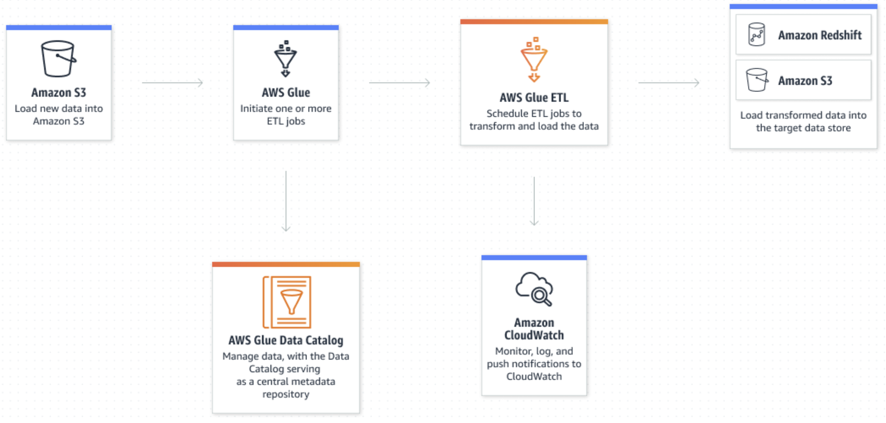
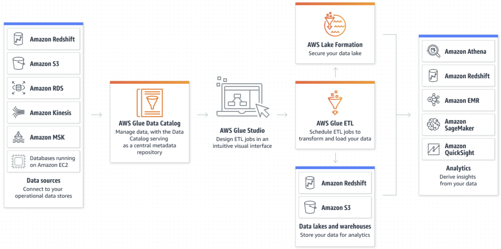
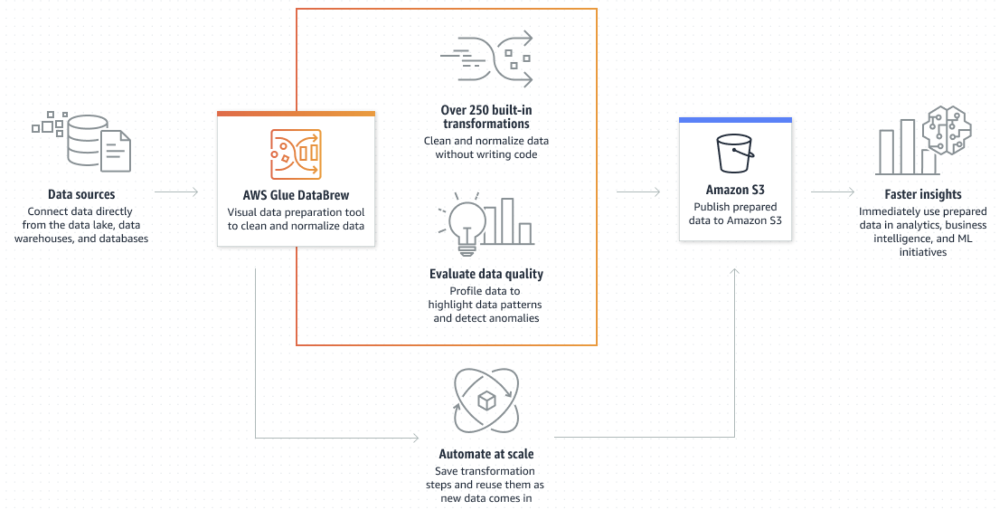

```c-lms
activity-name: AWS Query Data with Athena and Glue, in Amazon Data Redshift and S3
topic: What is AWS Glue?
```

# Query Data S3 Athena Glue Analyze Data Redshift

## What is AWS Glue?

AWS Glue is a fully managed ETL (Extract, Transform, Load) service that makes it easy for customers to prepare and load their data for analytics. AWS Glue is serverless, so there is no infrastructure to manage, and you pay only for the resources you use.

AWS Glue is a serverless data integration service that makes it easy for analytics users to discover, prepare, move, and integrate data from multiple sources. You can use it for analytics, machine learning, and application development. It also includes additional productivity and data ops tooling for authoring, running jobs, and implementing business workflows. You can doing several things with AWS Glue: You can run ETL jobs as new data arrives; you can catalog your data to quickly discover and search multiple AWS datasets without moving the data; you can use no-code ETL jobs using AWS Glue Studio which makes it easier to visually create, run, and monitor AWS Glue ETL jobs; and you can utilize AWS Glue DataBrew, where you can explore and experiment with data directly from your data lake.

With AWS Glue, you can discover and connect to more than 70 diverse data sources and manage your data in a centralized data catalog. You can visually create, run, and monitor extract, transform, and load (ETL) pipelines to load data into your data lakes. Also, you can immediately search and query cataloged data using Amazon Athena, Amazon EMR, and Amazon Redshift Spectrum.

AWS Glue consolidates major data integration capabilities into a single service. These include data discovery, modern ETL, cleansing, transforming, and centralized cataloging. It’s also serverless, which means there’s no infrastructure to manage. With flexible support for all workloads like ETL, ELT, and streaming in one service, AWS Glue supports users across various workloads and types of users.

Also, AWS Glue makes it easy to integrate data across your architecture. It integrates with AWS analytics services and Amazon S3 data lakes. AWS Glue has integration interfaces and job-authoring tools that are easy to use for all users, from developers to business users, with tailored solutions for varied technical skill sets.

With the ability to scale on demand, AWS Glue helps you focus on high-value activities that maximize the value of your data. It scales for any data size, and supports all data types and schema variances. To increase agility and optimize costs, AWS Glue provides built-in high availability and pay-as-you-go billing.

For pricing information, see [AWS Glue pricing](https://aws.amazon.com/glue/pricing).


## Event Driven ETL

AWS Glue can run your extract, transform, and load (ETL) jobs as new data arrives. For example, you can configure AWS Glue to initiate your ETL jobs to run as soon as new data becomes available in Amazon Simple Storage Service (S3).

<p style="text-align: center">
  
</p>

## AWS Glue Data Catalog

You can use the Data Catalog to quickly discover and search multiple AWS datasets without moving the data. Once the data is cataloged, it is immediately available for search and query using Amazon Athena, Amazon EMR, and Amazon Redshift Spectrum.

<p style="text-align: center">
  
</p>


## No-code ETL Jobs

AWS Glue Studio makes it easier to visually create, run, and monitor AWS Glue ETL jobs. You can build ETL jobs that move and transform data using a drag-and-drop editor, and AWS Glue automatically generates the code.

<p style="text-align: center">
  
</p>

## Self-service Data Preparation

With AWS Glue DataBrew, you can explore and experiment with data directly from your data lake, data warehouses, and databases, including Amazon S3, Amazon Redshift, AWS Lake Formation, Amazon Aurora, and Amazon Relational Database Service (RDS). You can choose from over 250 prebuilt transformations in DataBrew to automate data preparation tasks such as filtering anomalies, standardizing formats, and correcting invalid values.

<p style="text-align: center">
  
</p>

See [Getting Started with AWS Glue](https://aws.amazon.com/glue/getting-started/)


```c-lms
topic: Why AWS Glue?
```

## Why AWS Glue?

Preparing your data to obtain quality results is the first step in an analytics or ML project. AWS Glue is a serverless data integration service that makes data preparation simpler, faster, and cheaper. You can discover and connect to over 70 diverse data sources, manage your data in a centralized data catalog, and visually create, run, and monitor ETL pipelines to load data into your data lakes.

[AWS Glue Overview](https://youtu.be/u14iVEc-C6E)


<!-- 
```python
from IPython.display import YouTubeVideo
## Tutorial Video Name: AWS Glue
YouTubeVideo('u14iVEc-C6E', width=720, height=480)
```
-->


<iframe
    width="720"
    height="480"
    src="https://www.youtube.com/embed/u14iVEc-C6E"
    frameborder="0"
    allowfullscreen

></iframe>


<!--

```python
#https://youtu.be/qgWMfNSN9f4
from IPython.display import YouTubeVideo
## Tutorial Video Name: What is AWS Glue
YouTubeVideo('qgWMfNSN9f4', width=720, height=480)
```
-->

## What is AWS Glue?


<iframe
    width="720"
    height="480"
    src="https://www.youtube.com/embed/qgWMfNSN9f4"
    frameborder="0"
    allowfullscreen

></iframe>


<!--

```python
#https://youtu.be/z3HeHlWg88M
from IPython.display import YouTubeVideo
## Tutorial Video Name: Getting started with AWS Glue ETL
YouTubeVideo('z3HeHlWg88M', width=720, height=480)
```
-->


## Getting started with AWS Glue ETL

<iframe
    width="720"
    height="480"
    src="https://www.youtube.com/embed/z3HeHlWg88M"
    frameborder="0"
    allowfullscreen

></iframe>


<!--

```python
#https://youtu.be/qNojanBn1NY
from IPython.display import YouTubeVideo
## Tutorial Video Name: Getting started with AWS Glue Data Catalog
YouTubeVideo('qNojanBn1NY', width=720, height=480)
```
-->


## Getting started with AWS Glue Data Catalog


<iframe
    width="720"
    height="480"
    src="https://www.youtube.com/embed/qNojanBn1NY"
    frameborder="0"
    allowfullscreen

></iframe>


```c-lms
topic: AWS Glue Use Cases
```

## AWS Glue Use Cases

## Simplify ETL pipeline development

Remove infrastructure management with automatic provisioning and worker management, and consolidate all your data integration needs into a single service.

## Discover data efficiently

Quickly identify data across multiple AWS datasets, and then make it instantly available for querying and transforming.

## Interactively explore, experiment on, and process data

Using AWS Glue interactive sessions, data engineers can interactively explore and prepare data using the integrated development environment (IDE) or notebook of their choice.

## Support various processing frameworks and workloads

More easily support various data processing frameworks, such as ETL and ELT, and various workloads, including batch, micro-batch, and streaming.

```c-lms
topic: AWS Glue Features
```

## AWS Glue Features

AWS Glue features fall into three major categories:

- __Discover and organize data__

- __Transform, prepare, and clean data for analysis__

- __Build and monitor data pipelines__

## Discover and organize data

__Unify and search across multiple data stores__ – Store, index, and search across multiple data sources and sinks by cataloging all your data in AWS.

__Automatically discover data__ – Use AWS Glue crawlers to automatically infer schema information and integrate it into your AWS Glue Data Catalog.

__Manage schemas and permissions__ – Validate and control access to your databases and tables.

__Connect to a wide variety of data sources__ – Tap into multiple data sources, both on premises and on AWS, using AWS Glue connections to build your data lake.

## Transform, prepare, and clean data for analysis

__Visually transform data with a drag-and-drop interface__ – Define your ETL process in the drag-and-drop job editor and automatically generate the code to extract, transform, and load your data.

__Build complex ETL pipelines with simple job scheduling__ – Invoke AWS Glue jobs on a schedule, on demand, or based on an event.

__Clean and transform streaming data in transit__ – Enable continuous data consumption, and clean and transform it in transit. This makes it available for analysis in seconds in your target data store.

__Deduplicate and cleanse data with built-in machine learning__ – Clean and prepare your data for analysis without becoming a machine learning expert by using the FindMatches feature. This feature deduplicates and finds records that are imperfect matches for each other.

__Built-in job notebooks__ – AWS Glue Studio job notebooks provide serverless notebooks with minimal setup in AWS Glue Studio so you can get started quickly.

__Edit, debug, and test ETL code__ – With AWS Glue interactive sessions, you can interactively explore and prepare data. You can explore, experiment on, and process data interactively using the IDE or notebook of your choice.

__Define, detect, and remediate sensitive data__ – AWS Glue sensitive data detection lets you define, identify, and process sensitive data in your data pipeline and in your data lake.

## Build and monitor data pipelines

__Automatically scale based on workload__ – Dynamically scale resources up and down based on workload. This assigns workers to jobs only when needed.

__Automate jobs with event-based triggers__ – Start crawlers or AWS Glue jobs with event-based triggers, and design a chain of dependent jobs and crawlers.

__Run and monitor jobs__ – Run your AWS Glue jobs, and then monitor them with automated monitoring tools, the Apache Spark UI, AWS Glue job run insights, and AWS CloudTrail.

__Define workflows for ETL and integration activities__ – Define workflows for ETL and integration activities for multiple crawlers, jobs, and triggers.

Read more about AWS Glue in the [AWS Glue Documentation](https://docs.aws.amazon.com/glue/index.html)

## Review and Practice <a class="anchor" id="DS107L7.4_quiz"></a>

Below you will find a quiz to review the recently covered material. Quizzes are _not_ graded.

```c-lms
start-activity: DS107L7.4 AWS GLue Quiz
```

```c-lms
topic: Data Analytics Lab 3 
```

<div class="panel panel-success">
    <div class="panel-heading">
        <h3 class="panel-title">Hint!</h3>
    </div>
    <div class="panel-body">
        <p>Ensure you complete and annotate the challenge questions for answering questions in Lesson 10 final exam <b><a href="https://vimeo.com/762068599"> recorded live workshop</a></b>  for this lab.</p>
    </div>
</div>

<!--
```python
#https://vimeo.com/762068599
from IPython.display import VimeoVideo
## Tutorial Video Name: Data Analytics Lab 3 - Query Data in Amazon S3 with Amazon Athena and AWS Glue
VimeoVideo('762068599', width=720, height=480)
```
-->


<div style="padding:56.66% 0 0 0;position:relative;"><iframe src="https://player.vimeo.com/video/762068599?h=46402ae197&amp;badge=0&amp;autopause=0&amp;player_id=0&amp;app_id=58479" frameborder="0" allow="autoplay; fullscreen; picture-in-picture" allowfullscreen style="position:absolute;top:0;left:0;width:100%;height:100%;" title="Data Analytics Lab 3 - Query Data in Amazon S3 with Amazon Athena and AWS Glue"></iframe></div><script src="https://player.vimeo.com/api/player.js"></script>


```c-lms
topic: Amazon Redshift
```

## Amazon Redshift

Amazon Redshift uses SQL to analyze structured and semi-structured data across data warehouses, operational databases, and data lakes, using AWS-designed hardware and machine learning to deliver the best price performance at any scale.

<p style="text-align: center">
  
</p>

Tens of thousands of customers today rely on Amazon Redshift to analyze exabytes of data and run complex analytical queries, making it the most widely used cloud data warehouse. Run and scale analytics in seconds on all your data without having to manage your data warehouse infrastructure.

<!--
```python
#https://youtu.be/lWwFJV_9PoE
from IPython.display import YouTubeVideo
## Tutorial Video Name: Introduction of data warehousing with Amazon Redshift
YouTubeVideo('lWwFJV_9PoE', width=720, height=480)
```
-->


<iframe
    width="720"
    height="480"
    src="https://www.youtube.com/embed/lWwFJV_9PoE"
    frameborder="0"
    allowfullscreen

></iframe>

```c-lms
topic: Amazon Redshift Use Cases
```

## Amazon Redshift Use Cases

## Improve financial and demand forecasts

Automatically create, train, and deploy machine learning models for predictive insights.

## Collaborate and share data

Securely share data among accounts, organizations, and partners while building applications on top of third-party data.

## Optimize your business intelligence

Build insight-driven reports and dashboards using Amazon QuickSight, Tableau, Microsoft PowerBI, or other business intelligence tools.

## Increase developer productivity

Get simplified data access, ingest, and egress from numerous programming languages and platforms without configuring drivers and managing database connections.

```c-lms
topic: Amazon Redshift Features
```

## Amazon Redshift Features

## Easy analytics for everyone

Focus on getting from data to insights in seconds and delivering on your business outcomes, without worrying about managing your data warehouse.

__Amazon Redshift Serverless:__ Amazon Redshift Serverless is a serverless option of Amazon Redshift that makes it easy to run and scale analytics in seconds without the need to set up and manage data warehouse infrastructure. With Redshift Serverless, any user—including data analysts, developers, business professionals, and data scientists—can get insights from data by simply loading and querying data in the data warehouse. [Learn more](https://aws.amazon.com/redshift/redshift-serverless/).

__Query Editor v2:__ Use SQL to make your Amazon Redshift data and data lake more accessible to data analysts, data engineers, and other SQL users with a web-based analyst workbench for data exploration and analysis. Query Editor v2 lets you visualize query results in a single click, create schemas and tables, load data visually, and browse database objects. It also provides an intuitive editor for authoring and sharing SQL queries, analyses, visualizations, and annotations, and securely sharing them with your team.

__Automated Table Design:__ Amazon Redshift monitors user workloads and uses sophisticated algorithms to find ways to improve the physical layout of data to optimize query speeds. Automatic Table Optimization selects the best sort and distribution keys to optimize performance for the cluster’s workload. If Amazon Redshift determines that applying a key will improve cluster performance, tables will be automatically altered without requiring administrator intervention. The additional features Automatic Vacuum Delete, Automatic Table Sort, and Automatic Analyze eliminate the need for manual maintenance and tuning of Redshift clusters to get the best performance for new clusters and production workloads.

__Query using your own tools:__ Amazon Redshift gives you the flexibility to run queries within the console or connect SQL client tools, libraries, or data science tools including Amazon Quicksight, Tableau, PowerBI, QueryBook and Jupyter Notebook.

__Simple API to interact with Amazon Redshift:__ Amazon Redshift lets you painlessly access data with all types of traditional, cloud-native, and containerized, serverless web services-based applications and event-driven applications. The Amazon Redshift Data API simplifies data access, ingest, and egress from programming languages and platforms supported by the AWS SDK, such as Python, Go, Java, Node.js, PHP, Ruby, and C++. The Data API eliminates the need for configuring drivers and managing database connections. Instead, you can run SQL commands to an Amazon Redshift cluster by simply calling a secured API endpoint provided by the Data API. The Data API takes care of managing database connections and buffering data. The Data API is asynchronous, so you can retrieve your results later. Your query results are stored for 24 hours.

__Fault tolerant:__ There are multiple features that enhance the reliability of your data warehouse cluster. For example, Amazon Redshift continuously monitors the health of the cluster and automatically re-replicates data from failed drives and replaces nodes as necessary for fault tolerance. Clusters can also be relocated to alternative Availability Zones (AZs) without any data loss or application changes.

## Analyze all your data

Get integrated insights running real-time and predictive analytics on complex, scaled data across your operational databases, data lake, data warehouse and thousands of third-party data sets.

__Federated query:__ With the new federated query capability in Amazon Redshift, you can reach into your operational relational database. Query live data across one or more Amazon Relational Database Service (RDS) and Aurora PostgreSQL and RDS MySQL and Aurora MySQL databases to get instant visibility into the full business operations without requiring data movement. You can join data from your Redshift data warehouse, data in your data lake, and data in your operational stores to make better data-driven decisions. Amazon Redshift offers sophisticated optimizations to reduce data moved over the network and complements it with its massively parallel data processing for high-performance queries. Learn more.

__Query and export data to and from your data lake:__ No other cloud data warehouse makes it as easy to both query data and write data back to your data lake in open formats. You can query open file formats such as Parquet, ORC, JSON, Avro, CSV, and more directly in S3 using familiar ANSI SQL. To export data to your data lake, simply use the Amazon Redshift UNLOAD command in your SQL code and specify Parquet as the file format, and Amazon Redshift automatically takes care of data formatting and data movement into S3. This gives you the flexibility to store highly structured, frequently accessed data and semi-structured data in an Amazon Redshift data warehouse, while keeping up to exabytes of structured, semi-structured and unstructured data in Amazon S3. Exporting data from Amazon Redshift back to your data lake lets you analyze the data further with AWS services such as Amazon Athena, Amazon EMR, and Amazon SageMaker.

__AWS services integration:__ Native integration with AWS services, database, and machine learning services makes it easier to handle complete analytics workflows without friction. For example, AWS Lake Formation is a service that makes it easy to set up a secure data lake in days. AWS Glue can extract, transform, and load (ETL) data into Amazon Redshift. Amazon Kinesis Data Firehose is the easiest way to capture, transform, and load streaming data into Amazon Redshift for near real-time analytics. You can use Amazon EMR to process data using Hadoop/Spark and load the output into Amazon Redshift for BI and analytics. Amazon QuickSight is the first BI service with pay-per-session pricing that you can use to create reports, visualizations, and dashboards on Redshift data. You can use Amazon Redshift to prepare your data to run machine learning (ML) workloads with Amazon SageMaker. To accelerate migrations to Amazon Redshift, you can use the AWS Schema Conversion tool and the AWS Database Migration Service (DMS). Amazon Redshift is also deeply integrated with Amazon Key Management Service (KMS) and Amazon CloudWatch for security, monitoring, and compliance. You can also use Lambda user-defined functions (UDFs) to invoke a Lambda function from your SQL queries as if you are invoking a UDF in Amazon Redshift. You can write Lambda UDFs to integrate with AWS Partner services and to access other popular AWS services such as Amazon DynamoDB and Amazon SageMaker.

__Partner console integration:__ You can accelerate data onboarding and create valuable business insights in minutes by integrating with select Partner solutions in the Amazon Redshift console. With these solutions you can bring data from applications such as Salesforce, Google Analytics, Facebook Ads, Slack, Jira, Splunk, and Marketo into your Redshift data warehouse in an efficient and streamlined way. It also lets you join these disparate datasets and analyze them together to produce actionable insights.

__Data Sharing:__ Amazon Redshift data sharing allows you to extend the ease of use, performance, and cost benefits of Amazon Redshift in a single cluster to multi-cluster deployments while being able to share data. Data sharing enables instant, granular, and fast data access across Redshift clusters without the need to copy or move it. Data sharing provides live access to data so your users always see the most current and consistent information as it’s updated in the data warehouse. You can securely share live data with Redshift clusters in the same or different AWS accounts and across Regions. Learn more.

__AWS Data Exchange for Amazon Redshift:__ Query Amazon Redshift datasets from your own Redshift cluster without extracting, transforming, and loading ETL the data. You can subscribe to Redshift cloud data warehouse products in AWS Data Exchange. As soon as a provider makes an update, the change is visible to subscribers. If you are a data provider, access is automatically granted when a subscription starts and revoked when it ends, invoices are automatically generated when payments are due, and payments are collected through AWS. You can license access to flat files, data in Amazon Redshift, and data delivered through APIs, all with a single subscription. Learn more.

__Redshift ML:__ Redshift ML makes it easy for data analysts, data scientists, BI professionals, and developers to create, train, and deploy Amazon SageMaker models using SQL. With Redshift ML, you can use SQL statements to create and train Amazon SageMaker models on your data in Amazon Redshift and then use those models for predictions such as churn detection, financial forecasting, personalization, and risk scoring directly in your queries and reports. Learn more.

__Native support for advanced analytics:__ Amazon Redshift supports standard scalar data types such as NUMBER, VARCHAR, and DATETIME and provides native support for the following advanced analytics processing:

- __Spatial data processing:__ Amazon Redshift provides a polymorphic data type, GEOMETRY, that supports multiple geometric shapes such as Point, Linestring, and Polygon. Amazon Redshift also provides spatial SQL functions to construct geometric shapes, import, export, access, and process the spatial data. You can add GEOMETRY columns to Redshift tables and write SQL queries spanning across spatial and non-spatial data. This capability lets you store, retrieve, and process spatial data and seamlessly enhance your business insights by integrating spatial data into your analytical queries. With Amazon Redshift’s ability to seamlessly query data lakes, you can also easily extend spatial processing to data lakes by integrating external tables in spatial queries. See the documentation for more details.
- __HyperLogLog sketches:__ HyperLogLog is a novel algorithm that efficiently estimates the approximate number of distinct values in a dataset. HLL sketch is a construct that encapsulates the information about the distinct values in the dataset. You can use HLL sketches to achieve significant performance benefits for queries that compute approximate cardinality over large datasets, with an average relative error of 0.01–0.6%. Amazon Redshift provides a first-class datatype HLLSKETCH and associated SQL functions to generate, persist, and combine HyperLogLog sketches. The Amazon Redshift HyperLogLog capability uses bias correction techniques and provides high accuracy with low memory footprint. See the documentation for more details.
- __DATE & TIME data types:__ Amazon Redshift provides multiple data types DATE, TIME, TIMETZ, TIMESTAMP, and TIMESTAMPTZ to natively store and process data/time data. TIME and TIMESTAMP types store the time data without time zone information, whereas TIMETZ and TIMESTAMPTZ types store the time data including the time zone information. You can use various date/time SQL functions to process the date and time values in Redshift queries. See the documentation for more details.
- __Semi-structured data processing:__ The Amazon Redshift SUPER data type natively stores JSON and other semi-structured data in Redshift tables, and uses the PartiQL query language to seamlessly process the semi-structured data. The SUPER data type is schema-less in nature and allows storage of nested values that may contain Redshift scalar values, nested arrays, and nested structures. PartiQL is an extension of SQL and provides powerful querying capabilities such as object and array navigation, un-nesting of arrays, dynamic typing, and schema-less semantics. This lets you achieve advanced analytics that combine the classic structured SQL data with the semi-structured SUPER data with superior performance, flexibility, and ease of use. See the documentation for more details.
- __Integration with third-party tools:__ There are many options to enhance Amazon Redshift by working with industry-leading tools and experts for loading, transforming, and visualizing data. Our extensive list of Partners have certified their solutions to work with Amazon Redshift.
    - Load and transform your data with Data Integration Partners.
    - Analyze data and share insights across your organization with Business Intelligence Partners.
    - Architect and implement your analytics platform with System Integration and Consulting Partners.
    - Query, explore, and model your data using tools and utilities from Query and Data Modeling Partners.
    
## Performance at any scale

Gain up to 3x better price performance than other cloud data warehouses with automated optimizations to improve query speed.

__RA3 instances:__ RA3 instances deliver up to 3x better price performance of any cloud data warehouse service. These Amazon Redshift instances maximize speed for performance-intensive workloads that require large amounts of compute capacity, with the flexibility to pay separately for compute independently of storage by specifying the number of instances you need. [Learn more](https://aws.amazon.com/redshift/features/ra3.htm/?nc=sn&loc=2&dn=5).

__Efficient storage and high-performance query processing:__ Amazon Redshift delivers fast query performance on datasets ranging in size from gigabytes to petabytes. Columnar storage, data compression, and zone maps reduce the amount of I/O needed to perform queries. Along with the industry-standard encodings such as LZO and Zstandard, Amazon Redshift also offers purpose-built compression encoding, AZ64, for numeric and date/time types to provide both storage savings and optimized query performance.

__Limitless concurrency:__ Amazon Redshift provides consistently fast performance, even with thousands of concurrent queries, whether they query data in your Redshift data warehouse or directly in your Amazon S3 data lake. Amazon Redshift Concurrency Scaling supports virtually unlimited concurrent users and concurrent queries with consistent service levels by adding transient capacity in seconds as concurrency increases. [Learn more](https://aws.amazon.com/redshift/features/concurrency-scaling.html/?nc=sn&loc=2&dn=3&refid=ps_a134p000006pkmtaaq&trkcampaign=acq_paid_search_brand).

__Materialized views:__ Amazon Redshift materialized views allow you to achieve significantly faster query performance for iterative or predictable analytical workloads such as dashboarding and queries from Business Intelligence (BI) tools, and extract, transform and load ELT data processing jobs. You can use materialized views to easily store and manage precomputed results of a SELECT statement that may reference one or more tables, including external tables. Subsequent queries referencing the materialized views can run much faster by reusing the precomputed results. Amazon Redshift can efficiently maintain the materialized views incrementally to continue to provide the low latency performance benefits. [Learn more](https://aws.amazon.com/redshift/features/redshift-ml/).

__Automated Materialized Views:__ Organizations are building more data dependent applications, dashboards, reports and ad-hoc queries than ever before. Each application needs to be tuned and optimized, which requires time, resources, and money. Materialized views are a powerful tool for improving query performance, and you could set these up if you have well understood workloads. However, you might have increased and changing workloads where query patterns are not predictable. Automated Materialized Views improve throughput of queries, lower query latency, shorten execution time through automatic refresh, auto query rewrite, incremental refresh, and continuous monitoring of Amazon Redshift clusters. Amazon Redshift balances the creation and management of AutoMVs with minimal resource utilization. [Learn more](https://docs.aws.amazon.com/redshift/latest/dg/materialized-view-auto-mv.html).

__Machine learning to maximize throughput and performance:__ Advanced ML capabilities in Amazon Redshift deliver high throughput and performance, even with varying workloads or concurrent user activity. Amazon Redshift uses sophisticated algorithms to predict and classify incoming queries based on their run times and resource requirements to dynamically manage performance and concurrency while also helping you prioritize your business-critical workloads. Short query acceleration (SQA) sends short queries from applications such as dashboards to an express queue for immediate processing rather than being starved behind large queries. Automatic workload management (WLM) uses ML to dynamically manage memory and concurrency, helping maximize query throughput. In addition, you can now easily set the priority of your most important queries, even when hundreds of queries are being submitted. Amazon Redshift is also a self-learning system that observes the user workload, determining the opportunities to improve performance as the usage grows, applying optimizations seamlessly, and making recommendations through Redshift Advisor when an explicit user action is needed to further turbocharge Redshift performance.

__Result caching:__ Amazon Redshift uses result caching to deliver sub-second response times for repeat queries. Dashboard, visualization, and business intelligence tools that run repeat queries experience a significant performance boost. When a query runs, Amazon Redshift searches the cache to see if there is a cached result from a prior run. If a cached result is found and the data has not changed, the cached result is returned immediately instead of re-running the query.

__Petabyte-scale data warehousing:__ With a few clicks in the console or a simple API call, you can easily change the number or type of nodes in your data warehouse, and scale up or down as your needs change. With managed storage, capacity is added automatically to support workloads up to 8 PB of compressed data. You can also run queries against petabytes of data in Amazon S3 without having to load or transform any data with the Amazon Redshift Spectrum feature. You can use S3 as a highly available, secure, and cost-effective data lake to store unlimited data in open data formats. Redshift Spectrum runs queries across thousands of parallelized nodes to deliver fast results, regardless of the complexity of the query or the amount of data.

__Flexible pricing options:__ Amazon Redshift is the most cost-effective data warehouse, and you can optimize how you pay. You can start small for just $0.25 per hour with no commitments, and scale out for just $1,000 per terabyte per year. Amazon Redshift is the only cloud data warehouse that offers on-demand pricing with no upfront costs, Reserved Instance pricing that can save you up to 75% by committing to a one- or three-year term, and per-query pricing based on the amount of data scanned in your Amazon S3 data lake. Amazon Redshift’s pricing includes built-in security, data compression, backup storage, and data transfer. As the size of data grows, you use managed storage in the RA3 instances to store data cost-effectively at $0.024 per GB per month.

__Predictable cost, even with unpredictable workloads:__ Amazon Redshift allows you to scale with minimal cost impact, as each cluster earns up to one hour of free Concurrency Scaling credits per day. These free credits are sufficient for the concurrency needs of 97% of customers. This provides you with predictability in your month-to-month cost, even during periods of fluctuating analytical demand.

__Choose your node type to get the best value for your workloads:__ You can select from three instance types to optimize Amazon Redshift for your data warehousing needs: RA3 nodes, Dense Compute nodes, and Dense Storage nodes.

RA3 nodes let you scale storage independently of compute. With RA3, you get a high-performance data warehouse that stores data in a separate storage layer. You only need to size the data warehouse for the query performance that you need.

Dense Compute (DC) nodes allow you to create very high-performance data warehouses using fast CPUs, large amounts of RAM, and solid-state disks (SSDs) and are the best choice for less than 500 GB of data.

Dense Storage (DS2) nodes let you create large data warehouses using hard disk drives (HDDs) for a low price point when you purchase the three-year Reserved Instances. Most customers who run on DS2 clusters can migrate their workloads to RA3 clusters and get up to twice the performance and more storage for the same cost as DS2.

Scaling your cluster or switching between node types requires a single API call or a few clicks in the AWS Management Console. Visit the [pricing page](https://aws.amazon.com/redshift/pricing/) for more information.

## Secure and compliant

AWS has comprehensive security capabilities to satisfy the most demanding requirements, and Amazon Redshift provides data security out-of-the-box at no extra cost.

__End-to-end encryption:__ With just a few parameter settings, you can set up Amazon Redshift to use SSL to secure data in transit, and hardware-accelerated AES-256 encryption for data at rest. If you choose to enable encryption of data at rest, all data written to disk will be encrypted as well as any backups. Amazon Redshift takes care of key management by default.

__Network isolation:__ Amazon Redshift lets you configure firewall rules to control network access to your data warehouse cluster. You can run Amazon Redshift inside Amazon Virtual Private Cloud (VPC) to isolate your data warehouse cluster in your own virtual network and connect it to your existing IT infrastructure using an industry-standard encrypted IPsec VPN.

__Audit and compliance:__ Amazon Redshift integrates with AWS CloudTrail to enable you to audit all Redshift API calls. Redshift logs all SQL operations, including connection attempts, queries, and changes to your data warehouse. You can access these logs using SQL queries against system tables, or save the logs to a secure location in Amazon S3. Amazon Redshift is compliant with SOC1, SOC2, SOC3, and PCI DSS Level 1 requirements. For more details, visit [AWS Cloud Compliance](https://aws.amazon.com/compliance/).

__Tokenization:__ Amazon Lambda user-defined functions (UDFs) lets you use an AWS Lambda function as a UDF in Amazon Redshift and invoke it from Redshift SQL queries. With this functionality you can to write custom extensions for your SQL query to achieve tighter integration with other services or third-party products. You can write Lambda UDFs to enable external tokenization, data masking, identification or de-identification of data by integrating with vendors such as Protegrity, and protect or unprotect sensitive data based on a user’s permissions and groups, in query time. 

__Granular access controls:__ Granular row and column level security controls ensure that users see only the data they should have access to. Amazon Redshift is integrated with [AWS Lake Formation](https://aws.amazon.com/lake-formation/), ensuring that Lake Formation’s column level access controls are also enforced for Redshift queries on the data in the data lake.

Find out more what’s [new](https://aws.amazon.com/redshift/whats-new/).

Visit [Amazon Redshift Documentation](https://docs.aws.amazon.com/redshift/index.html) for more detailed product information.


## Review and Practice <a class="anchor" id="DS107L7.9_quiz"></a>

Below you will find a quiz to review the recently covered material. Quizzes are _not_ graded.

```c-lms
start-activity: DS107L7.9 Amazon RedShift Quiz
```

```c-lms
topic: Getting Started with Amazon Redshift
```

## Getting Started with Amazon Redshift


## Trying Redshift
AWS account required: Step through the [Getting Started tutorial](http://docs.aws.amazon.com/redshift/latest/gsg/welcome.html) and use the free trial to create and provision your first cluster, then load and query sample data in minutes.

- Get started with [Amazon Redshift provisioned](https://docs.aws.amazon.com/redshift/latest/gsg/getting-started.html).
- Get started with [Amazon Redshift Serverless](https://docs.aws.amazon.com/redshift/latest/mgmt/working-with-serverless.html#serverless-overview).

Before you start, you can also [experience Amazon Redshift through an interactive dashboard](https://modeanalytics.com/mode_redshift_demo/reports/1e9d4b64f0a4?secret_key=2e5d13346ca7dad2dcbfd74e) built using public datasets. 

## Learning resources

1. Read a conceptual introduction in the [Amazon Redshift System Overview](https://docs.aws.amazon.com/redshift/latest/mgmt/welcome.html).
2. Load and analyze your own data. See [Designing Tables](http://docs.aws.amazon.com/redshift/latest/dg/c_designing-tables-best-practices.html), [Loading Data](http://docs.aws.amazon.com/redshift/latest/dg/c_loading-data-best-practices.html), [Designing Queries](http://docs.aws.amazon.com/redshift/latest/dg/c_designing-queries-best-practices.html) in the Database Developer Guide.
3. Analyze your data with any SQL client using industry-standard ODBC/JDBC connections. See [Connecting to a Cluster](http://docs.aws.amazon.com/redshift/latest/mgmt/connecting-to-cluster.html) in the Management Guide for details.
4. Learn how to query data stored in Amazon S3, without moving the data, using Redshift Spectrum. See [the Getting Started with Redshift Spectrum tutorial](https://docs.aws.amazon.com/redshift/latest/dg/c-getting-started-using-spectrum.html).
5. Check out [business intelligence (BI)](https://aws.amazon.com/redshift/partners/#business-intelligence-partners) and [data integration (ETL)](https://aws.amazon.com/redshift/partners/#etl-partners) vendors that have certified Amazon Redshift for use with their tools.


```c-lms
topic: Data Analytics Lab 4 
```

## Data Analytics Lab 4 Analyze Data with Amazon Redshift

<!--

```python
#https://vimeo.com/762346055
from IPython.display import VimeoVideo
## Tutorial Video Name: Data Analytics Lab 4 - Analyze Data with Amazon Redshift 
VimeoVideo('762346055', width=720, height=480)
```
-->


<div style="padding:56.66% 0 0 0;position:relative;"><iframe src="https://player.vimeo.com/video/762346055?h=e2a4ac080b&amp;badge=0&amp;autopause=0&amp;player_id=0&amp;app_id=58479" frameborder="0" allow="autoplay; fullscreen; picture-in-picture" allowfullscreen style="position:absolute;top:0;left:0;width:100%;height:100%;" title="Data Analytics Lab 4 - Analyze Data with Amazon Redshift"></iframe></div><script src="https://player.vimeo.com/api/player.js"></script>

```c-lms
topic: Key Terms
```

## Key Terms

Below is a list and short description of the important keywords learned in this lesson. Please read through and go back and review any concepts you do not fully understand. Great Work!

<table class="table table-striped">
    <tr>
        <th>Keyword</th>
        <th>Description</th>
    </tr>
    <tr>
        <td style="font-weight: bold;" nowrap>AWS Glue</td>
        <td>is a serverless data integration service that makes it easy for analytics users to discover, prepare, move, and integrate data from multiple sources.</td>
    </tr>
    <tr>
        <td style="font-weight: bold;" nowrap>AWS Glue Data Catalog</td>
        <td>You can use the Data Catalog to quickly discover and search multiple AWS datasets without moving the data. Once the data is cataloged, it is immediately available for search and query using Amazon Athena, Amazon EMR, and Amazon Redshift Spectrum.</td>
    </tr>
    <tr>
        <td style="font-weight: bold;" nowrap>AWS ETL Jobs</td>
        <td>AWS Glue Studio makes it easier to visually create, run, and monitor AWS Glue Extract Transfer and Load (ETL) jobs.</td>
    </tr>
    <tr>
        <td style="font-weight: bold;" nowrap>AWS Glue DataBrew</td>
        <td>you can explore and experiment with data directly from your data lake, data warehouses, and databases, including Amazon S3, Amazon Redshift, AWS Lake Formation, Amazon Aurora, and Amazon Relational Database Service (RDS). </td>
    </tr>
    <tr>
        <td style="font-weight: bold;" nowrap>Amazon Redshift</td>
        <td>uses SQL to analyze structured and semi-structured data across data warehouses, operational databases, and data lakes, using AWS-designed hardware and machine learning to deliver the best price performance at any scale.</td>
    </tr>
</table>

---

```c-lms
topic: Lesson 7 Exam
```

```c-lms
start-activity: DS107L7.12 Lesson 7 Exam
```
