```c-lms
activity-name: AWS Analyze Data using Sagemaker and Automate Data Loading Data Pipeline
topic: The Jupyter Project: Jupyter Notebook and JupyterLab
```

# Analyze Data Sagemaker Jupyter Bokeh Automate Data Loading Data Pipeline

# The Jupyter Project: Jupyter Notebook and JupyterLab<a class="anchor" id="DS107L8_page_1"></a>


***
 
| [Home](https://jupyter.org/index.html) 
| [About](https://jupyter.org/about)
| [Install](https://jupyter.org/install)
| [Community](https://jupyter.org/community)
| [Documentation](https://jupyter.org/Documentation)
| [nbviewer](https://nbviewer.jupyter.org/)
| [JupyterHub](https://jupyter.org/hub)
| [Widgets](https://jupyter.org/widgets)
| [Blog](https://blog.jupyter.org/)
***

Project Jupyter exists to develop open-source software, open-standards, and services for interactive computing across dozens of programming languages.

Project Jupyter is a non-profit, open-source project, born out of the IPython Project in 2014 as it evolved to support interactive data science and scientific computing across all programming languages. Jupyter will always be 100% open-source software, free for all to use and released under the liberal terms of the modified BSD license.

Jupyter is developed in the open on GitHub, through the consensus of the Jupyter community. For more information on our governance approach, please see our Governance Document.

All online and in-person interactions and communications directly related to the project are covered by the Jupyter Code of Conduct. This Code of Conduct sets expectations to enable a diverse community of users and contributors to participate in the project with respect and safety.


The Jupyter project is comprised of several projects: _[Jupyter Notebook](https://jupyter-notebook.readthedocs.io/en/stable/notebook.html): The Classic Notebook Interface, [JupyterLab](https://jupyterlab.readthedocs.io/en/stable/) : A Next-Generation Notebook Interface, [JupyterHub](https://jupyter.org/hub): JupyterHub brings the power of notebooks to groups of users, [Voilà](https://voila.readthedocs.io/en/stable/) helps communicate insights by transforming notebooks into secure, stand-alone web applications that you can customize and share._ 

## Jupyter Notebook

[Jupyter Notebook](https://jupyter-notebook.readthedocs.io/en/stable/notebook.html) provides a browser-based [REPL](https://repl.it/@enaard/Python-3#main.py) built upon a number of popular open-source libraries:

[IPython](https://en.wikipedia.org/wiki/IPython) | [ØMQ](https://en.wikipedia.org/wiki/ZeroMQ) | [Tornado](https://en.wikipedia.org/wiki/Tornado_(web_server)) | [jQuery](https://en.wikipedia.org/wiki/JQuery) | 
[Bootstrap](https://en.wikipedia.org/wiki/Bootstrap_(front-end_framework)) | [MathJax](https://en.wikipedia.org/wiki/MathJax)

The notebook extends the console-based approach to interactive computing in a qualitatively new direction, providing a web-based application suitable for capturing the whole computation process: developing, documenting, and executing code, as well as communicating the results. The Jupyter notebook combines two components:

A web application: a browser-based tool for interactive authoring of documents which combine explanatory text, mathematics, computations and their rich media output.

Notebook documents: a representation of all content visible in the web application, including inputs and outputs of the computations, explanatory text, mathematics, images, and rich media representations of objects.

Main features of the web application
In-browser editing for code, with automatic syntax highlighting, indentation, and tab completion/introspection.

The ability to execute code from the browser, with the results of computations attached to the code which generated them.

Displaying the result of computation using rich media representations, such as HTML, LaTeX, PNG, SVG, etc. For example, publication-quality figures rendered by the matplotlib library, can be included inline.

In-browser editing for rich text using the Markdown markup language, which can provide commentary for the code, is not limited to plain text.

The ability to easily include mathematical notation within markdown cells using LaTeX, and rendered natively by MathJax.

Notebook documents contains the inputs and outputs of a interactive session as well as additional text that accompanies the code but is not meant for execution. In this way, notebook files can serve as a complete computational record of a session, interleaving executable code with explanatory text, mathematics, and rich representations of resulting objects. These documents are internally JSON files and are saved with the .ipynb extension. Since JSON is a plain text format, they can be version-controlled and shared with colleagues.

Notebooks may be exported to a range of static formats, including HTML (for example, for blog posts), reStructuredText, LaTeX, PDF, and slide shows, via the nbconvert command.

Furthermore, any .ipynb notebook document available from a public URL can be shared via the Jupyter Notebook Viewer <nbviewer>. This service loads the notebook document from the URL and renders it as a static web page. The results may thus be shared with a colleague, or as a public blog post, without other users needing to install the Jupyter notebook themselves. In effect, nbviewer is simply nbconvert as a web service, so you can do your own static conversions with nbconvert, without relying on nbviewer.

***

## JupyterLab
    
[JupyterLab](https://jupyterlab.readthedocs.io/en/stable/) is the next-generation web-based user interface for Project Jupyter
    
JupyterLab enables you to work with documents and activities such as Jupyter notebooks, text editors, terminals, and custom components in a flexible, integrated, and extensible manner. For a demonstration of JupyterLab and its features, you can view this video:


<!--
```python
#https://youtu.be/A5YyoCKxEOU
from IPython.display import YouTubeVideo
## Tutorial Video Name: JupyterLab
YouTubeVideo('A5YyoCKxEOU', width=720, height=480)
```
-->


<iframe
    width="720"
    height="480"
    src="https://www.youtube.com/embed/A5YyoCKxEOU"
    frameborder="0"
    allowfullscreen
></iframe>


<!--
```python
#https://vimeo.com/574898381
from IPython.display import VimeoVideo
## Tutorial Video Name: Working with Jupyter
VimeoVideo('574898381', width=720, height=480)
```
-->


<div style="padding:56.25% 0 0 0;position:relative;"><iframe src="https://player.vimeo.com/video/574898381?h=b5115cc915&amp;badge=0&amp;autopause=0&amp;player_id=0&amp;app_id=58479" frameborder="0" allow="autoplay; fullscreen; picture-in-picture" allowfullscreen style="position:absolute;top:0;left:0;width:100%;height:100%;" title="Jupyter-Basics.mp4"></iframe></div><script src="https://player.vimeo.com/api/player.js"></script>


```c-lms
topic: Amazon SageMaker
```


Build, train, and deploy machine learning (ML) models for any use case with fully managed infrastructure, tools, and workflows

<p style="text-align: center">
  
</p>

---

Support for the leading ML frameworks, toolkits, and programming languages

<p style="text-align: center">
  
</p>

---

## Features
### Amazon SageMaker Automatic Model Tuning
Find the best version of your model automatically

__Amazon SageMaker Automatic Model Tuning__ (also known as hyperparameter tuning or hyperparameter optimization) finds the best version of your machine learning (ML) model by running multiple training jobs on your dataset using your specified algorithm and hyperparameter ranges.  It then chooses the hyperparameter values that result in the best performing model, as determined by your chosen metric.  You specify an ML model to tune, your objective metric, and the hyperparameters to search, and SageMaker Automatic Model Tuning finds a better version of the model in the most cost-effective way.

<p style="text-align: center">
  
</p>

### Amazon SageMaker Autopilot
Automatically create machine learning models with full visibility

__Amazon SageMaker Autopilot__ eliminates the heavy lifting of building ML models. You simply provide a tabular dataset and select the target column to predict, and SageMaker Autopilot will automatically explore different solutions to find the best model. You then can directly deploy the model to production with just one click or iterate on the recommended solutions to further improve the model quality.

<p style="text-align: center">
  
</p>

### Amazon SageMaker Canvas
Generate accurate ML predictions - no code required

__Amazon SageMaker Canvas__ expands access to machine learning (ML) by providing business analysts with a visual point-and-click interface that allows them to generate accurate ML predictions on their own — without requiring any machine learning experience or having to write a single line of code. With Amazon SageMaker Canvas, you can import data from disparate sources, select values you want to predict, automatically prepare data, and quickly and easily build ML models. You can then analyze models and generate accurate predictions with just a few clicks.

<p style="text-align: center">
  
</p>

### Amazon SageMaker Clarify
Amazon SageMaker Clarify provides machine learning developers with greater visibility into their training data and models so they can identify and limit bias and explain predictions. Biases are imbalances in the training data or prediction behavior of the model across different groups, such as age or income bracket. Biases can result from the data or algorithm used to train your model. For instance, if an ML model is trained primarily on data from middle-aged individuals, it may be less accurate when making predictions involving younger and older people. The field of machine learning provides an opportunity to address biases by detecting them and measuring them in your data and model. You can also look at the importance of model inputs to explain why models make the predictions they do.

Amazon SageMaker Clarify detects potential bias during data preparation, after model training, and in your deployed model by examining attributes you specify. For instance, you can check for bias related to age in your initial dataset or in your trained model and receive a detailed report that quantifies different types of possible bias. SageMaker Clarify also includes feature importance graphs that help you explain model predictions and produces reports which can be used to support internal presentations or to identify issues with your model that you can take steps to correct.

#### Detect bias in your data and model

##### Identify imbalances in data
SageMaker Clarify is integrated with Amazon SageMaker Data Wrangler, making it easier to identify bias during data preparation. You specify attributes of interest, such as gender or age, and SageMaker Clarify runs a set of algorithms to detect any presence of bias in those attributes. After the algorithm runs, SageMaker Clarify provides a visual report with a description of the sources and measurements of possible bias so that you can identify steps to remediate the bias. For example, in a financial dataset that contains only a few examples of business loans to one age group as compared to others, SageMaker will flag the imbalance so that you can avoid a model that disfavors that age group.

##### Check your trained model for bias
You can also check your trained model for bias, such as predictions that produce a negative result more frequently for one group than they do for another. SageMaker Clarify is integrated with SageMaker Experiments so that after a model has been trained, you can identify attributes you would like to check for bias, such as age. SageMaker runs a set of algorithms to check the trained model and provides you with a visual report that identifies the different types of bias for each attribute, such as whether older groups receive more positive predictions compared to younger groups.

##### Monitor your model for bias
Although your initial data or model may not have been biased, changes in the world may introduce bias to a model that has already been trained. For example, a substantial change in home buyer demographics could cause a home loan application model to become biased if certain groups were not present or accurately represented in the original training data. SageMaker Clarify is integrated with SageMaker Model Monitor, enabling you to configure alerting systems like Amazon CloudWatch to notify you if your model exceeds certain bias metric thresholds. 

#### Explain model behavior
##### Understand your model
Trained models may consider some model inputs more strongly than others when generating predictions. For example, a loan application model may weigh credit history more heavily than other factors. SageMaker Clarify is integrated with SageMaker Experiments to provide a graph detailing which features contributed most to your model’s overall prediction-making process after the model has been trained. These details may be useful for compliance requirements or can help determine if a particular model input has more influence than it should on overall model behavior.

##### Monitor your model for changes in behavior
Changes in real-world data can cause your model to give different weights to model inputs, changing its behavior over time. For example, a decline in home prices could cause a model to weigh income less heavily when making loan predictions. Amazon SageMaker Clarify is integrated with SageMaker Model Monitor to alert you if the importance of model inputs shift, causing model behavior to change.

##### Explain individual model predictions
Customers and internal stakeholders both want transparency into how models make their predictions. SageMaker Clarify integrates with SageMaker Experiments to show you the importance of each model input for a specific prediction. Results can be made available to customer-facing employees so that they have an understanding of the model’s behavior when making decisions based on model predictions.


### Amazon SageMaker Data Wrangler
The fastest and easiest way to prepare data for machine learning

Amazon SageMaker Data Wrangler reduces the time it takes to aggregate and prepare data for machine learning (ML) from weeks to minutes. With SageMaker Data Wrangler, you can simplify the process of data preparation and feature engineering, and complete each step of the data preparation workflow, including data selection, cleansing, exploration, and visualization from a single visual interface. Using SageMaker Data Wrangler’s data selection tool, you can choose the data you want from various data sources and import it with a single click. Once data is imported, you can use the data quality and insights report to automatically verify data quality and detect abnormalities, such as duplicate rows and target leakage. SageMaker Data Wrangler contains over 300 built-in data transformations so you can quickly normalize, transform, and combine features without having to write any code. With SageMaker Data Wrangler’s visualization templates, you can quickly preview and inspect that these transformations are completed as you intended by viewing them in Amazon SageMaker Studio, the first fully integrated development environment (IDE) for ML. Once your data is prepared, you can build fully automated ML workflows with Amazon SageMaker Pipelines and save them for reuse in the Amazon SageMaker Feature Store.

<p style="text-align: center">
  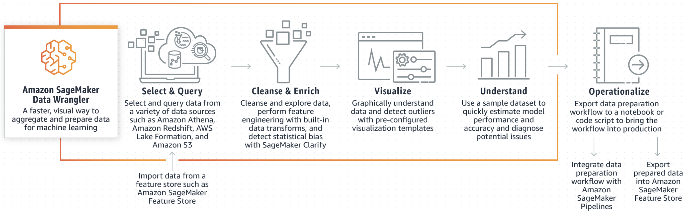
</p>

### Amazon SageMaker Debugger
Optimize ML models with real-time monitoring of training metrics and system resources

#### Automatic detection, analysis, and alerts
Amazon SageMaker Debugger can reduce troubleshooting during training from days to minutes by automatically detecting and alerting you to remediate common training errors such as gradient values becoming too large or too small. Alerts can be viewed in Amazon SageMaker Studio or configured through Amazon CloudWatch. Additionally, the SageMaker Debugger SDK enables you to automatically detect new classes of model-specific errors such as data sampling, hyperparameter values, and out of bound values.

#### Monitoring and profiling
Amazon SageMaker Debugger automatically monitors utilization of system resources such as GPUs, CPUs, network, and memory, and profiles your training jobs to collect detailed ML framework metrics. You can inspect all resource metrics visually through SageMaker Studio. Anomalies in resource utilization are correlated to specific operations for identification of bottlenecks such as over-utilized CPUs so you can take corrective action quickly. Additionally, a detailed report can be downloaded for offline analysis. Training runs can be profiled either at the start of the training job or at any point when training is in progress.

#### Built-in analytics
Amazon SageMaker Debugger comes with built-in analytics that automatically analyze data emitted during training such as inputs, outputs, and transformations known as tensors. As a result, you can detect whether a model is overfitting or overtraining, whether gradients are getting too large or too small, whether GPU resources are underutilized, and other bottlenecks during training. With SageMaker Debugger, you can also create your own custom conditions to test for specific behavior in your training jobs. These conditions can invoke actions such as stopping a training job and sending an SMS or email. Early stopping of training jobs will help reduce training costs for suboptimal models and develop better prototypes faster.

#### Broad support across ML algorithms and DL frameworks
Amazon SageMaker Debugger supports ML frameworks including TensorFlow, PyTorch, Apache MXNet, Keras, and XGBoost. SageMaker’s built-in containers for these frameworks come pre-installed with SageMaker Debugger, enabling you to monitor, profile, and debug your training scripts easily. By default, SageMaker Debugger monitors system hardware utilization and losses during training without writing additional code to monitor each resource separately.

#### Integration with AWS Lambda
Amazon SageMaker Debugger is integrated with AWS Lambda so you can act on results from alerts. For example, AWS Lambda functions can automatically stop a training job when a non-converging action such as losses continuously increasing rather than decreasing over time, is detected. AWS Lambda provides notifications to stop training jobs so you can reduce costs and achieve desired results during the early stages of ML development and training.

<p style="text-align: center">
  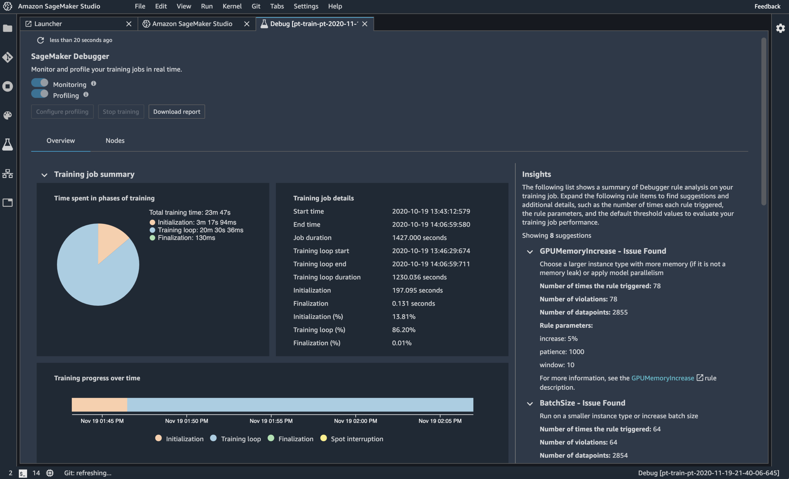
</p>

### Amazon SageMaker Model Deployment
Easily deploy and manage machine learning (ML) models for inference

Amazon SageMaker makes it easy to deploy ML models to make predictions (also known as inference) at the best price-performance for any use case. It provides a broad selection of ML infrastructure and model deployment options to help meet all your ML inference needs. It is a fully managed service and integrates with MLOps tools, so you can scale your model deployment, reduce inference costs, manage models more effectively in production, and reduce operational burden.

<p style="text-align: center">
  
</p>

### Distributed training libraries
Complete distributed training up to 40% faster

Amazon SageMaker offers the fastest and easiest methods for training large deep learning models and datasets. Using partitioning algorithms, SageMaker's distributed training libraries automatically split large deep learning models and training datasets across AWS GPU instances in a fraction of the time it takes to do manually. SageMaker achieves these efficiencies through two techniques: data parallelism and model parallelism. Model parallelism splits models too large to fit on a single GPU into smaller parts before distributing across multiple GPUs to train, and data parallelism splits large datasets to train concurrently in order to improve training speed.

ML use cases such as image classification and text-to-speech demand increasingly larger computational requirements and datasets. For example BERT, a state-of-the-art natural language processing (NLP) model released in 2018, uses 340 million parameters. Now, state-of-the-art NLP models, such as T5, GPT-3, and Turing-NLG, have set new accuracy records, but require tens to hundreds of billions of parameters. Training models like T5 or GPT-3 on a single GPU instance can take several days, slowing your ability to deploy the latest iterations into production. Additionally, implementing your own data and model parallelism strategies manually can take weeks of experimentation.

With only a few lines of additional code, you can add either data parallelism or model parallelism to your PyTorch and TensorFlow training scripts and Amazon SageMaker will apply your selected method for you. SageMaker will determine the best approach to split your model by using graph partitioning algorithms to balance the computation of each GPU while minimizing the communication between GPU instances. SageMaker also optimizes your distributed training jobs through algorithms that are designed to fully utilize AWS compute and network infrastructure in order to achieve near-linear scaling efficiency, which allows you to complete training faster than manual implementations.

### Amazon SageMaker Edge
Easily operate machine learning (ML) models running on edge devices

#### Build and refine models for increased accuracy over time
The SageMaker Edge Agent allows you to capture data and metadata based on triggers that you set so that you can retrain your existing models with real-world data or build new models. Additionally, this data can be used to conduct your own analysis, such as model drift analysis.

#### Your choice of deployment methods
We offer three options for deployment. GGv2 (~ size 100MB) is a fully integrated AWS IoT deployment mechanism. For those customers with a limited device capacity, we have a smaller built-in deployment mechanism within SageMaker Edge. For customers who have a preferred deployment mechanism, we support third party mechanisms that can be plugged into our user flow.

#### Visual dashboard to monitor your fleet of devices
Amazon SageMaker Edge Manager provides a dashboard so you can understand the performance of models running on each device across your fleet. The dashboard helps you visually understand overall fleet health and identify the problematic models through a dashboard in the console. When a problem is identified, you can collect model data, relabel the data, retrain the model, and redeploy the model.

#### Optimize ML models for a wide range of devices
Amazon SageMaker Edge Compiler automatically optimizes ML models for deployment on a wide variety of edge devices. SageMaker Edge Compiler compiles your trained model into an executable format that applies performance optimizations that can make your model run up to 25x faster on the target hardware.

#### Support Security and Compliance
Amazon SageMaker Edge packages the ML model by signing it with customer-supplied keys or AWS keys. The Edge Agent authenticates the signature and also verifies that the model has not been tampered with before loading the model into the runtime.

### Amazon SageMaker Feature Store
A fully managed service for machine learning features

Amazon SageMaker Feature Store is a fully managed, purpose-built repository to store, share, and manage features for machine learning (ML) models. Features are inputs to ML models used during training and inference. For example, in an application that recommends a music playlist, features could include song ratings, listening duration, and listener demographics. Features are used repeatedly by multiple teams and feature quality is critical to ensure a highly accurate model. Also, when features used to train models offline in batch are made available for real-time inference, it’s hard to keep the two feature stores synchronized. SageMaker Feature Store provides a secured and unified store for feature use across the ML lifecycle.

<p style="text-align: center">
  
</p>

### Amazon SageMaker Data Labeling
Create high-quality datasets for training machine learning models

Amazon SageMaker enables you to identify raw data, such as images, text files, and videos; add informative labels; and generate labeled synthetic data to create high-quality training datasets for your machine learning (ML) models. SageMaker offers two options, Amazon SageMaker Ground Truth Plus and Amazon SageMaker Ground Truth, which provide you with the flexibility to use an expert workforce to create and manage data labeling workflows on your behalf or manage your own data labeling workflows.

#### Amazon SageMaker Ground Truth Plus

With SageMaker Ground Truth Plus, you can create high-quality training datasets without having to build labeling applications or manage labeling workforces on your own. SageMaker Ground Truth Plus helps reduce data labeling costs by up to 40%. SageMaker Ground Truth Plus provides an expert workforce that is trained on ML tasks and can help meet your data security, privacy, and compliance requirements. You upload your data, and then SageMaker Ground Truth Plus creates and manages data labeling workflows and the workforce on your behalf.

<p style="text-align: center">
  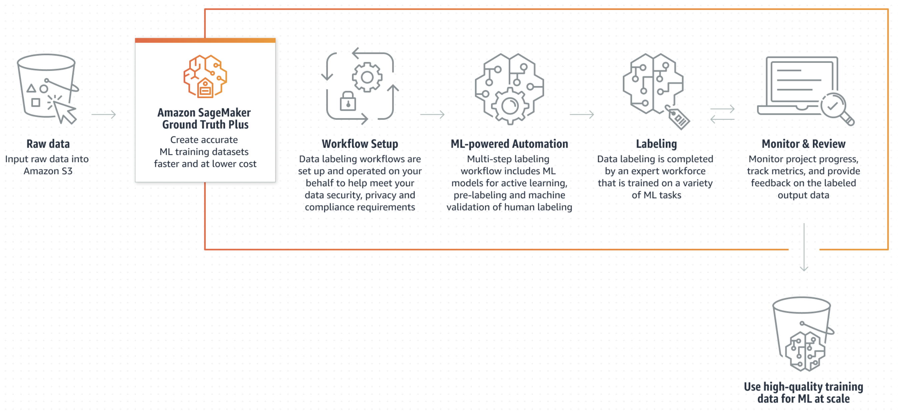
</p>

#### Amazon SageMaker Ground Truth

If you want the flexibility to build and manage your own data labeling workflows and workforce, you can use SageMaker Ground Truth. SageMaker Ground Truth is a data labeling service that makes it easy to label data and gives you the option to use human annotators through Amazon Mechanical Turk, third-party vendors, or your own private workforce.

You can also generate labeled synthetic data without manually collecting or labeling real-world data. SageMaker Ground Truth can generate hundreds of thousands of automatically labeled synthetic images on your behalf.

<p style="text-align: center">
  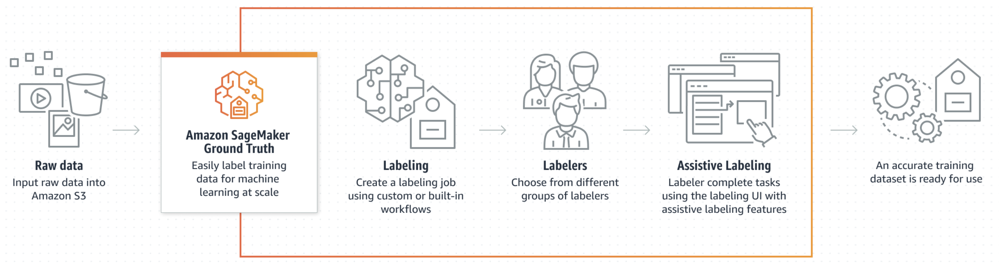
</p>

#### Amazon SageMaker Ground Truth generate labeled synthetic data.

<p style="text-align: center">
  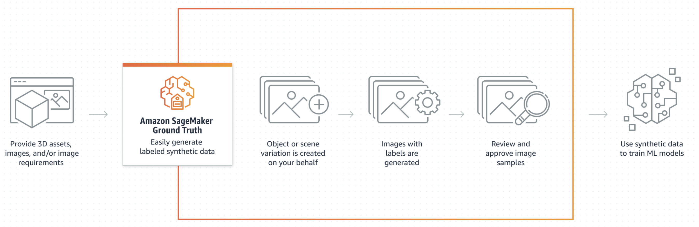
</p>

#### Amazon SageMaker Ground Truth Feature Comparison

<p style="text-align: center">
  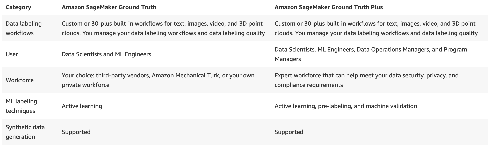
</p>

### Amazon SageMaker JumpStart
Built-in algorithms and pre-built machine learning (ML) solutions that you can deploy with just a few clicks

#### Built-in Algorithms
SageMaker JumpStart provides hundreds of built-in algorithms with pre-trained models from model hubs, including TensorFlow Hub, PyTorch Hub, HuggingFace, and MxNet GluonCV. You can also access built-in algorithms using the SageMaker Python SDK. Built-in algorithms cover common ML tasks, such as data classifications (image, text, tabular) and sentiment analysis.

<p style="text-align: center">
  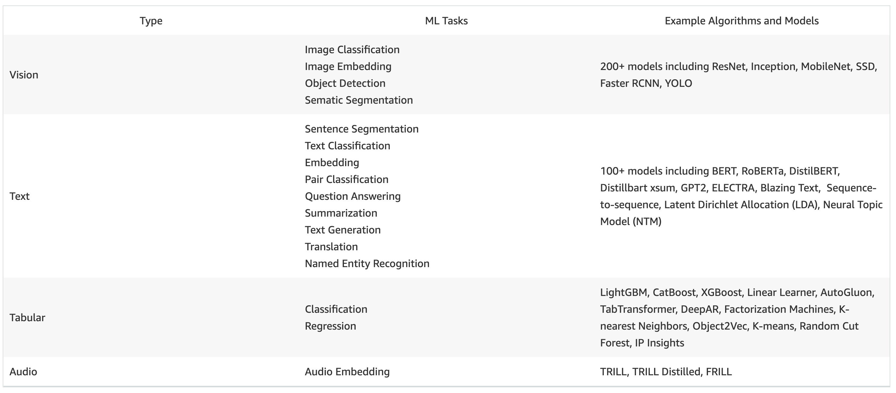
</p>

#### Pre-built Solutions
Pre-built solutions can be used for common use cases and are fully customizable.

<p style="text-align: center">
  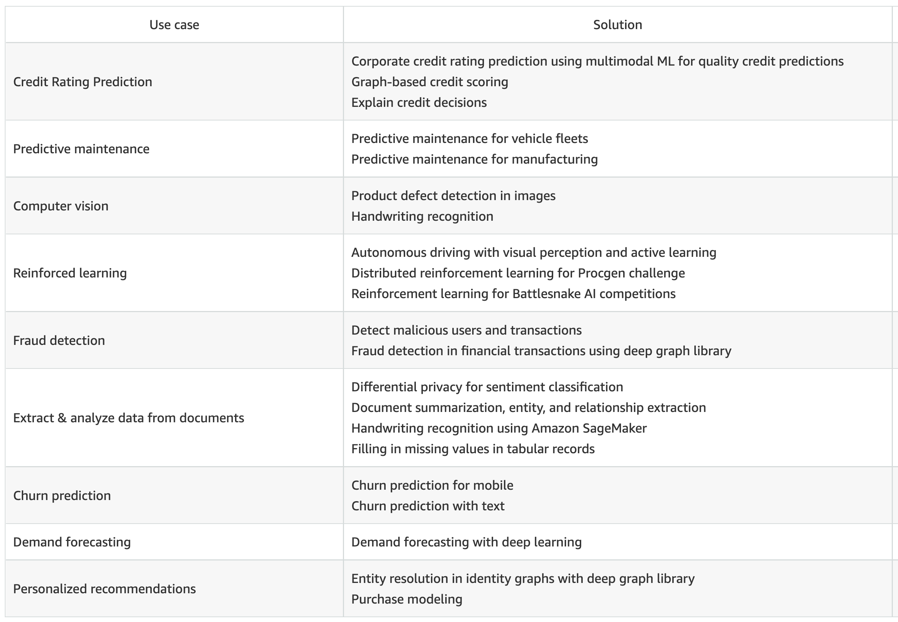
</p>

### ML Ops with Amazon SageMaker and Kubernetes
Simplify Kubernetes-based machine learning with Amazon SageMaker

Kubernetes is an open source system used to automate the deployment, scaling, and management of containerized applications. Kubeflow Pipelines is a workflow manager that offers an interface to manage and schedule machine learning (ML) workflows on a Kubernetes cluster. Using open source tools offers flexibility and standardization, but requires time and effort to set up infrastructure, provision notebook environments for data scientists, and stay up-to-date with the latest deep learning framework versions.

Amazon SageMaker Operators for Kubernetes and Components for Kubeflow Pipelines enable the use of fully managed SageMaker machine learning tools across the ML workflow natively from Kubernetes or Kubeflow. This eliminates the need for you to manually manage and optimize your Kubernetes-based ML infrastructure while still preserving control over orchestration and flexibility.

<p style="text-align: center">
  
</p>

### Amazon SageMaker Model Monitor
Keep machine learning models accurate over time

#### Data collection and monitoring
With Amazon SageMaker Model Monitor, you can select the data you would like to monitor and analyze without the need to write any code. SageMaker Model Monitor lets you select data from a menu of options such as prediction output, and captures metadata such as timestamp, model name, and endpoint so you can analyze model predictions based on the metadata. You can specify the sampling rate of data capture as a percentage of overall traffic in the case of high volume real-time predictions, and the data is stored in your own Amazon S3 bucket. You can also encrypt this data, configure fine-grained security, define data retention policies, and implement access control mechanisms for secure access.

#### Built-in analysis
Amazon SageMaker Model Monitor offers built-in analysis in the form of statistical rules, to detect drifts in data and model quality. You can also write custom rules and specify thresholds for each rule. The rules can then be used to analyze model performance. SageMaker Model Monitor runs rules on the data collected, detects anomalies, and records rule violations.

#### Visualizations
All metrics emitted by Amazon SageMaker Model Monitor can be collected and viewed in [Amazon SageMaker Studio](https://aws.amazon.com/sagemaker/studio/), so you can visually analyze your model performance without writing additional code. Not only can you visualize your metrics, but you can also run ad-hoc analysis in a SageMaker notebook instance to understand your models better.

<p style="text-align: center">
  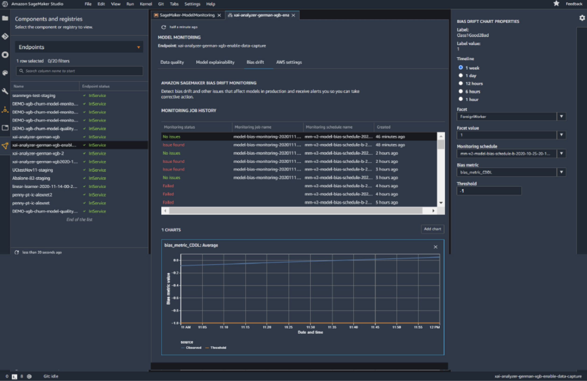
</p>

#### Ongoing model prediction
Amazon SageMaker Model Monitor allows you to ingest data from your ML application in order to compute model performance. The data is stored in Amazon S3 and secured through access control, encryption, and data retention policies.

#### Monitoring schedule
You can monitor your ML models by scheduling monitoring jobs through Amazon SageMaker Model Monitor. You can automatically kick off monitoring jobs to analyze model predictions during a given time period. You can also have multiple schedules on a SageMaker endpoint.

#### Integration with Amazon SageMaker Clarify
Amazon SageMaker Model Monitor is integrated with Amazon SageMaker Clarify to improve visibility into potential bias. Although your initial data or model may not have been biased, changes in the world may cause bias to develop over time in a model that has already been trained. For example, a substantial change in home buyer demographics could cause a home loan application model to become biased if certain populations were not present in the original training data. Integration with SageMaker Clarify enables you to configure alerting systems such as Amazon CloudWatch to notify you, if your model begins to develop bias.

#### Reports and alerts
The reports generated by monitoring jobs can be saved in Amazon S3 for further analysis. Amazon SageMaker Model Monitor emits metrics to Amazon CloudWatch where you can consume notifications to trigger alarms or corrective actions such as retraining the model or auditing data. The metrics include information such as rules that were violated and timestamp information. SageMaker Model Monitor also integrates with other visualization tools including Tensorboard, Amazon QuickSight, and Tableau.

### Amazon SageMaker Notebooks
Fully managed notebooks (Powered by Jupyter) for exploring data and building ML models

#### SageMaker Studio Notebooks
Quick start, collaborative notebooks that integrate with purpose-built ML tools in SageMaker and other AWS services for your end-to-end ML development, from preparing data at peta-byte scale using Spark on Amazon EMR, to training and debugging models, tracking experiments, deploying and monitoring models and managing pipelines – all in Amazon SageMaker Studio – a fully integrated development environment (IDE) for ML. Easily dial up or down compute resources without interrupting your work. Share notebooks easily with your team using a sharable link.

<p style="text-align: center">
  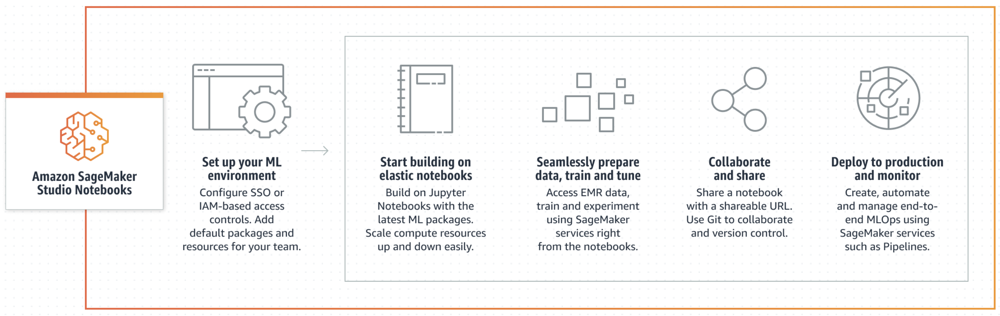
</p>


#### Notebook Instances
Stand-alone fully-managed Jupyter Notebook instances in the Amazon SageMaker console. Choose from the broadest choice of compute resources available in the cloud, including GPUs for accelerated computing, and work with the latest versions of open source software that you are already familiar with.

<p style="text-align: center">
  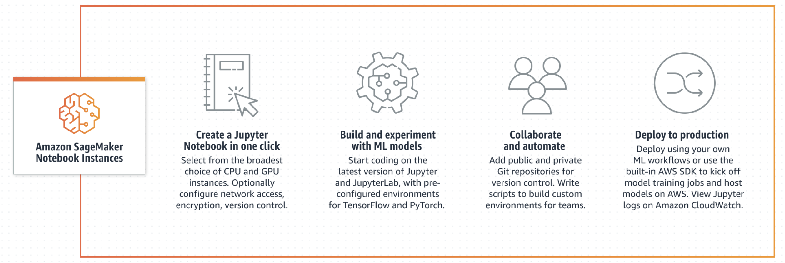
</p>

<!--
```python
#https://youtu.be/78bij26G-8M
from IPython.display import YouTubeVideo
## Tutorial Video Name: SageMaker Studio Notebooks
YouTubeVideo('78bij26G-8M', width=720, height=480)
```
-->


<iframe
    width="720"
    height="480"
    src="https://www.youtube.com/embed/78bij26G-8M"
    frameborder="0"
    allowfullscreen
></iframe>


### Amazon SageMaker Pipelines
First purpose-built CI/CD service for machine learning

#### Key Features
##### Compose, manage, and reuse ML workflows
Using Amazon SageMaker Pipelines, you can create ML workflows with an easy-to-use Python SDK, and then visualize and manage your workflow using Amazon SageMaker Studio. You can be more efficient and scale faster by storing and reusing the workflow steps you create in SageMaker Pipelines. You can also get started quickly with built-in templates to build, test, register, and deploy models so you can get started with CI/CD in your ML environment quickly.

<p style="text-align: center">
  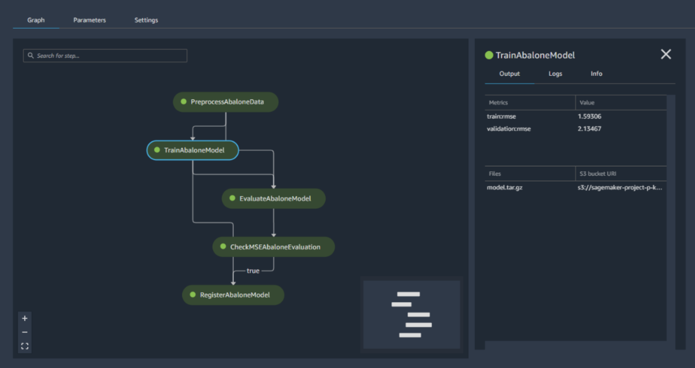
</p>

##### Choose the best models for deploying into production
Many customers have hundreds of workflows, each with a different version of the same model. With the SageMaker Pipelines model registry, you can track these versions in a central repository where it is easy to choose the right model for deployment based on your business requirements. You can use SageMaker Studio to browse and discover models, or you can access them through the SageMaker Python SDK.

##### Automatic tracking of models
Amazon SageMaker Pipelines logs every step of your workflow, creating an audit trail of model components such as training data, platform configurations, model parameters, and learning gradients. Audit trails can be used to recreate models and help support compliance requirements.

##### Bring CI/CD to machine learning
Amazon SageMaker Pipelines brings CI/CD practices to machine learning, such as maintaining parity between development and production environments, version control, on-demand testing, and end-to-end automation, helping you scale ML throughout your organization.

### RStudio on Amazon SageMaker
Fully-managed RStudio integrated development environment (IDE) for data science and machine learning

RStudio on Amazon SageMaker is the first fully managed cloud-based RStudio Workbench. You can quickly launch the familiar RStudio integrated development environment (IDE), and dial up and down the underlying compute resources without interrupting your work, making it easy to build machine learning (ML) and analytics solutions in R at scale.

<p style="text-align: center">
  
</p>

### Amazon SageMaker Studio Lab
Learn and experiment with ML using a no-setup, free development environment

Amazon SageMaker Studio Lab is a free machine learning (ML) development environment that provides the compute, storage (up to 15GB), and security—all at no cost—for anyone to learn and experiment with ML. All you need to get started is a valid email address—you don’t need to configure infrastructure or manage identity and access or even sign up for an AWS account. SageMaker Studio Lab accelerates model building through GitHub integration, and it comes preconfigured with the most popular ML tools, frameworks, and libraries to get you started immediately. SageMaker Studio Lab automatically saves your work so you don’t need to restart in between sessions. It’s as easy as closing your laptop and coming back later.

<p style="text-align: center">
  
</p>


<!--
```python
#https://youtu.be/k2nVIvHB1dk
from IPython.display import YouTubeVideo
## Tutorial Video Name: SageMaker Studio Lab
YouTubeVideo('k2nVIvHB1dk', width=720, height=480)
```
-->


<iframe
    width="720"
    height="480"
    src="https://www.youtube.com/embed/k2nVIvHB1dk"
    frameborder="0"
    allowfullscreen
></iframe>


### Amazon SageMaker Studio
The fully integrated development environment (IDE) for machine learning

Amazon SageMaker Studio is an integrated development environment (IDE) that provides a single, web-based visual interface where you can access purpose-built tools to perform all machine learning (ML) development steps, from preparing data to building, training, and deploying your ML models, improving data science team productivity by up to 10x. You can quickly upload data, create new notebooks, train and tune models, move back and forth between steps to adjust experiments, and deploy models to production without leaving Studio.

<p style="text-align: center">
  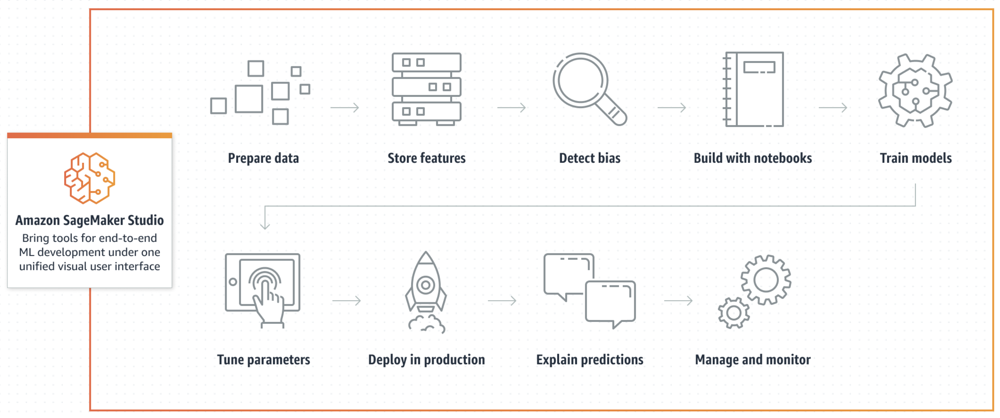
</p>

<!--
```python
#https://youtu.be/jSrg1BgQzRo
from IPython.display import YouTubeVideo
## Tutorial Video Name: SageMaker Studio Lab
YouTubeVideo('jSrg1BgQzRo', width=720, height=480)
```
-->


<iframe
    width="720"
    height="480"
    src="https://www.youtube.com/embed/jSrg1BgQzRo"
    frameborder="0"
    allowfullscreen

></iframe>


### Amazon SageMaker Model Training
Train ML models quickly and cost effectively with Amazon SageMaker

Amazon SageMaker Model Training reduces the time and cost to train and tune machine learning (ML) models at scale without the need to manage infrastructure. You can take advantage of the highest-performing ML compute infrastructure currently available, and SageMaker can automatically scale infrastructure up or down, from one to thousands of GPUs. Since you pay only for what you use, you can manage your training costs more effectively. To train deep learning models faster, SageMaker distributed training libraries can automatically split large models and training datasets across AWS GPU instances, or you can use third-party libraries, such as DeepSpeed, Horovod, or Megatron.

<p style="text-align: center">
  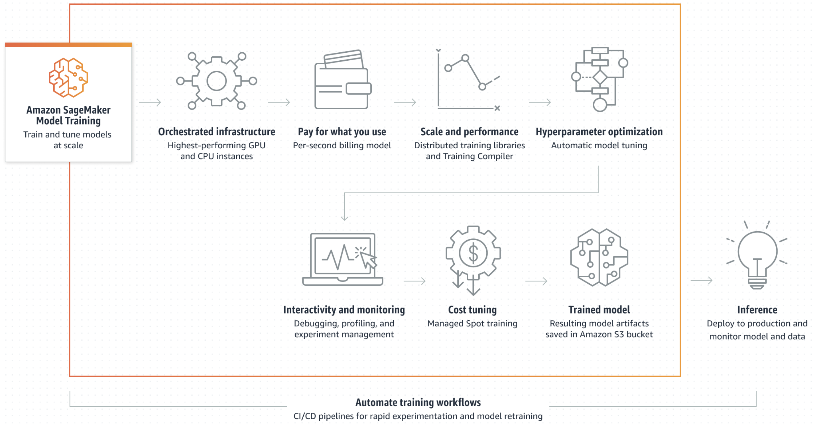
</p>

<hr style="height:10px;border-width:0;color:gray;background-color:gray">

```c-lms
topic: Bokeh and other Visualization Packages
```
## Bokah

<p style="text-align: left">
  
</p>

Bokeh is a Python library for creating interactive visualizations for modern web browsers. It helps you build beautiful graphics, ranging from simple plots to complex dashboards with streaming datasets. With Bokeh, you can create JavaScript-powered visualizations without writing any JavaScript yourself.

| [First steps](https://docs.bokeh.org/en/latest/docs/first_steps.html) 
| [User guide ](https://docs.bokeh.org/en/latest/docs/user_guide.html) 
| [Gallery ](https://docs.bokeh.org/en/latest/docs/gallery.html) 
| [Reference ](https://docs.bokeh.org/en/latest/docs/reference.html) 
| [Contribute ](https://docs.bokeh.org/en/latest/docs/dev_guide.html) 
| [Releases ](https://docs.bokeh.org/en/latest/docs/releases.html) 
| [Tutorial ](https://mybinder.org/v2/gh/bokeh/bokeh-notebooks/master?filepath=tutorial%2F00%20-%20Introduction%20and%20Setup.ipynb) 
| [Community ](https://discourse.bokeh.org/) |


<p style="text-align: center">
  
</p>

---

## Matplotlib

<p style="text-align: left">
  
</p>

| [Plot types](https://matplotlib.org/stable/plot_types/index.html)
| [Examples ](https://matplotlib.org/stable/gallery/index.html)
| [Tutorials ](https://matplotlib.org/stable/tutorials/index.html)
| [Reference ](https://matplotlib.org/stable/api/index.html)
| [User guide ](https://matplotlib.org/stable/users/index.html)
| [Develop ](https://matplotlib.org/stable/devel/index.html)
| [Release notes ](https://matplotlib.org/stable/users/release_notes.html) |

<p style="text-align: center">
  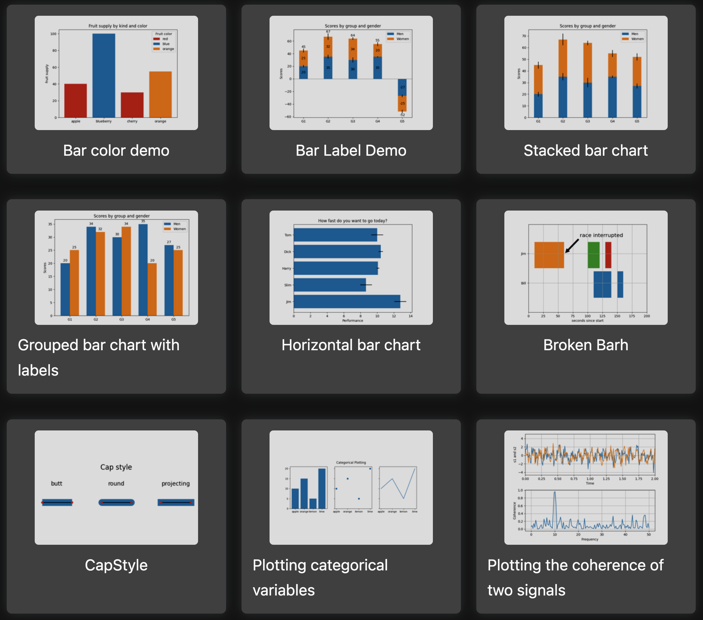
</p>

---

## Plotly

<p style="text-align: left">
  
</p>

| [Graphing Libraries](https://plotly.com/graphing-libraries/) |

<p style="text-align: center">
  
</p>

---

## Seaborn

<p style="text-align: left">
  
</p>

| [ Installing ](https://seaborn.pydata.org/installing.html)
| [ Gallery ](https://seaborn.pydata.org/examples/index.html)
| [ Tutorial ](https://seaborn.pydata.org/tutorial.html)
| [ API ](https://seaborn.pydata.org/api.html)
| [ Releases ](https://seaborn.pydata.org/whatsnew/index.html)
| [ Citing ](https://seaborn.pydata.org/citing.html)
| [ FAQ ](https://seaborn.pydata.org/faq.html) |

<p style="text-align: center">
  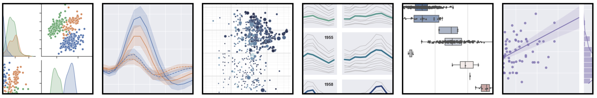
</p>


## Review and Practice <a class="anchor" id="DS107L8.3_quiz"></a>

Below you will find a quiz to review the recently covered material. Quizzes are _not_ graded.

```c-lms
start-activity: DS107L8.3 Jupyter SageMaker Bokeh Quiz
```

```c-lms
topic: Data Analytics Lab 5 - Analyze Data with Amazon SageMaker, Jupyter Notebooks, and Bokeh
```

## Lab 5 - Analyze Data with Amazon SageMaker, Jupyter Notebooks, and Bokeh

<!--
```python
#https://vimeo.com/762405184
from IPython.display import VimeoVideo
## Tutorial Video Name: Data Analytics Lab 5 - Analyze Data with Amazon SageMaker, Jupyter Notebooks, and Bokeh 
VimeoVideo('762405184', width=720, height=480)
```
-->


<div style="padding:56.66% 0 0 0;position:relative;"><iframe src="https://player.vimeo.com/video/762405184?h=a37f6fb2cf&amp;badge=0&amp;autopause=0&amp;player_id=0&amp;app_id=58479" frameborder="0" allow="autoplay; fullscreen; picture-in-picture" allowfullscreen style="position:absolute;top:0;left:0;width:100%;height:100%;" title="Data Analytics Lab 5 - Analyze Data with Amazon SageMaker, Jupyter Notebooks, and Bokeh"></iframe></div><script src="https://player.vimeo.com/api/player.js"></script>


```c-lms
topic: AWS Data Pipeline
```

## AWS Data Pipeline
Easily automate the movement and transformation of data.

AWS Data Pipeline is a web service that helps you reliably process and move data between different AWS compute and storage services, as well as on-premises data sources, at specified intervals. With AWS Data Pipeline, you can regularly access your data where it’s stored, transform and process it at scale, and efficiently transfer the results to AWS services such as Amazon S3, Amazon RDS, Amazon DynamoDB, and Amazon EMR.

AWS Data Pipeline helps you easily create complex data processing workloads that are fault tolerant, repeatable, and highly available. You don’t have to worry about ensuring resource availability, managing inter-task dependencies, retrying transient failures or timeouts in individual tasks, or creating a failure notification system. AWS Data Pipeline also allows you to move and process data that was previously locked up in on-premises data silos.

### What is AWS Data Pipeline?

AWS Data Pipeline is a web service that you can use to automate the movement and transformation of data. With AWS Data Pipeline, you can define data-driven workflows, so that tasks can be dependent on the successful completion of previous tasks. You define the parameters of your data transformations and AWS Data Pipeline enforces the logic that you've set up.

The following components of AWS Data Pipeline work together to manage your data:

- A pipeline definition specifies the business logic of your data management. For more information, see Pipeline Definition File Syntax.

- A pipeline schedules and runs tasks by creating Amazon EC2 instances to perform the defined work activities. You upload your pipeline definition to the pipeline, and then activate the pipeline. You can edit the pipeline definition for a running pipeline and activate the pipeline again for it to take effect. You can deactivate the pipeline, modify a data source, and then activate the pipeline again. When you are finished with your pipeline, you can delete it.

Task Runner polls for tasks and then performs those tasks. For example, Task Runner could copy log files to Amazon S3 and launch Amazon EMR clusters. Task Runner is installed and runs automatically on resources created by your pipeline definitions. You can write a custom task runner application, or you can use the Task Runner application that is provided by AWS Data Pipeline. For more information, see Task Runners.

For example, you can use AWS Data Pipeline to archive your web server's logs to Amazon Simple Storage Service (Amazon S3) each day and then run a weekly Amazon EMR (Amazon EMR) cluster over those logs to generate traffic reports. AWS Data Pipeline schedules the daily tasks to copy data and the weekly task to launch the Amazon EMR cluster. AWS Data Pipeline also ensures that Amazon EMR waits for the final day's data to be uploaded to Amazon S3 before it begins its analysis, even if there is an unforeseen delay in uploading the logs.

<p style="text-align: center">
  
</p>

### Accessing AWS Data Pipeline
You can create, access, and manage your pipelines using any of the following interfaces:

__AWS Management Console__ — Provides a web interface that you can use to access AWS Data Pipeline.

__AWS Command Line Interface (AWS CLI)__ — Provides commands for a broad set of AWS services, including AWS Data Pipeline, and is supported on Windows, macOS, and Linux. For more information about installing the AWS CLI, see [AWS Command Line Interface](https://aws.amazon.com/cli/). For a list of commands for AWS Data Pipeline, see [datapipeline](https://docs.aws.amazon.com/cli/latest/reference/datapipeline/index.html).

__AWS SDKs__ — Provides language-specific APIs and takes care of many of the connection details, such as calculating signatures, handling request retries, and error handling. For more information, see [AWS SDKs](http://aws.amazon.com/tools/#SDKs).

__Query API__ — Provides low-level APIs that you call using HTTPS requests. Using the Query API is the most direct way to access AWS Data Pipeline, but it requires that your application handle low-level details such as generating the hash to sign the request, and error handling. For more information, see the [AWS Data Pipeline API Reference](https://docs.aws.amazon.com/datapipeline/latest/APIReference/).


```c-lms
topic: Configuring connections in Amazon Redshift
```

## Configuring connections in Amazon Redshift

In the following section, you can find how to configure JDBC, Python, and ODBC connections to connect to your cluster from SQL client tools. This section describes how to set up JDBC, Python, and ODBC connections. It also describes how to use Secure Sockets Layer (SSL) and server certificates to encrypt communication between the client and server.

## JDBC, Python, and ODBC drivers for Amazon Redshift
To work with data in your cluster, you need JDBC, Python, or ODBC drivers for connectivity from your client computer or instance. Code your applications to use JDBC, Python, or ODBC data access API operations, and use SQL client tools that support either JDBC, Python, or ODBC.

Amazon Redshift offers JDBC, Python, and ODBC drivers for download. These drivers are supported by AWS Support. PostgreSQL drivers are not tested and not supported by the Amazon Redshift team. Use the Amazon Redshift–specific drivers when connecting to an Amazon Redshift cluster. The Amazon Redshift drivers have the following advantages:

- Support for IAM, SSO, and federated authentication.
- Support for new Amazon Redshift data types.
- Support for authentication profiles.
- Improved performance in conjunction with Amazon Redshift enhancements.

For more information about how to download the JDBC and ODBC drivers and configure connections to your cluster, see [Configuring a connection for JDBC driver version 2.1 for Amazon Redshift](https://docs.aws.amazon.com/redshift/latest/mgmt/jdbc20-install.html), [Configuring the Amazon Redshift Python connector](https://docs.aws.amazon.com/redshift/latest/mgmt/python-redshift-driver.html), and [Configuring an ODBC connection](https://docs.aws.amazon.com/redshift/latest/mgmt/configure-odbc-connection.html).

## Finding your cluster connection string
To connect to your cluster with your SQL client tool, you need the cluster connection string. You can find the cluster connection string in the Amazon Redshift console, on a cluster's details page.

To find the connection string for a cluster:

1. Sign in to the AWS Management Console and open the Amazon Redshift console at [https://console.aws.amazon.com/redshift/](https://console.aws.amazon.com/redshift/).

2. On the navigation menu, choose Clusters, then choose the cluster name from the list to open its details.

3. The JDBC URL and ODBC URL connection strings are available, along with additional details, in the General information section. Each string is based on the AWS Region where the cluster runs. Click the icon next to the appropriate connection string to copy it.

```c-lms
topic: Querying a Database in AWS Redshift
```

## Querying a Database in AWS Redshift


To query databases hosted by your Amazon Redshift cluster, you have two options:

1. Connect to your cluster and run queries on the AWS Management Console with the query editor.

If you use the query editor on the Amazon Redshift console, you don't have to download and set up a SQL client application.

2. Connect to your cluster through a SQL client tool, such as SQL Workbench/J.

Amazon Redshift supports SQL client tools connecting through Java Database Connectivity (JDBC) and Open Database Connectivity (ODBC). Amazon Redshift doesn't provide or install any SQL client tools or libraries, so you must install them on your client computer or Amazon EC2 instance to use them. You can use most SQL client tools that support JDBC or ODBC drivers.

- [Querying a database using the Amazon Redshift query editor v2](https://docs.aws.amazon.com/redshift/latest/mgmt/query-editor-v2.html)
- [Querying a database using the query editor](https://docs.aws.amazon.com/redshift/latest/mgmt/query-editor.html)
- [Connecting to an Amazon Redshift cluster using SQL client tools](https://docs.aws.amazon.com/redshift/latest/mgmt/connecting-to-cluster.html)
- [Using the Amazon Redshift Data API](https://docs.aws.amazon.com/redshift/latest/mgmt/data-api.html)

## Review and Practice <a class="anchor" id="DS107L8.7_quiz"></a>

Below you will find a quiz to review the recently covered material. Quizzes are _not_ graded.

```c-lms
start-activity: DS107L8.7 Data Pipeline Query Redshift Quiz
```

```c-lms
topic: Data Analytics Lab 6 - Automate Loading Data with AWS Data Pipelinet
```
## Data Analytics Lab 6 - Automate Loading Data with AWS Data Pipeline


<!--
```python
#https://vimeo.com/762463685
from IPython.display import VimeoVideo
## Tutorial Video Name: Data Analytics Lab 6 - Automate Loading Data with AWS Data Pipeline
VimeoVideo('762463685', width=720, height=480)
```
-->


<div style="padding:56.66% 0 0 0;position:relative;"><iframe src="https://player.vimeo.com/video/762463685?h=1589584ade&amp;badge=0&amp;autopause=0&amp;player_id=0&amp;app_id=58479" frameborder="0" allow="autoplay; fullscreen; picture-in-picture" allowfullscreen style="position:absolute;top:0;left:0;width:100%;height:100%;" title="Data Analytics Lab 6 - Automate Loading Data with AWS Data Pipeline"></iframe></div><script src="https://player.vimeo.com/api/player.js"></script>


```c-lms
topic: Key Terms
```
## Key Terms

Below is a list and short description of the important keywords learned in this lesson. Please read through and go back and review any concepts you do not fully understand. Great Work!

<table class="table table-striped">
    <tr>
        <th>Keyword</th>
        <th>Description</th>
    </tr>
    <tr>
        <td style="font-weight: bold;" nowrap>Project Jupyter </td>
        <td>Open-source software, open-standards, and services for interactive computing across dozens of programming languages.</td>
    </tr>
    <tr>
        <td style="font-weight: bold;" nowrap>Jupyter Notebook</td>
        <td>A web application: a browser-based tool for interactive authoring of documents which combine explanatory text, mathematics, computations and their rich media output.</td>
    </tr>
    <tr>
        <td style="font-weight: bold;" nowrap>JupyterLab</td>
        <td>JupyterLab enables you to work with documents and activities such as Jupyter notebooks, text editors, terminals, and custom components in a flexible, integrated, and extensible manner. </td>
    </tr>
    <tr>
        <td style="font-weight: bold;" nowrap>Amazon SageMaker</td>
        <td>Build, train, and deploy machine learning (ML) models for any use case with fully managed infrastructure, tools, and workflows.</td>
    </tr>
       <tr>
        <td style="font-weight: bold;" nowrap>Amazon SageMaker Automatic Model Tuning </td>
        <td>(also known as hyperparameter tuning or hyperparameter optimization) finds the best version of your machine learning (ML) model by running multiple training jobs on your dataset using your specified algorithm and hyperparameter ranges.</td>
    </tr>
       <tr>
        <td style="font-weight: bold;" nowrap>Amazon SageMaker Autopilot</td>
        <td>Automatically create machine learning models with full visibility.</td>
    </tr>
       <tr>
        <td style="font-weight: bold;" nowrap>Amazon SageMaker Canvas</td>
        <td>Generate accurate ML predictions - no code required</td>
    </tr>
        </tr>
       <tr>
        <td style="font-weight: bold;" nowrap>Amazon SageMaker Clarify</td>
        <td>Amazon SageMaker Clarify provides machine learning developers with greater visibility into their training data and models so they can identify and limit bias and explain predictions.</td>
    </tr>
        </tr>
       <tr>
        <td style="font-weight: bold;" nowrap>Amazon SageMaker Data Wrangler</td>
        <td>The fastest and easiest way to prepare data for machine learning</td>
    </tr>
        </tr>
       <tr>
        <td style="font-weight: bold;" nowrap>Amazon SageMaker Debugger</td>
        <td>Optimize ML models with real-time monitoring of training metrics and system resources
    </td>
    </tr>
        </tr>
       <tr>
        <td style="font-weight: bold;" nowrap>Amazon SageMaker Model Deployment</td>
        <td>Deploy and manage machine learning (ML) models for inference</td>
    </tr>
           <tr>
        <td style="font-weight: bold;" nowrap>Amazon SageMaker Edge</td>
        <td>Operate machine learning (ML) models running on edge devices</td>
    </tr>
    <tr>
        <td style="font-weight: bold;" nowrap>Amazon SageMaker Feature Store</td>
        <td>Fully managed service for machine learning features</td>
    </tr>
    <tr>
        <td style="font-weight: bold;" nowrap>Amazon SageMaker Data Labeling</td>
        <td>Create high-quality datasets for training machine learning models</td>
    </tr>
    <tr>
        <td style="font-weight: bold;" nowrap>Amazon SageMaker Ground Truth Plus</td>
        <td>Create high-quality training datasets without having to build labeling applications or manage labeling workforces on your own</td>
    </tr>
    <tr>
        <td style="font-weight: bold;" nowrap>Amazon SageMaker JumpStart</td>
        <td>Built-in algorithms and pre-built machine learning (ML) solutions that you can deploy with just a few clicks</td>
    </tr>
    <tr>
        <td style="font-weight: bold;" nowrap>Amazon SageMaker Model Monitor</td>
        <td>Keep machine learning models accurate over time</td>
    </tr>
    <tr>
        <td style="font-weight: bold;" nowrap>Amazon SageMaker Notebooks</td>
        <td>Fully managed notebooks (Powered by Jupyter) for exploring data and building ML models</td>
    </tr>
    <tr>
        <td style="font-weight: bold;" nowrap>Amazon SageMaker Studio Notebooks</td>
        <td>Quick start, collaborative notebooks that integrate with purpose-built ML tools in SageMaker and other AWS services for your end-to-end ML development, from preparing data at peta-byte scale using Spark on Amazon EMR, to training and debugging models, tracking experiments, deploying and monitoring models and managing pipelines</td>
    </tr>
    <tr>
        <td style="font-weight: bold;" nowrap>Amazon SageMaker Pipelines</td>
        <td>you can create ML workflows with an easy-to-use Python SDK, and then visualize and manage your workflow using Amazon SageMaker Studio</td>
    </tr>
    <tr>
        <td style="font-weight: bold;" nowrap>RStudio on Amazon SageMaker</td>
        <td>Fully-managed RStudio integrated development environment (IDE) for data science and machine learning</td>
    </tr>
    <tr>
        <td style="font-weight: bold;" nowrap>Amazon SageMaker Studio Lab</td>
        <td>Amazon SageMaker Studio Lab is a free machine learning (ML) development environment that provides the compute, storage (up to 15GB), and security—all at no cost—for anyone to learn and experiment with ML.</td>
    </tr>
    <tr>
        <td style="font-weight: bold;" nowrap>Amazon SageMaker Studio</td>
        <td>Amazon SageMaker Studio is an integrated development environment (IDE) that provides a single, web-based visual interface where you can access purpose-built tools to perform all machine learning (ML) development steps, from preparing data to building, training, and deploying your ML models, improving data science team productivity by up to 10x.</td>
    </tr>
    <tr>
        <td style="font-weight: bold;" nowrap>AAmazon SageMaker Model Training</td>
        <td>Amazon SageMaker Model Training reduces the time and cost to train and tune machine learning (ML) models at scale without the need to manage infrastructure.</td>
    </tr>
    <tr>
        <td style="font-weight: bold;" nowrap>Bokah</td>
        <td>Bokeh is a Python library for creating interactive visualizations for modern web browsers.</td>
    </tr>
    <tr>
        <td style="font-weight: bold;" nowrap>AWS Data Pipeline</td>
        <td>Easily automate the movement and transformation of data.</td>
    </tr>
    <tr>
        <td style="font-weight: bold;" nowrap>AWS Management Console</td>
        <td>Provides a web interface that you can use to access AWS Data Pipeline.</td>
    </tr>
    <tr>
        <td style="font-weight: bold;" nowrap>AWS Command Line Interface (AWS CLI)</td>
        <td>Provides commands for a broad set of AWS services, including AWS Data Pipeline, and is supported on Windows, macOS, and Linux.</td>
    </tr>
    <tr>
        <td style="font-weight: bold;" nowrap>AWS SDKs</td>
        <td>Provides language-specific APIs and takes care of many of the connection details, such as calculating signatures, handling request retries, and error handling.</td>
    </tr>
    <tr>
        <td style="font-weight: bold;" nowrap>Query API</td>
        <td>Provides low-level APIs that you call using HTTPS requests.</td>
    </tr>
    <tr>
        <td style="font-weight: bold;" nowrap>JDBC</td>
        <td>Java DataBase Connector</td>
    </tr>
    <tr>
        <td style="font-weight: bold;" nowrap>ODBC</td>
        <td>Microsoft Open Database Connectivity</td>
    </tr>
</table>


---

```c-lms
topic: Lesson 8 Exam
```
## Lesson 8 Exam

```c-lms
start-activity: DS107L8.10 Lesson 8 Exam
```


