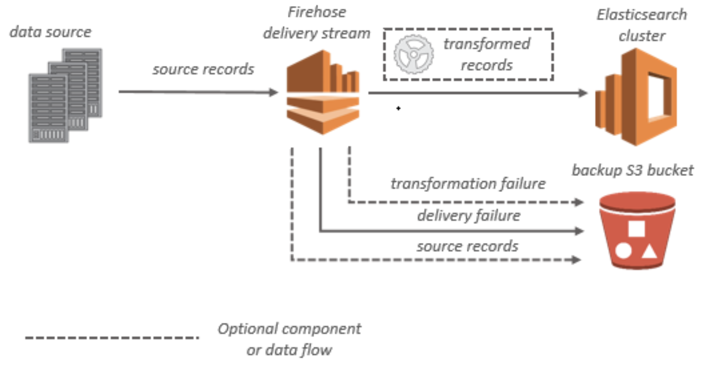
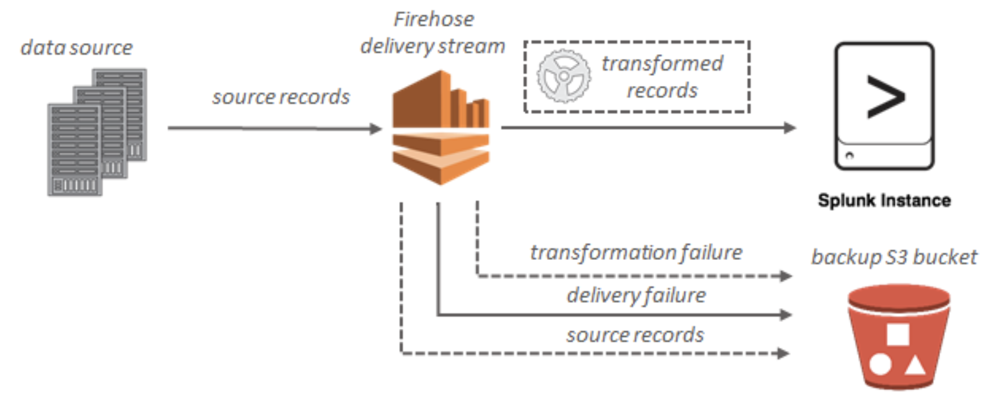
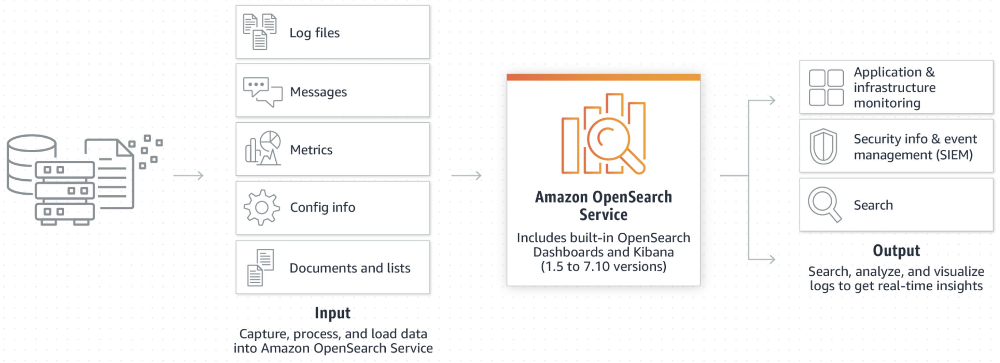
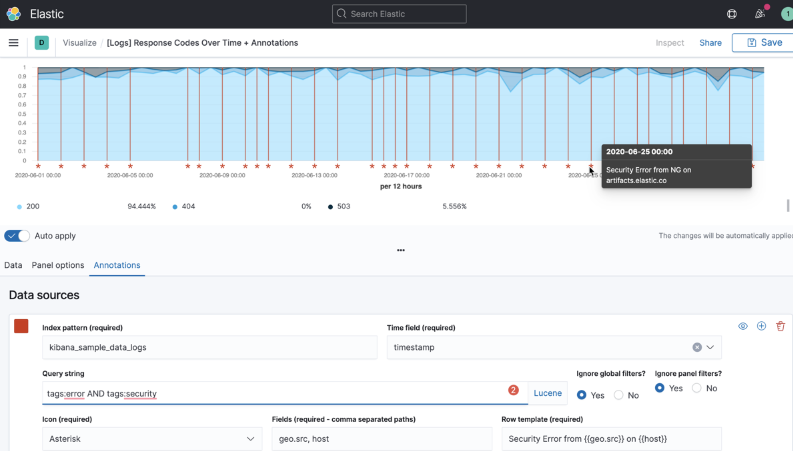
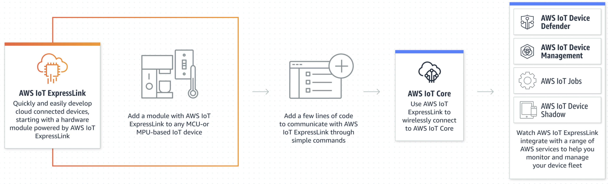

```c-lms
activity-name: AWS Analyze Streaming Data with Kinesis Firehose, Analyze IoT Data & Analytics
topic: Amazon Kinesis Data Firehose
```

# AWS Analyze Streaming Data Kinesis Firehose OpenSearch Kibana Analyze IoT Data & Analytics

## Amazon Kinesis Data Firehose
Reliably load real-time streams into data lakes, warehouses, and analytics services

Amazon Kinesis Data Firehose is an extract, transform, and load (ETL) service that reliably captures, transforms, and delivers streaming data to data lakes, data stores, and analytics services.

<p style="text-align: center">
  
</p>

## What Is Amazon Kinesis Data Firehose?

Amazon Kinesis Data Firehose is a fully managed service for delivering real-time [streaming data](http://aws.amazon.com/streaming-data/) to destinations such as Amazon Simple Storage Service (Amazon S3), Amazon Redshift, Amazon OpenSearch Service, Splunk, and any custom HTTP endpoint or HTTP endpoints owned by supported third-party service providers, including Datadog, Dynatrace, LogicMonitor, MongoDB, New Relic, and Sumo Logic. Kinesis Data Firehose is part of the Kinesis streaming data platform, along with [Kinesis Data Streams](https://docs.aws.amazon.com/kinesis/latest/dev/), [Kinesis Video Streams](https://docs.aws.amazon.com/kinesisvideostreams/latest/dg/), and [Amazon Kinesis Data Analytics](https://docs.aws.amazon.com/kinesisanalytics/latest/dev/). With Kinesis Data Firehose, you don't need to write applications or manage resources. You configure your data producers to send data to Kinesis Data Firehose, and it automatically delivers the data to the destination that you specified. You can also configure Kinesis Data Firehose to transform your data before delivering it.

For more information about AWS big data solutions, see [Big Data on AWS](http://aws.amazon.com/big-data/). For more information about AWS streaming data solutions, see [What is Streaming Data](http://aws.amazon.com/streaming-data/)?

### Use cases
Stream into data lakes and warehouses
Stream data into Amazon S3 and convert data into required formats for analysis without building processing pipelines.

### Boost security
Monitor network security in real time and create alerts when potential threats arise using supported Security Information and Event Management (SIEM) tools.

### Build ML streaming applications
Enrich your data streams with machine learning (ML) models to analyze data and predict inference endpoints as streams move to their destination.

## Key Concepts
As you get started with Kinesis Data Firehose, you can benefit from understanding the following concepts:

### Kinesis Data Firehose delivery stream
The underlying entity of Kinesis Data Firehose. You use Kinesis Data Firehose by creating a Kinesis Data Firehose delivery stream and then sending data to it. For more information, see [Creating an Amazon Kinesis Data Firehose Delivery Stream](https://docs.aws.amazon.com/firehose/latest/dev/basic-create.html) and [Sending Data to an Amazon Kinesis Data Firehose Delivery Stream](https://docs.aws.amazon.com/firehose/latest/dev/basic-write.html).

### record
The data of interest that your data producer sends to a Kinesis Data Firehose delivery stream. A record can be as large as 1,000 KB.

### data producer
Producers send records to Kinesis Data Firehose delivery streams. For example, a web server that sends log data to a delivery stream is a data producer. You can also configure your Kinesis Data Firehose delivery stream to automatically read data from an existing Kinesis data stream, and load it into destinations. For more information, see [Sending Data to an Amazon Kinesis Data Firehose Delivery Stream](https://docs.aws.amazon.com/firehose/latest/dev/basic-write.html).

### buffer size and buffer interval
Kinesis Data Firehose buffers incoming streaming data to a certain size or for a certain period of time before delivering it to destinations. Buffer Size is in MBs and Buffer Interval is in seconds.

### Data Flow

For Amazon S3 destinations, streaming data is delivered to your S3 bucket. If data transformation is enabled, you can optionally back up source data to another Amazon S3 bucket.

<p style="text-align: center">
  
</p>

For Amazon Redshift destinations, streaming data is delivered to your S3 bucket first. Kinesis Data Firehose then issues an Amazon Redshift COPY command to load data from your S3 bucket to your Amazon Redshift cluster. If data transformation is enabled, you can optionally back up source data to another Amazon S3 bucket.

<p style="text-align: center">
  
</p>

For OpenSearch Service destinations, streaming data is delivered to your OpenSearch Service cluster, and it can optionally be backed up to your S3 bucket concurrently.

<p style="text-align: center">
  
</p>

For Splunk destinations, streaming data is delivered to Splunk, and it can optionally be backed up to your S3 bucket concurrently.

<p style="text-align: center">
  
</p>


```c-lms
topic: Amazon OpenSearch Service
```
## Amazon OpenSearch Service
Securely unlock real-time search, monitoring, and analysis of business and operational data

Amazon OpenSearch Service makes it easy for you to perform interactive log analytics, real-time application monitoring, website search, and more. OpenSearch is an open source, distributed search and analytics suite derived from Elasticsearch. Amazon OpenSearch Service is the successor to Amazon Elasticsearch Service, and offers the latest versions of OpenSearch, support for 19 versions of Elasticsearch (1.5 to 7.10 versions), as well as visualization capabilities powered by OpenSearch Dashboards and Kibana (1.5 to 7.10 versions). Amazon OpenSearch Service currently has tens of thousands of active customers with hundreds of thousands of clusters under management processing hundreds of trillions of requests per month.

<p style="text-align: center">
  
</p>

<!--

```python
#https://youtu.be/cZHB7KBubWs
from IPython.display import YouTubeVideo
## Tutorial Video Name: Amazon OpenSearch Service
YouTubeVideo('cZHB7KBubWs', width=720, height=480)
```
-->


<iframe
    width="720"
    height="480"
    src="https://www.youtube.com/embed/cZHB7KBubWs"
    frameborder="0"
    allowfullscreen
></iframe>


### Features
AWS manages the software installation, upgrades, patching, scaling (up to 3 PB), and cross-region replication with no downtime. Amazon OpenSearch Service is also bundled with a dashboard visualization tool, OpenSearch Dashboards, which helps visualize not only log and trace data, but also machine-learning powered results for anomaly detection and search relevance ranking.

#### Managed OpenSearch
Focus on analysis instead of spending time managing your deployment, and adjusting deployment configurations as requirements change—while using the power of open source search.

#### Secure
Meet and maintain high security for authentication, authorization, encryption, audit, and regulatory compliance.

#### Observability
Deliver log and trace analytics solutions while developing interactive queries and visualizing results with high adaptability and speed.

#### Cost-conscious
Integrate fast, scalable full-text search capabilities. Manage growing analytics costs for hot, UltraWarm, and cold tiers. All features are included without upsell.

### Use cases
#### Monitor and debug applications and infrastructure
Easily store and analyze data for comprehensive visibility into your system performance with observability logs, metrics, and traces. Set up automated alerts when your system underperforms and find root cause for availability issues.

Learn more about » [log analytics](https://aws.amazon.com/log-analytics/) 

#### Security information and event management (SIEM)
Centralize and analyze logs from disparate applications and systems across your network for real-time threat detection and incident management.

#### Enable seamless, personalized search
Help users quickly find relevant data with a fast, personalized search experience within your applications, websites, and data lake catalogs.

#### Observability
Efficiently find and fix problems, improve application health, and deliver better customer experiences.
Learn more about » [observability](https://aws.amazon.com/opensearch-service/features/observability/) 

### Watch the [OpenSearch playlist](https://www.youtube.com/playlist?list=PLhr1KZpdzukdBBUx1LHR8yPNQa5ZTuWYd)


```c-lms
topic: Kibana
```
## Kibana

<p style="text-align: left">
  
</p>

### Your window into the Elastic Stack
Kibana is a free and open user interface that lets you visualize your Elasticsearch (OpenSearch) data and navigate the Elastic Stack. Do anything from tracking query load to understanding the way requests flow through your apps.

### A picture's worth a thousand log lines
Kibana gives you the freedom to select the way you give shape to your data. With its interactive visualizations, start with one question and see where it leads you. See the full list of Kibana features.

#### Basics
Kibana core ships with the classics: histograms, line graphs, pie charts, sunbursts, and more. And, of course, you can search across all of your documents.

<p style="text-align: center">
  
</p>

#### Location analysis
Leverage [Elastic Maps](https://www.elastic.co/maps) to explore location data, or get creative and visualize custom layers and vector shapes.

<p style="text-align: center">
  
</p>

#### Time series
Perform advanced time series analysis on your Elasticsearch data with our curated time series UIs. Describe queries, transformations, and visualizations with powerful, easy-to-learn expressions.

<p style="text-align: center">
  
</p>

#### Machine learning
Detect the anomalies hiding in your Elasticsearch data and explore the properties that significantly influence them with [unsupervised machine learning features](https://www.elastic.co/what-is/elastic-stack-machine-learning).

<p style="text-align: center">
  
</p>

#### Graphs and networks
Take the relevance capabilities of a search engine, combine them with [graph exploration](https://www.elastic.co/what-is/elasticsearch-graph), and uncover the uncommonly common relationships in your Elasticsearch data.

<p style="text-align: center">
  
</p>

```c-lms
topic: Streaming Data
```
## Streaming Data


## What is streaming data?

Streaming data is data that is generated continuously by thousands of data sources, which typically send in the data records simultaneously, and in small sizes (order of Kilobytes). Streaming data includes a wide variety of data such as log files generated by customers using your mobile or web applications, ecommerce purchases, in-game player activity, information from social networks, financial trading floors, or geospatial services, and telemetry from connected devices or instrumentation in data centers.

This data needs to be processed sequentially and incrementally on a record-by-record basis or over sliding time windows, and used for a wide variety of analytics including correlations, aggregations, filtering, and sampling. Information derived from such analysis gives companies visibility into many aspects of their business and customer activity such as –service usage (for metering/billing), server activity, website clicks, and geo-location of devices, people, and physical goods –and enables them to respond promptly to emerging situations. For example, businesses can track changes in public sentiment on their brands and products by continuously analyzing social media streams, and respond in a timely fashion as the necessity arises.

## Benefits of streaming data

Streaming data processing is beneficial in most scenarios where new, dynamic data is generated on a continual basis. It applies to most of the industry segments and big data use cases. Companies generally begin with simple applications such as collecting system logs and rudimentary processing like rolling min-max computations. Then, these applications evolve to more sophisticated near-real-time processing. Initially, applications may process data streams to produce simple reports, and perform simple actions in response, such as emitting alarms when key measures exceed certain thresholds. Eventually, those applications perform more sophisticated forms of data analysis, like applying machine learning algorithms, and extract deeper insights from the data. Over time, complex, stream and event processing algorithms, like decaying time windows to find the most recent popular movies, are applied, further enriching the insights.

## Examples of streaming data

- Sensors in transportation vehicles, industrial equipment, and farm machinery send data to a streaming application. The application monitors performance, detects any potential defects in advance, and places a spare part order automatically preventing equipment down time.
- A financial institution tracks changes in the stock market in real time, computes value-at-risk, and automatically rebalances portfolios based on stock price movements.
- A real-estate website tracks a subset of data from consumers’ mobile devices and makes real-time property recommendations of properties to visit based on their geo-location.
- A solar power company has to maintain power throughput for its customers, or pay penalties. It implemented a streaming data application that monitors of all of panels in the field, and schedules service in real time, thereby minimizing the periods of low throughput from each panel and the associated penalty payouts.
- A media publisher streams billions of clickstream records from its online properties, aggregates and enriches the data with demographic information about users, and optimizes content placement on its site, delivering relevancy and better experience to its audience.
- An online gaming company collects streaming data about player-game interactions, and feeds the data into its gaming platform. It then analyzes the data in real-time, offers incentives and dynamic experiences to engage its players.

## Comparison between batch processing and stream processing
Before dealing with streaming data, it is worth comparing and contrasting stream processing and batch processing. Batch processing can be used to compute arbitrary queries over different sets of data. It usually computes results that are derived from all the data it encompasses, and enables deep analysis of big data sets. MapReduce-based systems, like Amazon EMR, are examples of platforms that support batch jobs. In contrast, stream processing requires ingesting a sequence of data, and incrementally updating metrics, reports, and summary statistics in response to each arriving data record. It is better suited for real-time monitoring and response functions.

<p style="text-align: center">
  
</p>

Many organizations are building a hybrid model by combining the two approaches, and maintain a real-time layer and a batch layer. Data is first processed by a streaming data platform such as [Amazon Kinesis](https://aws.amazon.com/kinesis/) to extract real-time insights, and then persisted into a store like S3, where it can be transformed and loaded for a variety of batch processing use cases.

## Challenges in working with streaming data
Streaming data processing requires two layers: a storage layer and a processing layer. The storage layer needs to support record ordering and strong consistency to enable fast, inexpensive, and replayable reads and writes of large streams of data. The processing layer is responsible for consuming data from the storage layer, running computations on that data, and then notifying the storage layer to delete data that is no longer needed. You also have to plan for scalability, data durability, and fault tolerance in both the storage and processing layers. As a result, many platforms have emerged that provide the infrastructure needed to build streaming data applications including [Amazon Kinesis Data Streams](https://aws.amazon.com/kinesis/data-streams/), [Amazon Kinesis Data Firehose](https://aws.amazon.com/kinesis/data-firehose/), [Amazon Managed Streaming for Apache Kafka (Amazon MSK)](https://aws.amazon.com/msk/), [Apache Flume](https://flume.apache.org/), [Apache Spark Streaming](https://spark.apache.org/streaming/), and [Apache Storm](https://storm.apache.org/).

Working with streaming data on AWS
Amazon Web Services (AWS) provides a number options to work with streaming data. You can take advantage of the managed streaming data services offered by Amazon Kinesis, or deploy and manage your own streaming data solution in the cloud on Amazon EC2.

Amazon Kinesis is a platform for streaming data on AWS, offering powerful services to make it easy to load and analyze streaming data, and also enables you to build custom streaming data applications for specialized needs. It offers three services: Amazon Kinesis Data Firehose, Amazon Kinesis Data Streams, and Amazon Managed Streaming for Apache Kafka (Amazon MSK).

In addition, you can run other streaming data platforms such as – Apache Flume, Apache Spark Streaming, and Apache Storm – on Amazon EC2 and Amazon EMR.

## Review and Practice <a class="anchor" id="DS107L9.4_quiz"></a>

Below you will find a quiz to review the recently covered material. Quizzes are _not_ graded.

```c-lms
start-activity: DS107L9.4 Kinesis Elasticsearch OpenSearch Kibana Streaming Data Quiz
```

```c-lms
topic: Data Analytics Lab 7 - Analyze Streaming Data with Amazon Kinesis Data Firehose, Amazon Elasticsearch Service, and Kibana
``` 

## Data Analytics Lab 7 - Analyze Streaming Data with Amazon Kinesis Data Firehose, Amazon Elasticsearch Service, and Kibana


<!--
#https://vimeo.com/762741810
from IPython.display import VimeoVideo
# Tutorial Video Name: Data Analytics Lab 7 - Analyze Streaming Data with Amazon Kinesis Data Firehose, Amazon Elasticsearch Service, and Kibana
VimeoVideo('762741810', width=720, height=480)
-->


<div style="padding:56.66% 0 0 0;position:relative;"><iframe src="https://player.vimeo.com/video/762741810?h=05b978d09e&amp;badge=0&amp;autopause=0&amp;player_id=0&amp;app_id=58479" frameborder="0" allow="autoplay; fullscreen; picture-in-picture" allowfullscreen style="position:absolute;top:0;left:0;width:100%;height:100%;" title="Data Analytics Lab 7 - Analyze Streaming Data with Amazon Kinesis Data Firehose, Amazon Elasticsearch Service, and Kibana"></iframe></div><script src="https://player.vimeo.com/api/player.js"></script>


```c-lms
topic: AWS Internet of Things (IoT)
``` 

## AWS Internet of Things (IoT)

Unlock your IoT data and accelerate business growth

AWS offers Internet of Things (IoT) services and solutions to connect and manage billions of devices. Collect, store, and analyze IoT data for industrial, consumer, commercial, and automotive workloads.

### AWS IoT services
#### Device software
Connect your devices and operate them at the edge.

## [FreeRTOS](https://aws.amazon.com/freertos/?c=i&sec=srv)
Real-time operating system for resource-constrained devices

FreeRTOS is an open-source, cloud-neutral real-time operating system that offers a fast, dependable, and responsive kernel. FreeRTOS is freely distributed under the Massachusetts Institute of Technology (MIT) open-source license and implemented in over 40 architectures, providing developers with a broad choice of hardware along with a set of prepackaged software libraries.

<p style="text-align: center">
  
</p>

### FreeRTOS Use cases
- Manage multiple commercial equipment tasks
FreeRTOS supports task scheduling across multiple identical processor cores, such as IoT-activated vending machines running video promotions and beverage selection tasks simultaneously.
- Locally collect and process data
Collect data on industrial device system performance and take critical local actions in real time to prevent outages.
- Update your devices remotely
Use AWS IoT Device Management with FreeRTOS devices for an integrated OTA update solution to securely maintain and update your devices.

## [AWS IoT Greengrass](https://aws.amazon.com/greengrass/?c=i&sec=srv)
Build intelligent IoT devices faster

###How it works

#### Build, deploy, and manage software

<p style="text-align: center">
  
</p>

#### AWS IoT Greengrass connectivity

<p style="text-align: center">
  
</p>

#### Add AWS Services

<p style="text-align: center">
  
</p>

## [AWS IoT ExpressLink](https://aws.amazon.com/iot-expresslink/?c=i&sec=srv)
Quickly and easily develop IoT devices that connect securely to the AWS Cloud

AWS IoT ExpressLink powers a range of hardware modules developed and offered by AWS Partners, such as Espressif, Infineon, and u-blox. The [connectivity modules](https://devices.amazonaws.com/search?page=1&sv=iotxplnk) include software implementing AWS mandated security requirements, making it faster and easier for you to securely connect devices to the cloud and seamlessly integrate with a range of AWS services.

<p style="text-align: center">
  
</p>


## [AWS IoT EduKit](https://aws.amazon.com/iot/edukit/?c=i&sec=srv)
Learn how to build simple IoT applications with reference hardware and step-by-step tutorials

Get hands-on with IoT
AWS IoT EduKit makes it easy for developers—from students to experienced professionals—to receive hands-on experience building end-to-end IoT applications by combining a reference hardware kit with a set of easy to follow educational tutorials and example code.

<!--
```python
#https://youtu.be/GEnZX2_mFMM
from IPython.display import YouTubeVideo
## Tutorial Video Name: Amazon OpenSearch Service
YouTubeVideo('GEnZX2_mFMM', width=720, height=480)
```
-->


<iframe
    width="720"
    height="480"
    src="https://www.youtube.com/embed/GEnZX2_mFMM"
    frameborder="0"
    allowfullscreen
></iframe>


```c-lms
topic: AWS IoT Analytics
``` 

## AWS IoT Analytics

## [AWS IoT Analytics](https://aws.amazon.com/iot-analytics/)
Analytics for IoT devices

AWS IoT Analytics is a fully-managed service that makes it easy to run and operationalize sophisticated analytics on massive volumes of IoT data without having to worry about the cost and complexity typically required to build an IoT analytics platform. It is the easiest way to run analytics on IoT data and get insights to make better and more accurate decisions for IoT applications and machine learning use cases.

IoT data is highly unstructured which makes it difficult to analyze with traditional analytics and business intelligence tools that are designed to process structured data. IoT data comes from devices that often record fairly noisy processes (such as temperature, motion, or sound). The data from these devices can frequently have significant gaps, corrupted messages, and false readings that must be cleaned up before analysis can occur. Also, IoT data is often only meaningful in the context of additional, third party data inputs. For example, to help farmers determine when to water their crops, vineyard irrigation systems often enrich moisture sensor data with rainfall data from the vineyard, allowing for more efficient water usage while maximizing harvest yield.

AWS IoT Analytics automates each of the difficult steps that are required to analyze data from IoT devices. AWS IoT Analytics filters, transforms, and enriches IoT data before storing it in a time-series data store for analysis. You can setup the service to collect only the data you need from your devices, apply mathematical transforms to process the data, and enrich the data with device-specific metadata such as device type and location before storing the processed data. Then, you can analyze your data by running ad hoc or scheduled queries using the built-in SQL query engine, or perform more complex analytics and machine learning inference. AWS IoT Analytics makes it easy to get started with machine learning by including pre-built models for common IoT use cases.

You can also use your own custom analysis, packaged in a container, to execute on AWS IoT Analytics. AWS IoT Analytics automates the execution of your custom analyses created in Jupyter Notebook or your own tools (such as Matlab, Octave, etc.) to be executed on your schedule.

AWS IoT Analytics is a fully managed service that operationalizes analyses and scales automatically to support up to petabytes of IoT data. With AWS IoT Analytics, you can analyze data from millions of devices and build fast, responsive IoT applications without managing hardware or infrastructure.

For more information, visit the [AWS IoT Analytics documentation page](https://aws.amazon.com/documentation/iotanalytics/).

### AWS IoT Analytics benefits

#### Operationalize your analytical workflows
You supply the analysis, AWS IoT Analytics automates the execution of your analysis when and where you need it. AWS IoT Analytics will import your custom authored code containers, built in external tools such as Matlab, Octave, etc, and execute them on your schedule to generate operational insights, giving you more time to focus on what you do best.

#### Easily run queries on IoT data
With AWS IoT Analytics, you can run simple, ad-hoc queries using the built-in SQL query engine. Using standard SQL queries to extract data from the data store, you can calculate the average distance traveled of a fleet of vehicles or number of doors locked in a smart building, for example. Also, AWS IoT Analytics provides a series of non-overlapping, contiguous time windows to perform analysis on new, incremental data. You can improve analysis efficiency and lower costs by scanning only the data you need.

#### Data storage optimized for IoT
AWS IoT Analytics stores the processed device data in a time-series data store that is optimized to deliver fast response times on IoT queries. The raw data is also automatically stored for later processing or reprocessing for another use case.

#### Prepares your IoT data for analysis
AWS IoT Analytics includes data preparation techniques that make it easy to prepare and process your data for analysis. AWS IoT Analytics also supports time-series analyses so you can analyze the performance of devices over time and understand how and where they are being used, continuously monitor device data to predict maintenance issues, and monitor sensors to predict and react to environmental conditions. AWS IoT Analytics is integrated with AWS IoT Core to easily ingest device data directly from connected devices. It cleans false readings, fills gaps in the data, and performs mathematical transformations of message data. As the data is ingested, AWS IoT Analytics can process it using conditional statements, filter data to collect just the data you want to analyze, and enrich it with information from the AWS IoT registry. You can also use AWS Lambda functions to enrich your device data from external sources like the Weather Service, HERE Maps, Salesforce, or Amazon DynamoDB.

#### Tools for machine learning
AWS IoT Analytics makes it easy to apply machine learning to your IoT data with hosted Jupyter notebooks. You can directly connect your IoT data to the notebook and build, train, and execute models right from the AWS IoT Analytics console without having to manage any of the underlying infrastructure. Using AWS IoT Analytics, you can apply machine learning algorithms to your device data to produce a health score for each device in your fleet. For example, an auto manufacturer can detect which of their customers have worn brake pads and alert them to seek maintenance for their vehicles. With just the click of a button, you can also package your Jupyter Notebook code into an executable container image and execute that container on AWS IoT Analytics as needed.

#### Automated scaling with pay as you go pricing
AWS IoT Analytics is a fully managed and pay-as-you go service that scales automatically to support up to petabytes of IoT data. With IoT Analytics, you can analyze your entire fleet of connected devices without managing hardware or infrastructure. As your needs change, compute power and the data store automatically scale up or down so you always have the right capacity for your IoT applications and you only pay for the resources that you use.

<p style="text-align: center">
  
</p>

### Use cases

#### Smart agriculture
AWS IoT Analytics can automatically enrich IoT device data with contextual metadata using the AWS IoT Registry and other public data sources so that you can perform analysis that factors in time, location, temperature, altitude, and other environmental conditions. With that analysis, you can write models delivering recommended actions your devices can take in the field. For example, operators of connected agriculture equipment can use AWS IoT Analytics to enrich moisture sensor data with expected rainfall to optimize the water-efficiency of their automated irrigation equipment.

#### Predictive maintenance
AWS IoT Analytics provides pre-built templates to help you easily build powerful predictive maintenance models and apply them to your fleet. For example, you could use AWS IoT Analytics to better predict when heating and cooling systems will fail on connected cargo vehicles and service accordingly to prevent shipment damage.

#### Proactive replenishing of supplies
AWS IoT Analytics lets you build IoT applications that can monitor inventories in real time. For example, a food and drink company can use AWS IoT Analytics to analyze data from their food vending machines and proactively reorder merchandise for the correct machine and item whenever the food supply is running low.

#### Process efficiency scoring
With AWS IoT Analytics, companies can build applications that constantly monitor the efficiency of different processes and take action to improve the process. For example, a mining company can increase the efficiency of its ore trucks by maximizing the load for each trip. With AWS IoT Analytics, the company can identify the most efficient load for a location or truck over time, and then compare any deviations from the target load in real time, and better plan loading guidelines to improve efficiency.

## Review and Practice <a class="anchor" id="DS107L9.7_quiz"></a>

Below you will find a quiz to review the recently covered material. Quizzes are _not_ graded.

```c-lms
start-activity: DS107L9.7 Analyze IoT Data with AWS IoT Analytics Quiz
```

```c-lms
topic: Data Analytics Lab 8 - Analyze IoT Data with AWS IoT Analytics
``` 

## Data Analytics Lab 8 - Analyze IoT Data with AWS IoT Analytics


<!--
#https://vimeo.com/762759934
from IPython.display import VimeoVideo
# Tutorial Video Name: Data Analytics Lab 8 - Analyze IoT Data with AWS IoT Analytics
VimeoVideo('762759934', width=720, height=480) -->

<div style="padding:56.66% 0 0 0;position:relative;"><iframe src="https://player.vimeo.com/video/762759934?h=12daac44f4&amp;badge=0&amp;autopause=0&amp;player_id=0&amp;app_id=58479" frameborder="0" allow="autoplay; fullscreen; picture-in-picture" allowfullscreen style="position:absolute;top:0;left:0;width:100%;height:100%;" title="Data Analytics Lab 8 - Analyze IoT Data with AWS IoT Analytics"></iframe></div><script src="https://player.vimeo.com/api/player.js"></script>


```c-lms
topic: Key Terms
``` 

## Key Terms

Below, is a list and short description of the central keywords you have learned in this lesson. Please read through and go back and review any concepts you don't understand fully. Great Work!


<table class="table table-striped">
    <tr>
        <th>Keyword</th>
        <th>Description</th>
    </tr>
    <tr>
        <td style="font-weight: bold;" nowrap>Amazon Kinesis Data Firehose</td>
        <td>is an extract, transform, and load (ETL) service that reliably captures, transforms, and delivers streaming data to data lakes, data stores, and analytics services.</td>
    </tr>
    <tr>
        <td style="font-weight: bold;" nowrap>Amazon OpenSearch Service</td>
        <td>is an open source, distributed search and analytics suite derived from Elasticsearch.</td>
    </tr>
    <tr>
        <td style="font-weight: bold;" nowrap>Kibana</td>
        <td>is a free and open user interface that lets you visualize your Elasticsearch (OpenSearch) data and navigate the Elastic Stack.</td>
    </tr>
    <tr>
        <td style="font-weight: bold;" nowrap>Streaming data</td>
        <td>is data that is generated continuously by thousands of data sources, which typically send in the data records simultaneously, and in small sizes (order of Kilobytes).</td>
    </tr>
    <tr>
        <td style="font-weight: bold;" nowrap>AWS IoT</td>
        <td>Internet of Things (IoT) services and solutions to connect and manage billions of devices. Collect, store, and analyze IoT data for industrial, consumer, commercial, and automotive workloads.</td>
    </tr>
    <tr>
        <td style="font-weight: bold;" nowrap>FreeRTOS</td>
        <td>is an open-source, cloud-neutral real-time operating system that offers a fast, dependable, and responsive kernel.</td>
    </tr>
    <tr>
        <td style="font-weight: bold;" nowrap>AWS IoT Greengrass</td>
        <td>Build intelligent IoT devices faster.</td>
    </tr>
    <tr>
        <td style="font-weight: bold;" nowrap>AWS IoT ExpressLink</td>
        <td>powers a range of hardware modules developed and offered by AWS Partners, such as Espressif, Infineon, and u-blox. </td>
    </tr>
    <tr>
        <td style="font-weight: bold;" nowrap>AWS IoT EduKit</td>
        <td> makes it easy for developers—from students to experienced professionals—to receive hands-on experience building end-to-end IoT applications by combining a reference hardware kit with a set of easy to follow educational tutorials and example code.</td>
    </tr>
    <tr>
        <td style="font-weight: bold;" nowrap>AWS IoT Analytics</td>
        <td>is a fully-managed service that makes it easy to run and operationalize sophisticated analytics on massive volumes of IoT data without having to worry about the cost and complexity typically required to build an IoT analytics platform.</td>
    </tr>
    
</table>

```c-lms
topic: Lesson 9 Exam
``` 

## Lesson 9 Exam


```c-lms
start-activity: DS107L9.10 Lesson 9 Exam
```

