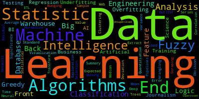

# DS-Student-Resources
Data Science Student Companion Notebook Series

  

## Curriculum 

| | 
|:--|
|[DS101-Basic-Statistics](DS101-Basic-Statistics/DS101-Syllabus.md)| 
|[DS102-Statistical-Programming-in-R](DS102-Statistical-Programming-in-R/DS102-Syllabus.md)|
|[DS103-Metrics-and-Data-Processing](DS103-Metrics-and-Data-Processing/DS103-Syllabus.md)|
|[DS104-Data-Wrangling-and-Visualization](DS104-Data-Wrangling-and-Visualization/DS104-Syllabus.md)|
|[DS105-Intermediate-Statistics](DS105-Intermediate-Statistics/DS105-Syllabus.md)|
|[DS106-Machine-Learning](DS106-Machine-Learning/DS106-Syllabus.md)|
|[DS107-Big-Data](DS107-Big-Data/DS107-Syllabus.md)|
|[DS108-Databases](DS108-Databases/DS108-Syllabus.md)|
|[DS109-Python](DS109-Python/DS109-Syllabus.md)|
|[DS110-Final-Project](DS110-Final-Project/DS110-Syllabus.md)|

## Curriculum Datasets

- [ds-datasets.csv](ds-datasets.csv)
- [ds-jupyter-notebooks.csv](ds-jupyter-notebooks.csv)

## About this Repo

The GitHub repository https://github.com/woz-u/DS-Student-Resources contains a collection of Jupyter notebooks and data sets that are used by students in the Data Science program at Woz U. The notebooks cover a variety of topics, including machine learning, data visualization, and natural language processing. The data sets are used to train and evaluate the models that are developed in the notebooks.

The repository is organized into the following folders:

- notebooks: This folder contains the Jupyter notebooks.
- data: This folder contains the data sets.
- images: This folder contains images that are used in the notebooks.
- references: This folder contains links to additional resources.

The notebooks are written in Python and use the following libraries:

- numpy: This library provides a high-level interface to numerical arrays.
- pandas: This library provides data structures and analysis tools for structured (tabular, multidimensional, potentially heterogeneous) and time series data.
- matplotlib: This library provides a comprehensive library for creating static, animated, and interactive visualizations in Python.
- seaborn: This library provides a high-level interface for creating attractive and informative statistical graphics in Python.
- scikit-learn: This library provides a comprehensive collection of machine learning algorithms.
- and many others to include R and R packages

The data sets are in a variety of formats, including CSV, JSON, and text. The data sets are used to train and evaluate the models that are developed in the notebooks.

The repository is a valuable resource for students who are learning Data Science. The notebooks provide a hands-on introduction to the concepts and tools of Data Science. The data sets can be used to train and evaluate models. The repository is a great way to get started with Data Science.